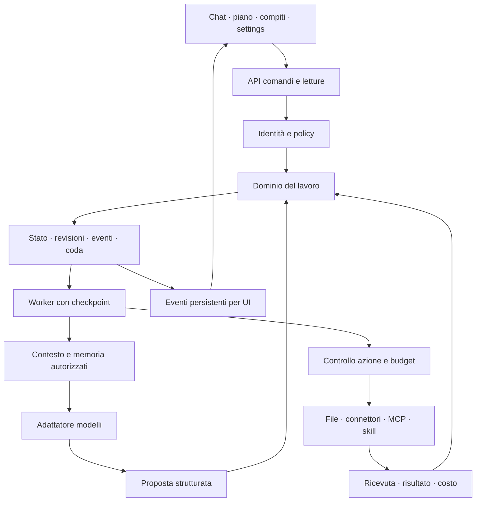

# Motore Homun — proposta di architettura

> Specifica consolidata da analizzare: [pacchetto v0.1](../specifications/README.md). Chiarisce decisioni, proposte e scelta ancora aperta del backend memoria; prevale sulle ipotesi non confermate di questo documento.

Data: 17 settembre 2026. Stato: proposta per decidere lo sviluppo, non architettura già approvata o implementata.

Documenti collegati: [piano di sviluppo](../development/2026-09-17-piano-sviluppo.md), [visione](../VISIONE-PRODOTTO.md), [formazione e affidabilità](../MOTORE-AFFIDABILITA-E-FORMAZIONE.md), [consegna prototipo](../ux/27-prototipo-conversazionale-consegna.md).

> Aggiornamento durante la discussione: Fabio ha proposto comunicazione diretta tra applicazioni, senza server centrale. La proposta di rete e i limiti della prima versione sono in [Rete tra applicazioni](2026-09-17-rete-tra-applicazioni.md); questa estensione entra nel piano prima della beta aziendale.

> Dati: Fabio richiede località e trasferimento minimo, con cifratura. Vedere [Distribuzione e cifratura](2026-09-17-distribuzione-dati.md). Nessuna replica totale o blockchain è approvata.

## 1. Decisione proposta

Conservare la UX conversazionale e costruire un **motore persistente del lavoro**, indipendente dal modello AI e dall'interfaccia. La chat interpreta; il dominio valida; il runtime esegue; le viste mostrano lo stesso stato.

Proposta di partenza: app Mac con frontend React esistente, servizio Python locale, database SQLite e archivio file locale. Preparare contratti che possano essere serviti da un host aziendale in seguito. Questa modalità iniziale è un'ipotesi da confermare, coerente con la precedente richiesta di app installabile; non è una scelta già acquisita. Un server sempre acceso e la collaborazione simultanea cambiano il perimetro del primo rilascio.

Non costruire subito sincronizzazione bidirezionale locale/cloud. Ogni spazio ha **un'autorità unica** che possiede stato, permessi, coda e file. In futuro il desktop potrà collegarsi a uno spazio remoto; ciò non richiede che due database siano entrambi autoritativi.

## 2. Requisiti acquisiti

- Chat principale, pannello destro essenziale, azioni organizzative nel menu; dashboard come viste dello stesso lavoro.
- Una conversazione può esistere senza progetto e senza compito. Un progetto può contenere più conversazioni e lavori. Creare un progetto da una conversazione preserva gli identificativi e la storia.
- Persone e agenti hanno identità diverse; agente, modello e ruolo nel lavoro sono concetti separati. Squadre riutilizzabili tra progetti.
- Piano ordinato e modificabile da chat o interfaccia, con responsabili, stato dei passi, evidenze e inserimenti intermedi. Creazione contestuale degli agenti.
- Richieste di contributo precise, con risposta/caricamento nello stesso punto e notifica che vi porta direttamente.
- Risultati versionati, revisore, correzioni e approvazione; azioni proposte coerenti con origine e capacità disponibili, ad esempio spostare una scheda Trello.
- Materiali automaticamente associati al contesto d'origine; riuso e accesso espliciti; ricerca, filtri, cartelle e operazioni multiple.
- Catalogo plugin unico per MCP, skill, connettori e moduli propri.
- Automazioni come lavori ripetibili, con risultati accessibili; niente configurazioni separate e duplicate.
- Memoria dell'agente e del progetto, contesto limitato per chat, costi, modelli misti, formazione per competenza e ambito.
- Gruppi organizzativi rinviati. Nessun obbligo di progettare tutto come un repository software.

## 3. Stato verificato nel codice

| Base | Evidenza locale | Conseguenza |
|---|---|---|
| UX attuale | `src/components/builder/ConversationWorkspace.tsx`, circa 2.969 righe | Separare orchestrazione UI e regole di dominio durante la migrazione, senza riscrittura estetica |
| Lavoro simulato | `Work`, `Phase`, scenari e risultati precompilati nello stesso file | Non usare gli scenari come tipi di lavoro reali |
| Piano | `ConversationCatalogPlan.tsx`: passi con agente per nome e contatore completed | Passare a ID, stato per passo, dipendenze e revisioni |
| Persistenza demo | `conversation-storage.ts`: snapshot IndexedDB | Utile per demo; il database del motore diventerà la fonte dei dati reali |
| Settings | `ConversationSettings.tsx`, `conversation-preferences.ts` | Separare preferenze personali, politiche di spazio e configurazione runtime |
| Backend precedente | `src/routes/api/chat.ts` | Richiede projectId, sceglie il primo bot del progetto, usa gateway fisso: non è il nuovo runtime |
| Supabase | migrazioni in `supabase/migrations`, `useWorkspace.tsx` | Esistono organizzazioni, ruoli, chat e pipeline; presenza statica non prova funzionamento, adeguatezza o sicurezza |
| Vecchio Homun | `../app` con moduli Rust, desktop e componenti Python | Candidato al riuso selettivo, non dipendenza implicita di Homun2 |

Nessun servizio remoto è stato modificato o verificato durante questa analisi; nessuna credenziale è stata letta.

## 4. Tre strade e compromessi

| Approccio | Vantaggio | Costo/rischio | Valutazione |
|---|---|---|---|
| Python modulare + UX React | Coerente con preferenza espressa, integrazioni e isolamento del dominio | Packaging e gestione di due linguaggi | **Proposto** |
| Estendere tutto in TypeScript/Supabase | Riutilizza gateway, auth e stack esistente | Richiede comunque worker persistente, nuovo dominio e strategia desktop; forte eredità della struttura per progetto | Alternativa se server-first è prioritario |
| Recuperare il vecchio runtime Rust | Componenti già presenti per strumenti, memoria e desktop | Accoppiamenti e costi di verifica/migrazione non ancora misurati | Audit selettivo, niente migrazione totale preventiva |

Queste valutazioni sono giudizi progettuali basati sul codice e sui requisiti, non benchmark.

### Stack candidato e decisioni da misurare

- React/TypeScript e componenti attuali per la UI.
- Python, FastAPI e Pydantic per API e contratti; versioni bloccate dopo una prova di compatibilità.
- SQLite per l'host locale, migrazioni e transazioni; file conservati fuori dal database con hash e versioni. Mai database WAL su cartella di rete condivisa.
- **Pydantic AI + DBOS** raccomandati per agenti e checkpoint: [scelta delle librerie](2026-09-17-scelta-framework.md). DBOS possiede il checkpoint; niente secondo orchestratore. Validare registrazione dinamica, cifratura e packaging prima dell'adozione definitiva.
- Un provider remoto e un provider locale compatibile con Ollama nel pilot. Nessun nome di modello hardcoded nel dominio.
- Electron candidato per packaging React + servizio locale; verifica di riuso e dimensioni prima della scelta definitiva. Componente Swift solo quando serve davvero una capacità nativa.
- Host aziendale successivo: stessa API, storage server e autenticazione multiutente; PostgreSQL candidato. Il passaggio richiede migrazioni e test, non una semplice sostituzione del driver.

## 5. Struttura del motore

Il modello non aggiorna direttamente database, permessi, budget o stato di approvazione. Propone comandi con parametri; il motore autentica l'attore, verifica versione, ambito e regole. Anche i pulsanti invocano gli stessi comandi. Nessun percorso privilegiato perché l'azione proviene dalla chat.

Un coordinatore è un agente che può proporre deleghe; il scheduler applica dipendenze e limiti. Impostare profondità massima, numero di passi, chiamate e costo: nessun ciclo di delega illimitato.

### Moduli e responsabilità

| Modulo | Responsabilità esclusiva |
|---|---|
| domain | Entità, comandi, transizioni, revisioni, invarianti |
| identity/policy | Attore autenticato, membership, accesso, concessioni e revoche |
| runtime | Coda, lease, checkpoint, cancellazione, retry e riconciliazione |
| planning | Proposte e modifiche del piano; non esegue azioni esterne |
| models | Capacità provider, streaming, limiti di contesto, usage e routing |
| tools | Manifest, connessioni, invocazioni, isolamento e ricevute |
| materials | Blob/versioni, collegamenti, estrazione, anteprima e accesso |
| context/memory | Selezione fonti, riassunti, lezioni e budget token |
| automations | Regole, orari/eventi, deduplica e creazione di run |
| notifications | Proiezione di richieste e risultati per destinatario |
| storage | Transazioni, migrazioni, backup e ripristino |
| api | Trasporto, validazione dei contratti e flusso eventi |

## 6. Modello dei dati

Tutte le entità hanno ID stabile, workspace_id, date UTC e versione quando modificabili. I riferimenti usano ID, mai il nome visualizzato.

| Entità | Contenuto e relazioni |
|---|---|
| Workspace / Membership | Spazio autoritativo, persone, ruoli e politiche |
| Person / Agent / Team | Identità; agente con curriculum, competenze, istruzioni versionate e policy modello; team con membri e coordinatore |
| Project | Obiettivo condiviso, membri/team, materiali e memoria; nessuna chat globale obbligatoria |
| Conversation / Message | Chat con project_id facoltativo, partecipanti, messaggi e riferimenti tipizzati ad agenti/file/lavori |
| Work | Obiettivo, richiesta originale, criteri, vincoli, requester, responsabile, revisore, scadenza e budget; può collegare più conversazioni |
| WorkConversation | Collega un lavoro alle conversazioni che ne discutono, indicandone una principale; non duplica il lavoro |
| PlanRevision / Step | Revisione immutabile; passi con responsabile, input richiesti, output atteso, dipendenze e controlli |
| Run / StepAttempt | Esecuzione di una revisione e singoli tentativi; un retry non è un nuovo lavoro |
| ContributionRequest | Che cosa manca, chi deve fornirlo, formato/criteri, passo bloccato, scadenza e risposte; testo/file/link/scelta |
| Artifact / ArtifactVersion | Risultato concreto, MIME, blob/hash, origine, produttore, fonti ed evidenze |
| Review / ActionApproval | Revisione di un risultato e autorizzazione di un effetto esterno sono entità distinte, riferite a una versione/hash |
| Material / MaterialLink / AccessGrant | Oggetto nella raccolta, associazione organizzativa, concessione d'accesso; collegare non amplia automaticamente la visibilità |
| ProcedureRevision / Automation | Metodo riutilizzabile e regola di attivazione, separati dalla singola esecuzione |
| Plugin / Installation / Connection / ToolGrant | Capacità disponibile, installazione, account collegato e uso autorizzato sono separati |
| MemoryEntry / Lesson | Ambito, provenienza, autore, validità, versione, accesso e stato di approvazione |
| UsageEntry / BudgetReservation | Consumi per chiamata/tentativo, stima/consuntivo, riserva e rilascio |
| DomainEvent / Notification | Storico delle transizioni e proiezione per destinatario; leggere una notifica non completa il compito |

UI minimale non significa cancellare queste distinzioni dal motore. All'utente si mostrano soltanto quando modificano una decisione.

## 7. Stati e modifiche del piano

Stati del lavoro: draft, ready, running, waiting_input, waiting_approval, paused, review, completed, failed, cancelled. Archiviazione come attributo distinto; un lavoro running non si archivia prima di sospenderlo o annullarlo esplicitamente.

| Evento | Prima → dopo | Condizione |
|---|---|---|
| Accettazione piano | draft → ready | Responsabilità, output e criteri validi |
| Avvio | ready → running | Policy, input, modello e budget disponibili |
| Mancanza dati | running → waiting_input | Richiesta persistita con destinatario e input atteso |
| Risposta | waiting_input → ready | Contributo valido e autorizzato; nuove policy ricontrollate |
| Azione soggetta a consenso | running → waiting_approval | Parametri e versione dell'azione congelati |
| Fine esecuzione | running → review | Artifact ed evidenze salvati; controlli completati |
| Accettazione | review → completed | Revisore autorizzato sulla versione corrente |
| Autonomia prevista | running → completed | Policy applicabile e controlli soddisfatti, ricevuta salvata |
| Correzione | review → ready | Nuova revisione del piano, storico conservato |
| Errore non recuperabile | running → failed | Motivo, tentativi ed eventuali effetti incerti registrati |

Ogni passo ha stato proprio: pending, running, waiting_input, waiting_approval, succeeded, failed, cancelled, superseded. Il numero di passi completati è una proiezione, non la fonte dello stato.

Primo rilascio: esecuzione seriale dei passi con dipendenze esplicite; parallelismo limitato in una fase successiva. Non introdurre editor di grafi come requisito UX.

Riordinare/aggiungere passi crea una revisione. I passi conclusi restano storici; quelli running arrivano a un punto sicuro o sono cancellati con esito registrato. Cambiare input di un passo concluso invalida i risultati dipendenti e propone una nuova esecuzione; non basta spostare una card. Concorrenza: expected_version obsoleta produce conflitto e proposta aggiornata, mai sovrascrittura silenziosa.

## 8. Affidabilità e sicurezza dell'esecuzione

- Transazione unica per stato del comando, eventi e accodamento (outbox); UI ottimistica solo su dati reversibili.
- command_id deduplica i reinvii; lease e fencing impediscono che un worker scaduto confermi il tentativo di un altro.
- Distinguere azione proposta, autorizzata, iniziata, eseguita, verificata e risultato accettato.
- Timeout dopo un invio esterno può significare esito sconosciuto. Se provider non offre idempotenza o ricevuta interrogabile, non ripetere automaticamente: riconciliare o chiedere intervento.
- Nessuna promessa generale di exactly-once sui servizi esterni. Consegna almeno una volta, deduplica interna e strategia specifica per connettore.
- Alla ripresa rivalutare permessi, versione dei dati, connessione e budget. Revoca valida anche su lavori sospesi.
- Cancellare una richiesta non annulla retroattivamente un'email inviata. Compensazioni solo se supportate e registrate.
- File, web e risultati dei plugin sono dati non fidati: le loro istruzioni non possono ampliare le policy.
- Credenziali in portachiavi dell'host o secret store; frontend conserva riferimenti, mai segreti. Nessun accesso file/shell illimitato per default.
- API locale su loopback con token di sessione e verifica origine; desktop con bridge minimo. Plugin in processo separato con timeout e capacità esplicite.
- Download e anteprime rispettano accesso; nessuna esecuzione automatica di HTML/script allegati. Parser isolati con limiti di dimensione/tempo e difesa da archivi e percorsi malevoli.

## 9. Memoria, contesto e formazione

Il contesto di ogni chiamata contiene obiettivo stabile, revisione del piano, stato corrente, riferimenti autorizzati, riassunto della chat e ultimi messaggi entro un budget. Riassumere non può eliminare obiettivo o cambiare autorizzazioni.

Ambiti separati: conversazione, lavoro, progetto, agente e spazio. La memoria dell'agente non supera i diritti dell'utente/lavoro corrente. Nessuna condivisione automatica di trascrizioni tra chat; nel progetto si promuovono fatti/decisioni con provenienza e accesso. Filtrare prima della ricerca e verificare anche prima di consegnare il contesto al provider.

Prima versione: riassunti versionati e ricerca testuale; retrieval semantico solo dopo aver misurato la qualità. Memorie visibili, correggibili, disattivabili, eliminabili; aggiornamento o revoca della fonte invalida indici/cache e segnala le memorie derivate da rivalutare.

Feedback: correzione del caso → proposta di lezione circoscritta → approvazione della lezione → nuova prova. Approvare un risultato non promuove l'autonomia. Policy per competenza/strumento/ambito, decise da un supervisore umano. Nessun fine-tuning automatico nella v1.

## 10. Modelli e costi

Separare identità agente, modello scelto per il tentativo e provider. Registro capacità: tool calling, output strutturato, multimodalità, contesto, streaming e disponibilità. Modello locale inadeguato deve produrre limite esplicito o alternativa consentita, non un fallback cloud silenzioso.

Routing iniziale: modello configurato, eventuale fallback autorizzato; routing automatico basato su valutazioni nella fase successiva. Politica solo-locale applicata a ogni chiamata, inclusi embedding e riassunti.

Ledger per chiamata con run, step, agente, provider, modello, usage e tariffa/versione. Costi stimati e consuntivi distinti; locale non presentato come spesa API. Prenotare budget prima di avviare chiamate concorrenti, riconciliare dopo; usage mancante resta sconosciuto. Somme per agente/lavoro/spazio senza contare due volte i sottolavori. Limite applicato prima della prossima azione; chiamate già iniziate possono produrre un costo finale non perfettamente prevedibile.

## 11. Plugin e automazioni

Un catalogo, quattro adattatori: tool nativo, MCP, connettore gestito (Composio candidato), skill. Una skill è istruzione/procedura con dipendenze; eventuali script passano dal medesimo controllo di esecuzione. Installare non collega un account; collegare non assegna privilegi all'agente.

Manifest versionato: origine, autore, capacità, schema input/output, effetti, permessi, timeout, credenziale richiesta e compatibilità. Rimuovere un plugin segnala i lavori dipendenti e ne impedisce nuove invocazioni; non cancella lo storico.

Automazione: linguaggio naturale → regola strutturata → riepilogo leggibile → attivazione. Mai eseguire direttamente la stringa libera del prototipo. Versione della procedura fissata per run, destinatari e ambito dati espliciti. Chiave deduplica su automazione/versione/occorrenza o evento esterno; timezone IANA, ora legale, misfire e sovrapposizioni gestiti.

Default proposto: niente run simultanei della stessa routine; accorpare esecuzioni perse in un solo recupero dichiarato, con opzione salta. Mac spento: nessuna esecuzione promessa. Server sempre acceso necessario per quell'esigenza. Webhook solo con endpoint raggiungibile e validazione firma/deduplica.

## 12. Fonti tecniche consultate

Verificate il 17 settembre 2026; non sostituiscono la prova sul nostro caso. Versioni e API saranno fissate nello spike.

- [Pydantic AI: deferred tools](https://pydantic.dev/docs/ai/tools-toolsets/deferred-tools/): meccanismo candidato per sospendere le chiamate soggette ad approvazione; non costituisce da solo il dominio persistente di Homun.
- [LangGraph: persistence](https://docs.langchain.com/oss/python/langgraph/persistence): alternativa con checkpoint e store; la scelta deve evitare una seconda fonte di stato per lo stesso lavoro.
- [SQLite WAL](https://www.sqlite.org/wal.html): motivazione per tenere database e processi sull'host, non in una cartella di rete condivisa.
- [MCP architecture](https://modelcontextprotocol.io/docs/learn/architecture): protocollo di collegamento agli strumenti, non motore di responsabilità e workflow.
- [Ollama API](https://docs.ollama.com/api/introduction): candidato per l'adattatore locale; capacità da verificare per modello e macchina.
