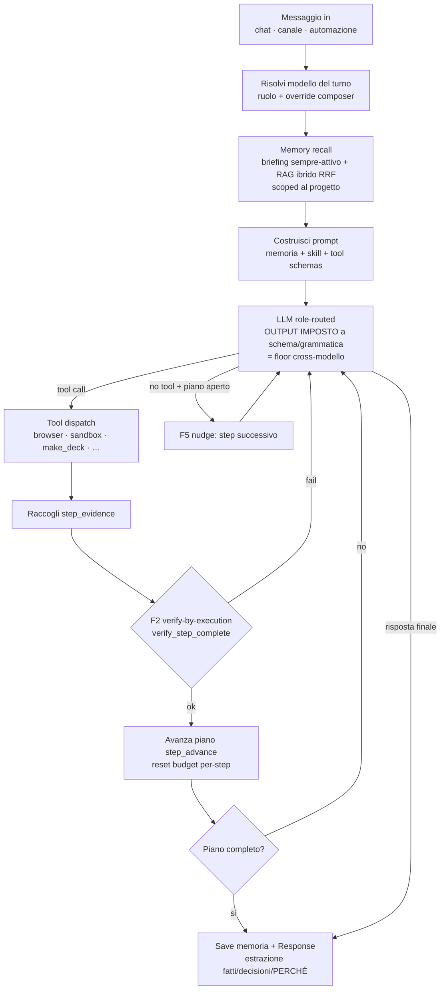

# Architettura — Agent loop / motore (cross-modello)

> Diagramma vivo. Decisione di fondo: [ADR 0016](../decisions/0016-harness-owned-task-engine-cross-model.md).
> Codice: `crates/desktop-gateway/src/main.rs` → `stream_chat_via_openai` (round loop +
> tool dispatch + piano + memoria). Condiviso da chat (`generate_stream`) e
> canali/automazioni (`run_agent_turn`).

## Principio

L'orchestrazione è proprietà dell'**harness**, non del modello: il codice possiede
control-flow, stato del piano e formato di output; **il modello riempie slot
vincolati**. Funziona sul **tier locale** (Gemma/7B). Invarianti del piano:
**monotonìa**, **limitatezza**, **identità non inferita**.

## Il loop

## Due modalità, un solo grafo

- **Workflow mode** (task strutturati / skill con step noti): il runtime guida una
  pipeline **dichiarata**; il modello riempie lo slot di **contenuto** di ogni step.
  Non può gonfiare/loopare/saltare. Es. `make_deck` (embrione di
  `create-presentations` come workflow).
- **Agent mode** (task aperti): il loop sopra, con piano runtime-owned + tool call
  imposti + stop di codice.
- Implementazione: **un solo esecutore** (il task aperto è "un piano con un nodo =
  mini-loop"); un **router** sceglie la modalità.

## Scaffolding adattivo (per tier di modello) → [ADR 0018](../decisions/0018-adaptive-harness-subagents-triggers.md)

Distinzione di fondo (tre fonti SOTA concordi — Anthropic, Browser Use bitter
lesson, Oracle "three levels"): l'**inner loop** resta model-driven; ciò che
l'harness possiede sta **attorno** al loop. Lo scaffolding adattivo agisce **solo
dentro** l'inner loop.

- **Pavimento — attorno al loop, uguale per tutti** (non danneggia i capaci):
  identità-piano + stop, involucro tool-call valido + parsing tollerante, memoria nel
  loop, registry capability, context engineering, approval. **Invariato per ogni tier.**
- **Manopole — dentro il loop, scalano inverse alla capacità** (`ScaffoldProfile`
  derivato dal `ModelTier`): formato (grammatica forzata vs tool-calling nativo),
  granularità slot, workflow guidato vs prosa, profondità verifica/repair.
- Invariante: modelli locali che migliorano → riclassificati su → lo scaffolding si
  **toglie da solo** quando il modello se lo merita (si cavalca il bitter lesson).
- Asse ortogonale intoccabile: rischio/approval scala con l'azione, **mai** con la
  bravura del modello.
- Tier scoperto via: seed registry + **probe** al primo uso + **stretta a runtime**
  sui fallimenti.

## Stato

- ✅ **Fase 1**: floor (enforcement output) + `make_deck` — v1041.
- ✅ **Fase 2**: piano = `ExecutionPlan` con `step_id` stabili (`plan_propose` +
  `step_advance`), merge-per-titolo ritirato (WS1-F2 Slice 3b, `merge_execution_plan`).
- ✅ **Floor su tutte le emissioni** (WS1 "floor ovunque", 2026-06-24): planner schema
  chiuso, `update_plan`/`step_advance` strict, judge verifica strict.
- ✅ **Router workflow|agent + primo scaffolding adattivo per richiesta** (WS1-F4) —
  `scaffolding_tier` keyed sul **tipo di richiesta** (deck → `maximum`).
- ✅ **Scaffolding adattivo per tier di MODELLO** (ADR 0018, incremento 2 di F4) —
  dietro `HOMUN_ADAPTIVE_FLOOR` (`off`|`shadow`|`on`), default off:
  - ✅ **Fase 0**: primitivo `tier` su `ResolvedRole` + `tier_for`/`tier_for_model`
    + modulo `scaffold` (`ScaffoldProfile`/`scaffold_for`, 4 test).
  - ✅ **Fase 1**: `verify_depth` tier-aware (capace salta la verifica sugli step
    senza azione esterna; debole verifica sempre).
  - ✅ **Fase 2**: router tier-aware (`relax_route_for_tier`): il modello capace non
    è forzato nel workflow one-shot — `make_deck`/`make_document` restano offerti.
  - ⃠ **Fase 3 (formato): MOOT** — la chat usa già tool-calling nativo; i percorsi
    strutturati/subagente vogliono il floor uniforme (caposaldo #6). Niente manopola
    formato: sarebbe rischio senza guadagno. Le due manopole reali (verify, workflow)
    bastano.
- 🟡 **Sub-agent sotto trigger** (ADR 0018 Pilastro 3) — sicurezza/topologia, non
  la manopola formato:
  - ✅ envelope ereditato fail-closed (`subagent_workflow.rs`, già esistente).
  - ✅ guard single-threaded-writes (`validate_single_threaded_writes` in
    `validate_plan`, 5 test): `Read`/`Draft` = `read_gather` fan-out ammesso (Draft
    è proposta, parallel-safe); solo `WriteWithConfirmation`/`ApprovedAutomation` =
    `write_decide` single-threaded. *(Corregge il default "Draft single-threaded":
    il workflow canonico Memory‖Tool lo falsifica.)*
  - ✅ verifica gateway conclusa: i trigger girano in `stream_chat_via_openai`
    (model-driven, gated da `tool_policy`+perimetro+project-access pre-fire), **non**
    dal Brain → non generano subagenti; guard+envelope coprono il path chat→Brain.
    "Sub-agent sotto trigger" è forward-looking. Bonus: l'adaptive floor copre già i
    trigger (stesso `stream_chat_via_openai`).

Backlog: [WS1](../plans/2026-06-22-batch-1042-artifacts-memory.md).
