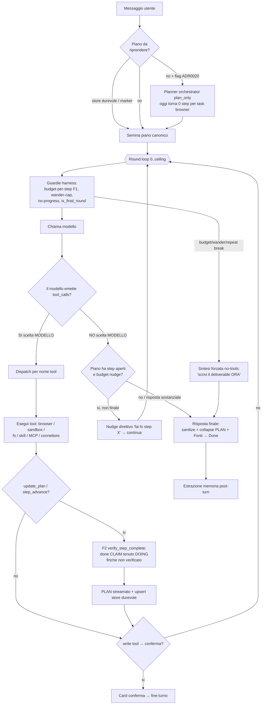

# Agent Loop — come funziona OGGI (mappa accurata)

> Stato: 2026-06-27. Reverse-engineered da `crates/desktop-gateway/src/main.rs`
> (`stream_chat_via_openai`, ~:17897→:22990) e da `crates/orchestrator`. Questa pagina
> descrive la **realtà attuale**, incluse le **divergenze dai [capisaldi](../CAPISALDI.md)**.
> È un punto fermo: ogni modifica al loop aggiorna questa pagina + il diagramma.
> Decisione di fondo: [ADR 0016](../decisions/0016-harness-owned-task-engine-cross-model.md),
> [0018](../decisions/0018-adaptive-harness-subagents-triggers.md),
> [0020](../decisions/0020-converge-chat-loop-onto-orchestrator.md).

## Cosa fa

Prende un messaggio utente, sceglie e chiama strumenti (browser, sandbox, filesystem,
skill, MCP, connettori) in più round, mantiene un **piano canonico**, e produce una
risposta finale aggiornando **memoria** e **artefatti**. È il cuore operativo del prodotto.
Condiviso da chat (`generate_stream`) e canali/automazioni (`run_agent_turn`).

## Come funziona OGGI

Punti caldi (con `file:line` in `main.rs`):

- **Seed piano** (`:~18979`): prima dal **runtime-plan store durevole**
  (`load_runtime_plan_from_state`), poi dal marker `‹‹PLAN››` in contesto; opzionale
  planner orchestrator dietro `HOMUN_ORCHESTRATED_CHAT` (ADR 0020 P1).
- **Round loop** (`:~19031`, `for round in 0..hard_round_ceiling()`).
- **Guardie harness** (deterministiche): budget per-step F1 (`rounds_since_progress`,
  `:~19042`), wander-cap (`:~19046`), no-progress identico (`:~19574`), `is_final_round`
  (`:~19186`) che **rimuove i tool** dal payload sull'ultimo round.
- **Fork act-vs-answer** (`:~19552`): il **modello** decide se chiamare tool o rispondere.
  Punto di **massima varianza**.
- **F2 verify** (`verify_step_complete`, `:~13783`): un `done` rivendicato è tenuto
  `doing` finché un giudice LLM non lo conferma sulle evidenze `step_evidence`.
- **Nudge F5** (`:~22771`, cap `MAX_PLAN_NUDGES=8`) + **over-running guard** (`:~22782`).
- **Sintesi forzata** (`:~22907`, ramo `!final_done`).

## I DUE motori (caposaldo #5: convergere, non duplicare → oggi VIOLATO)

| | Motore #1 — produzione | Motore #2 — dormiente |
|---|---|---|
| Dove | `stream_chat_via_openai` (`main.rs`) | `crates/orchestrator` `OrchestratorBrain` |
| Guida | **il modello** (prompt-prosa ~2000 righe) | un piano DAG tipizzato |
| Piano | `Vec<Value>` mergiato — **`merge_plan` per TITOLO** (`:~6747`) | `ExecutionPlan` con `step_id` stabili + `depends_on` |
| Esecuzione | round loop con tool inline | `execute_plan` itera **lineare, ignora `depends_on`**; solo valida/accoda |
| Subagenti | n/d (il loop fa tutto) | `generate_json`-only, **senza tool** |
| Uso live | tutto | solo validazione `make_deck` + materializzazione task durabili |

## Gli strati (su cui ricostruire, bottom-up)

- **L0 — Normalizzazione I/O modello**: come ogni modello risponde → forma unica
  `{content, reasoning, tool_calls}`. Vedi [model-io.md](model-io.md). *Chiave di volta.*
- **L1 — Tool/Capability**: browser, sandbox, fs, skill, MCP, connettori — contratti
  affidabili. Vedi [browser.md](browser.md), [tools-mcp-skills.md](tools-mcp-skills.md),
  [capability-registry.md](capability-registry.md).
- **L2 — Loop di controllo**: questa pagina. Harness possiede l'envelope; inner loop
  **dovrebbe** essere libero per i capaci / scaffolded per i deboli (ADR 0018, **non
  implementato**: floor default-off).
- **L3 — Convergenza**: ADR 0020 — instradare il turno su UN motore guidato.

## Divergenze dai capisaldi (da chiudere)

- **Caposaldo #2** ("orchestrazione = proprietà dell'harness; piano non creato/seguito =
  **bug di design**"): **VIOLATO**. Il control-flow (act-vs-answer, quale tool, quando
  `done`, quando fermarsi) è del **modello**; l'harness interviene solo reattivamente.
- **Caposaldo #6** ("stato e control-flow di CODICE; identità non inferita"): **parziale**.
  `merge_plan` inferisce l'identità per **titolo** (`:~6747`) sotto la vernice `ExecutionPlan`.
- **Caposaldo #5** ("un solo motore"): **violato** — due motori coesistono.
- **ADR 0018** (inner loop tier-adattivo): **non realizzato** — floor default-off, i
  modelli capaci ricevono lo stesso scaffolding dei deboli.

### Conseguenze osservate (sintomi)
- "Il piano a volte parte, a volte no, lo segue e non lo segue" → creazione piano lasciata
  al modello + F2 che tiene `done`→`doing` + il deliverable esce da canali no-tools che
  **bypassano** il piano (`:~19210`, `:~22924`).
- "Stesso prompt, risultato diverso" → temp 0 senza seed (seme piccolo) **amplificato** dal
  control-flow ramificato (pianifica-o-no, profilo browser ephemeral, numero turni variabile).

## File chiave

- Loop: `crates/desktop-gateway/src/main.rs` → `stream_chat_via_openai`.
- Piano: `runtime_execution_plan`, `merge_execution_plan`/`merge_plan`, `verify_step_complete`,
  `load_runtime_plan_from_state`, `parse_plan_marker`, `collapse_plan_markers`.
- Motore #2: `crates/orchestrator` (`brain.rs`, `types.rs`, `planner.rs`).
