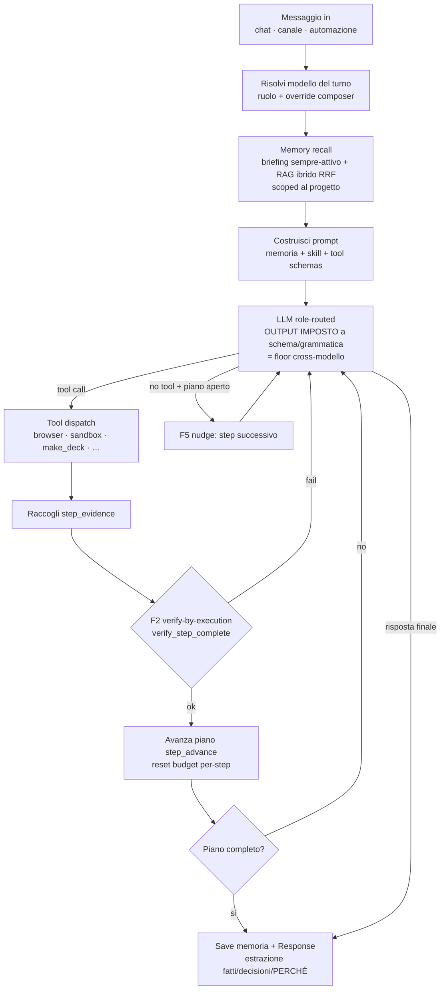

# Architettura — Agent loop / motore (cross-modello)

> Diagramma vivo. Decisione di fondo: [ADR 0016](../decisions/0016-harness-owned-task-engine-cross-model.md).
> Codice: `crates/desktop-gateway/src/main.rs` → `stream_chat_via_openai` (round loop +
> tool dispatch + piano + memoria). Condiviso da chat (`generate_stream`) e
> canali/automazioni (`run_agent_turn`).

## Principio

L'orchestrazione è proprietà dell'**harness**, non del modello: il codice possiede
control-flow, stato del piano e formato di output; **il modello riempie slot
vincolati**. Funziona sul **tier locale** (Gemma/7B). Invarianti del piano:
**monotonìa**, **limitatezza**, **identità non inferita**.

## Il loop

## Due modalità, un solo grafo

- **Workflow mode** (task strutturati / skill con step noti): il runtime guida una
  pipeline **dichiarata**; il modello riempie lo slot di **contenuto** di ogni step.
  Non può gonfiare/loopare/saltare. Es. `make_deck` (embrione di
  `create-presentations` come workflow).
- **Agent mode** (task aperti): il loop sopra, con piano runtime-owned + tool call
  imposti + stop di codice.
- Implementazione: **un solo esecutore** (il task aperto è "un piano con un nodo =
  mini-loop"); un **router** sceglie la modalità.

## Scaffolding adattivo (per tier di modello)

- **Pavimento** (uguale per tutti, non danneggia i capaci): runtime possiede
  identità-piano + stop; involucro tool-call valido.
- **Manopole** (scalano inverse alla capacità): formato (grammatica forzata vs
  tool-calling nativo), granularità slot, workflow guidato vs prosa, profondità
  verifica/repair.
- Tier scoperto via: seed registry + **probe** al primo uso + **stretta a runtime**
  sui fallimenti.

## Stato

- ✅ **Fase 1**: floor (enforcement output) + `make_deck` — v1041.
- ☐ **Fase 2**: piano = `ExecutionPlan` con `step_id` stabili (`plan_propose` +
  `step_advance`), ritira il merge-per-titolo (`merge_plan`). ← il refactor del piano.
- ☐ Floor su **tutte** le emissioni (oggi solo contenuto deck).
- ☐ Fasi 3-6: skill dichiarative · router+scaffolding · convergenza `OrchestratorBrain`
  (ADR 0008) · memoria per-step + sub-agent.

Backlog: [WS1](../plans/2026-06-22-batch-1042-artifacts-memory.md).
