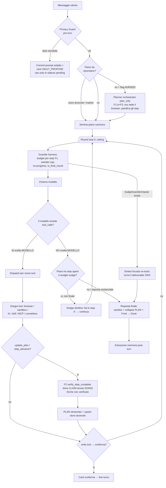

# Agent Loop — come funziona OGGI (mappa accurata)

> Verificato vs codice 2026-07-06 (broker+WS).
> Reverse-engineered da `crates/desktop-gateway/src/main.rs` (il loop canonico:
> `stream_chat_via_openai`, chiamato via `run_agent_turn_into_message` /
> `run_agent_turn_into_message_with_fanout`) e da `crates/orchestrator` (motore dormiente).
> Questa pagina descrive la **realtà attuale**, incluse le **divergenze dai
> [capisaldi](../CAPISALDI.md)**. È un punto fermo: ogni modifica al loop aggiorna questa
> pagina + il diagramma. Decisione di fondo: [ADR 0016](../decisions/0016-harness-owned-task-engine-cross-model.md),
> [0018](../decisions/0018-adaptive-harness-subagents-triggers.md),
> [0020](../decisions/0020-converge-chat-loop-onto-orchestrator.md),
> [0021](../decisions/0021-single-guarded-loop-planning-as-tool.md) (loop unico guardato,
> **scelto**) e [0024](../decisions/0024-engine-extraction-from-monolith.md) (estrazione del loop in un
> crate `engine` — **Proposta**, `crates/engine` NON esiste ancora).
>
> **Il loop è UNO solo** (ADR 0021): il ReAct guardato con native tool-calling +
> plan-as-a-tool, che vive **dentro `main.rs`**. `crates/orchestrator` (planner/driver/
> step_executor) è l'alternativa **dormiente**, NON instradata. Non esiste alcun
> `crates/engine` né flag `HOMUN_ENGINE_CRATE`.

## Cosa fa

Prende un messaggio utente, sceglie e chiama strumenti (browser, sandbox, filesystem,
skill, MCP, connettori) in più round, mantiene un **piano canonico**, e produce una
risposta finale aggiornando **memoria** e **artefatti**. È il cuore operativo del prodotto.
Il loop vero e proprio è `stream_chat_via_openai`, invocato via
`run_agent_turn_into_message` / `run_agent_turn_into_message_with_fanout`
(main.rs), condiviso da chat e canali/automazioni.

## Come una richiesta entra e stream-a (TURN BROKER + WS unificato)

Il **percorso della richiesta** oggi passa dal **turn broker** (default-on,
`turn_broker_enabled()` in `main.rs`), che ha sostituito il vecchio NDJSON-per-turno +
polling:

1. **POST `/api/chat/turns`** (`enqueue_turn`, `main.rs`) accoda un task `chat_turn`
   sul `TaskStore` e ritorna subito un `turn_id`.
2. **L'executor** (`crates/desktop-gateway/src/turn_executor.rs`) esegue il task:
   chiama `start_visible_conversation_turn` poi
   `run_agent_turn_into_message_with_fanout`, cioè fa girare il **loop canonico**.
   Ogni evento (delta/activity/plan_update/reasoning/tool/done/…) viene fatto **fan-out**
   da `emit_turn_event` su TRE sink: (a) la tabella durabile `turn_events` (per il resume
   dopo reconnect), (b) un canale broadcast per-turno (stream NDJSON `/api/chat/turns/{id}/events`
   — **transitorio**, tenuto finché il WS unificato non è l'unico client), (c) la `WsRegistry`.
3. **Gli eventi vengono streamati sul WEBSOCKET unificato `/api/ws`**
   (`crates/desktop-gateway/src/ws_gateway.rs`, handler `ws_handler`): un'unica connessione
   persistente che fa fan-out di tutti gli eventi server→client (`turn.event`, `computer.live`,
   `app.event`, …). Il client desktop si sottoscrive via
   `apps/desktop/src/lib/wsSubscription.ts`.

Il loop descritto sotto è ciò che l'executor esegue **dentro** questo percorso.

## Come funziona OGGI (il loop)

Punti caldi (cita il **simbolo** in `main.rs`, non il numero di riga — main.rs è
editato di continuo, re-grep il simbolo):

- **Seed piano**: prima dal **runtime-plan store durevole**
  (`load_runtime_plan_from_state`), poi dal marker `‹‹PLAN››` in contesto; opzionale
  planner orchestrator dietro `HOMUN_ORCHESTRATED_CHAT` (ADR 0020 P1).
- **Privacy Guard pre-turn**: prima del loop e prima del modello chat, classifica
  il prompt con ruolo `privacy_guard` locale (fallback deterministico). Se rileva
  dati sensibili, emette solo `VAULT_PROPOSE`, passa al frontend il testo utente
  redatto per il commit e conserva il raw in un sidecar `pending_id` consumabile
  con PIN. Il loop ReAct non parte e il raw non entra nella history del modello chat.
- **Round loop** (`for round in 0..hard_round_ceiling()`).
- **Guardie harness** (deterministiche): budget per-step F1 (`rounds_since_progress`),
  wander-cap, no-progress identico, `is_final_round` che **rimuove i tool** dal payload
  sull'ultimo round.
- **Stream live tipizzato** (nota: gli eventi viaggiano oggi sul **WS unificato `/api/ws`**
  via il fan-out del broker, vedi §percorso richiesta; il canale NDJSON per-turno è
  transitorio): `emit_stream_event` espande i vecchi delta marker in eventi
  canonici prima di inviare il delta legacy: `activity`, `plan_update`, `reasoning`,
  `choice_prompt`, `vault_propose`, `vault_reveal`, `payment_approval`. I marker restano nel
  testo solo come compatibilità/persistenza storica; il frontend espone `CoreChatStreamEvent`,
  `listenChatStreamDelta` è una vista filtrata dei soli `delta`, e `ChatView` conserva `eventParts`
  live per rendere Choice/Vault/Payment/Plan/Piano dai payload tipizzati prima del fallback marker.
  Il testo streaming resta sola prosa: il frontend non sintetizza più marker legacy da `eventParts`.
  Il gateway non invia più il delta legacy dello stesso marker per default; chi integra un client
  vecchio solo-delta può riattivarlo con `HOMUN_STREAM_LEGACY_MARKER_DELTAS=1`. `ChatView` mantiene
  comunque un filtro difensivo per scartare marker completi se arrivano da una sorgente legacy.
  I nuovi messaggi salvano anche `chat_messages.event_parts_json`, una proiezione derivata dei
  marker; l'API messaggi la espone come `event_parts` e il frontend la idrata su reload/storico,
  così il rendering storico non dipende esclusivamente da regex sul testo. Le nuove seed card
  assistente possono passare `event_parts` espliciti (es. `choice_prompt`) senza incorporare marker
  nel testo persistito.
- **Fork act-vs-answer**: il **modello** decide se chiamare tool o rispondere.
  Punto di **massima varianza**.
- **F2 verify** (`verify_step_complete`): un `done` rivendicato è tenuto
  `doing` finché un giudice LLM non lo conferma sulle evidenze `step_evidence`.
- **Nudge F5** (cap `MAX_PLAN_NUDGES=8`) + **over-running guard**.
- **Sintesi forzata** (ramo `!final_done`).

## Il motore vivo e quello dormiente (ADR 0021: loop unico guardato — **scelto**)

**Decisione presa (ADR 0021):** il prodotto ha **un solo** motore vivo — il loop guardato
di motore #1. `crates/orchestrator` (motore #2) resta in albero ma è **DORMIENTE / non
instradato**: NON è "in convergenza", non guida alcun turno di chat. La tabella descrive
i due per contesto storico (ADR 0016/0018/0020 esploravano la convergenza; ADR 0021 ha
scelto il loop unico e retrocesso il drive come motore di esecuzione).

| | Motore #1 — **LIVE (l'unico)** | Motore #2 — **DORMIENTE (non instradato)** |
|---|---|---|
| Dove | `stream_chat_via_openai` (`main.rs`) | `crates/orchestrator` `OrchestratorBrain` |
| Guida | **il modello** (native tool-calling + plan-as-a-tool) | un piano DAG tipizzato |
| Piano | `Vec<Value>` mergiato — **`merge_plan` per TITOLO** | `ExecutionPlan` con `step_id` stabili + `depends_on` |
| Esecuzione | round loop con tool inline | due path: `execute_plan` (materializza task durabili) **e** `drive` (driver sincrono in-turn + arg-fill model-fills-slot) |
| Subagenti | n/d (il loop fa tutto) | durabile = `generate_json`-only; **nel driver = loop agentico bounded read/gather** (`agentic.rs`, validato su gemma4) |
| Uso live | **tutto** | **nessuno** — il planner `plan_only` può seminare motore #1 dietro `HOMUN_ORCHESTRATED_CHAT` (ADR 0020 P1, flag-off); `drive` non è instradato |

### Precisazione su `execute_plan` e `depends_on` (correzione 2026-06-28)

Una versione precedente di questa pagina diceva che `execute_plan` "itera lineare, **ignora**
`depends_on`". È **impreciso**: (a) `validate_plan` (`brain.rs`) rifiuta ogni piano in cui una
dipendenza non **precede** il dipendente → l'array `steps` è già in ordine topologico, quindi
l'iterazione lineare *è* un ordine valido; (b) `enqueue_step` cabla i `depends_on` come **archi del
`TaskStore`** durabile. Il gap reale **non è lo scheduler**: è che `execute_plan` **materializza
task di sfondo e ritorna** (CapabilityCall = una call immediata o enqueue; SubagentTask =
`generate_json` senza tool). Non esiste(va) un **driver sincrono di turno**.

### Il driver in-turn (F3.1/F3.2 — punto fermo testato, validato su gemma4)

`crates/orchestrator/src/driver.rs` (`drive_plan`) è il control-flow **posseduto dall'harness**:
fa un **solo passaggio in avanti** sul piano (ordine topologico garantito da `validate_plan`), e per
ogni step chiama un `StepExecutor` iniettato; un `done` lo assegna il runtime **solo dopo** lo
`StepVerifier`, mai l'auto-report del modello. Le **3 invarianti** sono per costruzione: monotonìa
(un Done non si rivede), limitatezza (un risultato per step, il piano non cresce), identità =
`step_id` (i titoli non si consultano mai). È puro → unit-testabile con fake, senza modello/SQLite.

`CapabilityStepExecutor` (`step_executor.rs`, generico su `JsonRuntime`) è l'esecutore reale dei
`CapabilityCall`: (1) risolve il tool come `validate_plan` (tolleranza #11), (2) se gli `arguments`
sono **vuoti** — il planner-seme produce la FORMA del piano, non gli args (ADR 0020 P1) — il **modello
li riempie vincolato allo schema del tool** (`fill_arguments`, constrained decoding ADR 0016 Pilastro
3; args concreti → salta la generazione), (3) esegue sul `CapabilityFacade` canonico (policy +
validazione + dispatch + audit). Il Brain espone `drive(request, plan) → DriveOutcome`.

**Step agentici (`SubagentTask`, F3.2c — `agentic.rs`, validato su gemma4):** ADR 0016 Pilastro 2
definisce DUE modalità sullo stesso grafo — *workflow* (slot-fill, il `subagents::run_generate_json`
durabile single-shot) e *agent* (uno step la cui esecuzione è un mini-loop). `run_agentic_step` è la
modalità *agent*: loop **bounded** (`MAX_AGENTIC_ROUNDS`, ultimo round forza la sintesi) in cui il
modello **sterza** (sceglie il prossimo tool read/gather o conclude) mentre l'harness possiede
l'envelope. **Due fasi per round** (cura il fallimento "invalid arguments" osservato su gemma4):
(1) scelta del tool vincolata a un **enum** dei tool gather disponibili (#6), (2) `fill_arguments`
riempie gli args vincolati allo schema di QUEL tool (riuso del meccanismo capability → caposaldo #5).
Scope **solo read/gather** (Read/Draft; le scritture restano fuori, servono single-threaded+approval).
Il `done` resta del gate verify del driver, mai dell'auto-report.

**Convergenza chiave (CORREZIONE 2026-06-28 — la direzione era invertita):** una versione precedente
diceva che il path "canonico" per il browser è il `CapabilityProvider` sul sidecar condiviso
(`call_shared_browser_sidecar`) e che la `chat_browser_call` inline di motore #1 era "la parallela da
ritirare". È **SBAGLIATO**, verificato dal vivo (vedi [browser.md](browser.md) §Divergenze e
[STATO.md](../STATO.md) sessione 5e). Il path **maturo e fedele a OpenClaw** è quello di **motore #1**:
loop osserva→agisci con **native tool-calling** (gli args li impone il provider, contro l'intero
snapshot in contesto) + le arm inline + il pannello "Computer LIVE". Il path del **drive** —
`run_agentic_step` (loop `generate_json` su un digest da 4k) — è la **REGRESSIONE**: rianima esattamente
il `RuntimeBrowserLoopPlanner`/`BrowserLoopRunner` che il codebase aveva già **ritirato** convergendo su
OpenClaw. La convergenza giusta: il drive **possiede il piano/envelope** (le 3 invarianti, quando-done,
verify) e **DELEGA l'esecuzione browser** al loop native di motore #1 — non la reimplementa. È
l'estrazione & delega (Increment B, in corso).

**Validato su gemma4:** `orchestrated_brain_drives_plan_on_gemma4` (CapabilityCall: planner→driver→
arg-fill→execute→done) e `orchestrated_subagent_gathers_on_gemma4` (F3.2c: gemma4 sceglie il tool,
riempie la query vincolata, raccoglie, sintetizza — `evidence=[gather:web_search]`). Il verticale di
motore #2 regge sul tier debole (caposaldo #2). **Aggiornamento ADR 0021:** l'idea di
"instradare il turno di chat sul `drive`" (F3.3) è stata **abbandonata** — ADR 0021 ha
scelto il **loop unico guardato** con planning-as-a-tool e ha retrocesso il drive come
motore di esecuzione della chat. La convergenza corretta è **within** il loop di motore #1
(guardie deterministiche + plan-as-a-tool), non un secondo motore che guida il turno.
Il vettore vivo è ora l'**estrazione del loop** in `crates/engine` (ADR 0024, **Proposta**,
crate non ancora creato) — behavior-preserving, non un cambio di motore.

## Gli strati (su cui ricostruire, bottom-up)

- **L0 — Normalizzazione I/O modello**: come ogni modello risponde → forma unica
  `{content, reasoning, tool_calls}`. Vedi [model-io.md](model-io.md). *Chiave di volta.*
- **L1 — Tool/Capability**: browser, sandbox, fs, skill, MCP, connettori — contratti
  affidabili. Vedi [browser.md](browser.md), [tools-mcp-skills.md](tools-mcp-skills.md),
  [capability-registry.md](capability-registry.md).
- **L2 — Loop di controllo**: questa pagina. Harness possiede l'envelope; inner loop
  **dovrebbe** essere libero per i capaci / scaffolded per i deboli (ADR 0018, **non
  implementato**: floor default-off).
- **L3 — Convergenza**: **RISOLTA** da ADR 0021 → il turno gira su **un solo** loop
  guardato (motore #1). L'idea ADR 0020 di instradare il turno sull'orchestrator è stata
  superata; il lavoro attivo è l'estrazione del loop (ADR 0024, Proposta).

## Divergenze dai capisaldi (da chiudere)

- **Caposaldo #2** ("orchestrazione = proprietà dell'harness; piano non creato/seguito =
  **bug di design**"): **VIOLATO**. Il control-flow (act-vs-answer, quale tool, quando
  `done`, quando fermarsi) è del **modello**; l'harness interviene solo reattivamente.
- **Caposaldo #6** ("stato e control-flow di CODICE; identità non inferita"): **parziale**.
  `merge_plan` inferisce l'identità per **titolo** (main.rs, re-grep `fn merge_plan`).
- **Caposaldo #5** ("un solo motore"): **rispettato in scelta, non ancora in albero**.
  ADR 0021 ha scelto il loop unico; `crates/orchestrator` resta in albero ma **dormiente**
  (non instradato). Convergere = ritirare/rimuovere il motore #2 parallelo, non wire-arlo.
- **ADR 0018** (inner loop tier-adattivo): **parziale, default-off**. Il meccanismo È cablato:
  `scaffold_for(turn_tier)` (`scaffold.rs`) deriva le manopole e, sotto `adaptive_floor=on`,
  **workflow_bias** rilassa la rotta (`relax_route_for_tier`) e **verify_depth** modula il gate
  F2; `format` è MOOT (chat già native tool-calling); `slot` è observe-only. **F2.1 (fatto):** la
  decisione `{tier, profilo, mode}` è persistita nel `tool_trace` (→ memoria/learning,
  `scaffold::floor_trace_for_mode`) in `shadow`|`on` — la telemetria Fase-1 prerequisito per
  accendere il floor. Resta off di default finché la eval bi-popolazione (gemma4 vs capace) non lo
  valida; e i modelli capaci ricevono ancora lo scaffolding dei deboli **finché il floor è off**.

### Conseguenze osservate (sintomi)
- "Il piano a volte parte, a volte no, lo segue e non lo segue" → creazione piano lasciata
  al modello + F2 che tiene `done`→`doing` + il deliverable esce da canali no-tools che
  **bypassano** il piano. **F2.2 (default-on, opt-out `HOMUN_PLAN_RECONCILE=0/off`):** quando
  l'over-running guard ACCETTA la risposta con l'ultimo step ancora aperto (`answer_concludes_plan`),
  l'harness riconcilia quello step a `done` + persiste (`upsert_runtime_plan_memory_from_state`),
  così il piano persistito riflette il deliverable e il turno DOPO non riprende il piano a vuoto
  (`thread_has_active_runtime_plan`). La sintesi forzata (esaurimento round) NON riconcilia: lì il
  lavoro è genuinamente incompiuto e il piano DEVE restare aperto per la ripresa. Promosso dopo
  evidenza live: risposta `.invalid` consegnata ma pannello rimasto 1/2 perché lo step finale era
  ancora `doing` nello store.
- "Stesso prompt, risultato diverso" → temp 0 senza seed (seme piccolo) **amplificato** dal
  control-flow ramificato (pianifica-o-no, profilo browser ephemeral, numero turni variabile).
- **Ripresa-piano che cicla all'infinito (F4 — gated `HOMUN_PLAN_STALL_ABORT`).** I contatori
  di recovery sono **per-turno** (`nav_failures`, `rounds_since_progress` sono `let mut` dentro il
  turno → resettati a ogni ripresa). Un piano RIPRESO dallo store (`load_runtime_plan_from_state`,
  channel/resume) riavvia il suo step corrente coi contatori a zero, quindi uno step che fallisce in
  modo deterministico (URL morto, form non riempibile) **si ritenta a ogni ripresa, per sempre**.
  Fix: un **segnale cross-turno** persistito sulla memoria del piano (`stall_turns`/`last_resume_done`,
  preservati attraverso gli upsert di mid-turno) conta le riprese che NON chiudono nessun nuovo step;
  dopo `MAX_PLAN_STALL_RESUMES` (3) l'harness **blocca** lo step stallato (`block_stalled_step`).
  Perché funzioni la terminazione: il piano si stala (stop auto-resume) quando è **`settled`** (ogni
  step `done` **o** `blocked`), non solo quando è `complete` (tutti `done`) — altrimenti uno step
  `blocked` lo terrebbe "attivo" in eterno. E `blocked` è reso **sticky** in `merge_plan` (il modello
  non può riaprirlo e ri-armare il loop). Puro+testato (`next_plan_stall`, `plan_is_settled`,
  `block_stalled_step`). **Validazione live 2026-06-29:** non promuovere ancora default-ON. Il
  tentativo con URL `.invalid` ha mostrato che il piano può essere sostituito/contaminato da un
  runtime-plan non correlato recuperato dalla memoria/recall, prima che il contatore F4 arrivi al
  log atteso. Fix successivo: i runtime-plan restano memorie `open_loop` per il lifecycle/graph,
  ma non vengono più iniettati nel briefing generico `OPEN LOOPS`; il resume passa solo dal loader
  per-thread (`runtime_plan_memory_matches`). Il wiring resta gated finché il cap `3` non viene
  riverificato live.
- **"Il modello a volte non produce la risposta" (F3-deep — cutoff/budget).** Un modello di
  ragionamento può spendere l'intero budget token a *pensare* (`finish_reason:length`, `content`
  vuoto): la frontiera canonica (`model_normalize::assistant_response`) produce allora
  `‹‹REASONING››…‹‹/REASONING››` con **body vuoto**, e il loop lo **committava** come risposta finale
  (`final_done=true`) → bolla vuota / solo-ragionamento. Fix: prima di finalizzare, se
  `answer_body_is_empty(&content)` (lo `strip_chat_markers` toglie ogni marker → resto vuoto = niente
  prosa) **e** non c'è già contenuto accumulato, si fa `break` **senza** `final_done` → scatta la
  **sintesi forzata** esistente (`!final_done`): una call no-tools con budget token FRESCO e direttiva
  "scrivi la risposta finale ORA", con la catena di fallback (`accumulated`/`last_model_error`/canned).
  `break` esce dal round-loop → la sintesi gira **una volta sola**, niente spin né contatore. Riuso del
  meccanismo esistente (caposaldo #5), non un terzo path. Puro+testato (`answer_body_is_empty`).
  Per validarlo senza introdurre un secondo path, esiste solo in debug
  `HOMUN_DEBUG_MAIN_LOOP_MAX_TOKENS`: abbassa il budget del loop principale ma NON quello della
  sintesi forzata, così il log `[answer] empty answer body (...) → forced synthesis` è esercitabile
  live in modo deterministico.
- **Marker display-only che rientrano nel contesto del modello (fix).** `build_chat_runtime_prompt`
  (`lib.rs`) rendeva la history dell'assistant nel prompt **verbatim**, marker `‹‹REASONING››`/`‹‹PLAN››`/…
  inclusi. Su un follow-up (peggio sul "Continue") un modello di ragionamento **rileggeva il proprio
  trace** e lo scambiava per testo incollato dall'utente ("il testo che hai incollato è già completo").
  I marker sono display-only (la UI li rende, i canali già li strippano via `strip_chat_markers`): non
  devono mai raggiungere il modello come contenuto. Fix: `strip_display_markers` canonico in `lib.rs`
  (gestisce anche un trace **non chiuso** da `finish_reason:length` → drop fino a fine stringa), usato in
  `normalize_context_text`; `strip_chat_markers` del gateway converge su di esso (caposaldo #5/#13). La
  ripresa-piano NON è toccata: legge `request.context` direttamente, non il prompt renderizzato.

## File chiave

- Loop canonico: `crates/desktop-gateway/src/main.rs` → `stream_chat_via_openai`
  (invocato via `run_agent_turn_into_message` / `run_agent_turn_into_message_with_fanout`).
- Percorso richiesta (broker + WS): `main.rs` `turn_broker_enabled()` / `enqueue_turn`
  (`POST /api/chat/turns`); `crates/desktop-gateway/src/turn_executor.rs`
  (`start_visible_conversation_turn` → `run_agent_turn_into_message_with_fanout`,
  `emit_turn_event`); `crates/desktop-gateway/src/ws_gateway.rs` (`/api/ws`, `ws_handler`);
  client `apps/desktop/src/lib/wsSubscription.ts`.
- Stream live: `local_first_subagents::GenerateStreamEvent`, `emit_stream_event`,
  `expand_legacy_delta_to_chat_events`, `apps/desktop/src/lib/coreBridge.ts` /
  `chatApi.ts` (`CoreChatStreamEvent`).
- Persistenza chat: `chat_messages.event_parts_json` in `crates/desktop-gateway/src/chat_store.rs`
  conserva una proiezione strutturata derivata dai marker per i nuovi messaggi; l'API la espone
  come `ChatMessage.event_parts` e `apps/desktop/src/App.tsx` la mappa in `ChatMessage.eventParts`.
- Piano: `runtime_execution_plan`, `merge_execution_plan`/`merge_plan`, `verify_step_complete`,
  `load_runtime_plan_from_state`, `parse_plan_marker`, `collapse_plan_markers`.
- Motore #2 (**dormiente, non instradato**): `crates/orchestrator` (`brain.rs` incl. `drive`,
  `driver.rs` il driver in-turn + seam `StepExecutor`/`StepVerifier`, `step_executor.rs`
  `CapabilityStepExecutor`, `types.rs`, `planner.rs`).
