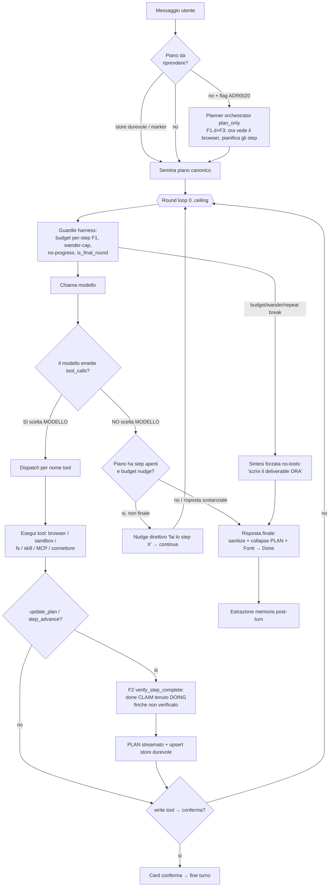

# Agent Loop — come funziona OGGI (mappa accurata)

> Stato: 2026-06-27. Reverse-engineered da `crates/desktop-gateway/src/main.rs`
> (`stream_chat_via_openai`, ~:17897→:22990) e da `crates/orchestrator`. Questa pagina
> descrive la **realtà attuale**, incluse le **divergenze dai [capisaldi](../CAPISALDI.md)**.
> È un punto fermo: ogni modifica al loop aggiorna questa pagina + il diagramma.
> Decisione di fondo: [ADR 0016](../decisions/0016-harness-owned-task-engine-cross-model.md),
> [0018](../decisions/0018-adaptive-harness-subagents-triggers.md),
> [0020](../decisions/0020-converge-chat-loop-onto-orchestrator.md).

## Cosa fa

Prende un messaggio utente, sceglie e chiama strumenti (browser, sandbox, filesystem,
skill, MCP, connettori) in più round, mantiene un **piano canonico**, e produce una
risposta finale aggiornando **memoria** e **artefatti**. È il cuore operativo del prodotto.
Condiviso da chat (`generate_stream`) e canali/automazioni (`run_agent_turn`).

## Come funziona OGGI

Punti caldi (con `file:line` in `main.rs`):

- **Seed piano** (`:~18979`): prima dal **runtime-plan store durevole**
  (`load_runtime_plan_from_state`), poi dal marker `‹‹PLAN››` in contesto; opzionale
  planner orchestrator dietro `HOMUN_ORCHESTRATED_CHAT` (ADR 0020 P1).
- **Round loop** (`:~19031`, `for round in 0..hard_round_ceiling()`).
- **Guardie harness** (deterministiche): budget per-step F1 (`rounds_since_progress`,
  `:~19042`), wander-cap (`:~19046`), no-progress identico (`:~19574`), `is_final_round`
  (`:~19186`) che **rimuove i tool** dal payload sull'ultimo round.
- **Fork act-vs-answer** (`:~19552`): il **modello** decide se chiamare tool o rispondere.
  Punto di **massima varianza**.
- **F2 verify** (`verify_step_complete`, `:~13783`): un `done` rivendicato è tenuto
  `doing` finché un giudice LLM non lo conferma sulle evidenze `step_evidence`.
- **Nudge F5** (`:~22771`, cap `MAX_PLAN_NUDGES=8`) + **over-running guard** (`:~22782`).
- **Sintesi forzata** (`:~22907`, ramo `!final_done`).

## I DUE motori (caposaldo #5: convergere, non duplicare → oggi VIOLATO)

| | Motore #1 — produzione | Motore #2 — in convergenza (F3) |
|---|---|---|
| Dove | `stream_chat_via_openai` (`main.rs`) | `crates/orchestrator` `OrchestratorBrain` |
| Guida | **il modello** (prompt-prosa ~2000 righe) | un piano DAG tipizzato |
| Piano | `Vec<Value>` mergiato — **`merge_plan` per TITOLO** (`:~6747`) | `ExecutionPlan` con `step_id` stabili + `depends_on` |
| Esecuzione | round loop con tool inline | due path: `execute_plan` (materializza task durabili) **e** `drive` (driver sincrono in-turn + arg-fill model-fills-slot, F3) |
| Subagenti | n/d (il loop fa tutto) | durabile = `generate_json`-only; **nel driver = loop agentico bounded read/gather** (`agentic.rs`, F3.2c, validato su gemma4) |
| Uso live | tutto | planner `plan_only` semina motore #1 (ADR 0020 P1); `drive` non ancora instradato |

### Precisazione su `execute_plan` e `depends_on` (correzione 2026-06-28)

Una versione precedente di questa pagina diceva che `execute_plan` "itera lineare, **ignora**
`depends_on`". È **impreciso**: (a) `validate_plan` (`brain.rs`) rifiuta ogni piano in cui una
dipendenza non **precede** il dipendente → l'array `steps` è già in ordine topologico, quindi
l'iterazione lineare *è* un ordine valido; (b) `enqueue_step` cabla i `depends_on` come **archi del
`TaskStore`** durabile. Il gap reale **non è lo scheduler**: è che `execute_plan` **materializza
task di sfondo e ritorna** (CapabilityCall = una call immediata o enqueue; SubagentTask =
`generate_json` senza tool). Non esiste(va) un **driver sincrono di turno**.

### Il driver in-turn (F3.1/F3.2 — punto fermo testato, validato su gemma4)

`crates/orchestrator/src/driver.rs` (`drive_plan`) è il control-flow **posseduto dall'harness**:
fa un **solo passaggio in avanti** sul piano (ordine topologico garantito da `validate_plan`), e per
ogni step chiama un `StepExecutor` iniettato; un `done` lo assegna il runtime **solo dopo** lo
`StepVerifier`, mai l'auto-report del modello. Le **3 invarianti** sono per costruzione: monotonìa
(un Done non si rivede), limitatezza (un risultato per step, il piano non cresce), identità =
`step_id` (i titoli non si consultano mai). È puro → unit-testabile con fake, senza modello/SQLite.

`CapabilityStepExecutor` (`step_executor.rs`, generico su `JsonRuntime`) è l'esecutore reale dei
`CapabilityCall`: (1) risolve il tool come `validate_plan` (tolleranza #11), (2) se gli `arguments`
sono **vuoti** — il planner-seme produce la FORMA del piano, non gli args (ADR 0020 P1) — il **modello
li riempie vincolato allo schema del tool** (`fill_arguments`, constrained decoding ADR 0016 Pilastro
3; args concreti → salta la generazione), (3) esegue sul `CapabilityFacade` canonico (policy +
validazione + dispatch + audit). Il Brain espone `drive(request, plan) → DriveOutcome`.

**Step agentici (`SubagentTask`, F3.2c — `agentic.rs`, validato su gemma4):** ADR 0016 Pilastro 2
definisce DUE modalità sullo stesso grafo — *workflow* (slot-fill, il `subagents::run_generate_json`
durabile single-shot) e *agent* (uno step la cui esecuzione è un mini-loop). `run_agentic_step` è la
modalità *agent*: loop **bounded** (`MAX_AGENTIC_ROUNDS`, ultimo round forza la sintesi) in cui il
modello **sterza** (sceglie il prossimo tool read/gather o conclude) mentre l'harness possiede
l'envelope. **Due fasi per round** (cura il fallimento "invalid arguments" osservato su gemma4):
(1) scelta del tool vincolata a un **enum** dei tool gather disponibili (#6), (2) `fill_arguments`
riempie gli args vincolati allo schema di QUEL tool (riuso del meccanismo capability → caposaldo #5).
Scope **solo read/gather** (Read/Draft; le scritture restano fuori, servono single-threaded+approval).
Il `done` resta del gate verify del driver, mai dell'auto-report.

**Convergenza chiave (niente terzo dispatch):** il gateway ha **già** un `CapabilityProvider` browser
reale registrato nella facade (pilota il sidecar condiviso via `call_shared_browser_sidecar`). Quindi
`drive` → `CapabilityFacade::call_tool` **riusa gli esecutori durabili canonici**; la `chat_browser_call`
inline del loop di motore #1 è la **parallela da ritirare**, non da replicare.

**Validato su gemma4:** `orchestrated_brain_drives_plan_on_gemma4` (CapabilityCall: planner→driver→
arg-fill→execute→done) e `orchestrated_subagent_gathers_on_gemma4` (F3.2c: gemma4 sceglie il tool,
riempie la query vincolata, raccoglie, sintetizza — `evidence=[gather:web_search]`). Il verticale di
motore #2 regge sul tier debole (caposaldo #2). **Residuo F3:** (a) **instradare il turno** di
`stream_chat_via_openai` sul `drive` dietro `HOMUN_ORCHESTRATED_CHAT`, validare flag-ON vs motore #1
(F3.3 — il pezzo rischioso sul path vivo); (b) ritirare `merge_plan` per-titolo e il prompt-prosa di
control-flow (F3.4); (c) estendere lo scope agentico oltre read/gather (scritture single-threaded +
approval).

## Gli strati (su cui ricostruire, bottom-up)

- **L0 — Normalizzazione I/O modello**: come ogni modello risponde → forma unica
  `{content, reasoning, tool_calls}`. Vedi [model-io.md](model-io.md). *Chiave di volta.*
- **L1 — Tool/Capability**: browser, sandbox, fs, skill, MCP, connettori — contratti
  affidabili. Vedi [browser.md](browser.md), [tools-mcp-skills.md](tools-mcp-skills.md),
  [capability-registry.md](capability-registry.md).
- **L2 — Loop di controllo**: questa pagina. Harness possiede l'envelope; inner loop
  **dovrebbe** essere libero per i capaci / scaffolded per i deboli (ADR 0018, **non
  implementato**: floor default-off).
- **L3 — Convergenza**: ADR 0020 — instradare il turno su UN motore guidato.

## Divergenze dai capisaldi (da chiudere)

- **Caposaldo #2** ("orchestrazione = proprietà dell'harness; piano non creato/seguito =
  **bug di design**"): **VIOLATO**. Il control-flow (act-vs-answer, quale tool, quando
  `done`, quando fermarsi) è del **modello**; l'harness interviene solo reattivamente.
- **Caposaldo #6** ("stato e control-flow di CODICE; identità non inferita"): **parziale**.
  `merge_plan` inferisce l'identità per **titolo** (`:~6747`) sotto la vernice `ExecutionPlan`.
- **Caposaldo #5** ("un solo motore"): **violato** — due motori coesistono.
- **ADR 0018** (inner loop tier-adattivo): **parziale, default-off**. Il meccanismo È cablato:
  `scaffold_for(turn_tier)` (`scaffold.rs`) deriva le manopole e, sotto `adaptive_floor=on`,
  **workflow_bias** rilassa la rotta (`relax_route_for_tier`) e **verify_depth** modula il gate
  F2; `format` è MOOT (chat già native tool-calling); `slot` è observe-only. **F2.1 (fatto):** la
  decisione `{tier, profilo, mode}` è persistita nel `tool_trace` (→ memoria/learning,
  `scaffold::floor_trace_for_mode`) in `shadow`|`on` — la telemetria Fase-1 prerequisito per
  accendere il floor. Resta off di default finché la eval bi-popolazione (gemma4 vs capace) non lo
  valida; e i modelli capaci ricevono ancora lo scaffolding dei deboli **finché il floor è off**.

### Conseguenze osservate (sintomi)
- "Il piano a volte parte, a volte no, lo segue e non lo segue" → creazione piano lasciata
  al modello + F2 che tiene `done`→`doing` + il deliverable esce da canali no-tools che
  **bypassano** il piano. **F2.2 (parziale, gated `HOMUN_PLAN_RECONCILE`):** quando
  l'over-running guard ACCETTA la risposta con l'ultimo step ancora aperto (`answer_concludes_plan`),
  l'harness ora riconcilia quello step a `done` + persiste (`upsert_runtime_plan_memory_from_state`),
  così il piano persistito riflette il deliverable e il turno DOPO non riprende il piano a vuoto
  (`thread_has_active_runtime_plan`). La sintesi forzata (esaurimento round) NON riconcilia: lì il
  lavoro è genuinamente incompiuto e il piano DEVE restare aperto per la ripresa. Default-off finché
  validabile sul loop live.
- "Stesso prompt, risultato diverso" → temp 0 senza seed (seme piccolo) **amplificato** dal
  control-flow ramificato (pianifica-o-no, profilo browser ephemeral, numero turni variabile).

## File chiave

- Loop: `crates/desktop-gateway/src/main.rs` → `stream_chat_via_openai`.
- Piano: `runtime_execution_plan`, `merge_execution_plan`/`merge_plan`, `verify_step_complete`,
  `load_runtime_plan_from_state`, `parse_plan_marker`, `collapse_plan_markers`.
- Motore #2: `crates/orchestrator` (`brain.rs` incl. `drive`, `driver.rs` il driver in-turn +
  seam `StepExecutor`/`StepVerifier`, `step_executor.rs` `CapabilityStepExecutor`, `types.rs`,
  `planner.rs`).
