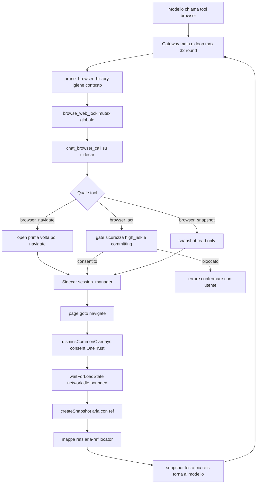

# Sottosistema Browser

> Verificato vs codice 2026-07-06.
>
> Stato: **reverse-engineered dal codice, punto fermo.** Documenta il comportamento reale
> OGGI, non il design desiderato. I riferimenti sono per **simbolo** (funzione/costante/file):
> `main.rs` e i sidecar cambiano a ogni edit, quindi i numeri di riga invecchiano — ri-greppa
> il simbolo, non fidarti del numero. Quando il codice e questa nota divergono, vince il codice
> (e questa nota va corretta).
>
> **Chi pilota il browser.** Il loop browser è guidato dal **singolo loop guardato** in
> `crates/desktop-gateway/src/main.rs` (ADR 0021), NON da `crates/orchestrator` (quel path di
> drive è ritirato/dormiente). Il loop è un port fedele di **OpenClaw** (aria-snapshot + ref
> indicizzati, done-tool).

---

## Cosa fa

Il sottosistema browser è la capacità "navigare il web reale" dell'agente. Permette al
modello di **aprire pagine**, **leggerle come testo accessibile con riferimenti
cliccabili** e **agire** (click, scrittura, selezione, hold) un micro-passo alla volta,
in un loop osserva→agisci. Serve i casi tipo "cerca un treno/volo", "leggi questa
pagina", "compila questa ricerca" senza che il modello debba conoscere il DOM.

Due metà:

- **Sidecar TypeScript** (`runtimes/browser-automation/`): processo Node che parla
  JSON-line su stdio e pilota Chromium via Playwright. Espone metodi atomici
  (`browser.open`, `browser.navigate`, `browser.snapshot`, `browser.act`, …). È il solo
  che tocca il browser.
- **Gateway Rust** (`crates/desktop-gateway/src/main.rs`): espone al modello i tool
  granulari `browser_navigate` / `browser_snapshot` / `browser_act` / `browser_tabs` /
  `browser_screenshot` / `browser_dialog`, gestisce il loop a round, l'igiene di
  contesto, il **gate di sicurezza** e il **lock globale** sul singolo browser.
- **Renderer live panel** (`apps/desktop/src/components/ChatComputerPanel.tsx` +
  `apps/desktop/src/styles.css`): mostra la sessione noVNC del thread mentre il browser
  lavora. Il compact card usa icona di espansione (`Maximize2`) e la modalità full è
  `position: fixed` ancorata dentro l'area chat, a destra della sidebar, così non cresce
  sotto il drawer e lascia una preview browser ampia.

---

## Come funziona OGGI

Flusso di un turno con browsing (lato gateway, `main.rs`):

1. Quando il modello chiama un tool browser, il gateway, se non c'è ancora una sessione,
   avvia il sidecar con `spawn_browser_sidecar_for_chat` / `spawn_browser_sidecar_for_task`
   (entrambe in `main.rs`). Il loop condiviso (`for round in 0..hard_round_ceiling()`, `main.rs`)
   gira fino a `chat_browser_max_rounds()` → `MAX_TOOL_ROUNDS_BROWSER = 32` round quando
   `browser_used` (`main.rs`, costante a `MAX_TOOL_ROUNDS_BROWSER`). NB: è **lo stesso** loop
   guardato ADR 0021 (motore #1), non un loop separato per il browser.
2. Ogni round inizia con **igiene di contesto** `prune_browser_history` (`main.rs`): tiene solo
   l'ULTIMO risultato-snapshot del browser e l'ULTIMA immagine, stubba i precedenti
   (`PRUNED_SNAPSHOT_STUB`, `main.rs`), per non far esplodere la context window a 32 round.
3. Ogni chiamata al sidecar passa per `chat_browser_call` (`main.rs`), sempre sotto il
   **`browse_web_lock`** globale (`fn browse_web_lock`, `main.rs`): un solo turno pilota il
   browser per volta.
4. **`browser_navigate`** (handler `"browser_navigate" => {` nel loop, `main.rs`): la prima volta
   su un tab fa `browser.open`, poi `browser.navigate`; subito dopo fa una `browser.snapshot` con
   i parametri canonici `browser_chat_snapshot_params` (`main.rs`) e restituisce al modello il
   testo via `browser_snapshot_text` (`main.rs`).
5. **`browser_act`** (handler `"browser_act" => {` nel loop, `main.rs`): costruisce l'azione
   coercendo l'errore comune del modello (un ref tipo `e83` passato come `target`, che è un id di
   TAB → re-routing in `ref`, stesso handler), passa per il **gate**
   `browser_safety::high_risk_reason` / `is_committing_action` (`browser_safety.rs`, `fn` a
   `:86` e `:66`), esegue `browser.act` e restituisce lo snapshot aggiornato. C'è anche
   no-progress detection (snapshot identico → nudge) e `browser_act_error_hint` (`main.rs`)
   che insegna la chiamata corretta.
   Dal 2026-06-29 il gate ha anche una variante approval-aware per il futuro flusso
   pagamenti: `high_risk_reason_with_payment_approval` sblocca solo controlli finali di
   pagamento con `payment_approval_id` combaciante. Il path chat corrente continua a
   chiamare il gate conservativo senza approval, quindi acquisti/login/pagamenti restano
   bloccati finché non esiste la Payment Approval Card completa. Vedi [vault.md](vault.md).

Lato sidecar (`session_manager.ts`), `async snapshot(...)` fa:
`waitForLoadState("networkidle", 2500ms)` → `dismissCommonOverlays` → `createSnapshot`,
e ripopola la mappa `refs`. `async act(...)` fa prima `dismissCommonOverlays`, poi
esegue l'azione e (per le azioni mutanti) ri-snapshotta.

---

## Perché è così

- **Profilo ephemeral di default** (`assistantUserDataDir`, `profiles.ts`): ogni
  run parte da una dir per-processo sotto la temp OS, fingerprint pulito. È una scelta
  **anti-bot**: un profilo riusato che un vendor (Cloudflare/DataDome) sfida UNA volta
  tiene per sempre il cookie/fingerprint "bot", trasformando un captcha una-tantum in un
  blocco permanente — il fallimento osservato su ricerche anonime pesanti (voli, treni).
  La persistenza è **opt-in** (`BROWSER_AUTOMATION_PERSIST_PROFILE=1`) e ha senso solo per
  flussi **autenticati**, dove sembrare un utente loggato che ritorna aiuta davvero.
- **Snapshot content-preserving** (`browser_chat_snapshot_params`, `main.rs`): la
  vecchia snapshot `mode:"efficient" + interactive:true` filtrava l'albero aria ai soli
  ruoli cliccabili e buttava via tabelle/righe/celle/testo — così una tabella Wikipedia
  tornava come navbar+cookie-button e il modello non vedeva mai i dati, ripiegando su curl
  con cifre stale/inventate. Oggi si tiene `compact:true` ma NON `interactive`, così la
  snapshot conserva il CONTENUTO **e** i ref interattivi: il modello può sia LEGGERE sia
  CLICCARE. `max_chars` ampio (20k) per non tagliare una tabella a metà.
- **Stealth minimale** (`applyStealthInit`, `session_manager.ts`): si nasconde solo
  il segnale più alto, `navigator.webdriver`, via `addInitScript` nel main world; sul path
  managed (`launchPersistentContext`) si droppano `--enable-automation` e
  `AutomationControlled` e si allineano locale/timezone all'host (`hostLocale()`/`hostTimezone()`,
  `session_manager.ts`). Volutamente minimale: patchright è stato revertato perché il suo
  isolated-context rompeva snapshot e form-fill.
- **Lock globale = un solo browser** (`browse_web_lock`, `main.rs`): c'è una sola
  istanza Chromium condivisa (warm context con cookie/consenso), quindi va serializzato
  l'accesso per non avere due turni che si pestano i tab/lo stato.
- **Discovery-first per ricerche aperte** (`browser_open_research_discovery_instruction`):
  quando l'utente chiede news o ricerca web corrente senza nominare un sito/URL, il loop
  deve partire da una pagina di search/discovery (risultati o news discovery), leggere più
  candidati recenti e solo dopo scegliere le fonti. Saltare direttamente a una singola
  testata è ammesso solo se l'utente l'ha nominata o se il contesto la impone. La pagina
  di discovery deve seguire lingua del prompt e locale del browser; se usa URL di search/news
  con parametri di mercato deve preferire parametri coerenti (`hl=it`, `gl=IT` per richieste
  italiane) invece di defaultare a un mercato casuale.

---

## Contratto

### Tool esposti al modello (gateway)

Schemi in `main.rs`, funzioni `browser_*_tool_schema()`.

| Tool | Input | Output | Note |
|------|-------|--------|------|
| `browser_navigate` (`browser_navigate_tool_schema`) | `url` (req), `target` (tab), `new_tab` | "Page opened (url). Snapshot:\n…" | apre/naviga + auto-snapshot |
| `browser_snapshot` (`browser_snapshot_tool_schema`) | `target` | "Page snapshot:\n…" | read-only, ri-legge la pagina |
| `browser_act` (`browser_act_tool_schema`) | `kind` (req: click/type/fill/select/select_option/press/press_key/hover/hold/scroll/scrollIntoView/wait), `ref`, `text`, `value`, `values`, `submit`, `key`, `durationMs`, `target` | snapshot aggiornato | un micro-passo per volta |
| `browser_screenshot` (`browser_screenshot_tool_schema`) | `full_page`, `marks`, `target` | immagine (+ legenda set-of-marks se `marks`) | solo se la text-snapshot non basta |
| `browser_tabs` (`browser_tabs_tool_schema`) | — | lista tab (id, url, titolo) | read-only |
| `browser_dialog` (`browser_dialog_tool_schema`) | `accept`, `prompt_text` | dialog gestito | risponde a alert/confirm/prompt nativi |

### Metodi del sidecar (stdio JSON-line)

`browser.health|profiles|start|stop|tabs|open|focus|close_tab|navigate|snapshot|`
`screenshot|act|arm_file_chooser|respond_dialog|wait_download|console|pdf`
(`BrowserMethod` in `contracts.ts`, dispatch `dispatch(...)` / `switch (request.method)` in
`server.ts`; entrypoint `handleRequestLine`). Request `{id, method, params}` →
response `{id, ok:true, result}` o `{id, ok:false, error:{code, message, retryable, manual_action_required}}`
(`BrowserRequest`/`BrowserResponse`/`BrowserErrorPayload` in `contracts.ts`).

### Forma dello snapshot

`BrowserSnapshot` (`type BrowserSnapshot` in `snapshot.ts`): `{ targetId, url, snapshot (testo),
refs[], refLocators, refsMode: "aria"|"locator", snapshotFormat: "ai"|"legacy", stats:{lines,chars,refs} }`.

- **`snapshot`** = testo accessibile (albero aria in modalità AI) con righe tipo
  `- button "Cerca" [ref=e7]`. Costruito da `createAiSnapshot` (`snapshot.ts`) via
  `page.ariaSnapshot({mode:"ai"})`, opzionalmente ridotto da
  `buildRoleSnapshotFromAiSnapshot` (`snapshot.ts`) secondo `INTERACTIVE_ROLES` /
  `STRUCTURAL_ROLES` (`snapshot.ts`).
- **`refs`** = elenco `{ref, role, name}` degli elementi indirizzabili; ogni ref mappa a
  un `Locator` (`page.locator("aria-ref=eN")`, `refLocators` map). Il modello agisce passando
  `ref`. Ref stale → take a fresh snapshot (`BROWSER_STALE_REF`, `requireRef` in `actions.ts`).
- Fallback `createLegacySnapshot` (`snapshot.ts`) quando l'aria-snapshot AI fallisce:
  title + body text + elementi da `INTERACTIVE_SELECTOR`, `refsMode:"locator"`.

### Env (sidecar)

- `BROWSER_AUTOMATION_PERSIST_PROFILE=1` → profilo persistente STABILE (default:
  ephemeral per-processo). `assistantUserDataDir` in `profiles.ts`.
- `BROWSER_AUTOMATION_ISOLATED_CONTEXT=1` → contesto isolato per worker paralleli (su CDP
  crea un `newContext` proprio via `isolatedContext`; forza comunque dir per-processo).
  `profiles.ts` + `session_manager.ts`.
- `BROWSER_AUTOMATION_USER_CDP_ENDPOINT` → attacca via `connectOverCDP` al browser reale
  del contained-computer (ADR 0010) invece di lanciare un Chromium host
  (`session_manager.ts`, ramo `connectOverCDP`). Wiring lato gateway:
  `browser_sidecar_env_with_headless` (`main.rs`), endpoint da
  `contained_computer_cdp_endpoint` (`main.rs`).
- `BROWSER_AUTOMATION_HEADLESS` (default headless), `_ALLOW_PRIVATE_NETWORK`,
  `_PROFILE_ROOT`, `_ARTIFACT_ROOT`, `_UPLOAD_ROOTS`, `BROWSER_EXECUTABLE_PATH`
  (`server.ts` env parsing; `discoverChromiumExecutable` in `profiles.ts`).

### Garanzie / errori tipizzati

- **Navigazione governata**: `assertNavigationAllowed` (`navigation_guard.ts`) blocca
  protocolli non http(s) e (default) la rete privata → `BROWSER_NAVIGATION_BLOCKED` /
  `BROWSER_PRIVATE_NETWORK_BLOCKED`.
- **Gate di sicurezza** (`browser_safety.rs`): `evaluate` (JS arbitrario) e azioni
  committing (click/submit/Enter) su controlli con label di acquisto/login/prenotazione
  (`HIGH_RISK_LABEL_PATTERNS`, EN+IT) sono rifiutate per tutti. In turni read-only da
  canale ogni commit è rifiutato, TRANNE per l'owner.
- Errori tipizzati `BrowserAutomationError` (`class BrowserAutomationError` in `contracts.ts`):
  es. `BROWSER_STALE_REF`,
  `BROWSER_ACTION_TIMEOUT`, `BROWSER_DIALOG_BLOCKED`, `BROWSER_TAB_NOT_FOUND`,
  `BROWSER_EXECUTABLE_NOT_FOUND`, `BROWSER_FORM_FILL_FAILED`, con flag
  `retryable` / `manual_action_required`.
- **Autocomplete owned dall'harness**: `kind:"type"` gestisce da solo la selezione del
  suggerimento (combobox, typeahead, keyboard-only) — il modello non deve saperlo
  (`confirmAutocomplete`, `actions.ts`). `hold` per le challenge "tieni premuto"
  (case `"hold"` in `executeAction`, `actions.ts`).
- **`kind:"fill"` accetta DUE forme** (`resolveFillFields`, `actions.ts`): la canonica
  `fields:[{ref,value}]` (multi-campo, usata da `fill_form`/batch) **e** la forma PIATTA
  del micro-tool chat `{ref, text|value}`. Lo schema `browser_act` esposto al modello è
  piatto (una micro-azione per volta), quindi `kind:"fill"` dal chat-loop arriva senza
  `fields`: prima della coercizione il `for…of action.fields` falliva silenziosamente
  (`action.fields` undefined → `BROWSER_ACTION_FAILED`), così **fill non funzionava** dalla
  chat mentre `type` sì. Ora le due forme convergono in un solo path (caposaldo #5); manca
  ancora né `fields` né `ref` → `BROWSER_INVALID_REQUEST` esplicito (non più TypeError opaco);
  `ref` senza valore usa stringa vuota, non errore.
- **Resilienza tab**: `resolvePage` (`session_manager.ts`) ri-materializza un tab
  morto al suo ultimo URL invece di fallire a metà loop; fallback headless→visibile su
  errori di rete tipici (`gotoWithHeadlessFallback`; `isHeadlessNavigationFailure`, entrambe
  in `session_manager.ts`).

---

## Divergenze / debolezze

Problemi reali individuati nel codice attuale:

1. **Lock globale → niente browsing parallelo.** `browse_web_lock` (`main.rs`)
   serializza tutto su un'unica istanza Chromium condivisa. Più turni/canali che vogliono
   navigare insieme si bloccano a vicenda. Il sidecar ha già il concetto di
   isolated-context per worker paralleli (`isolatedContext` in `session_manager.ts`), ma il
   path chat lo serializza comunque.
2. **Consent auto-dismiss solo OneTrust (+ generici IT/EN).** `dismissCommonOverlays`
   (`session_manager.ts`) conosce gli handler `#onetrust-*` e una manciata di bottoni
   per testo ("Rifiuta tutto", "Accept all", …). NON copre **Sourcepoint**, **Didomi**,
   **Quantcast/TCF** né i consent dentro **iframe** (selettori solo sul frame top). Su quei
   CMP il banner resta e occupa il viewport.
3. **SPA che falliscono lo snapshot.** Lo snapshot AI dipende da `page.ariaSnapshot` su un
   albero aria stabilizzato; il settle è **bounded** (`networkidle` 2.5s in `async snapshot`,
   `session_manager.ts`). Una SPA che non va mai idle, idrata dopo il cap, o monta i
   risultati in shadow DOM/canvas può tornare uno snapshot vuoto/scheletro. Fallback:
   `createLegacySnapshot` (testo + selettori CSS), oppure lo screenshot set-of-marks.
4. **Profilo ephemeral = consent-wall ogni pagina.** Il rovescio del default anti-bot:
   nessun cookie persiste tra run, quindi ogni sessione anonima rivede il consent-wall e
   le scelte geo/lingua. Mitigato solo dal warm shared context **quando** si è su CDP
   contained-computer (cookie condivisi tra tab della stessa sessione, wiring env in `main.rs`);
   sul path host ephemeral si riparte puliti ogni volta.
5. **`evaluate` non disponibile lato chat.** Il gate rifiuta `evaluate`
   (`high_risk_reason`, ramo `kind == "evaluate"` in `browser_safety.rs`), quindi non c'è via
   di estrazione dati via JS: tutto deve passare dal testo dello snapshot o da click/scroll.
   Limita pagine in cui il dato è raggiungibile solo via script.
6. **Due sorgenti per "i tool browser" (convergenti, F1.d).** Restano: (a)
   gli **schemi di chat** (`browser_*_tool_schema()` in `main.rs`, la superficie reale che il
   modello chiama nel singolo loop, cablati in `base_tools`); (b) il **seed del registry**
   (`browser_registry_cached_tools`, `main.rs`) che deriva gli stessi sei tool dagli schemi (a) —
   è ciò che il **plan-as-a-tool** indicizza (via registry), così il browser è visibile al piano
   coi nomi giusti. F1.d ha reso (a)≡(b); resta da far sorgentare (a) dal registry (lavoro di
   F3). Il **terzo** sorgente storico — il provider tipato `BrowserCapabilityProvider`,
   dot-named a livello di metodo sidecar (`browser.navigate`), **mai istanziato** — è stato
   **cancellato** (sessione 2026-06-28, F1.d cleanup): era un gemello dormiente in violazione del
   caposaldo #5. L'esecutore durable reale (`execute_capability_browser_task` →
   `execute_persistent_browser_capability`, `main.rs`) pilota il sidecar condiviso
   **direttamente** via `BrowserAutomationClient`/`BrowserMethod`, mappando il tool con
   `browser_method_for_capability_tool` (`main.rs`): non serviva né serve un `CapabilityProvider`
   tipato per il worker path. NB: l'**enum** `CapabilityProviderKind::Browser` resta (lo usano
   registry e resource-bridge per la classe risorsa `BrowserSession`); è solo la **struct**
   provider a essere stata rimossa. (Il vecchio drive di `crates/orchestrator` NON pilota questo
   path: il browser è guidato dal singolo loop guardato in `main.rs`, ADR 0021.)
7. **CDP-wedge invisibile a `browser_cdp_ok` (2026-06-29).** Un container `homun-cc` long-lived può
   andare in *wedge*: `/json/version` (HTTP) risponde ancora, ma `connectOverCDP` (ws handshake) si
   impianta su targets stantii → ogni sidecar nuovo va in `Timeout 30000ms exceeded`. `browser_cdp_ok`
   (`async fn browser_cdp_ok`, `main.rs`) sonda SOLO l'HTTP, quindi `ensure_browser_cdp_healthy` lo
   manca. Mitigazione (path condiviso `call_shared_browser_sidecar`, `main.rs`):
   `browser_response_indicates_cdp_wedge` riconosce la firma e `recycle_container()` una volta per
   finestra (`browser_recycle_throttle_ok`, 90s) → `SidecarLost` → respawn fresco. Resta debole: la
   firma è testuale (EN Playwright) e il recycle è un `docker rm -f` (disruptivo se un altro turno sta
   usando il browser). Fix migliore a regime: un probe ws-level (non solo HTTP) in `browser_cdp_ok`.

---

## Caposaldo servito

- **Caposaldo 3 — Local-first + privacy-by-design** (`docs/CAPISALDI.md`): il browser gira
  locale; navigazione governata (`navigation_guard.ts`) e gate di sicurezza
  (`browser_safety.rs`) sono guardrail fail-closed sulle azioni rischiose.
- **Caposaldo 2 / 11 — orchestrazione dell'harness, no keyword.** L'autocomplete, la
  selezione suggerimenti, la coercion ref/target e i nudge no-progress vivono nel
  CODICE (harness), non nel modello: il browsing deve funzionare anche su modelli deboli.
- **Caposaldo 9 — workspace agentico operativo.** Il loop osserva→agisci con evidenza
  (snapshot, screenshot, browser-step) è una superficie di computer activity verificabile.
- **Caposaldo 5 — un solo motore / niente duplicati.** Il browser ha UN solo esecutore
  (l'esecutore durable sul sidecar condiviso) e UNA sola superficie verso il planner (il seed
  del registry). Il provider tipato dormiente `BrowserCapabilityProvider` è stato cancellato
  (F1.d cleanup) per non lasciare un secondo path di esecuzione mai cablato — stesso ritiro già
  fatto per `SkillCapabilityProvider` (F1.b) e `ComposioCapabilityProvider` (F1.c).
- **ADR 0010 — contained computer**: l'attach via CDP (`connectOverCDP`,
  `BROWSER_AUTOMATION_USER_CDP_ENDPOINT`) è il modo in cui il browser reale del contained
  computer diventa il backend del sidecar. Riferimento esterno: `openclaw` (la snapshot
  segue il contratto OpenClaw — commento in `snapshot.ts` sopra `INTERACTIVE_ROLES`).

---

## File chiave

Sidecar TypeScript (`runtimes/browser-automation/src/`):
- `server.ts` — dispatch stdio JSON-line dei metodi `browser.*`.
- `contracts.ts` — `BrowserMethod`, request/response, `BrowserAutomationError`.
- `browser/session_manager.ts` — `BrowserSessionManager`: `snapshot`/`act`/`resolvePage`,
  `dismissCommonOverlays`, `applyStealthInit`, `launchPersistentContext` /
  `connectOverCDP`, fallback headless→visibile.
- `browser/snapshot.ts` — `createSnapshot` / `createAiSnapshot` /
  `buildRoleSnapshotFromAiSnapshot` / `createLegacySnapshot`, `INTERACTIVE_ROLES` /
  `STRUCTURAL_ROLES`.
- `browser/actions.ts` — `executeAction` (tutte le `kind`), `confirmAutocomplete`,
  `requireRef`, errori normalizzati.
- `browser/profiles.ts` — `assistantUserDataDir` (ephemeral di default / persist opt-in),
  `discoverChromiumExecutable`.
- `browser/navigation_guard.ts` — `assertNavigationAllowed`, blocco rete privata.

Gateway Rust (`crates/desktop-gateway/src/`) — riferimenti per simbolo, ri-greppa in `main.rs`:
- `main.rs` — tool schema (`browser_*_tool_schema`), loop condiviso
  (`for round in 0..hard_round_ceiling()`) e handler (`"browser_navigate"`/`"browser_snapshot"`/
  `"browser_act"` match arms), `browse_web_lock`, `prune_browser_history` /
  `PRUNED_SNAPSHOT_STUB`, `chat_browser_call`, `browser_chat_snapshot_params`,
  `browser_snapshot_text`, `browser_act_error_hint`, spawn sidecar
  (`spawn_browser_sidecar_for_chat` / `_for_task`), env builder
  (`browser_sidecar_env_with_headless`), CDP health (`browser_cdp_ok` /
  `ensure_browser_cdp_healthy`), worker path (`execute_capability_browser_task` /
  `execute_persistent_browser_capability` / `browser_method_for_capability_tool`),
  registry seed (`browser_registry_cached_tools`). Tutto guidato dal singolo loop ADR 0021.
- `browser_safety.rs` — `high_risk_reason` / `high_risk_reason_with_payment_approval`,
  `is_committing_action`, `snapshot_label_for_ref`, `HIGH_RISK_LABEL_PATTERNS`.
