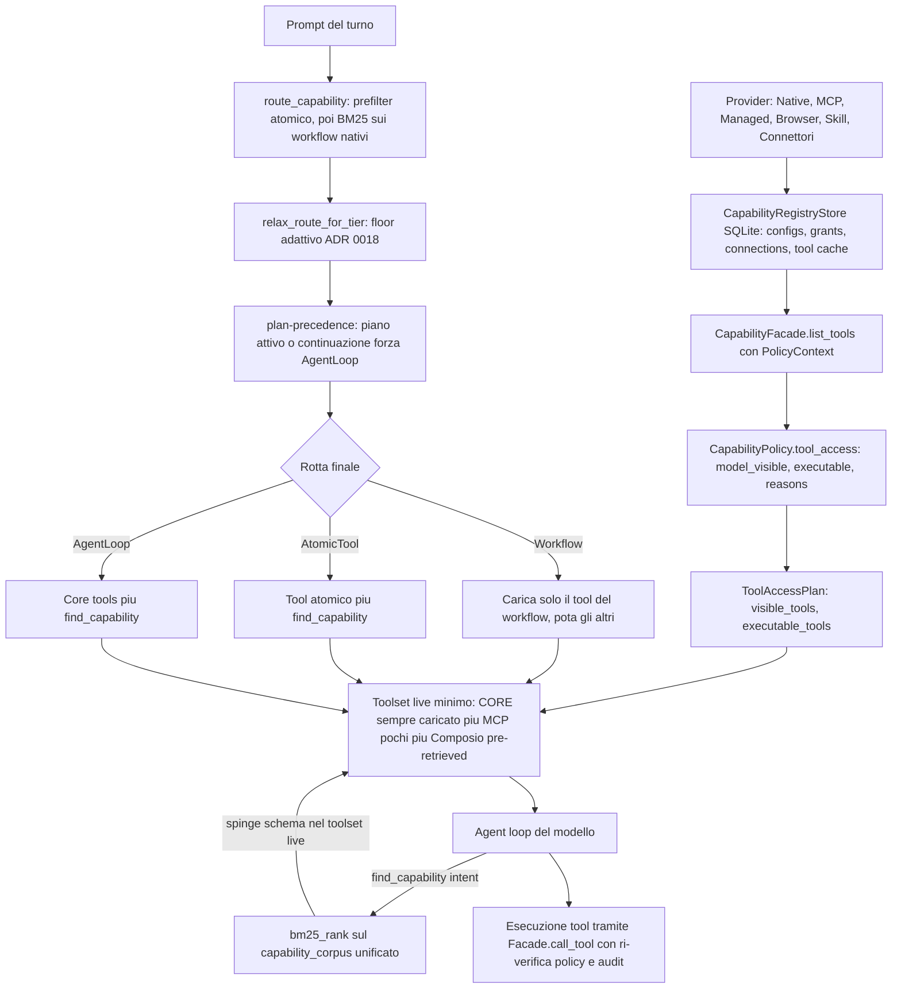

# Registry unico delle capability e routing

**Stato:** 2026-06-28 — reverse-engineered dal codice reale, **punto fermo**. Aggiornato con
**F1.a** (un solo ranker BM25 condiviso, ritirato l'FTS5 dell'orchestratore) e **F1.d**
(browser reale nel registry → visibile al planner). I `file:line` numerici di `main.rs`
possono ora essere leggermente sfasati dopo gli edit; i nomi di funzione restano la chiave.

Serve i **capisaldi #7** (capability activation da registry unico, non keyword sparse)
e **#11** (comprensione senza keyword/regex; verità verificabile). Vedi
[`docs/CAPISALDI.md`](../CAPISALDI.md) e le ADR
[0013](../decisions/0013-connector-auth-and-capability-routing.md),
[0016](../decisions/0016-harness-owned-task-engine-cross-model.md),
[0018](../decisions/0018-adaptive-harness-subagents-triggers.md).

---

## Cosa fa

È la **spina dorsale** che unifica, in un solo registry logico interrogabile, tutte le
classi di capability di Homun:

- **Workflow nativi** (`make_deck` / `make_document`) — deliverable end-to-end;
- **Tool atomici nativi** (operazioni PDF, file, codice, browser micro-tool, …);
- **Tool MCP** dei server connessi;
- **Skill / addon** installati;
- **Connettori** (Composio) — il catalogo grande, centinaia di tool.

Il registry garantisce due cose distinte:

1. **Persistenza + policy** (crate `local-first-capabilities`): chi è il provider, quali
   tool espone, sotto quale `ActionClass`, con quali `privacy_domains` e boundary
   (locale / cloud gestito). La `CapabilityFacade` decide cosa è **visibile** e cosa è
   **eseguibile** per un dato `PolicyContext`.
2. **Routing + retrieval** (gateway): a ogni turno una richiesta viene instradata verso
   un **Workflow** o verso l'**AgentLoop**, e il toolset live viene riempito col **set
   minimo** di tool — un piccolo core sempre caricato più ciò che `find_capability`
   recupera via BM25 dal registry. È il pattern *Tool Search* di Anthropic (ADR 0013).

L'obiettivo (caposaldo #7): «voglio creare un pitch per Homun» deve recuperare
`make_deck` **anche senza** le parole `slide` o `pptx`, perché il match è semantico/BM25
sul testo di route, non keyword cablate.

---

## Come funziona OGGI

### 1. Persistenza e policy — il crate `local-first-capabilities`

Lo store SQLite `CapabilityRegistryStore`
(`crates/capabilities/src/registry.rs:211`) tiene quattro tabelle:
`capability_provider_configs`, `capability_provider_grants`,
`capability_connection_configs`, `capability_tool_cache`
(`registry.rs:232`). Ogni provider ha un `CapabilityProviderKind`
(`Native | Mcp | Managed | Browser | Skill`, `types.rs:67`) e un `ResourceClass`
derivato dal kind (`registry.rs:675`).

- I **grant** (`CapabilityProviderGrant`, `registry.rs:64`) per `(provider, user,
  workspace)` portano: `enabled`, `allow_managed_cloud`, `privacy_domains`,
  `allowed_actions: Vec<ActionClass>`, `max_autonomy_level`.
- `policy_context(...)` (`registry.rs:636`) **collassa i grant abilitati** in un unico
  `PolicyContext` (`policy.rs:5`): provider abilitati, unione di privacy domain e azioni
  permesse, `max_autonomy_level` massimo, `allow_managed_cloud` in OR.
- I tool MCP/connettore sono materializzati come `CachedCapabilityTool`
  (`registry.rs:178`) nella `capability_tool_cache` (letti con `cached_tools(...)`,
  `registry.rs:610`), così non serve interrogare il server a ogni turno.

La **`CapabilityFacade`** (`facade.rs:10`) registra i `CapabilityProvider`
(trait in `provider.rs:8`) e produce il `ToolAccessPlan`:

- `list_tools(context)` (`facade.rs:58`) itera i provider abilitati, chiede
  `provider.list_tools()`, e per ogni tool chiede a `CapabilityPolicy::tool_access`
  (`policy.rs:30`) la `ToolAccessDecision { model_visible, executable, reasons }`.
  Riempie due liste: `visible_tools` (model_visible) ed `executable_tools`.
- `call_tool(context, call)` (`facade.rs:100`) ri-verifica la policy **prima** di
  eseguire: se non eseguibile → audit `denied` + errore; altrimenti valida gli argomenti
  contro l'`input_schema` (`validate_arguments`, `facade.rs:197`), esegue e registra
  audit `allowed`. Ogni decisione passa dall'audit (`InMemoryCapabilityAudit`).

La **policy** (`policy.rs:30`) è fail-closed sui confini: provider non abilitato,
`Managed` senza `allow_managed_cloud`, o privacy domain non concesso → tool **invisibile
e non eseguibile**. Superati i confini, il tool è `model_visible: true`; l'eseguibilità
dipende poi da `allowed_actions` e dal livello di autonomia richiesto dall'azione
(`required_autonomy_level`, `policy.rs:101`: Read=0, Draft=2, WriteWithConfirmation=3,
ApprovedAutomation=4).

Nel gateway lo store è dietro `Arc<Mutex<CapabilityRegistryStore>>` (`main.rs:142`),
aperto+seminato da `open_seeded_capability_registry` (`main.rs:43292`) e preso con
`lock_capability_registry(state)` (`main.rs:43538`). Il seeding di default registra il
provider `browser` con i suoi tool cache (`seed_default_capabilities`, `main.rs:43300`).

### 2. Routing della richiesta — Workflow vs AgentLoop (gateway)

A ogni turno di chat, `route_capability(prompt)` (`main.rs:8297`) decide:

1. **Prefilter atomico**: `atomic_pdf_operation_reason` (`main.rs:8333`) — se il prompt
   nomina «pdf» + un verbo atomico (estrai/unisci/converti…) → `AtomicTool`, per non
   instradare un'operazione atomica verso il workflow deliverable `make_document`.
2. Altrimenti BM25 (`bm25_rank`, `main.rs:8306`) sul corpus dei **workflow nativi**
   (`native_workflow_capability_entries`), ognuno con un `route_text` semantico
   multilingua (es. `make_deck`: «presentation presentazione deck slide … pitch investor
   deck», `main.rs:6973`). Il top match, se è un workflow noto
   (`native_workflow_by_tool_name`, `main.rs:8311`) → `Workflow { workflow_id, tool_name,
   scaffolding_tier, reason, alternatives }`.
3. Nessun candidato → `AgentLoop`.

`CapabilityRouteDecision` (`main.rs:8258`) ha le tre varianti `Workflow | AtomicTool |
AgentLoop`. `workflow_route_from_capability` (`main.rs:8279`) la collassa nel più semplice
`WorkflowRouteDecision { Workflow | AgentLoop }` usato per potare il toolset.

Sopra la rotta grezza agiscono due correttori, **in quest'ordine**, nel cuore del turno
(`main.rs:18519`–`18551`):

- **Floor adattivo (ADR 0018, Fase 2)** — `relax_route_for_tier(route, bias, floor_on)`
  (`main.rs:8430`): per un modello **capace** (`WorkflowBias::AllowAgentic`) un Workflow
  viene **rilassato** ad AgentLoop (il tool del workflow resta comunque offerto, cade solo
  la potatura + il vincolo «esattamente una volta»). Modelli deboli/bilanciati o floor
  off restano invariati; `AtomicTool` non si rilassa mai.
- **Precedenza del piano (`plan-precedence`)** — `main.rs:18540`: se è in corso un piano
  runtime (`thread_has_active_runtime_plan`, `main.rs:8500`, che cerca in memoria un
  `open_loop` con `source=runtime_plan` per il thread) **oppure** il messaggio è una
  continuazione/approvazione («1», «procedi», `is_plan_continuation_message`), una rotta
  Workflow viene **forzata** ad AgentLoop. Senza questo, un turno di continuazione finirebbe
  in un workflow one-shot che pota i tool del piano (`update_plan`, `browser_navigate`) e lo
  manderebbe in stallo (bug APPROVAL-RESUME). Tier- e flag-indipendente: vale anche col
  floor spento.

La rotta finale diventa istruzione di sistema iniettata nel prompt
(`capability_router_instruction_for_decision`, `main.rs:8372`) e una riga di trace
(`capability_route_trace_line`, `main.rs:8399`).

### 3. Costruzione del toolset live minimo (gateway)

1. Si parte da `base_tools` — l'insieme largo dei tool nativi (`main.rs:18640`+), con
   filtri per `read_only` (canali) e per i workflow deliverable.
2. **Split CORE / DEFERRED** (`main.rs:18715`): `base_tools.partition(...)` separa i tool
   il cui nome è in `CORE_TOOL_NAMES` (`main.rs:17493` — il piccolo core sempre caricato:
   memoria, date, piano, file di progetto, `find_capability`, …) dal **resto deferito**.
3. In base alla rotta (`main.rs:18723`): Workflow → si carica **solo** lo schema del
   workflow scelto; Atomic → lo schema atomico + `find_capability`; AgentLoop →
   `find_capability`. La potatura `prune_tools_for_workflow_route` (`main.rs:18709`,
   ripetuta `18775`) tiene solo il tool del workflow quando la rotta è Workflow.
4. **MCP**: se i tool MCP connessi sono pochi (`<= MCP_ALWAYS_LOAD_MAX = 24`,
   `main.rs:18744`) entrano dritti nel toolset live; oltre, restano dietro
   `find_capability`.
5. **Composio** (catalogo grande): mai tutto a prompt; `auto_retrieve_composio`
   (`main.rs:18763`, `main.rs:17628`) pre-recupera i ~4 tool più pertinenti al messaggio
   (keyword overlap + opzionale dense RRF) e li carica up-front; il resto vive nel corpus
   discoverable.
6. **Corpus unificato per `find_capability`** (`capability_corpus`, `main.rs:18779`): tool
   nativi deferiti + workflow + atomici + template catalog + tool MCP + skill, tutti come
   `CapabilityEntry` (`main.rs:17554`) in una sola lista BM25-searchable. I connettori non
   sono appiattiti qui: sono cercati toolkit-aware in `search_composio_catalog`
   (`main.rs:17770`) dentro `find_capability`.

### 4. `find_capability` — retrieval BM25 a runtime

Quando il modello chiama `find_capability(intent)` (handler `main.rs:21960`):

- `bm25_rank(&capability_corpus, &intent, 6)` (`main.rs:21991`; implementazione BM25
  Okapi k1=1.5 b=0.75 su token, `main.rs:17719`) restituisce le migliori capability.
  Per ognuna: skill → riga «load with use_skill»; tool/connettore con schema → lo
  **spinge nel toolset live** (`tool_schemas.push`, `main.rs:22006`) così è chiamabile dal
  turno successivo; template → suggerimento `template_ref`.
- I servizi connessi sono attivati toolkit-aware (`search_connector_capability_entries`,
  `main.rs:18018`), con i filtri di policy del turno (read-only, perimetro
  calendario/contatti).

### 5. Percorso orchestratore (planning durevole)

Quando il gateway costruisce un piano canonico via `OrchestratorBrain` (`main.rs:35689`),
il retrieval usa lo **stesso** ranker della chat (F1.a): un `ToolCorpus`
(`crates/orchestrator/src/tool_corpus.rs`) in memoria, ricostruito dai `visible_tools`
ad ogni ingresso di planning e ordinato dal BM25 **condiviso**
(`local_first_capabilities::search`). Il Brain chiama `load_initial_tools`
(`crates/orchestrator/src/brain.rs:233`): se i tool visibili sono ≤ 10 li passa tutti,
altrimenti `tool_corpus.search(user_message, max_loaded_tools)` restituisce i `ToolCard`
(`crates/orchestrator/src/types.rs:302`) e ne carica i dettagli. `max_loaded_tools` è tarato
sul context window del modello (`brain_budgets_for_context_window`, `main.rs:35762`: 16 per i
capaci, 5 di default — `types.rs:46`). Round successivi: rotta `NeedsMoreTools` → nuova
`search` con la query del planner (`brain.rs:299`).

> **F1.a — un solo motore di retrieval (caposaldo #5).** Prima convivevano **due** BM25: il
> `bm25_rank` Okapi del loop di chat e l'`FTS5 bm25()` su `ToolCard` dell'orchestratore (che
> però era SEMPRE aperto `in_memory` e ricostruito ogni turno → tutta la macchina FTS5 era
> peso morto, e il ranking `term*`-prefix divergeva dall'Okapi). Ora c'è **un solo** ranker
> condiviso in `local_first_capabilities::search` (Okapi BM25 puro su testo pre-tokenizzato,
> ritorna indici): la chat lo chiama via `bm25_rank`, l'orchestratore via `ToolCorpus`. Stesso
> algoritmo, stessa tokenizzazione → niente più drift tra "cosa trova la chat" e "cosa trova il
> piano". `ToolSearchIndexStore`/`tool_index.rs` (FTS5) sono **ritirati**.

### Diagramma del flusso

---

## Perché è così

- **Caposaldo #7 + ADR 0013**: man mano che i tool connessi crescono (>30–50), metterli
  tutti nel prompt degrada la selezione del modello e brucia contesto. Lo stato dell'arte
  (Anthropic *Tool Search*) tiene un **core piccolo sempre caricato** e fa **discovery del
  resto** via retrieval. Da qui lo split CORE/DEFERRED e `find_capability`.
- **Routing semantico, non keyword**: il match BM25 sul `route_text` permette di recuperare
  `make_deck` da «pitch per Homun» senza parole cablate (caposaldo #11). Keyword/regex
  restano solo come prefilter (PDF atomico), fallback o guardrail di sicurezza, non come
  verità primaria.
- **Un solo registry logico**: workflow, MCP, skill, connettori e atomici condividono lo
  stesso modello (`CapabilityProviderKind`, `ActionClass`, policy) così policy, audit e
  boundary sono **una sola decisione** invece di tre sistemi paralleli.
- **Policy fail-closed**: visibilità ed eseguibilità sono separate (`model_visible` vs
  `executable`) per poter mostrare al modello che una capability esiste pur negandone
  l'esecuzione finché manca il grant/approval — coerente col modello write→confirm→approve.
- **plan-precedence (Pavimento, ADR 0016/0018)**: il piano è control-flow di proprietà
  dell'harness; deve battere la manopola di routing, altrimenti un turno di ripresa cade in
  un workflow one-shot che pota i suoi stessi tool.

---

## Contratto

**Cosa garantisce il registry:**

- Un solo `PolicyContext` per `(user, workspace)` derivato dai grant abilitati
  (`registry.rs:636`): unione di privacy domain e azioni, autonomia massima,
  `allow_managed_cloud` in OR.
- `list_tools` produce un `ToolAccessPlan` deterministico e ordinato per nome
  (`facade.rs:75`), partizionato in `visible_tools` / `executable_tools`.
- `call_tool` **ri-verifica** sempre la policy prima di eseguire (`facade.rs:113`) e valida
  gli argomenti contro l'`input_schema`; ogni esito (allowed/denied) è registrato a audit.

**Come un tool diventa visibile/eseguibile:**

1. Il suo **provider** è registrato (config) e **abilitato** da un grant per quel
   `(user, workspace)`.
2. Supera i **confini**: provider abilitato, non `Managed` senza `allow_managed_cloud`, e
   ogni `privacy_domain` del tool è concesso → `model_visible: true`.
3. La sua **`action`** è in `allowed_actions` **e** `max_autonomy_level ≥
   required_autonomy_level(action)` → `executable: true` (`policy.rs:77`–`91`).
4. Per essere **chiamabile dal modello in chat** dev'essere nel toolset live: o nel CORE,
   o caricato dalla rotta, o pre-recuperato (MCP/Composio), o spinto da `find_capability`.

**Action class** (`types.rs:85`) e autonomia richiesta (`policy.rs:101`):

| ActionClass | Semantica | Autonomia minima |
| --- | --- | --- |
| `Read` | sola lettura | 0 |
| `Draft` | bozza, nessun side-effect committato | 2 |
| `WriteWithConfirmation` | scrittura con conferma utente | 3 |
| `ApprovedAutomation` | automazione approvata | 4 |

---

## Divergenze / debolezze

- **`route_capability(prompt)` non vede il tier del modello (ADR 0018).** La decisione di
  scaffolding dipende **solo** dal tipo di richiesta: `ModelTier` non raggiunge
  `route_capability` (`main.rs:8297`). Oggi il floor adattivo è correttivo a valle
  (`relax_route_for_tier`, `main.rs:8430`), non integrato nella decisione: un modello
  frontier viene comunque profilato sugli slot pensati per i deboli prima del rilascio.
  Direzione ADR 0018: rendere le manopole funzione del `ModelTier` portato fino alla
  decisione di scaffolding.
- **Il browser è visibile al planner (F1.d) — resta inline nel toolset LIVE della chat.**
  Il seed (`seed_default_capabilities`, `browser_registry_cached_tools`) ora semina nel
  provider `browser` i **veri** sei tool di chat (`browser_navigate`/`_snapshot`/`_act`/
  `_tabs`/`_screenshot`/`_dialog`) coi **loro schemi reali**, derivati dalle stesse
  `browser_*_tool_schema()`. Poiché il planner indicizza i `cached_tools` del registry, ora
  **vede il browser** come capability instradabile coi nomi che il loop di chat esegue
  davvero (chiude il "set ombra", sblocca ADR 0020). Residuo: nel loop di chat i micro-tool
  sono ancora cablati a mano in `base_tools` (`main.rs:~18829`) invece di essere sorgentati
  dal registry — convergere quella sorgente è lavoro di F3 (chat→OrchestratorBrain). Nota: il
  provider tipato `BrowserCapabilityProvider` (`crates/capabilities/src/browser_provider.rs`)
  è dot-named a livello di metodo sidecar e **mai istanziato** (morto): è il gemello dormiente,
  granularità sbagliata per il planner.
- **`PolicyContext` collassa i grant.** L'unione di privacy domain/azioni su tutti i
  provider abilitati (`registry.rs:649`) è permissiva: un'azione concessa per un provider
  entra nell'insieme globale `allowed_actions` valutato per ogni tool. La granularità
  per-provider esiste nei grant ma non è riproiettata nella decisione per-tool.
- **Validazione argomenti shallow.** `validate_arguments` (`facade.rs:197`) controlla solo
  `required` e i tipi di primo livello, non lo schema JSON completo (niente nested/enum/
  pattern).

---

## Caposaldo servito

- **#7 — Capability activation da registry unico, non keyword sparse.** Workflow, MCP,
  skill/addon, connettori e atomici nello stesso registry interrogabile; il turno fa
  retrieval/decisione strutturata e carica solo il set minimo. Keyword solo come
  prefilter/fallback/guardrail.
- **#11 — Comprensione senza keyword/regex; verità verificabile.** Il routing è BM25
  semantico sul testo di route, non regex cablate; la verifica (policy, audit, validazione
  argomenti, step verificati nel piano) è deterministica dove possibile.

---

## File chiave

- `crates/capabilities/src/facade.rs` — `CapabilityFacade`, `ToolAccessPlan`,
  `list_tools` (`:58`), `call_tool` (`:100`), `validate_arguments` (`:197`).
- `crates/capabilities/src/policy.rs` — `PolicyContext`, `CapabilityPolicy::tool_access`
  (`:30`), `required_autonomy_level` (`:101`).
- `crates/capabilities/src/registry.rs` — `CapabilityRegistryStore` (`:211`), schema/
  migrazioni (`:232`), `CachedCapabilityTool` (`:178`), `policy_context` (`:636`),
  `cached_tools` (`:610`).
- `crates/capabilities/src/types.rs` — `ProviderId` (`:15`), `CapabilityProviderKind`
  (`:67`), `ActionClass` (`:85`), `CapabilityTool` (`:101`).
- `crates/capabilities/src/provider.rs` — trait `CapabilityProvider` (`:8`).
- `crates/capabilities/src/search.rs` — **ranker BM25 condiviso** (F1.a): `tokenize`,
  `bm25_rank_indices` (Okapi su testo pre-tokenizzato → indici), `bm25_rank_texts`.
- `crates/orchestrator/src/tool_corpus.rs` — `ToolCorpus` in memoria: `rebuild_from_tools`,
  `search` (via il ranker condiviso), `tool_detail`. (Sostituisce l'ex `ToolSearchIndexStore`
  FTS5, ritirato.)
- `crates/orchestrator/src/types.rs` — `ToolCard` (`:302`), `OrchestratorBudgets`
  (`max_loaded_tools`, `:24`/`:46`).
- `crates/orchestrator/src/brain.rs` — `load_initial_tools` (`:233`), retry/`NeedsMoreTools`
  (`:262`).
- `crates/desktop-gateway/src/main.rs` — routing (`route_capability` `:8297`,
  `relax_route_for_tier` `:8430`, `thread_has_active_runtime_plan` `:8500`,
  `plan-precedence` `:18540`), toolset live (`CORE_TOOL_NAMES` `:17493`,
  split CORE/DEFERRED `:18715`, `MCP_ALWAYS_LOAD_MAX` `:18744`, `auto_retrieve_composio`
  `:17628`), `bm25_rank` (wrapper sul ranker condiviso), `find_capability` (handler
  `:21960`), `lock_capability_registry`, `seed_default_capabilities` /
  `browser_registry_cached_tools` (browser reale nel registry, F1.d).
- `docs/CAPISALDI.md` — caposaldi #7 e #11.
- `docs/decisions/0013-…`, `0016-…`, `0018-…`, `0020-…` — ADR di riferimento.
