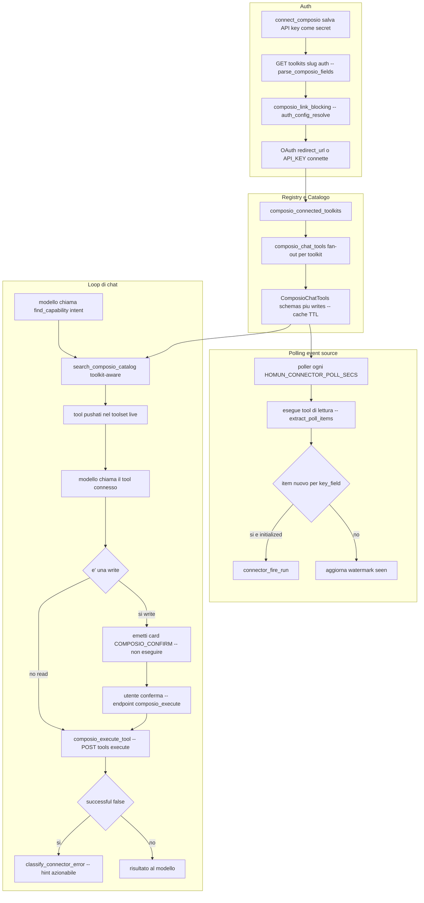

# Connettori / Composio (servizi connessi)

**Stato:** 2026-06-27 · reverse-engineered dal codice · punto fermo.

Documenta il sottosistema dei **servizi connessi** (Gmail, Google Calendar, GitHub,
Notion, Slack, …) mediati da [Composio](https://composio.dev). È una descrizione del
codice **com'è oggi**, non un progetto: `file:line` puntano a `crates/desktop-gateway`
e `crates/capabilities` di questo repo.

---

## Cosa fa

Permette all'agente di **leggere e agire su servizi cloud di terze parti** dell'utente
senza scrivere codice per-servizio. Composio è il broker che:

- ospita l'**auth** (OAuth/API key) verso ogni toolkit;
- espone un **catalogo di tool** (slug tipo `GMAIL_SEND_EMAIL`,
  `GOOGLECALENDAR_EVENTS_LIST`) con schema d'input;
- **esegue** la chiamata al servizio per conto nostro.

Homun ci aggiunge sopra le quattro cose che il broker non fa: 1) una **superficie
tool piccola** (Tool Search: i tool entrano nel loop solo on-demand via
`find_capability`, ADR 0013); 2) una **classifica read-vs-write** che impone la
**conferma** sulle scritture; 3) la **traduzione degli errori** in istruzioni
azionabili (reconnect / wait / re-grant); 4) il **polling** dei tool di lettura come
sorgente di eventi per le automazioni (caposaldo #10).

---

## Come funziona OGGI

### Layer e file

- **Provider di crate** `ComposioCapabilityProvider` — `crates/capabilities/src/composio.rs:98`.
  Implementa il trait `CapabilityProvider` (`list_tools`/`list_connections`/`call_tool`/
  `list_triggers`/`enable_trigger`). È il modello canonico e attende lo shape **pre-v3**
  Composio (`{tools}`). Viene registrato nel facade per il **task-runtime**
  (`crates/desktop-gateway/src/main.rs:31605`).
- **Path di chat "vivo"** — quasi tutto il flusso interattivo NON passa dal provider di
  crate ma da funzioni dirette in `crates/desktop-gateway/src/main.rs`, che parlano la
  **v3 API** (`{items}`). Questa è la divergenza principale (vedi sotto).

### 1) Auth / connessione (schema-driven, ADR 0013)

1. **Connessione dell'account Composio** (la API key del broker):
   `connect_composio` → `connect_composio_blocking` (`main.rs:35229`, `:32075`). Verifica
   la key contro `GET /toolkits` PRIMA di persistere, poi salva la key come **secret**
   (`SecretRef user/workspace/"composio"/"default"`, `main.rs:32114`) e fa
   `upsert_provider_config` nel registry (`main.rs:32129`). Nel registry finisce solo il
   **ref**, mai la key in chiaro.
2. **Toolkit auth schema-driven**: `GET /toolkits/{slug}/auth` →
   `parse_composio_fields` (`main.rs:34811`) legge l'`auth_config_details` reale del
   toolkit e ritorna gli `schemes[]` (OAUTH2 | API_KEY | …, managed vs custom). Il
   `ConnectModal` costruisce la form DA questi schemi: OAuth managed → bottone
   one-click; OAuth custom → Client ID/Secret + redirect-URI da whitelistare; API_KEY →
   campo chiave.
3. **Link della connessione**: `composio_link` → `composio_link_blocking` (`main.rs:35036`)
   → `composio_auth_config_resolve` (`main.rs:34940`) crea l'auth_config e inizia la
   connessione. OAuth → ritorna un `redirect_url` (pagina di consenso hosted da
   Composio); API_KEY → connette subito.
4. **Trasporto** per le chiamate: `composio_transport_for` (`main.rs:32197`) risolve la
   connection config dal registry, recupera la key dal secret store e costruisce un
   `GatewayComposioTransport { base_url, api_key }`. L'entità Composio è
   `composio_entity_id()` = base workspace (`main.rs:32373`), così gli account connessi
   si risolvono in qualunque progetto.

### 2) I tool entrano nel registry / catalogo

Catalogo costruito a runtime, non statico:

- `composio_connected_toolkits` (`main.rs:32496`) → `GET /connected_accounts?user_ids=…`,
  restituisce `(slug, is_active)`; un toolkit è attivo se **almeno un** account è ACTIVE.
- `composio_chat_tools` (`main.rs:32578`) fa fan-out **un toolkit per richiesta**
  (`GET /tools?toolkit_slug={slug}&limit=…` — v3 ignora i parametri plurali, verificato),
  converte ogni tool in schema funzione OpenAI e popola `ComposioChatTools { schemas,
  writes, inactive }` (`main.rs:32383`). `writes` = slug classificati scrittura.
- `composio_chat_tools_cached` (`main.rs:32559`) cachea per `cap` con TTL
  `HOMUN_COMPOSIO_CACHE_SECS` (default 60s); `composio_catalog_invalidate` (`main.rs:32550`)
  svuota la cache su connect/link/disconnect.
- I tool MCP confluiscono **nella stessa superficie** di discovery dei Composio
  (`main.rs:18158`).

### 3) Discovery nel loop — `find_capability` (Tool Search)

Il catalogo Composio è grande → resta **deferred**, dietro `find_capability`
(`main.rs:18750`, `has_composio`). Il modello chiama `find_capability(intent)`
(`main.rs:21960`): i tool nativi/skill passano per BM25, i connettori per
`search_connector_capability_entries` / `search_composio_catalog` (`main.rs:17770`,
toolkit-aware: attiva l'intero set CRUD del servizio insieme). I match vengono
**pushati nel toolset live** per i round successivi. Filtri di perimetro qui:
`read_only`+`composio_tool_is_read`, `can_see_calendar`/`tool_touches_calendar`,
`can_see_contacts`/`tool_touches_contacts` (`main.rs:22023`).

### 4) Dispatch: read vs write → approval

Quando il modello chiama un tool connesso (`main.rs:22615`):

- `needs_confirm = composio_writes.contains(name) && !composio_tool_allowed(name) && !autonomous`
  (`main.rs:22619`).
- **Read (o write già "always-allow", o run autonomo)** → esegue subito via
  `composio_execute_tool` (`main.rs:33587` → `POST /tools/execute/{tool}`).
- **Write** → NON esegue: emette una **card** `‹‹COMPOSIO_CONFIRM››{approval_id?,tool,
  arguments}‹‹/COMPOSIO_CONFIRM››` (`main.rs:22645`), setta `pending_confirm` e dice al
  modello «AWAITING USER CONFIRMATION — non dire che è fatto». L'esecuzione vera arriva
  dalla card: endpoint `composio_execute` (`main.rs:34238`) che **rifiuta** se la card non
  combacia (`composio_confirm_matches`, FORBIDDEN `composio_confirmation_required`),
  opzionalmente registra "always" (`add_composio_tool_allow`), esegue, e riscrive la card
  in "done" per evitare riesecuzioni.
- `create_pending_approval` (`main.rs:32994`) crea una riga di approvazione **solo per i
  canali remoti** (Telegram, `approval_channel != "in_app"`); in-app ritorna `None` (la
  card È il meccanismo in-app).
- Composio risponde **HTTP 200 anche se il tool è fallito** (`successful:false`):
  `composio_execution_error` (`main.rs:33749`) lo intercetta così non si dichiara "fatto"
  un'azione fallita.

### 5) Errori → istruzioni azionabili

`classify_connector_error` (`main.rs:33640`) mappa il testo d'errore (euristica) in
`ConnectorErrorKind { Auth, RateLimit, Forbidden, Unavailable }` (`main.rs:33629`).
`connector_error_hint` (Composio, `main.rs:33674`) e `mcp_error_hint` (`main.rs:33732`)
producono l'istruzione: Auth → reconnect + marker `‹‹COMPOSIO_RECONNECT››<slug>`;
RateLimit → aspetta; Forbidden → riconnetti con più scope; Unavailable → servizio
offline. `record_connector_run` (`main.rs:33708`) logga ogni run (kind, ok, error_kind,
durata) nell'audit.

### 6) Polling come event source (caposaldo #10)

`spawn_connector_event_poller` (`main.rs:10118`) ogni `connector_poll_interval`
(`HOMUN_CONNECTOR_POLL_SECS`, min 30s, default 300s) chiama `connector_poll_tick`
(`main.rs:10127`): per ogni automazione `EventTrigger::ConnectorPoll { tool, args,
key_field, label }` (`task-runtime/src/types.rs:341`) esegue il tool (MCP o Composio),
estrae gli item via `extract_poll_items` (`main.rs:10081`, primo array i cui elementi
hanno `key_field`), e **firea un run per ogni item nuovo** (watermark `seen` bounded a
1000). Il **primo poll** solo semina il watermark (`initialized`) senza firare.
`connector_fire_run` (`main.rs:10269`) materializza il run con l'item come contesto
evento.

### Diagramma

---

## Perché è così

- **Tool Search invece di prompt-stuffing** (ADR 0013-B): con decine/centinaia di tool
  connessi metterli tutti nel prompt degrada il modello. Core piccolo + discovery
  on-demand via `find_capability` mantiene la superficie stabile a prescindere da quanti
  servizi sono connessi. Stessa disciplina del caposaldo #7 (registry unico, no keyword).
- **Auth schema-driven** (ADR 0013-A): leggere l'`auth_config_details` reale del toolkit
  evita di "indovinare" l'auth (il bug Spotify). Aggiungere un connettore non richiede
  codice per-servizio: form e link derivano dagli schemi dichiarati.
- **Write → conferma per default**: una scrittura su un servizio dell'utente
  (manda email, cancella evento) è irreversibile. `composio_tool_is_read` è
  **conservativo** (read solo se c'è un verbo di lettura E nessuno di scrittura): nel
  dubbio è write da confermare. Caposaldo #10: approval è parte della singola decisione
  fail-closed.
- **HTTP 200 ≠ successo**: Composio segnala il fallimento con `successful:false`. Senza
  intercettarlo si mostrava "Azione eseguita" su azioni non avvenute → bug reale.
- **Polling come fallback**: molti servizi non fanno push verso un'app desktop
  local-first; il tempo è il fallback tecnico per trasformare un tool di lettura in
  sorgente di eventi (caposaldo #10), generico su qualunque connettore via `key_field`.

---

## Contratto

**Auth.** L'account Composio si connette con una API key, verificata e salvata come
secret (mai in chiaro nel registry). I singoli toolkit si connettono schema-driven
(OAuth managed/custom o API_KEY) leggendo l'auth reale via `parse_composio_fields`.
Entità Composio = base workspace, così gli account si risolvono in ogni progetto.

**Read vs write.** Classificazione dal solo slug — `composio_tool_is_read`
(`main.rs:32398`): read = presenza di un verbo di lettura (FETCH/GET/LIST/SEARCH/…) E
assenza di un verbo di scrittura (SEND/CREATE/DELETE/UPDATE/…). Ambiguo ⇒ write.
`ComposioChatTools.writes` è il set autorevole usato al dispatch.

**Approval.** Una write esegue solo se: l'utente conferma la card `COMPOSIO_CONFIRM`,
OPPURE il tool è in "always-allow" (`composio_tool_allowed`, file
`composio-tool-allow.json`, supporta `mcp__<server>__*`), OPPURE è un run `autonomous`
(opt-in per-automazione). L'endpoint `composio_execute` rifiuta qualunque write non
ancorata a una card combaciante. Le approvazioni via canale remoto passano per
`create_pending_approval` (in-app = `None`).

**Error kinds.** `auth` (401/expired/not connected → reconnect), `rate_limit`
(429/quota → wait), `forbidden` (403/scope → re-grant), `unavailable` (transport
down → offline). Stringhe stabili da `connector_error_kind_str` (`main.rs:33697`) per
audit/UI; `None` quando non classificabile ⇒ `"other"`.

---

## Divergenze / debolezze

- **Due implementazioni Composio parallele.** Il provider di crate
  (`composio.rs`, shape pre-v3 `{tools}`/`/tools/execute/{name}` con `user_id`+`arguments`)
  serve solo il task-runtime; il path di chat in `main.rs` parla **v3** (`{items}`,
  `?toolkit_slug=`, `?user_ids=`). Sono codebase distinte da tenere allineate a mano: il
  provider di crate userebbe lo shape sbagliato se messo sul path di chat (commento
  esplicito a `main.rs:32098`).
- **Read/write dal solo slug.** `composio_tool_is_read` è euristico: uno slug ambiguo o
  con verbo non in lista cade in write (sicuro ma rumoroso); un eventuale tool di scrittura
  che nello slug porta solo un verbo "read" verrebbe eseguito senza conferma.
- **Classificazione errori per substring.** `classify_connector_error` matcha sul testo
  (es. "401", "rate limit"): un servizio con messaggi atipici finisce in `other` senza
  hint di reconnect.
- **Polling, non push.** Latenza fino a `HOMUN_CONNECTOR_POLL_SECS` (default 5 min) e
  costo di N chiamate/intervallo; il watermark `seen` è bounded a 1000 → su volumi alti
  un item potrebbe rientrare come "nuovo" dopo l'eviction.
- **Catalogo a runtime.** Dipende da fan-out HTTP per toolkit (mitigato dalla cache TTL):
  con Composio lento il primo turno paga la latenza; un toolkit EXPIRED finisce in
  `inactive` per pilotare il reconnect ma i suoi tool spariscono dal catalogo.

---

## Caposaldo servito

- **#7 — Capability activation da registry unico, non keyword sparse.** I connector tool
  stanno nello stesso registry logico di workflow nativi/MCP/skill; entrano nel toolset
  live solo via `find_capability` (retrieval, non keyword).
- **#10 — Automazioni = evento → filtro → azione.** Il polling Composio/MCP è la
  sorgente d'evento per i trigger `ConnectorPoll`; approval + perimetro compongono una
  sola decisione fail-closed prima di ogni write.

---

## File chiave

- `crates/capabilities/src/composio.rs` — provider di crate `CapabilityProvider` (shape
  pre-v3); usato dal task-runtime.
- `crates/desktop-gateway/src/main.rs` — tutto il path di chat v3:
  - auth/connessione: `connect_composio_blocking:32075`, `parse_composio_fields:34811`,
    `composio_auth_config_resolve:34940`, `composio_link_blocking:35036`,
    `composio_transport_for:32197`, `composio_entity_id:32373`.
  - catalogo/registry: `composio_connected_toolkits:32496`, `composio_chat_tools:32578`,
    `composio_chat_tools_cached:32559`, `ComposioChatTools:32383`.
  - discovery/loop: `find_capability` dispatch `:21960`, `search_composio_catalog:17770`,
    `auto_retrieve_composio:17628`, `CORE_TOOL_NAMES:17493`.
  - dispatch read/write/approval: `:22615`, `composio_tool_is_read:32398`,
    `composio_tool_allowed:33796`, `humanize_composio_tool:32465`,
    `create_pending_approval:32994`, `composio_execute:34238`,
    `composio_execute_tool:33587`, `composio_execution_error:33749`.
  - errori: `classify_connector_error:33640`, `connector_error_hint:33674`,
    `mcp_error_hint:33732`, `connector_error_kind_str:33697`, `record_connector_run:33708`.
  - polling: `spawn_connector_event_poller:10118`, `connector_poll_tick:10127`,
    `extract_poll_items:10081`, `connector_fire_run:10269`.
  - registrazione provider (task-runtime): `:31605`.
- `crates/task-runtime/src/types.rs` — `EventTrigger::ConnectorPoll:341`.
- `docs/CAPISALDI.md` — caposaldi #7 (registry) e #10 (automazioni).
- `docs/decisions/0013-connector-auth-and-capability-routing.md` — auth schema-driven +
  Tool Search routing.
