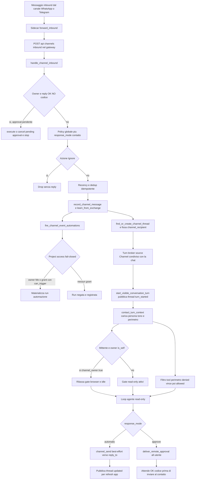

# Contatti & Canali

> Verificato vs codice 2026-07-09.

Data: 2026-06-27 · reverse-engineered dal codice reale · **punto fermo** (descrive
ciò che il gateway fa OGGI, non ciò che dovrà fare). Sorgente primaria:
`crates/desktop-gateway/src/main.rs` e `crates/desktop-gateway/src/chat_store.rs`
(store SQLite `~/.homun/desktop-gateway.sqlite`). I riferimenti a `main.rs` usano
**nomi di simbolo**, non numeri di riga: `main.rs` è un monolite (~59k righe)
editato di continuo, quindi ogni `:NNNN` invecchia — grep il simbolo. Allineato a
[CAPISALDI.md](../CAPISALDI.md) #1 (memoria condivisa) e #10 (automazioni +
project access fail-closed) e alla spec
[Evented Automations & Project Access](../superpowers/specs/2026-06-26-evented-automations-design.md).

---

## Cosa fa

Il sottosistema **Contatti & Canali** trasforma un messaggio in arrivo da un canale
esterno (WhatsApp, Telegram) in un **turno conversazionale di Homun**, eseguito
dall'agente con la persona giusta, dentro un **perimetro di isolamento** per-contatto,
e con un eventuale **accesso al progetto** governato. In pratica:

- **Rubrica curata** (`contacts`): chi sono le persone con cui comunichiamo, le loro
  identità di canale (`channel:identifier`), la persona/tono con cui rispondere, e il
  **perimetro** (cosa quel contatto può far usare a Homun in termini di memoria/tool).
- **Owner `Me`** (`is_self`): l'unico contatto con accesso progetto implicito e completo;
  rappresenta il proprietario del workspace e rilassa i gate pensati per proteggere
  l'utente DAGLI ALTRI.
- **Continuità app ↔ canale**: una conversazione WhatsApp/Telegram è un thread di chat
  di prima classe; la risposta dell'app rifluisce sul canale d'origine
  (`channel_recipient`).
- **Approval remoti**: un'azione che richiede conferma (es. `send_message`) può essere
  inviata all'utente sul suo canale e autorizzata con `OK <codice>` / `NO <codice>`.
- **Automazioni evento-triggered**: regole `quando <contatto> scrive su <canale>`,
  ammesse SOLO dietro **project access fail-closed**.

La conoscenza ABOUT un contatto (fatti, relazioni, episodi) NON vive in queste tabelle:
vive nel `MemoryFacade` (caposaldo #1), collegata per handle. Le tabelle qui sono
**read-model operativi** di routing/policy (caposaldo #5).

---

## Come funziona OGGI

### Ingresso: il sidecar di canale inoltra al gateway

I runtime di canale sono processi separati (`runtimes/channel-whatsapp`,
`runtimes/channel-telegram`) che fanno da bridge verso il protocollo nativo e
**inoltrano** ogni messaggio in arrivo al gateway:

- WhatsApp: `runtimes/channel-whatsapp/src/main.rs` `forward_inbound` (`:120`) →
  `POST {gateway}/api/channels/whatsapp/inbound` (`:137`).
- Telegram: `runtimes/channel-telegram/src/main.rs` `forward_inbound` (`:305`) →
  `POST {gateway}/api/channels/telegram/inbound`.
- I sidecar espongono `POST /send` (outbound) e uno stato di "typing"
  (`/chatstate` su Telegram, presence su WhatsApp).

Il payload normalizzato è un `ChannelInbound`: `sender` (id stabile PN/LID),
`sender_name`, `chat`, `sender_pn`, `content`, `message_id`, `ts`.

### Il gateway: da messaggio inbound a turno visibile

Route registrate in `main.rs` (`/api/channels/whatsapp/inbound` → `whatsapp_inbound`,
`/api/channels/telegram/inbound` → `telegram_inbound`), entrambe delegano a
**`handle_channel_inbound`**. Il flusso reale:

1. **Owner detection + approval control** (in `handle_channel_inbound`): se il mittente è
   l'owner (`channel_message_is_from_owner`) e il testo è un reply di controllo
   `OK 7F3` / `NO 7F3` (`parse_approval_reply`) su un approval pendente
   reale (`pending_approval_exists`), si esegue/annulla l'azione e si esce. È un
   messaggio di controllo, non una conversazione. **SECURITY**: solo il target self.
2. **Policy di risposta**: prima la policy globale
   (`inbound_action`, kill-switch `Ignore` vince), poi il `response_mode` del contatto
   curato (`contact_response_mode`): `automatic` → `AutoReply`, `approve` →
   `ApproveReply`, `silent` → `Ignore`, altro → `Draft`. `''`/sconosciuto eredita il
   globale.
3. **Recency + dedup**: scarto dei messaggi troppo vecchi
   (finestra `WA_HISTORY_RECENCY_HOURS`, default 48h), watermark per-contatto, e dedup
   idempotente su `{channel}:{message_id}` (`mark_inbound_seen`, `chat_store.rs:2327`).
   Su errore di store: **fail-open** (processa) per non perdere un messaggio nuovo.
4. **Memoria + automazioni**: `record_channel_message`
   registra contatto + episodio; **`fire_channel_event_automations`**
   valuta le regole evento DIETRO project access (vedi sotto); `learn_from_exchange`
   apprende conoscenza durevole attribuita al CONTATTO, non all'utente
   (fire-and-forget).
5. **Turno** (path del broker condiviso con la chat, vedi sotto): se l'azione è
   `AutoReply`/`ApproveReply`:
   - `find_or_create_channel_thread` crea/recupera l'UNICO thread per contatto e ne
     fissa il `channel_recipient` con `set_channel_thread_recipient`
     (`chat_store.rs:454`). Il reply-target preferisce `sender_pn` > `chat` > `sender`.
   - **`start_visible_conversation_turn`** persiste il bubble utente +
     un placeholder assistant `…`, poi pubblica l'evento **`thread.turn_started`**
     (`thread_turn_started_event`) così l'app mostra subito il turno. È lo **stesso
     `start_visible_conversation_turn`** che apre i turni di chat guidati dal turn
     broker (`turn_executor.rs`): canale e chat convergono su un unico apri-turno.
   - Indicatore di "typing" mantenuto vivo finché l'agente lavora.
   - **`run_agent_turn_into_message`** esegue il turno completo dell'agente sul thread
     con tool **read-only** — è il **single guarded ReAct loop** (ADR 0021), lo stesso
     motore che il worker del broker aziona via `run_agent_turn_into_message_with_fanout`
     (`turn_executor.rs`); se la persistenza del placeholder è fallita si **fa
     fail-closed** (niente lavoro invisibile né auto-reply invisibile).
     Fallback stateless `generate_channel_reply` solo dopo che il placeholder esiste.
6. **Persona + perimetro nel loop** (vedi sotto): dentro il turno,
   `contact_turn_context` carica persona/tono/relazioni e il
   perimetro, e filtra i tool offerti al modello.
7. **Reply best-effort al canale**:
   - `AutoReply` → `channel_send` verso `reply_to`; ogni errore è loggato ma NON
     ripropagato (best-effort).
   - `ApproveReply` → il draft NON va al contatto: si crea un approval remoto
     `send_message` (`deliver_remote_approval`) instradato all'utente; il contatto
     riceve solo dopo `OK <codice>`.
   - Si pubblica `thread.updated` per far refreshare l'app se l'utente era altrove.

### Turno di canale = turn broker (default-on)

Il **turn broker** è il path INCONDIZIONATO dei turni: non c'è più alcun flag —
la funzione `turn_broker_enabled()` e la env `HOMUN_TURN_BROKER` sono state **rimosse**
("Broker is now the ONLY path"). Il broker conosce
esplicitamente le sorgenti in `local_first_task_runtime::broker::ChatTurnSource`
(`crates/task-runtime/src/broker.rs`): `Interactive`, `Automation`, **`Channel`**,
`Connector`. Le sorgenti non interattive (canale incluso) entrano con
`TurnApproval::Confirm`, hanno una `RetryPolicy`/`TaskPriority` dedicate per `Channel`,
e il worker del broker (`turn_executor.rs`) aziona il turno con lo **stesso** apri-turno
+ guarded loop del canale (`start_visible_conversation_turn` +
`run_agent_turn_into_message_with_fanout`). In pratica: un messaggio di canale diventa
un turno agentico attraverso la stessa macchina della chat — un turno visibile aperto,
poi guidato dal single guarded ReAct loop (ADR 0021) — non un secondo motore.

### Persona + perimetro dentro il loop dell'agente

Nel path condiviso (chat + canale) del guarded loop:

- `(contact_ctx, channel_owner) = contact_turn_context(state, thread_id)`: risolve il
  contatto per `(channel, sender)` via `contact_id_by_identity`; restituisce `None` per
  thread in-app, mittenti sconosciuti e la card dell'owner; `channel_owner=true` SOLO se
  il mittente è l'`is_self`.
- **`channel_owner` rilassa i gate** che proteggono l'utente DAGLI ALTRI: idle clock,
  e nel browser la safety-gate consente azioni "committing" se il mittente è l'owner
  (`browser_safety::is_committing_action` è bloccata solo `if read_only && !channel_owner`),
  mentre per gli altri ogni azione che conferma/invia è bloccata in turni read-only.
- **Filtro tool del perimetro** (loop tool-filter, "Contact perimeter tool filter"):
  `tools_denied` vince, poi `tools_allowed` (se non vuoto) restringe. Match **substring**
  sul nome funzione (`/function/name`), composto SOPRA la policy read-only del canale.
- Le relazioni (`Laura (moglie)`) sono iniettate SOLO se `perimeter.can_see_contacts`.

### Project access (fail-closed)

- Persistenza: `project-access.json` in `~/.homun` (`gateway_project_access_path`),
  lista di `ProjectAccessGrant` chiave `(workspace_id, contact_reference, channel)`.
- API: `GET /api/workspaces/{workspace_id}/access` (`project_access_list`),
  `.../access/upsert`, `.../access/remove`.
- Resolver: **`resolve_project_contact_policy`**:
  - **Owner `Me` (`is_self`) → bypass implicito**: tutto `true`, nessun grant richiesto.
  - Altrimenti cerca il grant per `(contact_reference, channel)`: **assente →
    `authorized=false`** e tutte le capability negate (fail-closed).
  - Se presente, i `capability_denies` del grant si SOMMANO a `perimeter.tools_denied`.
- Wrapper canale: `channel_project_contact_policy` risolve il
  contatto dal messaggio e produce `EffectiveProjectContactPolicy`. **Consumato OGGI
  solo da `fire_channel_event_automations`**: se
  `!authorized || !can_trigger_automations` la run è negata, registrata e saltata.

### Approval remoti

- Tabella `remote_approvals` (`chat_store.rs:1946`): `approval_id`, `code` unico,
  `tool`, `arguments_json`, `label`, `thread_id`, `status`, `expires_at`, ecc.
- `deliver_remote_approval`: crea l'approval pendente
  (`create_pending_approval`), lo dispatcha al canale dell'utente
  (`dispatch_remote_approval`) e, se inviato, lo marca dispatched.
- Il giro completo: l'app/agente emette un marker di conferma →
  `activate_remote_approvals_from_message` → l'utente risponde
  `OK/NO <codice>` sul canale → `handle_channel_inbound` esegue
  (`execute_pending_approval`) o annulla (`cancel_remote_approval_by_code`,
  `chat_store.rs:1104`).

### Diagramma del flusso

Le label del diagramma sono testo semplice (niente parentesi/due punti/markup) per
compatibilità del parser Mermaid.

---

## Perché è così

- **La rubrica è read-model di routing, la verità è la memoria** (caposaldo #1, #5).
  `contacts`/`contact_identities`/`contact_perimeters`/`contact_channel_profiles` non
  sono una "seconda verità semantica": instradano e configurano policy. Solo
  `contact_relationships` è `graph_like` ed è **mirrorato** nel grafo canonico quando
  entrambi i contatti hanno `entity_ref`, e tombstoned alla cancellazione
  (`chat_store.rs:246`–`247`, campo `graph_like: true` + `canonical_policy`). L'audit esplicito
  `CHAT_STORE_MEMORY_BOUNDARY_AUDIT` (`chat_store.rs:213`) documenta
  tabella-per-tabella questo confine.
- **Deny-by-default**. Un contatto senza riga `contact_perimeters` eredita
  `StoredPerimeter::default()` (`chat_store.rs:291`): `memory_scope=contact_only`,
  niente altri contatti/calendario, nessun allow-list di tool oltre la policy read-only
  del canale. Aprire è una scelta esplicita.
- **L'owner `Me` è l'unica eccezione** (caposaldo #10): rappresenta il proprietario
  del workspace, quindi i gate "anti-altri" (blocco click browser, project access) non
  hanno senso su di lui. Da qui il bypass in `resolve_project_contact_policy` e
  `channel_owner`.
- **Turno visibile prima di ogni lavoro**: `start_visible_conversation_turn` materializza
  bubble + `thread.turn_started` PRIMA del loop. Se la persistenza fallisce, **fail-closed**
  (caposaldo #9: stato verificabile, niente lavoro/azioni invisibili).
- **Continuità thread-scoped**: una conversazione di canale è UN thread per contatto
  con `source` + `channel_recipient`, così l'app può continuare la conversazione e la
  reply rifluisce SEMPRE sul canale d'origine (`app_channel_reply_target`),
  con fallback derivato dal thread id (`fallback_channel_recipient_from_thread_id`).
- **Project access è la prima superficie di autorizzazione** per le automazioni
  reattive (spec 2026-06-26): un evento esterno può toccare memoria/file/artefatti di
  progetto solo dietro grant esplicito; l'unica decisione composta è fail-closed.

---

## Contratto

### Perimetro contatto (`StoredPerimeter`, `chat_store.rs:197`)

| Campo | Default (senza riga) | Effetto |
| --- | --- | --- |
| `memory_scope` | `contact_only` | scope della memoria leggibile nel turno |
| `knowledge_folders` | `[]` | cartelle di conoscenza accessibili |
| `tools_allowed` | `[]` (= nessun allow-narrowing) | se non vuoto, restringe i tool (substring) |
| `tools_denied` | `[]` | nega tool (substring); **vince sempre** |
| `can_see_contacts` | `false` | inietta o no le relazioni di altri contatti |
| `can_see_calendar` | `false` | accesso al calendario |

**Come il perimetro filtra i tool nel loop** (loop tool-filter, commento "Contact
perimeter tool filter"): dato l'elenco di tool offerti al modello, per ogni schema si
guarda `/function/name`; se un elemento di `tools_denied` ne è substring → escluso; poi
se `tools_allowed` non è vuoto e nessun suo elemento è substring del nome → escluso. È
composto SOPRA la policy read-only del canale (i tool committing sono già negati ai
non-owner).

### Permessi project access (`ProjectAccessGrant`, `main.rs`)

Chiave `(workspace_id, contact_reference, channel)`; flag:
`can_trigger_automations`, `can_use_project_memory`, `can_receive_replies`,
`can_receive_artifacts`, più `capability_denies` (si sommano a `tools_denied`).

Risoluzione (`resolve_project_contact_policy`):
- **`is_self` (owner `Me`)** → tutto `true`, nessun grant necessario (accesso implicito
  e completo).
- **grant assente** → `authorized=false`, tutte le capability `false`, `denied_reason`
  valorizzato (**fail-closed**).
- **grant presente** → applica i flag del grant; `tools_denied =
  perimeter.tools_denied + grant.capability_denies` (dedup/sort).

### Owner `Me`

`is_self` è settato sul contatto (colonna `is_self`, `chat_store.rs:2071`;
`contact_type='self'`). `contact_turn_context` ritorna `(None, true)` per l'owner:
nessun perimetro restrittivo applicato + `channel_owner=true`. Il resolver di project
access fa bypass. La sua identità è unificata in `person:self` nel grafo
(`unify_owner_identity`).

---

## Divergenze / debolezze

1. **Project access NON gating sull'auto-reply conversazionale.** Oggi
   `channel_project_contact_policy` è consumato SOLO da
   `fire_channel_event_automations`. Il path di risposta
   conversazionale (`handle_channel_inbound` → `AutoReply`) NON consulta project
   access: l'unico gate sulla reply è il **contact perimeter**. Un contatto curato con
   `response_mode=automatic` ma SENZA grant di progetto riceve comunque risposte. La
   spec 2026-06-26 vuole il perimetro composto fail-closed PRIMA di ogni evento
   project-scoped; oggi è realizzato solo per le automazioni evento.
2. **`can_use_project_memory` / `can_receive_replies` / `can_receive_artifacts` sono
   definiti ma poco/non applicati nel runtime.** Sono persistiti, risolti e testati, ma
   fuori dal test non risultano consumati: la reply usa la memoria secondo
   `memory_scope` del perimetro, non secondo `can_use_project_memory` del grant.
   Capability ancora dichiarativa.
3. **Matching tool per substring.** Il filtro `tools_denied`/`tools_allowed` è un
   `name.contains(...)`: rischio di over/under-match (es. negare `send` colpisce ogni
   tool che contiene "send"). Non è un registry-aware match (tensione col caposaldo #7).
4. **Dedup fail-open su errore di store**: scelta deliberata (non perdere messaggi), ma
   in caso di errori persistenti può portare a doppie risposte.
5. **Telegram v1 solo chat dirette** (`runtimes/channel-telegram/src/main.rs`,
   `forward_inbound` `:305`, "direct chats only, v1"); i gruppi non sono coperti.
6. **Reply best-effort senza retry applicativo**: `channel_send` fallito è solo loggato;
   la consegna affidabile è demandata al sidecar (`forward_inbound` ha retry
   at-least-once, ma l'outbound del gateway no).
7. **`from` dell'automazione è match per sottostringa** su nome/sender: può collidere
   tra contatti con nomi simili.

---

## Caposaldo servito

- **#1 — Memoria condivisa come layer unico.** La conoscenza sui contatti (fatti,
  relazioni, episodi) è scritta/letta via `MemoryFacade`; le tabelle contatti sono
  read-model di routing, mai store paralleli. `learn_from_exchange` attribuisce
  l'apprendimento al contatto.
- **#5 — Un solo grafo / niente seconda verità.** `CHAT_STORE_MEMORY_BOUNDARY_AUDIT`
  (`chat_store.rs:213`) codifica il confine; `contact_relationships` è ammesso solo
  perché mirrorato nel grafo canonico (unico entry con `graph_like: true`).
- **#9 — Workspace agentico con turni visibili e verificabili.** `thread.turn_started`
  + placeholder + fail-closed se non persistibile.
- **#10 — Automazioni = evento → filtro → azione, fail-closed; owner `Me` eccezione
  implicita.** Realizzato per le automazioni evento via project access; la spec
  2026-06-26 ne è il riferimento direzionale (vedi divergenza #1).

---

## File chiave

> Nota: i riferimenti a `main.rs` sono **nomi di simbolo** (grep-abili); il file è un
> monolite editato di continuo, i numeri di riga invecchiano a ogni commit.

- `crates/desktop-gateway/src/main.rs`
  - `handle_channel_inbound` — orchestratore inbound (owner/approval, policy,
    dedup, memoria, turno, reply).
  - `whatsapp_inbound` / `telegram_inbound`; route `/api/channels/{whatsapp,telegram}/inbound`.
  - `contact_turn_context` (+ `ContactTurnContext`) — persona + perimetro + `channel_owner`.
  - Filtro tool del perimetro nel loop (commento "Contact perimeter tool filter").
  - Gate browser owner-aware (`browser_safety::is_committing_action` sotto
    `read_only && !channel_owner`).
  - `start_visible_conversation_turn` / `thread_turn_started_event` — condivisi con il
    worker del broker in `turn_executor.rs` (`run_agent_turn_into_message_with_fanout`).
  - `parse_channel_thread_id`; `app_channel_reply_target`;
    `fallback_channel_recipient_from_thread_id`.
  - Project access: `resolve_project_contact_policy`, `channel_project_contact_policy`,
    `ProjectAccessGrant`, `gateway_project_access_path`, route
    `project_access_list`/`.../access/upsert`/`.../access/remove`.
  - `fire_channel_event_automations` (gate project access interno).
  - Approval: `deliver_remote_approval`, `parse_approval_reply`,
    `activate_remote_approvals_from_message`, `send_message_tool_schema`,
    `execute_send_message`, `create_pending_approval`, `execute_pending_approval`,
    `dispatch_remote_approval`.
  - Turn broker (path incondizionato, nessun flag): `enqueue_turn`.
- `crates/task-runtime/src/broker.rs` — `ChatTurnSource` (incl. `Channel`),
  `chat_turn_retry_policy`, `enqueue_chat_turn`/`enqueue_chat_turn_atomic`.
- `crates/desktop-gateway/src/turn_executor.rs` — worker del broker che apre il turno
  visibile e aziona il guarded loop (path condiviso con i turni di canale).
- `crates/desktop-gateway/src/chat_store.rs`
  - Schema: `contacts` `:2065`, `contact_identities` `:2082`, `contact_perimeters`
    `:2099`, `profiles` `:2114`, `contact_channel_profiles` `:2124`,
    `contact_relationships` `:2132`, `remote_approvals` `:1946`. Colonne thread:
    `source` (alter `:2162`), `channel_recipient` (alter `:2169`).
  - `StoredPerimeter` `:197` + `Default` `:291`; `CHAT_STORE_MEMORY_BOUNDARY_AUDIT`
    `:213`.
  - Metodi: `contact_id_by_identity` `:1211`, `contact_handles` `:1302`,
    `perimeter_or_default` `:1588`, `resolve_profile_for` `:1797`, `relationships_for`
    `:1866`, `set_channel_thread_recipient` `:454`, `mark_inbound_seen` `:2327`,
    `cancel_remote_approval_by_code` `:1104`.
- `runtimes/channel-whatsapp/src/main.rs` — `forward_inbound` `:120`, `/send` `:239`.
- `runtimes/channel-telegram/src/main.rs` — `forward_inbound` `:305`, `/send` +
  `/chatstate` `:284`.
- `docs/CAPISALDI.md` — capisaldi #1, #5, #9, #10.
- `docs/superpowers/specs/2026-06-26-evented-automations-design.md` — direzione project
  access + automazioni evento.
