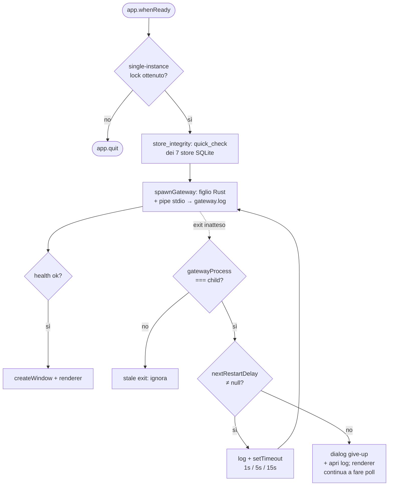

# Desktop shell — main process, gateway lifecycle, diagnostica

> **Realtà attuale** del guscio Electron (`apps/desktop/electron/`) e della sua interazione
> col gateway Rust. Nasce dal P0 di [confronto-codex-produzione.md](../confronto-codex-produzione.md)
> (branch `feat/p0-production-hygiene`, 2026-07-02): osservabilità, resilienza e diagnostica
> — le fondamenta perché Homun regga un utente che non sei tu.

## Ruolo del main process

Il `main.cjs` è il **postino + supervisore**: non contiene logica di prodotto (quella è nel
gateway Rust e nel renderer React), ma possiede il *ciclo di vita del processo*:
- avvia il gateway Rust come figlio (`spawn`), ricostruendo un PATH completo (Homebrew/Docker/
  cargo/…) perché una GUI lanciata dal Finder eredita un PATH minimale — vedi `resolveGatewayPath`;
- comunica col renderer via **contextIsolation + preload** (`localFirstDesktop`), col gateway via
  **HTTP + Bearer token** su loopback (`127.0.0.1:18765`);
- garantisce **una sola istanza**, **log persistenti**, **respawn** del gateway, e un **bundle di
  diagnostica** su richiesta.

Le responsabilità nuove del P0 vivono in due moduli piccoli e testabili (`electron/lib/*.cjs`,
coperti da `tests/*.test.mjs` via `node --test`), così `main.cjs` resta cablaggio:
- **`lib/logging.cjs`** — `createLogWriter(dir, name)` → writer append con timestamp ISO e
  rotazione *alla creazione* (5 generazioni × 5 MB); `pipeChildStream` instrada lo stdio di un
  figlio riga-per-riga nel writer. Fallisce in modo inerte (disco read-only → writer no-op): *il
  logging non deve mai essere ciò che fa crashare il guscio*.
- **`lib/watchdog.cjs`** — `nextRestartDelay(timestamps, now)` puro: backoff `1s→5s→15s`, `null`
  dopo 3 respawn in una finestra di 5 minuti. La finestra scorrevole *perdona* i crash vecchi (un
  run sano >5 min resetta il budget).

## Percorsi di diagnostica (tutto sotto `~/.homun/`)

Un'unica radice, così il bundle di feedback la raccoglie da un solo posto:

| File | Chi scrive | Contenuto |
|---|---|---|
| `logs/desktop.log` | main Electron | eventi del guscio (exit inatteso, respawn, give-up, second-instance) |
| `logs/gateway.log` | main (pipe stdio del figlio) | stdout/stderr del gateway packaged, con marker `[err]` e `gateway spawned (pid=…)` |
| `logs/panic.log` | gateway Rust (`panic_log.rs`) | ogni panic: messaggio + location + backtrace; file **0600** |
| `logs/last-crash.json` | gateway Rust | marker `{at, message}` dell'ultimo panic (ultimo vince) |
| `feedback/homun-feedback-<stamp>.tar.gz` | main (su richiesta) | **solo** `logs/` + `report.json` (versioni/specs) — **mai** i `.sqlite` |

**Privacy (caposaldo #3):** il bundle copia `~/.homun/logs`, non `~/.homun` — gli store personali
(`memory.sqlite`, chat, vault) non entrano mai. La copia è symlink-safe (solo file/dir regolari) e
la `feedbackHint` avvisa che i log possono contenere percorsi o frammenti di messaggi.

## Ciclo di vita del gateway (spawn → exit → respawn → give-up)

Note di design che il codice incarna:
- **Token e porta sono costanti del processo guscio**: al respawn il renderer si riprende da solo
  appena `/api/health` torna ok — nessun coordinamento extra.
- **Guardia stale-exit**: `spawnGateway` cattura `const child = gatewayProcess`; l'exit di un figlio
  già sostituito non nulla il riferimento nuovo né innesca respawn (altrimenti orfanerebbe il
  gateway o ne lancerebbe due sulla stessa porta).
- **Spawn-failure**: un `error` di `spawn` (EACCES, quarantena Gatekeeper, ENOENT sul fallback cargo)
  è loggato, non propaga come eccezione non gestita.
- **Give-up**: dopo il budget di crash-loop il main smette di riavviare e avvisa l'utente con un
  dialog (apre i log); il renderer resta in poll — la resa in-app è un follow-up dichiarato, non una
  svista.

## Sweep di integrità all'avvio (`store_integrity.rs`, lato gateway)

Prima che qualsiasi store venga aperto, il gateway verifica i 7 DB personali con
`PRAGMA quick_check`. Classificazione a 3 stati:
- **Healthy** (file assente, o open+quick_check = `ok`) → intatto;
- **Corrupt** (open riuscito + verdetto non-`ok`, oppure errore `NotADatabase`/`DatabaseCorrupt`) →
  **quarantena**: rinomina `<file>` + `-wal`/`-shm` in `*.corrupt-<epoch>.bak` (mai delete), così
  l'apertura successiva ricrea uno store pulito; il nome finisce in `/api/health` `recovered_stores`;
- **Inconclusive** (open fallito, `SQLITE_BUSY`/`LOCKED`, o ambiguo) → **lasciato intatto** e loggato.

L'invariante di sicurezza: *quando in dubbio, non toccare*. Un DB sano ma lockato (es. un secondo
gateway in dev) non deve mai essere messo in quarantena — distruggere uno store vivo sarebbe peggio
del crash-and-restart che la feature sostituisce. La quarantena scatta **solo** su verdetto positivo
di corruzione, e `recovered_stores` riporta solo i rename riusciti.

## Sicurezza Electron (stato)

Base già a norma: `contextIsolation:true`, `sandbox:true`, `nodeIntegration:false`, `webSecurity:true`;
`setWindowOpenHandler` → `openExternal` + deny; permission handler whitelist-only (`media`).

**Hardening P1 — Pilastro 3 (fatto, 2026-07-02):**
- **Fuses** (`scripts/after-pack-fuses.mjs`, hook `afterPack` di electron-builder): nel binario
  packaged sono spenti `RunAsNode`, `EnableNodeCliInspectArguments`, `EnableNodeOptionsEnvironmentVariable`
  e accesi `EnableCookieEncryption` + `OnlyLoadAppFromAsar`. Chiude i vettori "lancia l'app come Node".
  Su macOS `resetAdHocDarwinSignature` così la firma reale riparte pulita. Verifica end-to-end solo al
  release build (non nel `package:smoke`, che usa electron grezzo).
- **CSP** (`applyContentSecurityPolicy` in `main.cjs`, via `onHeadersReceived`): solo nei build
  packaged/staged (dev resta con la policy larga di Vite per l'HMR). Scoped ai bisogni reali —
  `script-src 'self'` (bundle Vite esterno), `style-src 'unsafe-inline'` (mermaid/highlight/React),
  `img/font data:/blob:`, `connect-src`/`frame-src` al gateway `127.0.0.1` (incluso l'iframe noVNC).
  Verificato via smoke: il renderer monta sotto la policy (root non vuoto), zero violazioni al load,
  `'self'` risolve sotto `file://`. *Residuo:* spot-check delle superfici dinamiche (mermaid, grafo
  memoria, iframe noVNC) su un build firmato reale.
- **devTools off** nel packaged (`webPreferences.devTools`), salvo dev o flag `HOMUN_ELECTRON_DEVTOOLS`.

**Hardening P1 — Pilastro 1 (asse sandbox: fatto, 2026-07-03):**
- **Sandbox OS-level a 3 livelli** imposto lato gateway sull'esecuzione tool. UNA sorgente di risoluzione
  `resolved_sandbox_mode()` (env > `RuntimeSettings.sandbox_mode` > default `danger`) onorata da **tutti i tool
  effettful**: `run_in_project` fenced via **Seatbelt** (`seatbelt.rs`, macOS) / **Landlock**
  (`landlock_fence.rs` + `bin/homun-linux-sandbox.rs`, Linux), e `write_file`/`edit_file` gated al chokepoint
  `execute_chat_tool` (read-only → escalation card che riesegue project-jailed su approvazione, provenance anti-RCE).
  Enum + policy pura in `tool_safety.rs`. `read-only` validato **eseguendo** (macOS runtime test; Linux via CI
  `landlock-fence`). MCP/Composio non recintati (processi esterni) → gated dall'asse approval (limite documentato).
  Vedi [ADR 0023](../decisions/0023-sandbox-enforcement-and-unified-approval.md).

**Hardening P1 — Pilastro 1 (#1: Settings UI asse sandbox + FLIP, fatto 2026-07-03):**
- **Default = `workspace-write`** (fence ON di default; `default_sandbox_mode()`), esposto come selector
  "Sandbox" a 3 livelli in **Settings › Runtime** (`SandboxModeBlock`); `set_runtime_settings` fa merge dei
  partial update (un controllo non clobbera l'altro). Ogni bash gira sotto il fence di default; scritture fuori
  project+cache → escalation card. Validato eseguendo (macOS). Smoke Electron app-level da fare prima del merge.

**Residui P1/P2 (non fatti — vincoli espliciti):**
- **Asse approval in Settings + wiring 4-livelli (#1b)** — esporre `approval_policy` (untrusted/on-failure/
  on-request/never) e risolverlo (`resolved_approval_policy`) al chokepoint, sostituendo la logica autonomous-based.
- **Firma Windows/Linux + publish automatico** (Pilastro 2) — **bloccato su input utente**: la firma
  richiede certificati/segreti (Azure Trusted Signing per Windows); l'auto-publish della release
  ribalterebbe il gate di revisione *draft* deliberato in `build.yml` → decisione di processo, non
  un fix.
- **protocol handler `homun://`** (P2) + migrazione token Bearer/loopback → **Unix domain socket**
  (P2, da fare con la separazione motore).

## Test e gate

- `apps/desktop` — `npm run test:electron` (moduli `lib/*.cjs`, `node --test`), `npm run typecheck`,
  `npm run test:ui-contract`, `npm run build`.
- gateway — `cargo test -p local-first-desktop-gateway` (include `panic_log` e `store_integrity`; il
  test end-to-end del panic hook è `#[ignore]` perché muta l'hook globale del processo → va eseguito
  seriale). Fallimento ambientale noto e tollerato: `import_pptx_template_pack…` (richiede LibreOffice).
