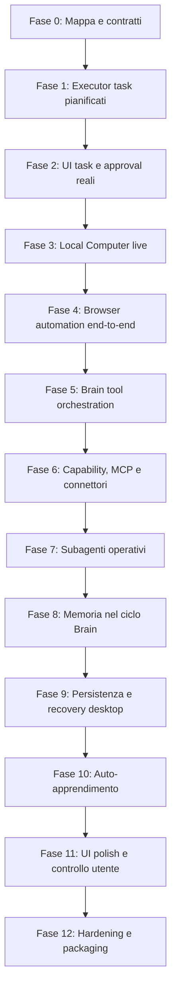

# Final Roadmap

Questa roadmap traduce `docs/architecture/system-map.md` in un percorso di
sviluppo ordinato fino all'obiettivo finale: un assistente personale local-first
che capisce richieste naturali, usa strumenti in modo governato, esegue task
anche lunghi, mostra il Local Computer e apprende abitudini in modo controllato.

Ogni fase deve chiudersi con test, documentazione aggiornata e una demo locale
verificabile. Una fase non e' chiusa se funziona solo tramite mock o se bypassa
Task Runtime, Resource Governor, Approval Gate o privacy policy.

## Principi Guida

- Finire un blocco per volta prima di passare al successivo.
- Ogni feature operativa passa da Durable Task Runtime.
- Ogni task dichiara risorse e passa dal Resource Governor.
- La UI mostra read model e stato, non decide tool o policy.
- Il Brain comprende, pianifica e seleziona capability; non esegue bypassando
  il runtime.
- Browser, shell, MCP, connettori, skill e subagenti condividono code,
  checkpoint, approval e risorse.
- L'auto-apprendimento arriva dopo eventi reali affidabili.
- Ogni fase aggiorna `docs/work-memory.md`; se cambia architettura o ordine,
  aggiorna anche `docs/architecture/system-map.md` e questo file.

## Roadmap Sintetica

## Fase 0 - Mappa, Focus E Contratti Base

Stato: completata come base, da mantenere aggiornata.

Obiettivo:

- avere una fonte di verita' su scopo, componenti, confini e ordine;
- evitare lavoro dispersivo su UI, Brain, browser o learning fuori sequenza.

Deliverable:

- `docs/architecture/system-map.md`;
- `docs/architecture/final-roadmap.md`;
- `docs/work-memory.md` aggiornato dopo ogni blocco;
- regola esplicita: ogni fase deve dichiarare quale parte della system map
  chiude.

Gate di chiusura:

- documenti committati;
- nessun placeholder;
- roadmap coerente con `PROJECT.md`.

## Fase 1 - Prompt Plan Executor V1

Stato: primo slice read-only governato implementato. Restano da collegare
browser/shell live come executor reali nelle fasi 3-4.

Obiettivo:

- trasformare i task `prompt_plan.*` creati dal Brain in esecuzione governata;
- usare Task Runtime, Resource Governor, Approval Gate e checkpoint prima di
  qualunque azione reale.

Componenti:

- `apps/desktop/src-tauri/src/state.rs`
- nuovo modulo Tauri Core per executor prompt plan;
- `crates/task-runtime`
- `crates/browser-automation`
- `crates/local-computer-session`

Deliverable:

- comando o loop locale per eseguire il prossimo task pianificato;
- selezione del prossimo task via scheduler;
- reservation risorse prima dell'esecuzione;
- stato `waiting_resource` quando browser, shell o LLM sono saturi;
- blocco automatico degli step con approval richiesta;
- checkpoint redatti per step iniziato, completato, bloccato o fallito;
- eventi Local Computer Session per step start/completion/block.

Test minimi:

- un prompt treno crea task e il primo step read-only viene eseguito;
- se `browser_session` e' gia' occupata, il task resta `waiting_resource`;
- uno step con `requires_user_approval=true` non viene eseguito;
- checkpoint e timeline non contengono raw prompt;
- release risorse dopo completion/failure.

Gate di chiusura:

- `cargo test --manifest-path apps/desktop/src-tauri/Cargo.toml`;
- test specifici executor;
- demo locale: prompt complesso -> piano -> task -> esecuzione step read-only
  -> timeline aggiornata.

## Fase 2 - UI Tasks, Queue, Risorse E Approval Reali

Stato: primo slice implementato. La UI legge `task_queue_snapshot`, mostra task,
approval e resource usage reali; resta da completare task detail/azioni approval.

Obiettivo:

- rendere visibile il runtime operativo, non solo la chat;
- permettere di capire cosa e' in coda, cosa gira, cosa e' bloccato e perche'.

Componenti:

- `apps/desktop/src/components/TasksView.tsx`
- `apps/desktop/src/lib/coreBridge.ts`
- `apps/desktop/src-tauri/src/commands.rs`
- `apps/desktop/src-tauri/src/models.rs`

Deliverable:

- TasksView collegata a `task_queue_snapshot`;
- task detail collegato a `task_detail`;
- pannello approval reale;
- visualizzazione resource usage per classe;
- stati chiari: queued, running, waiting_resource, waiting_user_approval,
  completed, failed;
- nessun raw payload nel detail.

Test minimi:

- UI contract su stati task e approval;
- typecheck/build frontend;
- test Rust sui DTO read model;
- verifica browser desktop/mobile senza overlap.

Gate di chiusura:

- l'utente puo' vedere task reali creati dal prompt planner;
- l'utente puo' distinguere blocco risorsa da blocco approval;
- la UI non mostra payload non redatti.

## Fase 3 - Local Computer Live

Obiettivo:

- rendere il Local Computer il centro di fiducia: vedere browser, shell, file e
  log di cio' che il sistema sta facendo.

Componenti:

- `crates/local-computer-session`
- `apps/desktop/src/components/ChatView.tsx`
- eventuali componenti separati per computer panel, timeline e artifact;
- `apps/desktop/src-tauri/src/local_computer_smoke.rs`

Deliverable:

- preview browser reale o screenshot aggiornabile;
- output shell redatto;
- artifact list reale;
- timeline compatta nella chat e detail completo on demand;
- takeover/pause UI cablati almeno come stati controllati;
- refresh affidabile senza layout jump.

Test minimi:

- smoke test shell produce transcript redatto;
- smoke test browser produce artifact/preview;
- snapshot UI verifica pannello desktop e mobile;
- nessun evento vecchio appare in thread nuovi.

Gate di chiusura:

- prompt operativo mostra nel Computer cosa sta succedendo;
- browser/shell/artifact/log sono coerenti con lo stesso task/thread.

## Fase 4 - Browser Automation End-To-End

Obiettivo:

- usare il browser per ricerche, compilazione form e operazioni web controllate;
- fermarsi prima di login, submit mutativi, acquisti e pagamenti.

Componenti:

- `crates/browser-automation`
- sidecar browser;
- Prompt Plan Executor;
- Local Computer Session;
- Approval Gate.

Deliverable:

- task browser read-only reali;
- form fill draft senza submit rischioso;
- manual blockers tipizzati;
- screenshot e transcript redatti;
- policy per domini e azioni sensibili;
- fallback e recovery su errore browser.

Test minimi:

- navigazione read-only su sito di test locale;
- compilazione form locale senza submit;
- blocco su azione mutativa senza approval;
- resource governor limita sessioni browser concorrenti;
- artifact redatti visibili in UI.

Gate di chiusura:

- demo: richiesta di ricerca o prenotazione simulata -> browser agisce ->
  risultati redatti -> approval prima di azioni rischiose.

## Fase 5 - Orchestrator Brain Completo

Obiettivo:

- superare il planner prompt-level e avere un Brain che sceglie tool,
  capability, MCP, skill e subagenti in modo spiegabile e governato.

Componenti:

- crate orchestrator, se separato;
- Capability Registry;
- Memory Layer;
- Task Runtime;
- Prompt submission Tauri.

Deliverable:

- tool registry compatto con title/description/resource/sensitivity;
- lazy loading del dettaglio tool;
- piano validato con step, dipendenze, risorse, risk e approval;
- immediate execution solo per azioni read/draft brevi e sicure;
- tutto il resto accodato;
- audit Brain persistente e UI-safe.

Test minimi:

- prompt in italiano e inglese selezionano tool coerenti;
- richiesta multi-step genera DAG;
- tool rischioso richiede approval;
- tool non abilitato genera richiesta configurazione;
- token budget: il Brain non riceve l'intero registry completo.

Gate di chiusura:

- il composer non risponde piu' "planner prossimo layer";
- richieste complesse diventano piani/tool/task osservabili.

## Fase 6 - Capability, MCP, Connettori E Skill

Obiettivo:

- rendere disponibili integrazioni reali senza costruire tutto a mano;
- mantenere separazione tra provider, policy, segreti e runtime.

Componenti:

- `crates/capabilities`
- MCP stdio/http adapters;
- managed provider adapter opzionale;
- secrets/keychain;
- Connections/Settings UI.

Deliverable:

- pagina connettori reale;
- enable/disable provider;
- grants e privacy domains;
- segreti non esposti nei read model;
- tool cache e resource hints;
- supporto MCP per provider locali;
- valutazione managed providers come Composio/Pipedream/Zapier solo sotto
  policy esplicita.

Test minimi:

- provider locale espone tool card;
- tool MCP viene accodato come task;
- provider disabilitato non viene selezionato;
- segreti assenti da JSON UI;
- connector_api limitato dal Resource Governor.

Gate di chiusura:

- Brain puo' selezionare un tool MCP/connettore abilitato e accodarlo.

## Fase 7 - Subagenti Operativi

Obiettivo:

- usare agenti specializzati per task complessi senza duplicare runtime,
  memoria o policy.

Componenti:

- `crates/subagents`
- Task Runtime;
- Capability Registry;
- Brain.

Deliverable:

- agent definitions data-driven;
- `when_to_use`, scope tool, limiti runtime e memoria accessibile;
- workflow subagente come task durevole;
- checkpoint e recovery;
- UI mostra subagenti coinvolti in modo comprensibile.

Test minimi:

- Brain delega a subagente coerente;
- subagente dichiara `llm_inference`;
- fallimento retryable torna in coda;
- memoria accessibile limitata al task;
- audit non espone prompt raw.

Gate di chiusura:

- una richiesta complessa puo' generare step capability e step subagente con
  dipendenze persistite.

## Fase 8 - Memoria Nel Ciclo Operativo

Obiettivo:

- usare la memoria per contesto, personalizzazione e continuita' senza
  esfiltrare dati.

Componenti:

- `crates/memory`
- MemoryUiReadModel;
- Brain memory context adapter;
- Graphify adapter;
- wiki/notes adapter.

Deliverable:

- memory retrieval filtrata per privacy domain e sensitivity;
- riferimenti memoria allegati ai piani Brain;
- memory dashboard reale;
- link tra memoria strutturata, grafo e wiki;
- azioni CRUD e antiesfiltrazione complete esposte al core/UI.

Test minimi:

- broad query senza permesso viene negata;
- memoria sensibile non entra in prompt oltre soglia;
- Brain riceve solo snippet/reference redatti;
- UI mostra contatori e riferimenti senza raw payload.

Gate di chiusura:

- richieste contestuali usano memoria reale con audit consultabile.

## Fase 9 - Persistenza, Resume E Task Di Giorni

Obiettivo:

- rendere affidabili task lunghi, multipli e riprendibili dopo riavvio.

Componenti:

- TaskStore SQLite persistente;
- LocalComputerSessionStore persistente;
- ChatThreadStore persistente;
- Process Manager;
- app lifecycle Tauri.

Deliverable:

- thread persistenti;
- task e checkpoint persistenti;
- sessioni computer persistenti o ricostruibili;
- resume di task pending/running;
- lease recovery all'avvio;
- limiti globali/per workspace/per utente applicati dopo restart.

Test minimi:

- creare task, riavviare app, ritrovare coda;
- running stale rilascia risorse e torna retryable;
- approval pending sopravvive al riavvio;
- thread nuovo non eredita eventi vecchi.

Gate di chiusura:

- un task di lunga durata puo' essere sospeso e ripreso senza perdere audit.

## Fase 10 - Auto-Apprendimento

Obiettivo:

- imparare abitudini e proporre automatismi dopo che eventi reali, memoria e
  policy sono affidabili.

Componenti:

- event ingestion dal Local Computer;
- Memory Layer;
- Learning read model;
- Automation proposals;
- Approval Gate.

Deliverable:

- raccolta eventi redatti e classificati;
- pattern detection locale;
- proposte di automatismi spiegabili;
- conferma, modifica, rifiuto e revoca;
- separazione tra insight, memoria confermata e automazione attiva.

Test minimi:

- eventi sensibili vengono esclusi o redatti;
- pattern con bassa confidenza resta candidate;
- automazione non viene attivata senza conferma;
- utente puo' cancellare insight e dati correlati.

Gate di chiusura:

- UI Apprendimento mostra cosa ha imparato, prove redatte e automatismi
  consigliati, senza agire da sola.

## Fase 11 - UI Finale E Qualita' Esperienza

Obiettivo:

- arrivare a una UI premium, chiara e operativa ispirata alla pulizia Manus,
  con settings/controlli solidi in stile Codex.

Componenti:

- Desktop UI React;
- Tasks/Approvals;
- Connections;
- Settings;
- Local Computer;
- Learning.

Deliverable:

- chat centrale pulita;
- sidebar/thread minimal;
- top menu contestuali;
- Local Computer espandibile;
- settings ampie e leggibili;
- connettori curati;
- responsive desktop/mobile;
- tema light completo e token pronti per dark mode.

Test minimi:

- screenshot desktop e mobile;
- nessun overlap;
- composer sempre utilizzabile;
- sidebar collapsabile;
- settings senza tagli;
- palette non monocromatica e non troppo densa.

Gate di chiusura:

- l'app si puo' usare per un workflow reale senza aprire terminale o log grezzi.

## Fase 12 - Production Hardening E Packaging

Obiettivo:

- rendere il sistema distribuibile, robusto e verificabile.

Componenti:

- Tauri packaging;
- process manager;
- secrets/keychain;
- migrations;
- test e2e;
- observability locale;
- export/delete data.

Deliverable:

- packaging macOS prima, poi Windows/Linux;
- migrations versionate;
- backup/recovery;
- export/delete globale dati utente;
- limiti output/log;
- crash recovery;
- suite e2e sui workflow principali;
- security/privacy review locale.

Test minimi:

- installazione pulita;
- upgrade schema;
- cancellazione dati;
- task recovery;
- runtime Gemma health;
- browser sidecar health;
- workflow e2e: prompt -> piano -> task -> tool -> Local Computer -> output.

Gate di chiusura:

- build installabile e testabile da utente reale con dati locali, senza API
  cloud implicite.

## Milestone Di Prodotto

### Milestone A - Test Reale Locale Governato

Include fasi 1-3.

Risultato:

- prompt complesso crea piano;
- task viene eseguito passando da risorse e approval;
- UI mostra stato reale e Local Computer coerente.

### Milestone B - Browser Reale Utile

Include fase 4.

Risultato:

- l'assistente puo' cercare, navigare e preparare form senza azioni rischiose;
- l'utente vede screenshot, transcript e blocchi approval.

### Milestone C - Tool Orchestration Reale

Include fasi 5-7.

Risultato:

- Brain sceglie capability, MCP, skill e subagenti;
- task multi-step e multi-tool sono accodati e osservabili.

### Milestone D - Assistente Personale Contestuale

Include fasi 8-10.

Risultato:

- memoria e apprendimento rendono l'assistente personale, ma sempre
  controllabile e revocabile.

### Milestone E - Prodotto Installabile

Include fasi 11-12.

Risultato:

- UI completa, pacchetto installabile, recovery, sicurezza e test e2e.

## Prossima Azione

Partire dalla Fase 1: Prompt Plan Executor V1.

Il primo slice deve essere piccolo ma reale:

- prendere un task `prompt_plan.research`;
- passare da scheduler e Resource Governor;
- eseguire solo uno step read-only;
- registrare checkpoint e timeline;
- mostrare il risultato nella UI.

Questo sblocca test reali senza introdurre ancora browser mutativo,
connettori complessi o auto-apprendimento.
