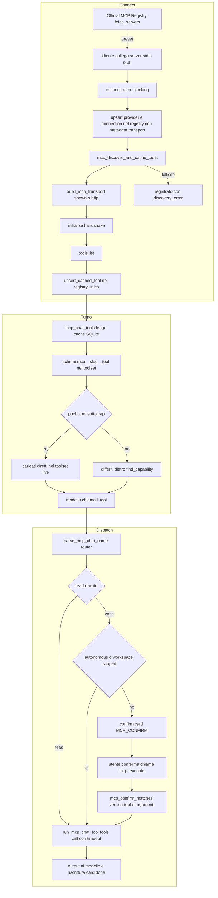

# Architettura — MCP (Model Context Protocol)

> Verificato vs codice 2026-07-06.
>
> Stato: **2026-06-27** — *reverse-engineered* dal codice reale, **punto fermo**
> (descrive ciò che esiste oggi, non un piano). Crate principale:
> `desktop-gateway` (orchestrazione, transport, loop) + `local-first-capabilities`
> (provider/registry). Principio guida → caposaldo **#7** (registry unico) e
> ADR **0013** (capability routing = Tool Search). DB capability: registry SQLite
> condiviso (lo stesso che cache i tool Composio/skills).

## Cosa fa

Permette a Homun di **connettere server MCP esterni** (locali via stdio, o remoti
via streamable-HTTP) e di esporne i tool al modello nel loop di chat **come se
fossero capability native**. Tre flussi:

1. **Discovery & connect** — l'utente collega un server (comando stdio o URL
   remoto, eventualmente trovato nella *official MCP registry*); Homun fa
   l'handshake `initialize`, enumera i tool (`tools/list`) e li **cache nel
   registry capability unico**.
2. **Dispatch nel loop** — i tool MCP cached entrano nel toolset del turno con
   nomi namespaced `mcp__{slug}__{tool}`; quando il modello li chiama, il gateway
   instrada la chiamata al server via `tools/call`.
3. **Conferma scrittura** — i tool classificati *write* non eseguono subito:
   emettono una **confirm-card** (`‹‹MCP_CONFIRM››…‹‹/MCP_CONFIRM››`) e girano
   solo dopo conferma esplicita dell'utente.

MCP condivide deliberatamente il **medesimo** registry, la stessa superficie di
discovery (`find_capability`) e lo stesso gate di conferma di Composio: non è un
sottosistema parallelo, è un *provider kind* in più (`CapabilityProviderKind::Mcp`).

## Come funziona OGGI

### Transport (livello protocollo)

`crates/capabilities/src/mcp.rs` definisce il trait `McpTransport`
(`mcp.rs:62`), con tre implementazioni più una variante unione nel gateway:

- **stdio** — `McpStdioTransport::spawn` (`mcp.rs:151`): lancia il comando come
  child process (`stdin`/`stdout` piped, `stderr` null), parla JSON-RPC riga per
  riga, fa match per `id` (`McpStdioTransport::request`, `mcp.rs:197`), uccide il
  child su `Drop` (`mcp.rs:256`).
- **HTTP (streamable-HTTP, spec 2025)** — `McpHttpTransport`
  (`desktop-gateway/src/mcp_http.rs:26`): `reqwest::blocking`, POST JSON-RPC,
  accetta sia `application/json` sia SSE (`text/event-stream`) e seleziona il
  messaggio col proprio `id` (`mcp_http.rs:106`); porta avanti l'header
  `Mcp-Session-Id` restituito a `initialize` (`mcp_http.rs:62`,`77`); header di
  auth opzionali.
- **`McpAnyTransport`** (`main.rs`, `enum McpAnyTransport`) — enum `Stdio | Http`
  che implementa `McpTransport`, così **un solo**
  `McpCapabilityProvider<McpAnyTransport>` copre entrambi i flavor. Costruito da
  `build_mcp_transport` leggendo il campo `transport` della metadata.
- `InMemoryMcpTransport` (`mcp.rs:80`) + bin `fake_mcp_stdio.rs` per i test.

### Provider (livello capability)

`McpCapabilityProvider<T>` (`mcp.rs:265`) implementa `CapabilityProvider`:
`initialize` fa handshake `initialize` + notify `notifications/initialized`
(`mcp.rs:287`); `list_tools` mappa `tools/list` in `CapabilityTool`
(`mcp.rs:326`); `call_tool` fa `tools/call` (`mcp.rs:345`). I trigger MCP **non
sono supportati** (`mcp.rs:360`, `list_triggers` vuoto).

**Classificazione read/write** (`capability_tool_from_mcp`, `mcp.rs:378`): una
policy per-tool esplicita vince; altrimenti si onora l'annotation MCP
`readOnlyHint` (`true`→Read, `false`→WriteWithConfirmation); se **assente** (la
maggioranza dei server) si applica un'euristica sul nome (`name_is_read_only`,
`mcp.rs:21`): il verbo guida è il *primo* token (`get_/list_/search_`→read;
`create_/send_/delete_`→write). Questo evita che reads tipo `search_products`
chiedano conferma.

### Connect & discovery

- Endpoint `POST /api/capabilities/mcp/connect` → `connect_mcp` →
  `connect_mcp_blocking` (`main.rs`). Richiede `name` + (`command` stdio
  **oppure** `url` remoto). Slugifica il nome con `mcp_provider_slug` →
  `provider_id = mcp:{slug}`, `connection_id = mcp-{slug}`.
- Scrive nel registry: `upsert_provider_config`, `upsert_provider_grant`
  (azioni concesse: `Read` + `WriteWithConfirmation`, autonomia max 3),
  `upsert_connection_config` con la **metadata di transport** serializzata da
  `mcp_stdio_config_to_metadata` o `mcp_http_config_to_metadata`. La coppia
  config→metadata→config è round-trip testata per garantire che ciò che `connect`
  scrive sia esattamente ciò che l'executor rilegge
  (`mcp_stdio_config_from_metadata`).
- **Tool discovery best-effort** — `mcp_discover_and_cache_tools`
  (`main.rs`): costruisce il transport, `initialize("2024-11-05")`,
  `list_tools`, poi `upsert_cached_tool` per ogni tool nel registry. Se il server
  non parte la registrazione **resta** e si restituisce `discovery_error` (mai
  swallowed): la UI può dire "registrato ma irraggiungibile".
- **Official MCP Registry** — `desktop-gateway/src/mcp_registry.rs` è un client
  della registry ufficiale (`registry.modelcontextprotocol.io`): `fetch_servers`
  (`mcp_registry.rs:379`) scarica `server.json`, normalizza ogni server in un
  preset install-ready (comando stdio `npx`/`uvx`/`docker`, oppure endpoint
  remoto) + i `inputs` che l'utente deve fornire (path, API key/secret, header
  auth). Esposto da `GET /api/capabilities/mcp/registry` → `mcp_registry_search`
  (`main.rs`) e usato dal meta-tool `suggest_capabilities` (`main.rs`). La
  registry attesta la **provenienza** (namespace verificati),
  **non** la sicurezza del codice → si mostra publisher + comando e si richiede
  conferma esplicita prima del lancio.

### Tool nel loop di chat

- `mcp_chat_tool_name` (`main.rs`) produce `mcp__{slug}__{tool}`;
  `parse_mcp_chat_name` (`main.rs`) è l'inverso e funge da **router** (`None` per
  qualsiasi nome non-MCP).
- `mcp_chat_tools` (`main.rs`) legge **solo dalla cache SQLite** (nessuna rete):
  per ogni connection MCP costruisce gli schema OpenAI `function` da
  `cached_tools` e raccoglie l'insieme dei *write* (`McpChatTools{schemas, writes}`).
  Un nome read-looking non viene mai gated anche se cached col vecchio default.
- **Iniezione nel turno** (`main.rs`, intorno alla costruzione di
  `composio_writes` che congela i write Composio+MCP): i tool MCP entrano nella
  **stessa** superficie di discovery di Composio; i loro write si uniscono a
  `composio_writes` (insieme congelato dei tool che richiedono conferma). Se i
  tool MCP sono pochi (≤ `MCP_ALWAYS_LOAD_MAX = 24`) vengono caricati
  **direttamente** nel toolset live (non dietro `find_capability`), perché i
  server MCP si installano deliberatamente e sono pochi; oltre il cap ricadono in
  `find_capability` come il grande catalogo Composio (`mcp_capability_entries`).
- **Dispatch** (`main.rs`, branch `parse_mcp_chat_name` nel match dei tool): se
  `parse_mcp_chat_name` riconosce il nome → branch MCP. Read → esecuzione diretta
  via `run_mcp_chat_tool` (`main.rs`) su `spawn_blocking`, con **timeout**
  (`mcp_call_timeout`) e classificazione errori (`mcp_error_hint`, traduce
  auth/ratelimit/unavailable in istruzioni per l'utente).
  `run_mcp_chat_tool` apre un transport **fresco per chiamata**, fa `initialize`,
  registra il provider in una `CapabilityFacade` one-shot e chiama `tools/call`;
  il child viene ucciso al ritorno (transport droppato).

### Conferma scrittura (write gate)

- Un write (e non `autonomous`, e non *workspace-scoped*) **non esegue**: si crea
  una pending approval e si emette la confirm-card
  `‹‹MCP_CONFIRM››{approval_id,tool,arguments}‹‹/MCP_CONFIRM››` (`main.rs`, branch
  di dispatch MCP); il modello viene istruito a NON dire che l'azione è stata
  eseguita.
- L'esecuzione confermata passa per `POST /api/capabilities/mcp/execute` →
  `mcp_execute` (`main.rs`): verifica che il messaggio d'origine contenga
  esattamente quella card (`mcp_confirm_matches`, match su tool **e** argomenti)
  — altrimenti `403 mcp_confirmation_required`. Poi esegue `run_mcp_chat_tool` con
  lo stesso timeout, **riscrive** la card a "done" (`rewrite_mcp_confirm_to_done`)
  così non si può rieseguire, e riprende il task dopo l'approvazione
  (`resume_thread_after_approval`).
- **Allow di server (policy B)** — con `allow_server` si registra il marker
  `mcp__{server}__*` (`add_composio_tool_allow`); `composio_tool_allowed`
  (`main.rs`) fa passare ogni write di quel server senza più chiedere.
- **Workspace-scoped bypass** — `workspace_scoped_mcp_write` (`main.rs`, delega a
  `workspace_scoped_mcp_write_for_root`): se un write del Filesystem MCP tocca
  solo path **dentro** la project-root del thread (`jail_absolute_in_root`), salta
  la card (è già confinato per costruzione, ADR 0009). La connection resta
  globale; la root è il confine di autorizzazione per-thread
  (`project_filesystem_mcp_instruction`).

### Diagramma



## Perché è così

- **Un solo provider, due transport.** `McpAnyTransport` evita di duplicare
  provider/registry/loop per stdio e remoto. La registry ufficiale è
  remote-first (~3/4 dei server espongono solo streamable-HTTP), quindi senza il
  transport HTTP la maggior parte dei server sarebbe inconnettibile.
- **Transport fresco per chiamata.** Niente pool di processi long-lived da
  gestire/recuperare: ogni `tools/call` spawna, `initialize`, esegue e chiude. È
  più semplice e robusto (un server bloccato non avvelena le chiamate successive),
  al costo della latenza di spawn — mitigato dal fatto che i tool MCP sono pochi
  e mirati. Il timeout impedisce che un server appeso freezi il turno.
- **Stessa superficie di Composio (caposaldo #7, ADR 0013).** MCP non è un
  binario speciale: cache nel registry unico, discovery via `find_capability`
  (BM25), confirm gate condiviso. Riduce il codice e mantiene una sola disciplina
  di routing/conferma. La piccola eccezione (≤24 tool caricati diretti) esiste
  perché un server installato a mano è un segnale d'intento forte: costringere il
  modello a "scoprirlo" con una keyword search degradava l'uso reale.
- **Read non confermati.** Defaultare i tool senza `readOnlyHint` a *write*
  faceva chiedere conferma anche per semplici `search_*`/`get_*`: l'euristica sul
  verbo guida ripristina l'attrito giusto solo dove c'è un effetto.
- **Metadata round-trip esplicita.** La coppia config↔metadata è testata perché
  drift impliciti tra ciò che `connect` scrive e ciò che l'executor legge avevano
  già prodotto regressioni (default/label model).

## Contratto

### Config connection (metadata persistita nel registry)

**stdio:**
```json
{ "transport": "stdio", "command": "npx", "args": ["-y", "@modelcontextprotocol/server-filesystem", "/path"], "env": { "API_KEY": "..." } }
```
**HTTP (remoto):**
```json
{ "transport": "http", "url": "https://example.com/mcp" }
```
`build_mcp_transport` discrimina sul campo `transport` (default `stdio`). I
secret/header HTTP sono forniti al connect ma vengono serializzati nel Secret
Store cifrato; nella connection resta soltanto `secret_ref`. Il transport risolve
e decodifica gli header a ogni discovery o `tools/call`, così nessun bearer token
finisce nella metadata SQLite. La registry ufficiale dichiara quali `inputs`
servono (target `env` / `arg` / `header`).

### Come un tool MCP appare al modello

Schema OpenAI `function` con **nome namespaced** `mcp__{slug}__{tool}`
(collision-safe vs Composio e vs altri server), `description` (≤300 char) e
`parameters` = `inputSchema` del server. `{slug}` = nome server slugificato;
`{tool}` = nome MCP nativo. Il routing è puramente sul prefisso `mcp__…__…`
(doppio underscore come separatore).

### Conferma write

- Read (per `ActionClass::Read` **o** nome read-looking) → esecuzione diretta.
- Write → confirm-card `‹‹MCP_CONFIRM››{tool,arguments[,approval_id]}‹‹/MCP_CONFIRM››`;
  esecuzione solo via `mcp_execute` previo match esatto su tool **e** argomenti.
- Bypass: `autonomous` (automazione opt-in), `mcp__{server}__*` allow-server,
  write Filesystem-MCP interamente dentro la project-root del thread.
- Da un canale read-only (es. Telegram) i write non eseguono e non mostrano
  nemmeno la card (nessuna UI di conferma lì).

## Divergenze / debolezze

- **Nessun server long-lived / nessun reuse di connessione.** Spawn+initialize ad
  ogni chiamata: corretto ma costoso per server pesanti; nessun warm pool.
- **Nessun supporto trigger/eventi MCP.** `enable_trigger`/`list_triggers`
  ritornano errore/vuoto (`mcp.rs:360`): un server MCP non può alimentare le
  automazioni event-driven come fa un connector (il polling event passa per gli
  altri tool, non per notifiche MCP).
- **Discovery one-shot, cache statica.** I tool sono enumerati solo al connect;
  non c'è refresh automatico se il server cambia il set di tool (serve
  riconnettere). `tools/list` non viene ri-pollato.
- **Niente MCP resources / prompts / sampling.** È implementato solo il flusso
  tool (`tools/list` + `tools/call`); resources, prompts e altri metodi del
  protocollo non sono gestiti.
- **Classificazione read/write euristica.** Per i server senza `readOnlyHint`, la
  sicurezza del gate dipende dal naming: un write con nome ambiguo/atipico
  potrebbe essere visto come read (mitigato dal default a write quando il primo
  token non è un verbo noto di lettura).
- **Confinamento stdio.** ADR 0009 confina il filesystem allo workspace
  all'esecuzione, ma il comando stdio gira comunque come processo locale con
  l'ambiente fornito: la registry ufficiale attesta provenienza, non sicurezza
  del codice → la fiducia è demandata alla conferma esplicita dell'utente.
- **Nome legacy condiviso.** Il write-allow MCP riusa lo store/funzioni
  `composio_tool_allow*`: funziona ma il naming non riflette che copre anche MCP.

## Caposaldo servito

**#7 — Capability activation da registry unico, non keyword sparse.** I tool MCP
sono cache e attivati esattamente come workflow nativi, skills e connector tools:
stesso registry logico, stesso retrieval (`find_capability`/BM25, ADR 0013),
stesso toolset live minimo. MCP **non** introduce un percorso di routing parallelo
né keyword sparse: euristiche locali (verb-heuristic, prefisso `mcp__`) sono solo
prefilter/guardrail, non verità primaria di routing. Tocca anche il **#10**
(automazioni dal registry unico) come provider tra gli altri.

## File chiave

| File | Ruolo |
|---|---|
| `crates/capabilities/src/mcp.rs` | Trait `McpTransport`, `McpStdioTransport`, `InMemoryMcpTransport`, `McpCapabilityProvider`, classificazione read/write (`name_is_read_only`) |
| `crates/desktop-gateway/src/mcp_http.rs` | Transport streamable-HTTP (JSON-RPC + SSE + `Mcp-Session-Id`) |
| `crates/desktop-gateway/src/mcp_registry.rs` | Client della official MCP Registry → preset install-ready |
| `crates/desktop-gateway/src/main.rs` | Orchestrazione (grep i simboli, `main.rs` è ~59k righe e cambia di continuo): `build_mcp_transport`/`McpAnyTransport`, `connect_mcp_blocking`, `mcp_discover_and_cache_tools`, `mcp_chat_tool_name`/`parse_mcp_chat_name`, `mcp_chat_tools`, `run_mcp_chat_tool`, dispatch nel loop (branch `parse_mcp_chat_name`), confirm + `mcp_execute`, `mcp_error_hint`, `mcp_provider_slug`, `workspace_scoped_mcp_write` |
| `crates/capabilities/src/bin/fake_mcp_stdio.rs` | Server MCP fittizio per i test stdio |
| `docs/decisions/0013-connector-auth-and-capability-routing.md` | ADR: capability routing = Tool Search (core + deferred) |
| `docs/CAPISALDI.md` (#7) | Principio: registry unico interrogabile |
