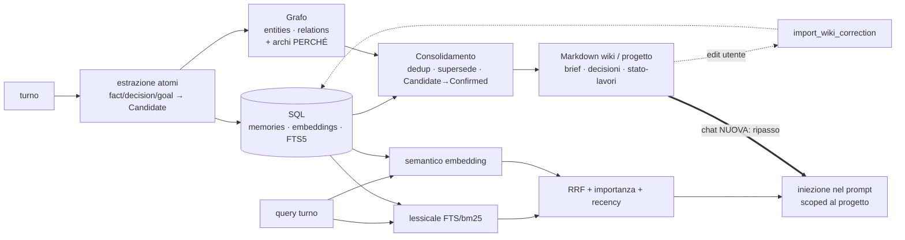

# Architettura — Memoria (SQL + grafo + markdown)

> Diagramma vivo. Il *perché* → [memory-vision.md](../memory-vision.md); la struttura
> dettagliata → [memory-architecture.md](../memory-architecture.md); principio → caposaldo
> #1 e #8. Crate `local-first-memory`; DB `~/.homun/memory.sqlite`.

## I tre livelli (divisione del lavoro)

| Livello | Ruolo (cervello) | Tecnologia |
|---|---|---|
| **Grafo** (entità+relazioni) | sinapsi — COSA↔COSA + **PERCHÉ** (archi causali) | `entities`/`relations`, `graphify` |
| **SQL** (memorie+embedding+FTS) | richiamo veloce — atomi + indici | `memories`, `memory_embeddings`, FTS5, **RRF** |
| **Markdown** (wiki per progetto) | pagine del quaderno — leggibile/editabile/portabile | `wiki_pages` + `WikiFileStore`, **bidirezionale** |

Verità = SQL+grafo; **markdown = proiezione + superficie editabile + export portabile**
(ciò che una **chat nuova** legge per la continuità).

## Il flusso

## Mappa memoria umana (copertura)

semantica ✅ · episodica ✅ · procedurale 🟡 · **provenienza/PERCHÉ 🟡 poco popolata** ·
**working-memory/loop-aperti ❌** · associativa (grafo) 🟡 (enorme ma **solo codice**).

## Baseline reale (2026-06-22)

Grafo **49.028 entità / 235.859 relazioni** ma quasi tutto **codice** · **391**
embedding · **9** pagine wiki. → la macchina c'è ma è **sbilanciata/dormiente** sui
pezzi che fanno "ricordare il perché e sopravvivere".

## Da completare → backlog WS5

5.1 grafo esteso a decisioni/artefatti/piano + **archi-perché** · 5.2 embeddare tutto ·
5.3 **loop aperti** di prima classe (Zeigarnik) · 5.4 **proiezione markdown attiva**
(iniettata nelle chat nuove) · 5.5 catena provenienza decisione→artefatto→codice→esito ·
5.6 **eval memoria**. Vedi [WS5](../plans/2026-06-22-batch-1042-artifacts-memory.md).
