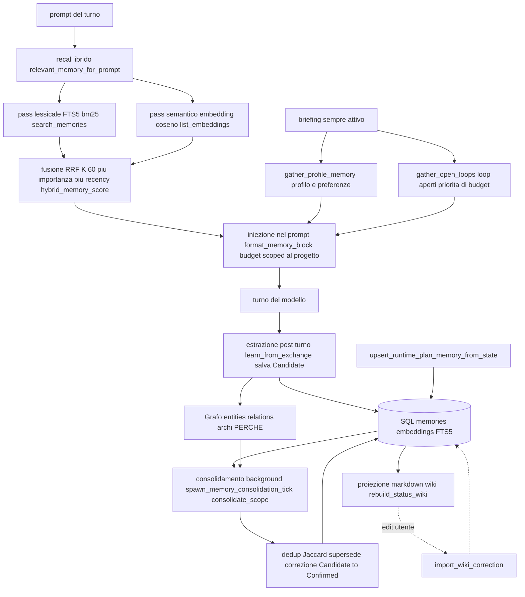

# Architettura — Memoria (SQL + grafo + markdown)

> Stato: **2026-06-27 — verificato vs codice. Punto fermo.** Questo è il diagramma vivo
> e accurato del sottosistema memoria. Il *perché* di prodotto → [memory-vision.md](../memory-vision.md);
> i principi vincolanti → [CAPISALDI.md](../CAPISALDI.md) Parte 1 + caposaldi #1 e #12.
> Crate `local-first-memory` (directory `crates/memory/`); DB `~/.homun/memory.sqlite`.

## Cosa fa

È **l'unico cervello persistente** di Homun: un solo store local-first che ogni capacità
(chat, canali, automazioni, sub-agent, artefatti, piano) usa per **richiamare** ciò che
già sa e per **scrivere** ciò che impara. Tiene insieme tre livelli che si dividono il
lavoro come una mente:

| Livello | Ruolo (cervello) | Tecnologia |
|---|---|---|
| **SQL** (memorie + embedding + FTS) | richiamo veloce — atomi richiamabili + indici | `memories`, `memory_embeddings`, FTS5, **RRF** |
| **Grafo** (entità + relazioni) | sinapsi — COSA↔COSA + **PERCHÉ** (archi causali) | `entities` / `relations`; **Graphify** come adapter di estrazione |
| **Markdown** (wiki per progetto) | pagine del quaderno — leggibile / editabile / portabile | `wiki_pages` + `WikiFileStore`, **bidirezionale** |

Verità = SQL + grafo; il markdown è **proiezione + superficie editabile + export portabile**
(ciò che una **chat nuova** legge per la continuità). Tutto è **scoped per
`workspace_id` (progetto) + `user_id`**, con `privacy_domain` / `sensitivity` / `access_audit`.

### Modello dati (schema, `crates/memory/src/store.rs`)

`memories` · `entities` · `relations` · `memory_events` (timeline episodica) ·
`memory_embeddings` (vettori densi) · `memory_evidence` (memoria → prova) ·
`wiki_pages` · `routines` / `automation_candidates` · `access_audit` · `tombstones`.
Confermato 1:1 con CAPISALDI Parte 1: lo schema è ancora vero.

- `MemoryRecord` (`types.rs:95`): `memory_type` (`fact | preference | decision | goal |
  episode | open_loop | artifact`), `text`, `confidence`, `status`, `privacy_domain` +
  `sensitivity`, `metadata`, `created/updated/last_seen`, e i campi di versionamento/
  autocorrezione `supersedes` / `superseded_by` / `correction_of`.
- `MemoryStatus` (`types.rs:73`): `Candidate | Confirmed | Rejected | Stale | Deleted`.
- `MemoryEntity` (`types.rs:117`): `entity_type`, `name`, `canonical_key`, `aliases` —
  il nodo del grafo, con merge canonico (sotto).

## Come funziona OGGI

Il ciclo per-turno è orchestrato dall'**harness** in `crates/desktop-gateway/src/main.rs`,
non dal modello. Cinque fasi: recall ibrido → briefing sempre-attivo → iniezione →
estrazione post-turno → consolidamento in background.

1. **Recall ibrido** — `relevant_memory_for_prompt` (`main.rs:12726`). Scoped al
   **workspace attivo** (isolamento progetto: "di cosa abbiamo discusso?" resta su QUESTO
   progetto). Due pass:
   - **lessicale** FTS5/bm25 via `facade.search_memories(...)` filtrato per policy, su
     `open_loop | goal | decision | fact | preference`, statuses `Confirmed + Candidate`
     (`main.rs:12770`);
   - **semantico** denso: embedding della query (off-lock) → `MemoryFacade::search_embeddings`
     (contratto `MemoryVectorIndex`) con floor rilassato `sim >= 0.5` e top-k. La prima
     implementazione è `ExactMemoryVectorIndex`, costruita dagli embedding SQLite esistenti:
     è una proiezione derivata e sostituibile, non una seconda memoria.
   I due rank si fondono con **RRF (K = 60)** + boost di **importanza** (`0.012 *
   importance`) + **recency** (decay esponenziale ~30 giorni, `0.008 * exp(-age/30)`) in
   `hybrid_memory_score` (`main.rs:12706`). In testa, se pertinente, vengono inserite righe
   di stato workflow / provenienza artefatto (`main.rs:12846`). Cap 10 righe.
   La query embedding e' bounded: prima passa da una cache in memoria LRU/TTL keyed su
   endpoint, modello, workspace e query normalizzata; poi viene calcolata con timeout
   (`HOMUN_MEMORY_QUERY_EMBED_TIMEOUT_MS`, default 700 ms). Se l'embed fallisce o supera
   il budget, il turno degrada a FTS + briefing sempre-attivo invece di bloccarsi.
   In debug (`HOMUN_DEBUG=1`) la recall emette una riga redatta `memory recall:` con
   tempi e cardinalita' del percorso caldo (`lock_wait_ms`, `fts_ms`,
   `query_embedding_ms`, `query_embedding_cache_hit`, `query_embedding_timed_out`,
   `vector_scan_ms`, `graph_context_ms`, candidate count e `degraded`). La riga non
   contiene il prompt ne' testo di memoria: serve a misurare il costo reale e a guidare
   l'introduzione dell'indice vettoriale.
2. **Briefing sempre-attivo** — separato dal RAG per-prompt, raggiunge il modello **ogni
   turno**:
   - `gather_profile_memory` (`main.rs:2302`) via `context_pack`: identità + preferenze
     stabili. In un PROGETTO il personale contribuisce **solo le preferenze** (tier
     sempre-rilevante); i fatti episodici personali restano al personale e arrivano al
     progetto solo on-demand via RAG;
   - `gather_open_loops` (`main.rs:1211`): i `open_loop` attivi, con **priorità di budget**
     garantita (il lavoro non chiuso non deve mai cadere).
3. **Iniezione** — `format_memory_block` (`main.rs:2355`) compone le sezioni `OPEN LOOPS`
   (per prime, budget prioritario) → `Personal` → `Project` entro un budget di caratteri,
   con marcatore di troncamento. Chiamato al `main.rs:18406`; il blocco RAG per-prompt è
   aggiunto subito dopo (`main.rs:18454`).
4. **Estrazione post-turno** — `learn_from_exchange` (`main.rs:5588`, invocata ai siti
   `:23035`, `:26928`, `:40147`). Un modello estrattore (`extractor_openai_config`,
   `main.rs:14773`) ricava da fatti/preferenze, **decisioni con il PERCHÉ** e alternative
   scartate, **open_loop** (lo stato completo: fatto / mancante / bloccato e perché),
   stati salienti e **negativi** ("non esiste ancora il file…"). Gating: `is_salient_exchange`
   OPPURE una conferma OPPURE un turno che ha **fatto** azioni concrete (`main.rs:5614`).
   I nuovi atomi entrano come **`Candidate`**.
5. **Sync piano** — `upsert_runtime_plan_memory_from_state` (`main.rs:9026`) proietta lo
   stato del piano runtime in memoria (`upsert_runtime_plan_memory`) e ricostruisce la wiki
   di stato — il piano è memoria, non uno store a parte.
6. **Consolidamento in background** — `spawn_memory_consolidation_tick` (`main.rs:1568`,
   intervallo da `HOMUN_AUTO_CONSOLIDATE_HOURS`, **off di default**) → `consolidate_scope`
   (`main.rs:4763`): dedup degli open_loop, dedup near-duplicate via **Jaccard**
   (`DEDUP_JACCARD`, `jaccard` a `main.rs:2542`), supersede / correzione,
   **`Candidate → Confirmed`**, e ricostruzione della wiki. Complementare:
   `spawn_embedding_catchup` (`main.rs:1597`) vettorizza a regime ogni memoria ancora priva
   di embedding (chiude il gap di recall denso).

### Merge canonico delle entità

`MemoryFacade::merge_entities` (`facade.rs:515`) fonde due nodi mantenendo il `survivor`,
assorbendo `name` / `canonical_key` / `aliases` dell'altro come alias (mai sovrascrivendo
la `canonical_key` del survivor) e unendo i metadata con motivazione. È il meccanismo che
tiene **un solo nodo per entità reale** nel grafo (es. dedup di persone/simboli).

## Perché è così

- **Ibrido FTS + denso + RRF**: il lessicale prende le corrispondenze esatte, il denso le
  parafrasi; RRF li fonde senza che uno domini → recall robusto **anche con
  modelli/embedding deboli** (coerente con il motore cross-modello, ADR 0016). Importanza e
  recency sono raffinamenti (~una posizione RRF), non override.
- **Tipi di memoria con politiche diverse**: le **preferenze** sono sempre-attive, le
  **decisioni** portano il "perché", gli **open_loop** tengono vivo il lavoro non chiuso
  (budget prioritario), gli **artifact** rendono richiamabili i deliverable, gli **episodi**
  sono timeline.
- **Grafo interrogabile, non testo piatto**: la conoscenza è interrogabile; Graphify è oggi
  il primo adapter maturo (soprattutto codice), l'obiettivo è graphificare anche artifact,
  decisioni, piano ed esiti con **archi causali**.
- **Scope per workspace + privacy/sensitivity + audit**: local-first e governato; niente
  fuga di dati personali nei progetti (l'isolamento è esplicito nel recall, `main.rs:12735`).
- **Candidate→Confirmed + supersede/correction + tombstones**: la memoria **si autocorregge
  e versiona**, non accumula spazzatura.

## Contratto

**La regola del caposaldo #1.** La memoria è IL differenziatore ed è il **layer condiviso**:
ogni capacità — chat, canali, automazioni, sub-agent, artefatti, piano — fa **recall +
write-back attraverso l'UNICO `MemoryFacade`** (`facade.rs:22`; aperto via `open_brain_memory`
`main.rs:35740`, acquisito via `lock_memory_facade` `main.rs:43530`). **Mai** uno store
parallelo che diventi una seconda verità semantica. Ogni output/cache esterna (graphify-out,
wiki markdown, read-model operativi) resta **derivata** e deve **convergere** sullo store
canonico (`entities` / `relations` / `memories`).

**Confine Vault (2026-06-29).** Il Vault è separato dalla memoria: dati critici come
carte, CVV/CV2, codice fiscale, targhe, salute e credenziali non devono entrare in
memoria in chiaro. `crates/memory/src/redaction.rs` chiama il classifier di
`local-first-vault` prima di persistere/esporre testo, sostituendo i valori con
placeholder `VAULT:*`. Il valore reale vive dietro `SecretRef`/Vault e deve essere
richiesto con tool minimizzati e auditati. Vedi [vault.md](vault.md).

## Divergenze / debolezze

- **`contact_relationships` / `contacts` / `contact_identities`** vivono nel DB della chat
  (`crates/desktop-gateway/src/chat_store.rs:2057+`, `2124`), **non** in `MemoryFacade`. Sono
  un **read-model UX** (rubrica curata): ammessi dal caposaldo #5 *solo se
  mirrorati/convergenti* — la conoscenza ABOUT un contatto deve restare nella memoria,
  collegata per handle (`entity_ref` sul contatto). Da sorvegliare perché **non diventino**
  una seconda verità semantica.
- **Grafo sbilanciato**: enorme ma quasi tutto **codice** (Graphify è l'unico adapter
  maturo); decisioni / artefatti / piano / esiti e gli **archi-perché** sono ancora poco
  popolati (backlog WS5).
- **Embedding parziali storici**: i vettori venivano scritti lazy → recall semantico
  copriva una frazione. `spawn_embedding_catchup` colma il gap a regime, ma resta dipendente
  dall'endpoint di embed.
- **Vettoriale ancora exact/O(N), ma dietro contratto**: la recall non legge più direttamente
  `list_embeddings` dal gateway; passa da `MemoryFacade::search_embeddings` e dal trait
  `MemoryVectorIndex`. Oggi il backend è `ExactMemoryVectorIndex` (stessa semantica cosine,
  nessun rischio packaging); prossimo passo: sostituire quel backend con `sqlite-vec`/`usearch`
  se il bundle macOS resta pulito.
- **Consolidamento off di default** (`HOMUN_AUTO_CONSOLIDATE_HOURS=0`): senza tick attivo la
  promozione `Candidate→Confirmed` e il dedup avvengono solo lungo le altre operazioni.
- **Provenienza / catena causale decisione→artefatto→codice→esito**: prevista, oggi parziale.

## Caposaldo servito

- **#1** — La memoria è IL differenziatore ed è il layer condiviso: recall + write-back
  dall'unico `MemoryFacade`, mai store paralleli.
- **#12** — La memoria cattura il **PERCHÉ** e i **LOOP APERTI**, non solo i fatti, e collega
  tutto nel grafo con archi causali; il lavoro incompiuto resta richiamabile finché non è
  chiuso — verificabile via eval.

## File chiave

- `crates/memory/src/facade.rs` — `MemoryFacade` (`:22`), `merge_memories` (`:201`),
  `merge_entities` (`:515`), `search_memories` (`:714`), `list_memories_for_ui` (`:989`).
- `crates/memory/src/types.rs` — `MemoryRecord` (`:95`), `MemoryStatus` (`:73`),
  `MemoryEntity` (`:117`).
- `crates/memory/src/store.rs` — schema SQLite (tutte le tabelle), `search_memory_refs`,
  `search_code_entities`, `search_embeddings`.
- `crates/memory/src/vector_index.rs` — contratto `MemoryVectorIndex`, `VectorHit` e backend
  exact derivato dagli embedding SQLite.
- `crates/memory/src/{graph,graphify,wiki,wiki_sync,search,policy,lifecycle}.rs` — grafo,
  adapter Graphify, proiezione/sync markdown, recall, policy, ciclo di vita.
- `crates/desktop-gateway/src/main.rs` — orchestrazione del ciclo per-turno:
  `relevant_memory_for_prompt` (`:12726`), `hybrid_memory_score` (`:12706`),
  `gather_profile_memory` (`:2302`), `gather_open_loops` (`:1211`),
  `format_memory_block` (`:2355`), `learn_from_exchange` (`:5588`),
  `upsert_runtime_plan_memory_from_state` (`:9026`),
  `spawn_memory_consolidation_tick` (`:1568`), `consolidate_scope` (`:4763`),
  `open_brain_memory` (`:35740`), `lock_memory_facade` (`:43530`).
- `crates/desktop-gateway/src/chat_store.rs` — read-model UX `contacts` /
  `contact_relationships` (`:2057+`), da tenere convergente con la memoria.
