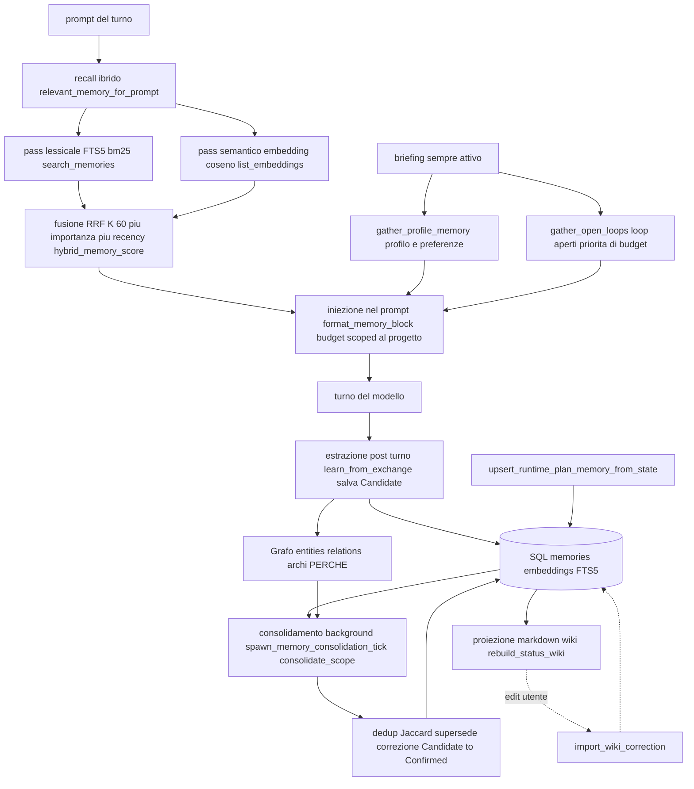

# Architettura — Memoria (SQL + grafo + markdown)

> ⚠️ **CORREZIONE post-merge 2026-07-06.** Questo file è stato verificato su un branch **cieco**
> alla linea `origin/main`. La realtà (post-merge): l'orchestrazione memoria (recall / learn /
> consolidate / backfill) è **stata migrata in `crates/memory/`** (`service.rs`/`recall.rs`/
> `learn.rs`/`consolidate.rs`/`embedding.rs`) dietro `HOMUN_MEMORY_SERVICE` / `HOMUN_MEMORY_POOL`
> — **ADR 0022 Tappe 1/1.5/2/4 FATTE** (resta Tappa 3 = recall on-demand via tool + pulizia).
> Le affermazioni "in-path / ADR 0022 = Proposed / flag inesistenti" più sotto sono **superate**.
> Vedi [ADR 0022](../decisions/0022-memory-as-out-of-path-service.md) e [STATO.md](../STATO.md).
>
> Stato: **2026-06-27 — verificato vs codice. Punto fermo.** Questo è il diagramma vivo
> e accurato del sottosistema memoria. Il *perché* di prodotto → [memory-vision.md](../memory-vision.md);
> i principi vincolanti → [CAPISALDI.md](../CAPISALDI.md) Parte 1 + caposaldi #1 e #12.
> Crate `local-first-memory` (directory `crates/memory/`, ~5958 righe); DB `~/.homun/memory.sqlite`.
>
> ⚠️ **Dove gira l'orchestrazione, oggi.** Lo *store* (schema, grafo, wiki, RRF, merge
> canonico) vive nel crate `crates/memory/`. Ma il *ciclo di orchestrazione* per-turno
> — recall / learn / consolidate / brief — è ancora **in-path dentro
> `crates/desktop-gateway/src/main.rs`**, non un servizio separato. Estrarlo out-of-path
> dietro `HOMUN_MEMORY_SERVICE` / `HOMUN_MEMORY_POOL` è l'oggetto dell'**ADR 0022 = Proposed
> (NON iniziato:** quei flag hanno 0 occorrenze nel codice). Non leggere questo documento
> come se la memoria fosse già un servizio a sé.
>
> Le referenze `main.rs:NNNN` invecchiano a ogni edit: fidati dei **nomi di simbolo**
> (`fn relevant_memory_for_prompt`, …) e ri-greppa, mai del numero.

## Cosa fa

È **l'unico cervello persistente** di Homun: un solo store local-first che ogni capacità
(chat, canali, automazioni, sub-agent, artefatti, piano) usa per **richiamare** ciò che
già sa e per **scrivere** ciò che impara. Tiene insieme tre livelli che si dividono il
lavoro come una mente:

| Livello | Ruolo (cervello) | Tecnologia |
|---|---|---|
| **SQL** (memorie + embedding + FTS) | richiamo veloce — atomi richiamabili + indici | `memories`, `memory_embeddings`, FTS5, **RRF** |
| **Grafo** (entità + relazioni) | sinapsi — COSA↔COSA + **PERCHÉ** (archi causali) | `entities` / `relations`; **Graphify** come adapter di estrazione |
| **Markdown** (wiki per progetto) | pagine del quaderno — leggibile / editabile / portabile | `wiki_pages` + `WikiFileStore`, **bidirezionale** |

Verità = SQL + grafo; il markdown è **proiezione + superficie editabile + export portabile**
(ciò che una **chat nuova** legge per la continuità). Tutto è **scoped per
`workspace_id` (progetto) + `user_id`**, con `privacy_domain` / `sensitivity` / `access_audit`.

### Modello dati (schema, `crates/memory/src/store.rs`)

`memories` · `entities` · `relations` · `memory_events` (timeline episodica) ·
`memory_embeddings` (vettori densi) · `memory_evidence` (memoria → prova) ·
`wiki_pages` · `routines` / `automation_candidates` · `access_audit` · `tombstones` ·
`schema_metadata`. Tutte create in `store.rs`; confermato 1:1 con CAPISALDI Parte 1.
`crates/memory/src/schema.rs` è un **layer tipato** sopra le primitive generiche (la forma
`Decision` col PERCHÉ), NON un secondo schema: una decisione resta un `MemoryRecord`.

### Fonti memoria collegate autorizzate (schema v7, smoke 2026-07-17 Europe/Rome)

Lo schema v7 aggiunge grant persistiti di fonte: un progetto consumatore può richiamare
solo fonti personali o di altri progetti dello stesso utente tramite un grant diretto,
una allow-list di collection e override puntuali `Allow`/`Deny`. Non esiste transitività:
una fonte ricevuta non abilita a sua volta altre fonti. Il comportamento è attivo per
default; per un rollback locale l'unico escape hatch è `HOMUN_MEMORY_SOURCES=0` oppure
`HOMUN_MEMORY_SOURCES=off`.

Lo smoke verificato copre isolamento personale/progetto, grant, collection e override,
revoca, e il perimetro contatti. Ogni fonte progetto deve inoltre comparire nel registry
persistito `workspaces.json`: fonte assente, illeggibile, corrotta o vuota viene filtrata
come `source_unavailable` prima di candidati, recall, audit o aggiornamento last-used.
Grant e policy restano persistiti e revocabili; il richiamo collegato non pubblica né
copia record e i flussi di pubblicazione restano separati. I candidati qui sono elementi
di recall/indice già filtrati dalla policy, non l'Advanced picker: quel picker gestisce
la selezione di record non-segreti disponibili come fonte.

- `MemoryRecord` (`types.rs`, `pub struct MemoryRecord`): `memory_type` (`fact | preference |
  decision | goal | episode | open_loop | artifact`), `text`, `confidence`, `status`,
  `privacy_domain` + `sensitivity`, `metadata`, `created/updated/last_seen`, e i campi di
  versionamento/autocorrezione `supersedes` / `superseded_by` / `correction_of`.
- `MemoryStatus` (`types.rs`, `pub enum MemoryStatus`): `Candidate | Confirmed | Rejected |
  Stale | Deleted`.
- `MemoryEntity` (`types.rs`, `pub struct MemoryEntity`): `entity_type`, `name`,
  `canonical_key`, `aliases` — il nodo del grafo, con merge canonico (sotto).

## Come funziona OGGI

Il ciclo per-turno è orchestrato dall'**harness** in `crates/desktop-gateway/src/main.rs`,
non dal modello — e **oggi vive qui, in-path**, non in un servizio separato (l'estrazione
out-of-path è ADR 0022, *Proposed*). Cinque fasi: recall ibrido → briefing sempre-attivo →
iniezione → estrazione post-turno → consolidamento in background.

1. **Recall ibrido** — `fn relevant_memory_for_prompt` (in `main.rs`). Scoped al
   **workspace attivo** (isolamento progetto: "di cosa abbiamo discusso?" resta su QUESTO
   progetto). Due pass:
   - **lessicale** FTS5/bm25 via `facade.search_memories(...)` filtrato per policy, su
     `open_loop | goal | decision | fact | preference`, statuses `Confirmed + Candidate`;
   - **semantico** denso: embedding della query (off-lock) → `MemoryFacade::search_embeddings`
     (contratto `MemoryVectorIndex`) con floor rilassato `sim >= 0.5` e top-k. La prima
     implementazione runtime è `MemoryVectorIndexCache`, costruita dagli embedding SQLite
     esistenti e cacheata per scope dentro `MemoryFacade`; con le feature default usa
     `UsearchMemoryVectorIndex` (coseno F32), mentre `ExactMemoryVectorIndex` resta il
     fallback compilabile con `--no-default-features`. `upsert_embedding` aggiorna la cache
     se già calda. È una proiezione derivata e sostituibile, non una seconda memoria.
   I due rank si fondono con **RRF (K = 60)** + boost di **importanza** (`0.012 *
   importance`) + **recency** (decay esponenziale ~30 giorni, `0.008 * exp(-age/30)`) in
   `fn hybrid_memory_score` (in `main.rs`). In testa, se pertinente, vengono inserite righe
   di stato workflow / provenienza artefatto. Cap 10 righe.
   La query embedding e' bounded: prima passa da una cache in memoria LRU/TTL keyed su
   endpoint, modello, workspace e query normalizzata; poi viene calcolata con timeout
   (`HOMUN_MEMORY_QUERY_EMBED_TIMEOUT_MS`, default 700 ms). Se l'embed fallisce o supera
   il budget, il turno degrada a FTS + briefing sempre-attivo invece di bloccarsi.
   In debug (`HOMUN_DEBUG=1`) la recall emette una riga redatta `memory recall:` con
   tempi e cardinalita' del percorso caldo (`lock_wait_ms`, `fts_ms`,
   `query_embedding_ms`, `query_embedding_cache_hit`, `query_embedding_timed_out`,
   `vector_scan_ms`, `graph_context_ms`, candidate count e `degraded`). La riga non
   contiene il prompt ne' testo di memoria: serve a misurare il costo reale e a guidare
   l'introduzione dell'indice vettoriale.
2. **Briefing sempre-attivo** — separato dal RAG per-prompt, raggiunge il modello **ogni
   turno**:
   - `fn gather_profile_memory_for_prompt` (in `main.rs`) via `context_pack`: identità +
     preferenze stabili. In un PROGETTO il personale contribuisce **solo le preferenze**
     (tier sempre-rilevante); i fatti episodici personali restano al personale e arrivano al
     progetto solo on-demand via RAG;
   - `fn gather_open_loops` (in `main.rs`): i `open_loop` attivi, con **priorità di budget**
     garantita (il lavoro non chiuso non deve mai cadere).
3. **Iniezione** — `fn format_memory_block` (in `main.rs`) compone le sezioni `OPEN LOOPS`
   (per prime, budget prioritario) → `Personal` → `Project` entro un budget di caratteri,
   con marcatore di troncamento; il blocco RAG per-prompt è aggiunto subito dopo.
4. **Estrazione post-turno** — `fn learn_from_exchange` (in `main.rs`, invocata dai siti che
   chiudono un turno). Un modello estrattore (`fn extractor_openai_config`) ricava da
   fatti/preferenze, **decisioni con il PERCHÉ** e alternative scartate, **open_loop** (lo
   stato completo: fatto / mancante / bloccato e perché), stati salienti e **negativi** ("non
   esiste ancora il file…"). Gating: `is_salient_exchange` OPPURE una conferma OPPURE un
   turno che ha **fatto** azioni concrete. I nuovi atomi entrano come **`Candidate`**.
5. **Sync piano** — `fn upsert_runtime_plan_memory_from_state` (in `main.rs`) proietta lo
   stato del piano runtime in memoria (`upsert_runtime_plan_memory`) e ricostruisce la wiki
   di stato — il piano è memoria, non uno store a parte.
6. **Consolidamento in background** — `fn spawn_memory_consolidation_tick` (in `main.rs`,
   intervallo da `HOMUN_AUTO_CONSOLIDATE_HOURS`, **off di default**) → `fn consolidate_scope`:
   dedup degli open_loop, dedup near-duplicate via **Jaccard** (`DEDUP_JACCARD`, `fn jaccard`),
   supersede / correzione, **`Candidate → Confirmed`**, e ricostruzione della wiki.
   Complementare: `fn spawn_embedding_catchup` vettorizza a regime ogni memoria ancora priva
   di embedding (chiude il gap di recall denso).

### Merge canonico delle entità

`MemoryFacade::merge_entities` (`facade.rs`) fonde due nodi mantenendo il `survivor`,
assorbendo `name` / `canonical_key` / `aliases` dell'altro come alias (mai sovrascrivendo
la `canonical_key` del survivor) e unendo i metadata con motivazione. È il meccanismo che
tiene **un solo nodo per entità reale** nel grafo (es. dedup di persone/simboli).

### Integrità del grafo progetto e identità Graphify

L'import Graphify è una **proiezione sostituibile** dello scope progetto, non un flusso
append-only. Prima di scrivere, l'adapter normalizza ogni nodo su un'identità canonica
derivata da workspace, tipo e chiave stabile; gli archi usano source, tipo e target
canonici. Ordine dell'input e duplicati dell'estrattore non cambiano quindi ref o
checksum. Nodi senza identità valida, archi duplicati e archi con estremi mancanti
vengono conteggiati nel report d'importazione e scartati prima del database.

La sostituzione di entity e relation Graphify dello scope avviene in una singola
transazione. Se parsing, normalizzazione o import falliscono, la proiezione precedente
resta intatta. Anche la pubblicazione runtime segue un ordine fail-closed:

1. import transazionale nel `MemoryFacade`;
2. pubblicazione atomica dell'artifact `graph.json`;
3. persistenza del fingerprint del progetto;
4. emissione dell'evento `project_graph.ready`.

Un errore in uno dei primi tre passaggi emette `project_graph.failed`, non avanza il
fingerprint e non dichiara pronto un grafo parziale. Rianalizzare due volte lo stesso
progetto converge sullo stesso checksum e sulle stesse ref; un'analisi cambiata
sostituisce esattamente la proiezione precedente.

### Audit e repair governato

`GET /api/integrity/audit` esegue un audit **read-only e metadata-only** di Memory,
Vault e stato dei grafi registrati. I report contengono soltanto versioni, conteggi,
stati e checksum: mai testo di memoria, path assoluti, secret, nonce o ciphertext. Per
ogni grafo registrato lo stato è `missing`, `fresh`, `stale` o `invalid`; i fingerprint
sono esposti solo tramite hash.

Il repair non parte mai automaticamente e usa quattro passaggi obbligatori:

1. azioni nominate e canoniche inviate a `POST /api/integrity/repair/preview`;
2. preview con stime, checksum dell'audit e approval token legato esattamente alle azioni;
3. nuovo controllo anti-drift e backup SQLite server-side;
4. `POST /api/integrity/repair/apply` con `confirm=true`, stesso checksum, token e azioni.

Qualunque differenza invalida l'approvazione. Le riparazioni Memory sono transazionali;
il refresh di un grafo riusa il percorso fail-closed sopra. Per evitare esiti misti tra
domini, un refresh grafo non si applica insieme a repair Memory nello stesso comando.
La cancellazione di un progetto segue inoltre la regola **registry-last**: pulisce in
transazione dati, cross-link e cache usando lo user canonico `local-user`, quindi rimuove
la voce dal registry solo dopo il successo. Un retry deve essere sicuro.

I duplicati hanno due classi diverse. Le relation Graphify duplicate sono difetti di una
proiezione deterministica e possono essere rimosse automaticamente per uno scope
registrato. Le memorie semanticamente simili, invece, sono conoscenza dell'utente:
l'audit le segnala come gruppi revisionabili, ma il repair di integrità non le fonde e
non le cancella mai automaticamente.

## Perché è così

- **Ibrido FTS + denso + RRF**: il lessicale prende le corrispondenze esatte, il denso le
  parafrasi; RRF li fonde senza che uno domini → recall robusto **anche con
  modelli/embedding deboli** (coerente con il motore cross-modello, ADR 0016). Importanza e
  recency sono raffinamenti (~una posizione RRF), non override.
- **Tipi di memoria con politiche diverse**: le **preferenze** sono sempre-attive, le
  **decisioni** portano il "perché", gli **open_loop** tengono vivo il lavoro non chiuso
  (budget prioritario), gli **artifact** rendono richiamabili i deliverable, gli **episodi**
  sono timeline.
- **Grafo interrogabile, non testo piatto**: la conoscenza è interrogabile; Graphify è oggi
  il primo adapter maturo (soprattutto codice), l'obiettivo è graphificare anche artifact,
  decisioni, piano ed esiti con **archi causali**.
- **Scope per workspace + privacy/sensitivity + audit**: local-first e governato; niente
  fuga di dati personali nei progetti (l'isolamento è esplicito nel recall, in
  `fn relevant_memory_for_prompt`).
- **Candidate→Confirmed + supersede/correction + tombstones**: la memoria **si autocorregge
  e versiona**, non accumula spazzatura.

## Contratto

**La regola del caposaldo #1.** La memoria è IL differenziatore ed è il **layer condiviso**:
ogni capacità — chat, canali, automazioni, sub-agent, artefatti, piano — fa **recall +
write-back attraverso l'UNICO `MemoryFacade`** (`pub struct MemoryFacade` in `facade.rs`;
aperto via `fn open_brain_memory`, acquisito via `fn lock_memory_facade`, entrambi in
`main.rs`). **Mai** uno store
parallelo che diventi una seconda verità semantica. Ogni output/cache esterna (graphify-out,
wiki markdown, read-model operativi) resta **derivata** e deve **convergere** sullo store
canonico (`entities` / `relations` / `memories`).

**Confine Vault (2026-06-29).** Il Vault è separato dalla memoria: dati critici come
carte, CVV/CV2, codice fiscale, targhe, salute e credenziali non devono entrare in
memoria in chiaro. `crates/memory/src/redaction.rs` chiama il classifier di
`local-first-vault` prima di persistere/esporre testo, sostituendo i valori con
placeholder `VAULT:*`. Il valore reale vive dietro `SecretRef`/Vault e deve essere
richiesto con tool minimizzati e auditati. Vedi [vault.md](vault.md).

## Divergenze / debolezze

- **Orchestrazione ancora in-path (ADR 0022 = Proposed)**: recall / learn / consolidate /
  brief girano dentro `crates/desktop-gateway/src/main.rs`, non in un servizio di memoria
  separato. L'estrazione out-of-path dietro `HOMUN_MEMORY_SERVICE` / `HOMUN_MEMORY_POOL`
  è **decisa ma NON iniziata** (i due flag hanno 0 occorrenze nel codice). Fino ad allora
  lo *store* è nel crate `memory`, ma il *ciclo* resta nel monolite del gateway.
- **`contact_relationships` / `contacts` / `contact_identities`** vivono nel DB della chat
  (`crates/desktop-gateway/src/chat_store.rs`, tabelle `contact_*`), **non** in
  `MemoryFacade`. Sono
  un **read-model UX** (rubrica curata): ammessi dal caposaldo #5 *solo se
  mirrorati/convergenti* — la conoscenza ABOUT un contatto deve restare nella memoria,
  collegata per handle (`entity_ref` sul contatto). Da sorvegliare perché **non diventino**
  una seconda verità semantica.
- **Grafo sbilanciato**: enorme ma quasi tutto **codice** (Graphify è l'unico adapter
  maturo); decisioni / artefatti / piano / esiti e gli **archi-perché** sono ancora poco
  popolati (backlog WS5).
- **Embedding parziali storici**: i vettori venivano scritti lazy → recall semantico
  copriva una frazione. `spawn_embedding_catchup` colma il gap a regime, ma resta dipendente
  dall'endpoint di embed.
- **Vettoriale default `usearch`, dietro contratto**: la recall non legge più direttamente
  `list_embeddings` dal gateway; passa da `MemoryFacade::search_embeddings` e dal trait
  `MemoryVectorIndex`. Oggi il backend default è `UsearchMemoryVectorIndex` via feature
  default `usearch-index`, cacheato per workspace come proiezione derivata dagli embedding
  canonici SQLite. `ExactMemoryVectorIndex` resta fallback con `--no-default-features`.
- **Consolidamento off di default** (`HOMUN_AUTO_CONSOLIDATE_HOURS=0`): senza tick attivo la
  promozione `Candidate→Confirmed` e il dedup avvengono solo lungo le altre operazioni.
- **Provenienza / catena causale decisione→artefatto→codice→esito**: prevista, oggi parziale.

## Caposaldo servito

- **#1** — La memoria è IL differenziatore ed è il layer condiviso: recall + write-back
  dall'unico `MemoryFacade`, mai store paralleli.
- **#12** — La memoria cattura il **PERCHÉ** e i **LOOP APERTI**, non solo i fatti, e collega
  tutto nel grafo con archi causali; il lavoro incompiuto resta richiamabile finché non è
  chiuso — verificabile via eval.

## File chiave

(Numeri di riga volutamente omessi: ri-greppa per nome di simbolo.)

- `crates/memory/src/facade.rs` — `MemoryFacade`, `merge_memories`, `merge_entities`,
  `search_memories`, `list_memories_for_ui`, `search_embeddings`.
- `crates/memory/src/types.rs` — `MemoryRecord`, `MemoryStatus`, `MemoryEntity`.
- `crates/memory/src/store.rs` — schema SQLite (tutte le tabelle: `memories`, `entities`,
  `relations`, `memory_events`, `memory_embeddings`, `memory_evidence`, `wiki_pages`,
  `routines`, `automation_candidates`, `access_audit`, `tombstones`, `schema_metadata`),
  `search_embeddings`.
- `crates/memory/src/schema.rs` — layer tipato sopra le primitive (forma `Decision`/PERCHÉ),
  non un secondo schema.
- `crates/memory/src/vector_index.rs` — contratto `MemoryVectorIndex`, `MemoryVectorIndexCache`,
  `UsearchMemoryVectorIndex` (default `usearch-index`) e `ExactMemoryVectorIndex` (fallback
  `--no-default-features`), derivati dagli embedding SQLite canonici.
- `crates/memory/src/{graph,graphify,wiki,wiki_sync,search,policy,lifecycle,operations,crypto,learning_ui,redaction}.rs`
  — grafo, adapter Graphify, proiezione/sync markdown, recall, policy, ciclo di vita,
  operazioni, crypto, UI di apprendimento, redazione Vault.
- `crates/desktop-gateway/src/main.rs` — orchestrazione del ciclo per-turno **in-path**
  (ADR 0022 non ancora estratto): `fn relevant_memory_for_prompt`, `fn hybrid_memory_score`,
  `fn gather_profile_memory_for_prompt`, `fn gather_open_loops`, `fn format_memory_block`,
  `fn learn_from_exchange`, `fn upsert_runtime_plan_memory_from_state`,
  `fn spawn_memory_consolidation_tick`, `fn consolidate_scope`, `fn open_brain_memory`,
  `fn lock_memory_facade`.
- `crates/desktop-gateway/src/chat_store.rs` — read-model UX `contacts` /
  `contact_relationships` / `contact_identities`, da tenere convergente con la memoria.
