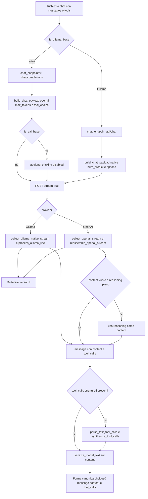

# I/O e normalizzazione dei modelli (L0)

> **Stato** — Data: 2026-06-27. Pagina **reverse-engineered** dal codice reale
> (`crates/desktop-gateway/src/main.rs`, `crates/inference/`). È il **punto fermo**
> dello strato fondamentale L0: come ogni modello risponde e come lo riportiamo a una
> forma unica. **Ogni modifica al sottosistema aggiorna questa pagina.**

## Cosa fa

Questo strato è il **confine di I/O** tra Homun e qualsiasi provider di inferenza: costruisce
la richiesta di chat nella forma giusta per il provider (Ollama native `/api/chat` vs
OpenAI-compat `/v1/chat/completions`), consuma lo streaming token-per-token con timeout
per-chunk, e **riassembla** la risposta — comunque sia fatta — in un'unica forma
non-streaming `choices[0].message` con `{content, tool_calls}`. Lungo la strada normalizza i
quirk dei modelli: risposta finita in `reasoning_content` invece che in `content`,
tool-call emessi come **testo** invece che nel campo strutturato, tag `<think>`/`<tool_call>`
che inquinano il contenuto, e l'output strutturato (`json_schema` → `json_object`) quando il
backend non lo applica davvero. È l'unico posto in cui la varietà dei modelli deve essere
domata prima che l'agent-loop la veda.

## Come funziona OGGI

Il flusso reale di un turno di chat (percorso principale: `generate_with_tools`, il loop a
round attorno a `crates/desktop-gateway/src/main.rs:18948` in poi):

1. **Selezione provider** — `is_ollama_base` (`main.rs:14347`) decide il path dal base URL
   (`ollama.com` o `:11434` → Ollama; tutto il resto → OpenAI-compat). `chat_endpoint`
   (`main.rs:14370`) calcola l'URL: Ollama → strip di un eventuale `/v1` finale e
   `…/api/chat`; gli altri → `…/chat/completions`. Si usa il **native** per Ollama perché la
   shim OpenAI-compat `/v1` storicamente *droppava* i tool-call in streaming (ollama#12557).

2. **Build payload** — `build_chat_payload` (`main.rs:14591`) produce due shape diverse:
   - **Ollama native**: `{model, messages: to_ollama_messages(...), stream:true,
     keep_alive:"10m", options:{temperature, num_predict:6000}}`; i `tools` vanno in
     `payload["tools"]` solo se non è il round finale. `to_ollama_messages` (`main.rs:14386`)
     converte: content-parts multimodali → `{content, images:[base64]}` (senza prefisso
     `data:`), e arguments dei `tool_calls` da **stringa JSON → oggetto** (il native vuole un
     oggetto).
   - **OpenAI-compat**: `{model, messages, temperature, max_tokens:6000, stream:true}` +
     `tool_choice:"auto"` quando ci sono tools. Per z.ai (`is_zai_base`, `main.rs:14354`) si
     aggiunge `thinking:{type:"disabled"}` salvo `HOMUN_ZAI_THINKING=1`.

3. **Streaming + riassemblaggio** — due collector simmetrici producono **la stessa forma**:
   - OpenAI: `collect_openai_stream` (`main.rs:14246`) bufferizza le righe SSE `data:`,
     emette ogni `delta.content` LIVE alla UI, e a fine stream chiama
     `reassemble_openai_stream` (`main.rs:14137`) che accumula `content`, `reasoning`
     (`reasoning_content` con alias `reasoning`) e i `tool_calls` per `index` (id/name/args
     concatenati).
   - Ollama: `collect_ollama_native_stream` (`main.rs:14517`) legge NDJSON; ogni riga passa
     da `process_ollama_line` (`main.rs:14465`) che streama il `message.content`, accumula, e
     converte i `tool_calls` (arguments oggetto → **stringa JSON**, id sintetico
     `ollama_call_N`). Gestisce sia lo stream sia un singolo oggetto non-streamed (tail).
   - Entrambi i collector hanno timeout **per-chunk** (`first_token` generoso, default 300s
     via `HOMUN_MODEL_FIRST_TOKEN_SECS`, poi `idle` più stretto) e **salvano l'output
     parziale** su stallo/errore mid-stream se è già arrivato qualcosa, invece di uccidere il
     turno.

4. **Fallback content vuoto** — in `reassemble_openai_stream`: se `content` è vuoto ma
   `reasoning` no, si usa `reasoning` come content (il dead-end GLM/kimi che "fa sparire la
   risposta"). Se il provider ha ignorato `stream:true` e ha mandato un JSON completo
   (`saw_event=false`), lo si usa così com'è.

5. **Tool-call come testo + sanitize** — quando il `message` riassemblato non ha
   `tool_calls` strutturati, l'agent-loop (`main.rs:~19565`) tenta `parse_text_tool_calls`
   (`main.rs:24923`): estrae call Hermes/Qwen (`<tool_call>{json}</tool_call>`) e Claude/
   MiniMax (`<invoke name=…><parameter…>`), filtrate ai soli tool **noti**, e le
   trasforma in struttura via `synthesize_tool_calls` (`main.rs:24969`). Il `content`
   committato passa sempre da `sanitize_model_text` (`main.rs:24863`) che spoglia i blocchi
   `<think>`/`<tool_call>`/`<invoke>`/`<function_calls>` e i token spuri (es. minimax).

6. **Output strutturato (deliverable/judge)** — per il JSON forzato (deck, giudici di
   orchestrazione) si usa `response_format`. Il provider OpenAI-compat del crate inference
   (`crates/inference/src/openai_compat.rs:106`) prova prima `json_schema` strict (decoding
   vincolato — il "floor" cross-modello) e **degrada UNA volta a `json_object` su un 400**.
   Stesso pattern duplicato nel gateway per il deck (`generate_deck_content`,
   `main.rs:16289` — attempts `json_schema` → `json_object`), con parsing **tollerante** a
   valle (`extract_deck_object`, `main.rs:16213`) perché alcuni provider accettano lo schema
   ma non lo *applicano*.



## Perché è così

- **Due path provider (Ollama native vs OpenAI `/v1`)**: la shim `/v1` di Ollama droppava i
  tool-call in streaming (ollama#12557); il native `/api/chat` supporta streaming + tools
  insieme (la strada di Zed). Tenere due shape è il prezzo per avere **token live E tool-call**
  sul tier locale, che è il prodotto (caposaldo 2). Il collector native gestisce comunque il
  caso non-streamed, così resta robusto.
- **Temperatura bassa**: la temperatura della chat arriva dalla richiesta del frontend, ma
  ogni percorso *deterministico* — giudici di completamento step/task (`main.rs:13809`,
  `:13879`), generazione strutturata — gira a **0/0.0**: l'harness possiede il control-flow e
  vuole decisioni ripetibili, non creatività (capisaldi 2 e 6). Il deck usa 0.4 (un po' di
  varietà narrativa con schema a vincolare la forma).
- **Fallback tool-as-text**: modelli deboli/locali (minimax via Ollama, alcuni template
  Hermes/Qwen/Claude) emettono i tool-call come **testo** nel loro template invece che nel
  campo strutturato. Senza il parse il loop si bloccherebbe; è il "parsing tollerante
  ovunque" del caposaldo 6, filtrato ai tool noti per non scambiare prosa per una call.
- **Fallback reasoning → content**: i modelli "thinking" (GLM, kimi-code, nemotron) spesso
  finiscono con `finish_reason:stop` e `content` **vuoto**, con tutta la risposta in
  `reasoning_content`. Senza fallback il turno committerebbe una risposta vuota (solo i
  Sources): è model-independent e **supera** l'hack per-provider `thinking:disabled`.
- **Schema downgrade `json_schema` → `json_object`**: lo strict `json_schema` è il floor
  cross-modello (constrained decoding) sui backend che lo applicano (OpenAI, OpenRouter,
  Ollama recente); ma `ollama.com/v1` lo rifiuta con 400 → si degrada una volta a
  `json_object`, **mai** perdendo silenziosamente l'enforcement dove esiste (ADR 0016).

## Contratto

**Forma canonica garantita** in uscita dai collector (consumata invariata dall'agent-loop):

```json
{ "choices": [ { "message": { "role": "assistant",
                              "content": "<string>",
                              "tool_calls": [ /* opzionale, solo se presenti */ ] },
                 "finish_reason": "<string>" } ] }
```

Invarianti:
- `tool_calls` (quando presenti) sono sempre in shape OpenAI: `{id, type:"function",
  function:{name, arguments:<stringa JSON>}}` — anche dal native Ollama (args oggetto →
  stringa, id sintetico) e dal fallback text-tool-call (id `textcall_R_I` / `ollama_call_N`).
- Il `content` committato è **sanitizzato** (`sanitize_model_text`): niente tag
  `<think>`/`<tool_call>`/`<invoke>` residui.
- L'output strutturato (deck/judge) è JSON valido estratto tollerantemente, **non** un
  oggetto necessariamente schema-conforme (vedi divergenze).

**Env / flag**:
- `HOMUN_MODEL_FIRST_TOKEN_SECS` (default 300) — budget primo token.
- `HOMUN_ZAI_THINKING=1` — riattiva il thinking di z.ai (default OFF).
- `HOMUN_INFERENCE_DEBUG` — dump della risposta JSON invalida nel crate inference.
- `keep_alive:"10m"` (Ollama) tiene caldo il modello locale; `num_predict`/`max_tokens` = 6000.

**Casi limite gestiti**:
- **reasoning-only** (`content` vuoto, `reasoning_content` pieno) → si usa il reasoning.
- **content vuoto totale** su stallo/errore con token già arrivati → si salva il parziale.
- **provider ignora `stream:true`** (un solo JSON) → usato as-is (`saw_event=false`; tail
  del collector native).
- **400 su `json_schema`** → retry singolo con `json_object`.
- **tool-call leakati come testo** → parse + synthesize, e content sanitizzato in history.

## Divergenze / debolezze

- **Non c'è UN normalizzatore unico**: la normalizzazione è **sparpagliata** in funzioni
  separate (`reassemble_openai_stream`, `process_ollama_line`, `sanitize_model_text`,
  `parse_text_tool_calls`, l'hack `thinking:disabled`, `to_ollama_messages`) più regex nel
  frontend `ChatView.tsx`. È esattamente il difetto che ADR 0019 vuole risolvere.
- **`model_normalize.rs` — cablaggio IN CORSO (F0, [piano](../plans/2026-06-27-foundations-up-convergence.md)):**
  il modulo implementa il pattern canonico SOTA (`Raw* serde-permissivo → Canonical* via
  TryFrom`, "parse don't validate"). Cablato finora:
  - `parse_plan_propose` (`‹‹PLAN_PROPOSE››`, step stringa-o-oggetto, fix gemma) — step 1 ADR 0019.
  - **`assistant_response`** (F0 increment 1): il **builder canonico** della risposta
    `{choices:[{message,finish_reason}]}` + la regola **reasoning-fallback** ora vivono QUI, e
    sia `reassemble_openai_stream` sia `collect_ollama_native_stream` lo chiamano (la logica
    inline duplicata è stata **cancellata**). Convergenza a zero cambio comportamento, 3 test.
  Da cablare (prossimi increment F0): `sanitize_model_text`, `parse_text_tool_calls`, lo
  schema-downgrade (oggi duplicato gateway vs `openai_compat.rs`), la cattura `reasoning`/
  `thinking` lato Ollama native.
- **Doppio path per il deck**: `generate_deck_content` (gateway) duplica il floor
  schema-downgrade già presente in `crates/inference/src/openai_compat.rs`; ADR 0016 prevede
  la convergenza, oggi non avvenuta.
- **`json_schema` non enforced ≠ rifiutato**: alcuni provider (es. Ollama Cloud) **accettano**
  lo schema ma non lo applicano (wrappano il deck sotto una chiave, aggiungono campi) → il
  vero floor è il **parsing tollerante** a valle, non l'enforcement. Modelli che ignorano
  `required` non vengono corretti dallo schema.
- **Tool-call testuali fragili**: `parse_text_tool_calls` copre solo i formati Hermes/Qwen e
  Claude/MiniMax noti, con parsing a `find` su stringhe (no nesting profondo, no streaming
  parziale del tag); un formato nuovo è invisibile finché non lo si aggiunge.
- **reasoning scartato vs mostrato**: il `reasoning` è usato come *fallback* del content, ma
  non c'è un canale d'evento separato per il thinking (lo prevede ADR 0019 con
  `TurnEvent::Reasoning`); oggi o sparisce o diventa il content.
- **Quirk per-provider hardcoded**: `is_zai_base` / `thinking:disabled` è un ramo cablato,
  non un registro per-provider documentato.

## Caposaldo servito

- **Caposaldo 2** — l'orchestrazione è dell'harness e deve girare sul **tier locale**: i due
  path provider, lo streaming con salvataggio del parziale e il fallback reasoning servono a
  far funzionare anche modelli deboli/locali senza stampella cloud.
- **Caposaldo 6** — stato e control-flow di codice, il modello riempie slot vincolati:
  output strutturato imposto dove il backend lo supporta (`json_schema`) + **parsing
  tollerante ovunque** (text-tool-call, reasoning-fallback, `extract_deck_object`).
- **Caposaldo 11** — comprensione senza keyword/regex, verità verificabile: il normalizzatore
  canonico (ADR 0019) è la direzione per togliere le regex dal frontend.
- **ADR 0016** — harness-owned task engine cross-modello: il floor `json_schema`→`json_object`
  e la temperatura 0 sui path deterministici.
- **ADR 0019** — NormalizerStage / eventi canonici tipizzati: il piano per consolidare tutto
  quanto sopra in `model_normalize` (oggi solo lo step 1, `PLAN_PROPOSE`).

## File chiave

- `crates/desktop-gateway/src/main.rs`
  - `reassemble_openai_stream` (`:14137`), `collect_openai_stream` (`:14246`)
  - `is_ollama_base` (`:14347`), `is_zai_base` (`:14354`), `chat_endpoint` (`:14370`)
  - `to_ollama_messages` (`:14386`), `process_ollama_line` (`:14465`),
    `collect_ollama_native_stream` (`:14517`)
  - `build_chat_payload` (`:14591`)
  - `extract_deck_object` (`:15713`), `generate_deck_content` (`:16217`)
  - `sanitize_model_text` (`:24863`), `parse_text_tool_calls` (`:24923`),
    `synthesize_tool_calls` (`:24969`)
  - `build_browser_inference_router` (`:37381`)
- `crates/desktop-gateway/src/model_normalize.rs` — normalizzatore canonico WIP (ADR 0019, NON cablato)
- `crates/desktop-gateway/src/model_registry.rs` — `infer_context_window` (`:288`), shape provider/role
- `crates/inference/src/openai_compat.rs` — `build_request_body` / schema-downgrade (`:77`, `:106`)
- `crates/inference/src/router.rs` — `ModelRouter`, `select`, `active_context_window` (`:58`)
- `docs/decisions/0016-harness-owned-task-engine-cross-model.md`
- `docs/decisions/0019-model-output-normalizer-canonical-events.md`
- `docs/CAPISALDI.md`
