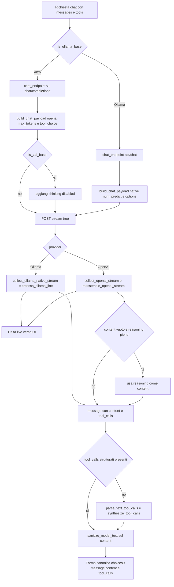

# I/O e normalizzazione dei modelli (L0)

> Verificato vs codice 2026-07-09.
>
> **Stato** — Data: 2026-06-27. Pagina **reverse-engineered** dal codice reale
> (`crates/desktop-gateway/src/main.rs`, `crates/engine/`, `crates/inference/`). È il **punto fermo**
> dello strato fondamentale L0: come ogni modello risponde e come lo riportiamo a una
> forma unica. **Ogni modifica al sottosistema aggiorna questa pagina.**
>
> ⚠️ `main.rs` è un monolite ~59k righe editato di continuo: i riferimenti sono ai
> **simboli/funzioni**, non a numeri di riga (che invecchiano a ogni edit). Ri-grep il
> simbolo, non fidarti di un `main.rs:NNNN`.

## Cosa fa

Questo strato è il **confine di I/O** tra Homun e qualsiasi provider di inferenza: costruisce
la richiesta di chat nella forma giusta per il provider (Ollama native `/api/chat` vs
OpenAI-compat `/v1/chat/completions`), consuma lo streaming token-per-token con timeout
per-chunk, e **riassembla** la risposta — comunque sia fatta — in un'unica forma
non-streaming `choices[0].message` con `{content, tool_calls}`. Lungo la strada normalizza i
quirk dei modelli: risposta finita in `reasoning_content` invece che in `content`,
tool-call emessi come **testo** invece che nel campo strutturato, tag `<think>`/`<tool_call>`
che inquinano il contenuto, e l'output strutturato (`json_schema` → `json_object`) quando il
backend non lo applica davvero. È l'unico posto in cui la varietà dei modelli deve essere
domata prima che l'agent-loop la veda.

## Come funziona OGGI

Il flusso reale di un turno di chat gira nel **loop a round unico guardato** (ADR 0021):
`for round in 0..hard_round_ceiling()` nel percorso agent-loop di `main.rs`, che a ogni round
POSTa la richiesta e chiama uno dei due collector:

1. **Selezione provider** — `is_ollama_base` decide il path dal base URL
   (`ollama.com` o `:11434` → Ollama; tutto il resto → OpenAI-compat). `chat_endpoint`
   calcola l'URL: Ollama → strip di un eventuale `/v1` finale e
   `…/api/chat`; gli altri → `…/chat/completions`. Si usa il **native** per Ollama perché la
   shim OpenAI-compat `/v1` storicamente *droppava* i tool-call in streaming (ollama#12557).

2. **Build payload** — `build_chat_payload` produce due shape diverse. Il budget di output è
   `chat_payload_max_tokens(is_final_round, …)`: **6000** di default, con l'`is_final_round`
   che serve a togliere i tool nell'ultimo round (round finale = sola sintesi, niente tool):
   - **Ollama native**: `{model, messages: to_ollama_messages(...), stream:true,
     keep_alive:"10m", options:{temperature, num_predict:<max_tokens>}}`; i `tools` vanno in
     `payload["tools"]` solo se non è il round finale. `to_ollama_messages`
     converte: content-parts multimodali → `{content, images:[base64]}` (senza prefisso
     `data:`), e arguments dei `tool_calls` da **stringa JSON → oggetto** (il native vuole un
     oggetto). Il `think:true` (traccia `message.thinking` separata) è aggiunto **solo** ai
     modelli thinking noti, via `ollama_thinking_supported` (vedi profilo capacità).
   - **OpenAI-compat**: `{model, messages, temperature, max_tokens:<…>, stream:true}` +
     `tool_choice:"auto"` quando ci sono tools. Per z.ai (`is_zai_base`) si
     aggiunge `thinking:{type:"disabled"}` salvo `HOMUN_ZAI_THINKING=1`.

3. **Streaming + riassemblaggio** — due collector simmetrici producono **la stessa forma**:
   - OpenAI: `collect_openai_stream` bufferizza le righe SSE `data:`,
     emette ogni `delta.content` LIVE alla UI, e a fine stream chiama
     `reassemble_openai_stream` che accumula `content`, `reasoning`
     (`reasoning_content` con alias `reasoning`) e i `tool_calls` per `index` (id/name/args
     concatenati).
   - Ollama: `collect_ollama_native_stream` legge NDJSON; ogni riga passa
     da `process_ollama_line` che streama il `message.content`, accumula la traccia
     `message.thinking` (+ alias `reasoning`/`reasoning_content`) come reasoning **separato**,
     e converte i `tool_calls` via `model_normalize::ollama_tool_call` (arguments oggetto →
     **stringa JSON**, id sintetico `ollama_call_N`). Gestisce sia lo stream sia un singolo
     oggetto non-streamed (tail).
   - Entrambi i collector hanno timeout **per-chunk** (`first_token` generoso, default 300s
     via `HOMUN_MODEL_FIRST_TOKEN_SECS`, poi `idle` più stretto) e **salvano l'output
     parziale** su stallo/errore mid-stream se è già arrivato qualcosa, invece di uccidere il
     turno.

4. **Fallback content vuoto** — in `reassemble_openai_stream`: se `content` è vuoto ma
   `reasoning` no, si usa `reasoning` come content (il dead-end GLM/kimi che "fa sparire la
   risposta"). Se il provider ha ignorato `stream:true` e ha mandato un JSON completo
   (`saw_event=false`), lo si usa così com'è.

5. **Tool-call come testo + sanitize** — quando il `message` riassemblato non ha
   `tool_calls` strutturati, l'agent-loop tenta
   `model_normalize::parse_text_tool_calls`: estrae call Hermes/Qwen
   (`<tool_call>{json}</tool_call>`) e Claude/MiniMax (`<invoke name=…><parameter…>`),
   filtrate ai soli tool **noti**, e le trasforma in struttura via
   `model_normalize::synthesize_tool_calls`. Il `content`
   committato passa sempre da `sanitize_model_text` (ora in `model_normalize`) che spoglia i blocchi
   `<think>`/`<tool_call>`/`<invoke>`/`<function_calls>` e i token spuri (es. minimax).

6. **Output strutturato (deliverable/judge)** — per il JSON forzato (deck, giudici di
   orchestrazione) si usa `response_format`, la cui shape è ora **convergiuta** in un'unica
   funzione pura `local_first_inference::structured_response_format(name, schema)`
   (`crates/inference/src/openai_compat.rs`, F0.6): `Some(schema)` → `json_schema` strict
   (decoding vincolato — il "floor" cross-modello), `None` → `json_object` (che è anche il
   target di degrado dopo un 400). Il provider OpenAI-compat (`build_request_body` nello
   stesso file) prova prima lo strict e **degrada UNA volta a `json_object` su un 400**.
   La stessa funzione è chiamata dal gateway per il deck (`generate_deck_content` — attempts
   `json_schema` → `json_object`) e per il judge (`orchestration_judge_response_format`), con
   parsing **tollerante** a valle (`extract_deck_object`) perché alcuni provider accettano lo
   schema ma non lo *applicano*.



## Perché è così

- **Due path provider (Ollama native vs OpenAI `/v1`)**: la shim `/v1` di Ollama droppava i
  tool-call in streaming (ollama#12557); il native `/api/chat` supporta streaming + tools
  insieme (la strada di Zed). Tenere due shape è il prezzo per avere **token live E tool-call**
  sul tier locale, che è il prodotto (caposaldo 2). Il collector native gestisce comunque il
  caso non-streamed, così resta robusto.
- **Temperatura bassa**: la temperatura della chat arriva dalla richiesta del frontend, ma
  ogni percorso *deterministico* — giudici di completamento step/task, generazione
  strutturata — gira a **0/0.0**: l'harness possiede il control-flow e
  vuole decisioni ripetibili, non creatività (capisaldi 2 e 6). Il deck usa **0.4** (un po' di
  varietà narrativa con schema a vincolare la forma).
- **Fallback tool-as-text**: modelli deboli/locali (minimax via Ollama, alcuni template
  Hermes/Qwen/Claude) emettono i tool-call come **testo** nel loro template invece che nel
  campo strutturato. Senza il parse il loop si bloccherebbe; è il "parsing tollerante
  ovunque" del caposaldo 6, filtrato ai tool noti per non scambiare prosa per una call.
- **Fallback reasoning → content**: i modelli "thinking" (GLM, kimi-code, nemotron) spesso
  finiscono con `finish_reason:stop` e `content` **vuoto**, con tutta la risposta in
  `reasoning_content`. Senza fallback il turno committerebbe una risposta vuota (solo i
  Sources): è model-independent e **supera** l'hack per-provider `thinking:disabled`.
- **Schema downgrade `json_schema` → `json_object`**: lo strict `json_schema` è il floor
  cross-modello (constrained decoding) sui backend che lo applicano (OpenAI, OpenRouter,
  Ollama recente); ma `ollama.com/v1` lo rifiuta con 400 → si degrada una volta a
  `json_object`, **mai** perdendo silenziosamente l'enforcement dove esiste (ADR 0016).

## Contratto

**Forma canonica garantita** in uscita dai collector (consumata invariata dall'agent-loop):

```json
{ "choices": [ { "message": { "role": "assistant",
                              "content": "<string>",
                              "tool_calls": [ /* opzionale, solo se presenti */ ] },
                 "finish_reason": "<string>" } ] }
```

Invarianti:
- `tool_calls` (quando presenti) sono sempre in shape OpenAI: `{id, type:"function",
  function:{name, arguments:<stringa JSON>}}` — anche dal native Ollama (args oggetto →
  stringa, id sintetico) e dal fallback text-tool-call (id `textcall_R_I` / `ollama_call_N`).
- Il `content` committato è **sanitizzato** (`sanitize_model_text`): niente tag
  `<think>`/`<tool_call>`/`<invoke>` residui.
- L'output strutturato (deck/judge) è JSON valido estratto tollerantemente, **non** un
  oggetto necessariamente schema-conforme (vedi divergenze).

**Env / flag**:
- `HOMUN_MODEL_FIRST_TOKEN_SECS` (default 300) — budget primo token.
- `HOMUN_ZAI_THINKING=1` — riattiva il thinking di z.ai (default OFF).
- `HOMUN_INFERENCE_DEBUG` — dump della risposta JSON invalida nel crate inference.
- `keep_alive:"10m"` (Ollama) tiene caldo il modello locale; `num_predict`/`max_tokens` = 6000.

**Casi limite gestiti**:
- **reasoning-only** (`content` vuoto, `reasoning_content` pieno) → si usa il reasoning.
- **content vuoto totale** su stallo/errore con token già arrivati → si salva il parziale.
- **provider ignora `stream:true`** (un solo JSON) → usato as-is (`saw_event=false`; tail
  del collector native).
- **400 su `json_schema`** → retry singolo con `json_object`.
- **tool-call leakati come testo** → parse + synthesize, e content sanitizzato in history.

## Divergenze / debolezze

- **Normalizzazione della RISPOSTA: convergiuta** in `model_normalize` (F0.1–F0.5: builder
  canonico + reasoning-fallback, estrazione `<think>`, tool-call Ollama, `sanitize_model_text`,
  tool-as-text). Restano fuori dal modulo gli stadi di **assemblaggio stream** e **richiesta**
  (`reassemble_openai_stream`, `process_ollama_line`, `to_ollama_messages`, l'hack
  `thinking:disabled`) più le regex nel frontend `ChatView.tsx` — bersagli successivi di ADR 0019.
- **`model_normalize.rs` — cablaggio CONVERGIUTO E COMPLETO (F0, [piano](../plans/2026-06-27-foundations-up-convergence.md);
  modulo ora in `crates/engine/src/model_normalize.rs`):**
  il modulo implementa il pattern canonico SOTA (`Raw* serde-permissivo → Canonical* via
  TryFrom`, "parse don't validate"). Cablato:
  - `parse_plan_propose` (`‹‹PLAN_PROPOSE››`, step stringa-o-oggetto, fix gemma) — step 1 ADR 0019.
  - **`assistant_response`** (F0 increment 1): il **builder canonico** della risposta
    `{choices:[{message,finish_reason}]}` + la regola **reasoning-fallback** ora vivono QUI, e
    sia `reassemble_openai_stream` sia `collect_ollama_native_stream` lo chiamano (la logica
    inline duplicata è stata **cancellata**), 3 test.
  - **Ollama `thinking`** (F0 increment 1b): `process_ollama_line` accumula ora
    `message.thinking` (e `reasoning`/`reasoning_content` per compat) come traccia di
    ragionamento — Ollama native LO espone separato dal `content` per i modelli thinking
    (deepseek-r1, qwen3). Così il reasoning-fallback vale **anche** su Ollama (prima committava
    vuoto). Non streamato come content (è la traccia, non la risposta).
  - **`ollama_tool_call`** (F0 increment 1c): la normalizzazione tool-call di Ollama native
    (omette l'`id`, manda `arguments` come **oggetto** → id sintetico + arguments stringa,
    shape OpenAI-compat) è ora in `model_normalize`, **testata** (2 test: oggetto/stringa/
    mancante), e `process_ollama_line` la chiama (inline cancellato). I tool-call OpenAI
    arrivano già-formati (serve solo il reassembly dei frammenti argomenti, resta nel collector).
  - **`split_reasoning_from_content`** (F0.2): estrae i blocchi `<think>…</think>` /
    `<thinking>…</thinking>` da `content` → `reasoning`, **in `assistant_response`**, così il
    reasoning-fallback recupera la risposta quando il modello mette tutto nel think. **Verifica
    (fonte Ollama + context7):** `message.thinking` si popola SOLO con `think:true` nella
    richiesta — che NON mandiamo (`build_chat_payload`) → i modelli reasoning (deepseek-r1,
    qwen3) emettono inline `<think>…</think>`; prima `sanitize_model_text` li **cancellava**
    (→ risposta vuota se l'intera risposta era nel think). Ora estratti+preservati. 2 test.
    Confermato anche: tool_calls Ollama completi per-chunk + accumulo `extend` = il nostro
    pattern; `arguments` oggetto + niente id = la nostra `ollama_tool_call`.
  - **Profilo capacità Ollama** (F0.3a-d): la **fonte unica** è il catalogo modelli gestito
    dall'utente — `model_registry::ModelEntry` (`vision/tools/reasoning/context_window`) nel
    `ProviderRegistry` (caposaldo #5, niente store parallelo). `warm_ollama_capabilities` legge
    dal catalogo (`registry_model_capabilities`), poi interroga `/api/show` **una volta per
    modello** (`capabilities[]` + `model_info["<arch>.context_length"]`) che **arricchisce** il
    profilo E **auto-compila** l'entry del catalogo (`autofill_model_entry_capabilities` →
    aggiorna `ModelEntry` + salva se cambiato), così la UI di gestione modelli mostra le capacità
    REALI invece delle euristiche da nome. Così
    l'harness **adatta** invece di indovinare (caposaldo #11). **Cablato:** `think:true` solo ai
    thinking; `tools` (non offre tool a chi non li fa); `vision` → vedi sotto. Tutti **fail-safe**:
    profilo sconosciuto/cloud (None) → comportamento di oggi invariato. **Estratto, rimandato:**
    `context_length` (budget sulla finestra reale tocca il prompt-building → increment dedicato +
    validato). 2 test (`parse_ollama_capabilities`, `ollama_native_root`).
  - **Vision — chi GUARDA l'immagine** (`crates/desktop-gateway/src/vision.rs`, 2026-07-14). La
    domanda "questo modello vede?" ha **una sola fonte** (il catalogo, che `/api/show` auto-compila)
    e **tre** risposte: `Yes | No | Unknown`. Il `Unknown` è essenziale: la cache
    `ollama_capabilities` è seminata con `unwrap_or_default()` e inserita comunque, quindi per un
    modello fuori catalogo restituisce un `vision:false` **mai stabilito** — un "non so" travestito
    da "no". Nessun call-site può leggerla per questa decisione.
    - **Screenshot del browser** (`GatewayTurnPolicy::supports_vision`): salta l'immagine solo per
      un modello *noto-cieco*; `Unknown` → la manda (uno screenshot sprecato costa un round; negarlo
      a chi vedeva acceca l'intero turno di browsing).
    - **Allegati dell'utente** (`vision::plan_attachments`) fa il trade-off opposto, perché un
      upload che muore su un 400 è un costo dell'*utente*: `Delegate` (manager noto-cieco → l'immagine
      NON gli arriva: la descrive il modello del ruolo `vision` in un sub-turno isolato — forma
      degenere della ricorsione di ADR 0025, un giro e zero tool — e la descrizione prende il posto
      dell'immagine); `Refuse` (nessuno può vedere → lo diciamo); altrimenti `InlineWithFallback`,
      cioè la manda **con la rete**: `ModelCallError::ImageUnsupported` non viene streammata, il loop
      torna con `TurnOutcome.image_rejection` senza aver emesso nulla e `run_agent_rounds` **rigioca
      il turno** dal seme con le immagini sostituite dalle descrizioni. Invariante: replay **solo** se
      il turno non ha ancora usato tool (altrimenti effetti collaterali doppi).
    - Il manager **non cambia mai modello** (ADR 0025 ha ritirato il model-switch di turno): cambia
      cosa gli arriva. Ruolo `vision` nei Settings (auto-match sui soli modelli vision).
  - **`sanitize_model_text`** (F0.4): spostato in `model_normalize` (+ `strip_tag_blocks`/
    `strip_fullwidth_bar_tokens`) → tutta la normalizzazione testo nel modulo canonico, 1 test.
  - **`parse_text_tool_calls` + `synthesize_tool_calls`** (F0.5): l'ULTIMO pezzo sparpagliato —
    il parsing tool-as-text (Hermes/Qwen `<tool_call>{json}</tool_call>`, Claude/MiniMax
    `<invoke name=…><parameter…>`) — spostato in `model_normalize` con i suoi helper privati
    (`xml_attr_value`, `parse_xml_parameters`). Il "blocco" annotato (helper condiviso) era
    illusorio: `xml_attr_value` è condiviso solo *dentro* il cluster, quindi tutto migra insieme.
    Rimozione che cura anche un doc orfano di `strip_tag_blocks` (riattacca il doc di
    `prune_browser_history`). 4 test. **Ora la frontiera canonica (ADR 0019) possiede OGNI forma
    in cui una call può arrivare — strutturata o trapelata-come-testo** (caposaldo #6/#11).
  - **schema-downgrade floor** (F0.6): la costruzione del `response_format` (strict `json_schema`
    → degrade `json_object`) era hand-rolled in **3 punti** (`build_request_body` nell'inference
    crate, `generate_deck_content` e `orchestration_judge_response_format` nel gateway). Convergiuta
    in **una** funzione pura `local_first_inference::structured_response_format(name, schema)`; tutti
    e 3 i siti la chiamano. Shape identica (refactor behavior-preserving, garantito dai test giudice
    + provider). Resta per-sito SOLO il control-flow di trasporto (async deck vs blocking provider,
    system+user vs prompt-only). 1 test nuovo. Caposaldo #5 / ADR 0016.
  - **`context_length` nel budget prompt** (F0.7): `chat_context_budget_chars` budgetava su un
    flat 32k (solo env `HOMUN_INFERENCE_CONTEXT_WINDOW`), ignorando la finestra reale del modello
    già auto-compilata nel catalogo (F0.3d). Ora il budget segue la finestra REALE
    (`registry_model_capabilities` → `ModelEntry.context_window`): precedenza env-override >
    finestra-catalogo > 32k default; chars = token × 3 (headroom implicito ~25% per system+reply).
    Policy estratta in `resolve_context_budget_chars` (pura, 1 test su 6 casi). Un modello 128k
    tiene la sua storia lunga, un modello locale piccolo è clampato a ciò che legge davvero.
  **L0 = PUNTO FERMO COMPLETO (core + tool-as-text + schema-floor + budget).** Coda L0 esaurita;
  prossimo strato = **F1 (capability unica)**.
- **`json_schema` non enforced ≠ rifiutato**: alcuni provider (es. Ollama Cloud) **accettano**
  lo schema ma non lo applicano (wrappano il deck sotto una chiave, aggiungono campi) → il
  vero floor è il **parsing tollerante** a valle, non l'enforcement. Modelli che ignorano
  `required` non vengono corretti dallo schema.
- **Tool-call testuali fragili**: `parse_text_tool_calls` copre solo i formati Hermes/Qwen e
  Claude/MiniMax noti, con parsing a `find` su stringhe (no nesting profondo, no streaming
  parziale del tag); un formato nuovo è invisibile finché non lo si aggiunge.
- **reasoning scartato vs mostrato**: il `reasoning` è usato come *fallback* del content, ma
  non c'è un canale d'evento separato per il thinking (lo prevede ADR 0019 con
  `TurnEvent::Reasoning`); oggi o sparisce o diventa il content.
- **Quirk per-provider hardcoded**: `is_zai_base` / `thinking:disabled` è un ramo cablato,
  non un registro per-provider documentato.

## Caposaldo servito

- **Caposaldo 2** — l'orchestrazione è dell'harness e deve girare sul **tier locale**: i due
  path provider, lo streaming con salvataggio del parziale e il fallback reasoning servono a
  far funzionare anche modelli deboli/locali senza stampella cloud.
- **Caposaldo 6** — stato e control-flow di codice, il modello riempie slot vincolati:
  output strutturato imposto dove il backend lo supporta (`json_schema`) + **parsing
  tollerante ovunque** (text-tool-call, reasoning-fallback, `extract_deck_object`).
- **Caposaldo 11** — comprensione senza keyword/regex, verità verificabile: il normalizzatore
  canonico (ADR 0019) è la direzione per togliere le regex dal frontend.
- **ADR 0016** — harness-owned task engine cross-modello: il floor `json_schema`→`json_object`
  e la temperatura 0 sui path deterministici.
- **ADR 0019** — NormalizerStage / eventi canonici tipizzati: la coda L0 è **consolidata** in
  `model_normalize` (builder canonico `assistant_response` + reasoning-fallback, estrazione
  `<think>`, `ollama_tool_call`, `sanitize_model_text`, tool-as-text, `parse_plan_propose`).
  Resta come futuro (non ancora nel codice) il **canale d'evento separato** per il reasoning
  (`TurnEvent::Reasoning`): oggi il reasoning è solo fallback del content, non un evento a sé.

## File chiave

- `crates/desktop-gateway/src/main.rs` (monolite ~59k righe — ri-grep i simboli, no line-ref):
  - `reassemble_openai_stream`, `collect_openai_stream`
  - `is_ollama_base`, `is_zai_base`, `chat_endpoint`
  - `to_ollama_messages`, `process_ollama_line`, `collect_ollama_native_stream`
  - `build_chat_payload`, `chat_payload_max_tokens` (budget output = 6000 default)
  - `ollama_thinking_supported`, `warm_ollama_capabilities`, `registry_model_capabilities`,
    `autofill_model_entry_capabilities` (profilo capacità Ollama)
  - `resolve_context_budget_chars`, `chat_context_budget_chars` (budget prompt su finestra reale)
  - `orchestration_judge_response_format`, `extract_deck_object`, `generate_deck_content`
  - il loop a round unico guardato: `for round in 0..hard_round_ceiling()` (ADR 0021)
  - `build_browser_inference_router`
- `crates/engine/src/model_normalize.rs` — **normalizzatore canonico CABLATO** (ADR 0019;
  modulo **rilocato** nel crate engine con ADR 0024 inc. 5e.3, non più in `desktop-gateway`):
  `assistant_response`, `split_reasoning_from_content`, `ollama_tool_call`, `sanitize_model_text`,
  `parse_text_tool_calls` + `synthesize_tool_calls`, `parse_plan_propose` (+ `crates/engine/src/markers.rs`)
- `crates/desktop-gateway/src/model_registry.rs` — `infer_context_window`, `ModelEntry`
  (`vision/tools/reasoning/context_window`), shape provider/role
- `crates/inference/src/openai_compat.rs` — `structured_response_format` (la **singola**
  definizione del floor `json_schema`→`json_object`), `build_request_body` / schema-downgrade
- `crates/inference/src/router.rs` — `ModelRouter`, `select`, `active_context_window`
- `docs/decisions/0016-harness-owned-task-engine-cross-model.md`
- `docs/decisions/0019-model-output-normalizer-canonical-events.md`
- `docs/CAPISALDI.md`
