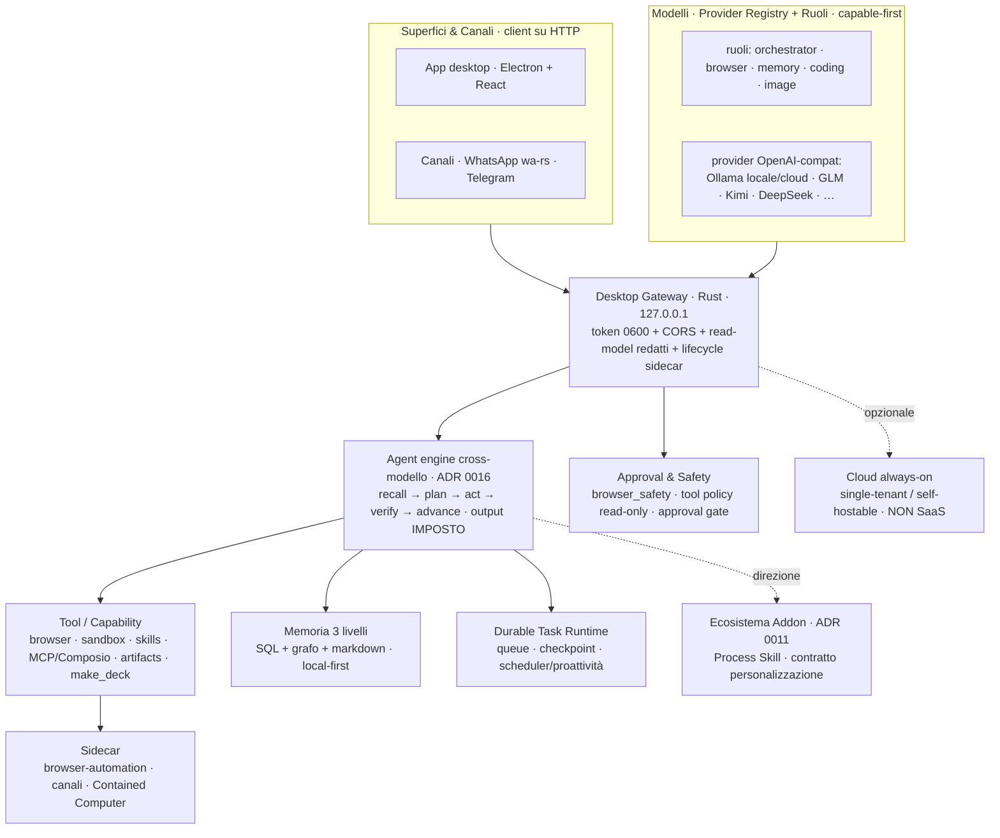

# Architettura — quadro d'insieme

> Diagramma vivo (aggiornato 2026-06-22). Sostituisce il vecchio poster SVG
> (`Desktop/homun-architecture.svg`, datato: MLX/Gemma-fallback, loop non
> cross-modello). Dettagli: [agent-loop](agent-loop.md) · [memory](memory.md) ·
> [plugins](plugins.md) · [system-map](system-map.md). Un poster SVG rifinito si
> rigenera su richiesta.

## Bande (cosa fa ciascuna)

- **Superfici & Canali**: client su HTTP verso il gateway; canali offline-resilient.
- **Modelli**: registry + **ruoli** (binding auto/esplicito), qualunque API
  OpenAI-compatibile; **local-first** (daemon Ollama) e cloud come *scelta*.
- **Gateway** (Rust, loopback): sicurezza (token, CORS, read-model redatti), spawn +
  lifecycle dei sidecar.
- **Agent engine** ([agent-loop](agent-loop.md)): il motore cross-modello — uno solo,
  condiviso da chat/canali/automazioni.
- **Capability / Tool** ([plugins](plugins.md)): cosa l'agente può fare.
- **Memoria** ([memory](memory.md)): il differenziatore, 3 livelli.
- **Task Runtime · Safety · Sidecar · Addon · Cloud**: esecuzione durevole, governo,
  contenimento, estensibilità, always-on opzionale.
