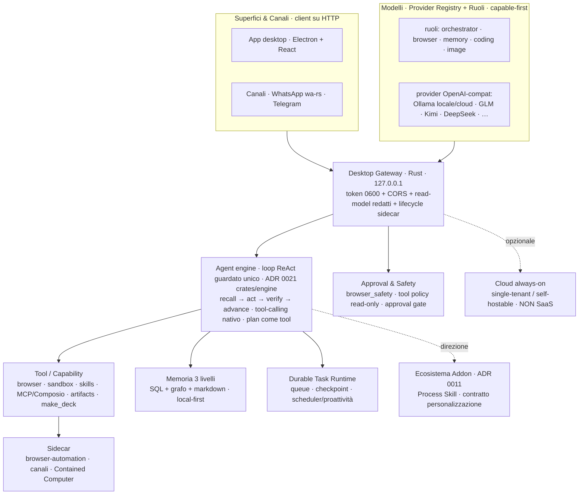

# Architettura — quadro d'insieme

> ⚠️ **Freschezza (2026-07-09):** queste mappe sono reverse-engineered a giugno 2026 e **precedono**
> la fase *turn-broker + unified WebSocket* (ora su `main`): il **path di richiesta** reale oggi è
> coda-turni + executor + `/api/ws`, che qui NON è ancora disegnato. Nel frattempo sono atterrate
> **ADR 0024 (estrazione del motore, 2026-07-08)** — il singolo loop guardato vive ora in
> `crates/engine` (`engine::agent_loop::run_turn`), non più inline in `main.rs`, senza flag — e
> **ADR 0025 (browse-as-recursion, 2026-07-09)**: un solo `browse(goal)` che ricorre in un sub-turno
> del motore. Inoltre molti riferimenti a
> riga (`main.rs:NNNN`) sono **stantii** (main.rs ≈58.9k righe, riscritto spesso): **ri-grep il
> simbolo, non fidarti del numero**. Le mappe restano utili per la *forma* dei sottosistemi; la
> ri-verifica contro il codice post-broker/WS è lavoro aperto (vedi [STATO.md](../STATO.md)).
>
> Diagramma vivo (aggiornato 2026-06-22). Sostituisce il vecchio poster SVG
> (`Desktop/homun-architecture.svg`, datato: MLX/Gemma-fallback, loop non
> cross-modello). Dettagli: [agent-loop](agent-loop.md) · [memory](memory.md) ·
> [plugins](plugins.md) · [system-map](system-map.md). Un poster SVG rifinito si
> rigenera su richiesta.

## Bande (cosa fa ciascuna)

- **Superfici & Canali**: client su HTTP verso il gateway; canali offline-resilient.
- **Modelli**: registry + **ruoli** (binding auto/esplicito), qualunque API
  OpenAI-compatibile; **local-first** (daemon Ollama) e cloud come *scelta*.
- **Gateway** (Rust, loopback): sicurezza (token, CORS, read-model redatti), spawn +
  lifecycle dei sidecar.
- **Agent engine** ([agent-loop](agent-loop.md)): il motore cross-modello — uno solo,
  condiviso da chat/canali/automazioni.
- **Capability / Tool** ([plugins](plugins.md)): cosa l'agente può fare.
- **Memoria** ([memory](memory.md)): il differenziatore, 3 livelli.
- **Task Runtime · Safety · Sidecar · Addon · Cloud**: esecuzione durevole, governo,
  contenimento, estensibilità, always-on opzionale.
