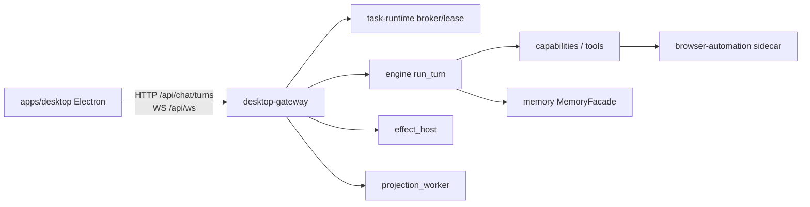

# Quadro d’insieme (as-built)

Verificato 2026-07-31 contro `Cargo.toml`, `crates/*`, `apps/desktop`.

## Forma del prodotto

- **UI:** Electron + React in `apps/desktop` (Vite `:1420` in dev).
- **Gateway:** crate `local-first-desktop-gateway` — HTTP/WS su `127.0.0.1:18765`
  (`HOMUN_DESKTOP_GATEWAY_HOST` / `_PORT`).
- **Motore agentico:** crate `local-first-engine` — unico loop
  `agent_loop::run_turn` (ADR 0024 completa).
- **Esecuzione durevole:** `local-first-execution-protocol` + `local-first-task-runtime`
  + host/effect/projection nel gateway.
- **Memoria:** `local-first-memory` → di default `{HOMUN_DATA_DIR|~/.homun}/memory.sqlite`.
- **Sidecar:** `runtimes/browser-automation`, `contained-computer`, canali, ecc.

```mermaid
flowchart LR
  UI[apps/desktop Electron] -->|HTTP /api/chat/turns<br/>WS /api/ws| GW[desktop-gateway]
  GW --> RT[task-runtime broker/lease]
  GW --> ENG[engine run_turn]
  ENG --> CAP[capabilities / tools]
  ENG --> MEM[memory MemoryFacade]
  GW --> EFF[effect_host]
  GW --> PROJ[projection_worker]
  CAP --> SIDE[browser-automation sidecar]
```

## Workspace Cargo (`local-first-*`)

| Crate path | Package name | Ruolo osservato |
| --- | --- | --- |
| `execution-protocol` | `local-first-execution-protocol` | DTO contract/outcome/receipt |
| `engine` | `local-first-engine` | Loop ReAct + HITL + browse contract |
| `task-runtime` | `local-first-task-runtime` | Queue, store, lease, outbox |
| `desktop-gateway` | `local-first-desktop-gateway` | HTTP, WS, host, tools, monolite `main.rs` |
| `memory` | `local-first-memory` | Store + facade + recall/learn |
| `capabilities` | `local-first-capabilities` | Registry/policy capability |
| `orchestrator` | `local-first-orchestrator` | Brain ancora usato per materializzare task (non è il chat loop) |
| `vault` / `secrets` | … | Vault / secret storage |
| `inference` / `inference-usage` | … | Provider / usage |
| `browser-automation` | … | Binding Rust verso sidecar |
| `host-computer` | … | Helper macOS host |
| `skill-runtime` / `process-skill` | … | Skills |
| `subagents` / `context-compression` / `process-manager` / `local-computer-session` | … | Supporto |

`main.rs` del gateway è ancora ~89k righe: pezzi estratti in moduli
(`execution_host`, `effect_host`, `turn_executor`, `projection_worker`, …) ma il
file resta il centro di massa.

## Porte e versione

| Cosa | Valore |
| --- | --- |
| Gateway | `127.0.0.1:18765` |
| Vite | `:1420` |
| Versione UI | `apps/desktop/package.json` → `0.1.1094` (al reset) |
| Workspace Cargo version | `0.1.0` in root `Cargo.toml` |

## Invariante runtime

Un solo protocollo di esecuzione tipizzato:

`ExecutionContract` → `ExecutionHost` / adapter → `ExecutionOutcome`

(+ effect receipt + projection outbox). Niente secondo agent loop per la chat.
Vedi [`execution.md`](execution.md) e [`agent-loop.md`](agent-loop.md).
