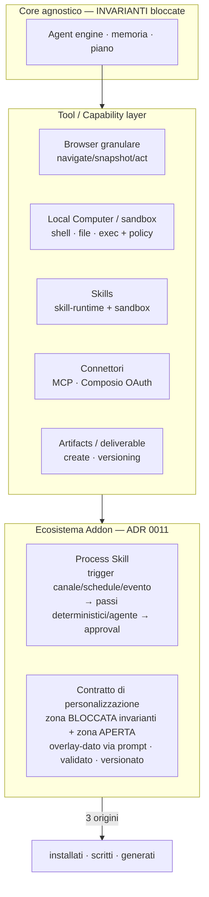
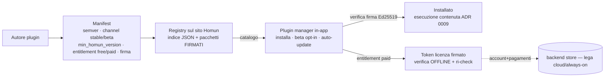

# Architettura — Skill, Capability & Addon

> Diagramma vivo. Decisioni: [ADR 0011 (core agnostico + ecosistema addon)](../decisions/0011-agnostic-core-addon-ecosystem.md),
> [ADR 0009 (capability execution containment)](../decisions/0009-capability-execution-containment.md),
> [ADR 0013 (connector auth & routing)](../decisions/0013-connector-auth-and-capability-routing.md).

## Principio

**Core agnostico** (invarianti bloccate) + **ecosistema addon** sopra. Le capability
sono "cosa l'agente può fare"; le skill/plugin estendono il comportamento senza
toccare il core. Tre origini per gli addon: **installati · scritti · generati**.

## La pila

## Skill vs Plugin (forma)

- **Skill** = istruzioni + risorse che il modello carica via `use_skill` (oggi
  prosa; in evoluzione: skill **dichiarative** → workflow runner, ADR 0016 Fase 3).
  Seeding in `~/.homun/skills/`; *gotcha noto*: una skill editata a mano (hash
  desync) non viene più auto-aggiornata → da irrobustire (WS4).
- **Plugin / Addon** (ADR 0011) = capability + Process Skill + contratto di
  personalizzazione (upgrade-safe: manutenzione centrale, overlay-dato dell'utente).

## Esecuzione contenuta (ADR 0009/0010)

Le capability rischiose girano **contenute**: sandbox skill, `ShellCommandPolicy`,
**Contained Computer** (Linux containerizzato: browser reale + shell per
verify-by-execution del codice). Approval gate per le azioni rischiose; contenuto =
**dato**, mai istruzioni.

## Distribuzione & ciclo di vita (WS9 — futuro vicino)

Da "app con plugin" a **piattaforma**: ogni plugin ha versioning proprio, canali,
è scaricabile dal **sito Homun** e si auto-aggiorna; alcuni saranno **a pagamento**.

- **Versioning/compat**: semver + `min_homun_version` (come `engines` di VS Code).
- **Canali**: stable (firmato/revisionato) · beta (opt-in per-plugin).
- **Sicurezza**: firma verificata all'install/update; contenimento + `skill_security`.
- **Paid**: predisporre ora (`entitlement` + token firmato offline); paywall dopo
  (account + pagamenti = cloud/always-on).

## Direzione

North-star prodotto = deliverable in stile **Manus** per le PMI (presentazioni →
documenti → ricerca…), come **workflow dichiarativi** che il runtime guida e il
modello riempie. Vedi [agent-loop.md](agent-loop.md) (Fase 3) e il
[backlog](../plans/2026-06-22-batch-1042-artifacts-memory.md).
