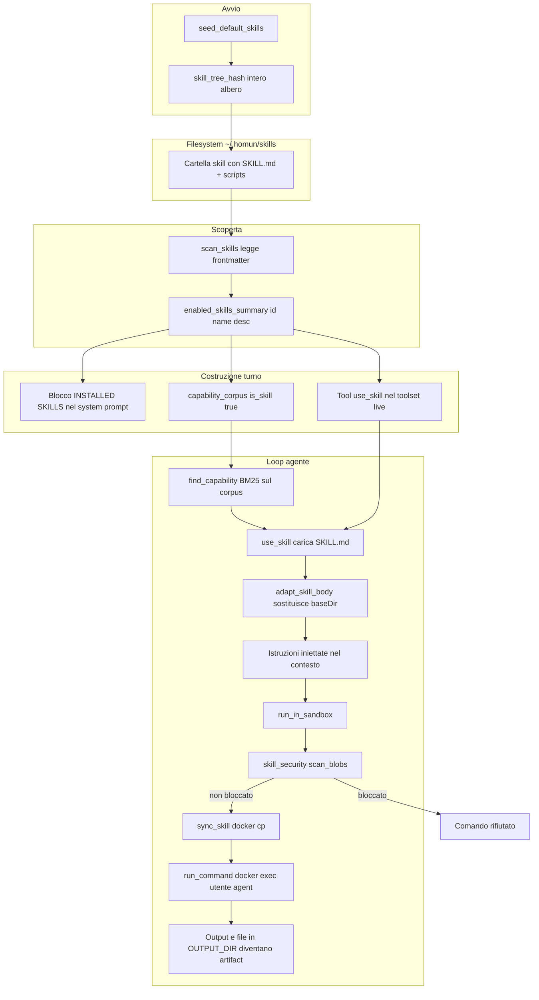

# Architettura — Skills (Agent Skills, cartelle `SKILL.md`)

> Verificato vs codice 2026-07-06.
>
> Stato: **2026-06-27**, documento *reverse-engineered* dal codice reale, **punto
> fermo** (descrive com'è OGGI, non com'è disegnato in futuro). Sottoinsieme del
> caposaldo #7 (registry unico) e legato a [plugins.md](plugins.md) /
> [CAPISALDI.md](../CAPISALDI.md). Decisioni correlate: ADR 0009 (esecuzione
> contenuta), ADR 0011 (core agnostico + addon), ADR 0016 (skill dichiarative,
> fase 3, **non** ancora implementata).

## Cosa fa

Il sottosistema **Skills** porta in Homun il formato *Agent Skills* di Anthropic:
una skill è una **cartella** con un file `SKILL.md` (frontmatter YAML +
istruzioni Markdown) più eventuali script/asset (`scripts/`, dati). Le skill
vivono sotto `~/.homun/skills/<id>/` e servono a estendere il comportamento
dell'agente **senza toccare il core agnostico**.

Concretamente il sottosistema:

- **scopre** le skill installate scansionando la cartella (`skills::scan_skills`);
- **semina** all'avvio le skill di default bundled (metodologia *HomunCoder*) in
  modo non distruttivo e auto-aggiornante (`seed_default_skills`);
- **espone** ogni skill abilitata al modello come riga `id: name — description`
  nel system prompt (progressive disclosure L1) e dentro il corpus
  `find_capability` (BM25);
- quando il turno **carica** una skill, inietta il corpo completo di `SKILL.md`
  via il tool `use_skill` (L2), adattando i path (`adapt_skill_body`);
- **esegue** i comandi della skill nella *contained computer* (Docker) via
  `run_in_sandbox`, previo **scan di sicurezza statico** (`skill_security`).

Punto chiave: la skill **non è una capability eseguibile** con uno schema di
tool proprio. È **istruzioni iniettate** nel contesto + esecuzione opportunistica
via il sandbox generico. (Il provider tipato `SkillCapabilityProvider` che modellava
la skill come tool chiamabile è stato **rimosso** in F1.b — era un errore di categoria;
nel crate `capabilities` resta solo il *modello di metadati* skill/plugin, non un
percorso di esecuzione. Vedi Divergenze.)

## Come funziona OGGI

### Percorsi di codice (file:line)

Scoperta / management (read-only, per UI e prompt):
- `crates/desktop-gateway/src/skills.rs:19` `skills_root` → `<data_dir>/skills`.
- `crates/desktop-gateway/src/skills.rs:82` `split_frontmatter` — parser YAML
  ad-hoc (solo chiavi note: `name`, `description`, `license`, `version`,
  `allowed-tools`; gestisce block scalar `|`/`>`, liste, quote).
- `crates/desktop-gateway/src/skills.rs:271` `scan_skills` — una `SkillSummary`
  per cartella con `SKILL.md`, ordinate per nome, esclude `.`-dir.
- `crates/desktop-gateway/src/skills.rs:322` `load_detail` — summary + body +
  file-tree (cap depth 4 / 300 nodi); `is_safe_id` (`:348`) blocca traversal.
- `crates/desktop-gateway/src/main.rs` `skills_dir` → `~/.homun/skills` (via
  `gateway_data_dir`).

Seeder + hashing dell'albero (auto-update non distruttivo):
- `crates/desktop-gateway/src/main.rs` chiama `seed_default_skills()` all'avvio.
- `crates/desktop-gateway/src/main.rs` `default_skills_dir` — sorgente bundled
  (`resources/default-skills`, override `HOMUN_DEFAULT_SKILLS_DIR`).
- `crates/desktop-gateway/src/main.rs` `skill_tree_hash` — hash
  **non-crittografico** (`DefaultHasher`) sull'**intero albero** (path + bytes di
  ogni file, ordinati), non solo `SKILL.md`: così un update di script/asset
  bundled è rilevato. Richiede la presenza di `SKILL.md` o ritorna `None`.
- `crates/desktop-gateway/src/main.rs` `seed_default_skills` — record
  per-skill `id<TAB>hash` in `.seeded-defaults`: installa nuovi default,
  **aggiorna** un default solo se l'utente NON l'ha editato (hash on-disk ==
  hash seminato), rispetta cancellazioni e edit utente; migra dal vecchio marker
  one-shot `.defaults-seeded`. Unisce il manifest `homuncoder-skills.txt`.

Esposizione al modello (prompt L1 + corpus capability):
- `crates/desktop-gateway/src/main.rs` `enabled_skills_summary` — `(id, name,
  desc)` delle skill abilitate.
- `crates/desktop-gateway/src/main.rs` `homuncoder_skill_ids` — le ~30 skill di
  metodologia, mostrate SOLO nelle chat di progetto.
- `crates/desktop-gateway/src/main.rs` blocco `INSTALLED SKILLS` nel system
  prompt: una riga per skill + istruzione "use them and call `use_skill`"; nelle
  chat progetto si aggiunge il blocco METHODOLOGY (HomunCoder).
- `crates/desktop-gateway/src/main.rs` le skill abilitate entrano nel
  `capability_corpus` con `is_skill: true`, `schema: None`.
- `crates/desktop-gateway/src/main.rs` se ci sono skill, il tool `use_skill`
  viene aggiunto al toolset live (`use_skill_tool_schema`).

`find_capability` (registry unico, BM25):
- `crates/desktop-gateway/src/main.rs` handler `find_capability`:
  `bm25_rank(&capability_corpus, &intent, 6)`. Per una skill emette
  `skill «id»: desc → load it with use_skill("id")` — **non** carica uno schema
  (le skill non hanno tool), a differenza dei tool nativi/MCP che vengono attivati
  nel toolset live.

Caricamento / iniezione nel loop (progressive disclosure L2):
- `crates/desktop-gateway/src/main.rs` handler `use_skill`: legge `id`, narra
  `‹‹ACT›› Using the skill «...»`, poi `load_skill_body(id)`.
- `crates/desktop-gateway/src/main.rs` `load_skill_body` → `load_detail` +
  `adapt_skill_body`.
- `crates/desktop-gateway/src/main.rs` `adapt_skill_body` — sostituisce
  `{baseDir}`/`${baseDir}`/`$BASEDIR`… con `sandbox::container_skill_dir(id)`
  (`sandbox.rs:66` → `/home/agent/skills/<id>`).
- Il body (cap 8000 char) torna al modello come messaggio "Instructions for the
  skill … FOLLOW THEM": **istruzioni iniettate**, il loop prosegue normale.

Esecuzione + security scan:
- `crates/desktop-gateway/src/main.rs` handler `run_in_sandbox`: prima di
  eseguire, `skill_security::scan_blobs([(command)])`; se `scan.blocked` il
  comando NON parte.
- `crates/desktop-gateway/src/main.rs` deriva lo `skill_id` dal path
  `/home/agent/skills/<id>/…` (`skill_id_from_command`) se omesso, fa
  `sandbox::sync_skill` (`sandbox.rs:671`, `docker cp` dell'albero skill nel
  container) e poi `sandbox::run_command` (`sandbox.rs:691`, `docker exec` come
  utente non-root `agent`, timeout 60s, output cap 8000). I file generati vanno
  in `$OUTPUT_DIR` bind-montato → diventano artifact scaricabili.
- `crates/desktop-gateway/src/skill_security.rs:340` `scan_blobs` /
  `:349` `scan_dir`: regole substring + combo (pipe-to-shell, base64, netcat -e),
  severità Critical(55)/Warning(18), `BLOCK_THRESHOLD=60`, `blocked` se c'è un
  Critical o il punteggio supera la soglia. Usato anche in preflight prima
  dell'install dal catalogo.

Catalogo / install (ClawHub):
- `crates/desktop-gateway/src/skills_catalog.rs` — fetch del registry ClawHub
  (`clawhub.ai`), cache locale (6h), categorizzazione per keyword (`:78`),
  `search` BM25-like (`:251`), `download_zip` (`:296`), `extract_zip` con guardia
  traversal/size (`:348`). Preflight di sicurezza via `read_zip_text_files` +
  `skill_security::scan_blobs`.

### Diagramma



## Perché è così

- **Progressive disclosure (L1 → L2).** Pre-caricare solo `id: name —
  description` tiene il prompt magro; il corpo completo di `SKILL.md` arriva solo
  on-demand via `use_skill`. È l'approccio di Claude Code / Anthropic Agent Skills
  e serve direttamente il caposaldo #7 ("registry grande, toolset live piccolo").
- **La skill è dato, non istruzioni privilegiate.** Una skill è testo + script
  che il modello *segue/esegue*. Per questo l'esecuzione è **contenuta** (Docker,
  utente non-root, timeout) e preceduta da uno **scan statico** (ADR 0009):
  contenuto inaffidabile non deve poter fare danni né dirottare il system prompt
  (categoria `PromptInjection` nello scanner).
- **Seeder non distruttivo + hash dell'albero.** Spedire la metodologia di
  default senza mai clobberare una skill editata a mano richiede di distinguere
  "default che abbiamo seminato e l'utente non ha toccato" (→ aggiornabile) da
  "default editato/cancellato" (→ rispettato). L'hash dell'**intero albero** (non
  solo `SKILL.md`) coglie anche update di script bundled.
- **Formato cartella standard.** Adottare lo stesso shape di `~/.claude/skills`
  rende ogni skill della community installabile senza adattatori, e abilita il
  catalogo ClawHub come fonte di install.
- **Niente schema-tool per le skill.** Una skill non è un'azione atomica con
  input tipato: il "come si esegue" sta nelle sue istruzioni in prosa, materializzate
  dai tool generici `run_in_sandbox` (shell) / browser / artifact. Evita di
  inflazionare il toolset e mantiene il routing nel registry unico.

## Contratto

### Struttura `SKILL.md`

```
---
name: weather               # display name (fallback: id = nome cartella)
description: |               # ciò che il MODELLO legge per decidere se usarla (L1)
  Fetch the weather for a city and summarize it.
version: 1.0.0              # opzionale
license: MIT                # opzionale
allowed-tools: [Read, Bash] # opzionale (parsato ma NON enforced nel gateway)
---
# Corpo Markdown: istruzioni operative.
# Può referenziare {baseDir}/scripts/x.py → risolto a /home/agent/skills/<id>/...
```

- **id** = nome della cartella (slug stabile, validato `is_safe_id`).
- Solo le chiavi note sono parsate; YAML arbitrario è ignorato. Frontmatter
  assente → tutto il file è body.
- File/asset extra (script, dati) sono ammessi; il file-tree è cap a depth 4 /
  300 nodi per la UI.

### Come la skill influenza il turno

1. **L1 (sempre):** riga `id: name — desc` nel blocco `INSTALLED SKILLS` del
   system prompt + entry `is_skill` nel `capability_corpus`. Le skill HomunCoder
   compaiono solo nelle chat di **progetto**.
2. **Selezione:** il modello chiama `use_skill(id)` direttamente, oppure passa
   per `find_capability(intent)` che gliela suggerisce.
3. **L2 (on-demand):** il body di `SKILL.md` (≤8000 char, `{baseDir}` risolto)
   viene **iniettato** come messaggio "FOLLOW THEM". Non è un workflow né una
   capability con control-flow proprio: è prosa che guida i tool successivi.
4. **Esecuzione:** i comandi della skill girano via `run_in_sandbox` nella
   contained computer; i file vanno in `$OUTPUT_DIR` → artifact.

### Sicurezza

- **Scan statico** (`skill_security`): substring + combo rules su 6 categorie
  (Destructive, PrivilegeEscalation, SecretAccess, RemoteExecution, Obfuscation,
  PromptInjection). Risk 0–100; `blocked` se Critical o ≥60.
- **Gate runtime:** ogni `run_in_sandbox` riscansiona il **comando** prima
  d'eseguirlo; bloccato → comando non eseguito.
- **Preflight install:** lo ZIP del catalogo è scansionato prima di estrarre;
  `extract_zip` blocca path-traversal e entry oversize.
- **Containment:** `docker exec` come utente `agent` non-root, timeout 60s,
  output cap; nessuna esecuzione sull'host.

## Divergenze / debolezze

- **~~Doppio modello di skill~~ → RISOLTO (F1.b, 2026-06-28).** C'era un secondo
  percorso di **esecuzione** tipato: `SkillCapabilityProvider` (in `skill_plugin.rs`)
  esponeva i tool del manifest come capability chiamabili, ma `call_tool` ritornava
  **sempre** `skill_execution_unavailable` — un errore di categoria (una skill è prosa
  che il modello *segue*, non un tool tipato; vedi *Perché è così*). Il provider e il suo
  costruttore `enabled_skill_providers` sono stati **rimossi**: l'**unico** percorso di
  esecuzione skill è quello filesystem del gateway (`skills.rs` + `use_skill` +
  `run_in_sandbox`). Il modello **tipato di metadati** (`SkillManifest`,
  `SkillInstallRecord`, trust/scoping, `manifest_hash`, plugin manifests) **resta** in
  `skill_plugin.rs` come *store di soli metadati* — la fondazione futura per la
  distribuzione firmata (plugins.md WS9), **non** un provider di esecuzione parallelo.
  Caposaldo #5 ripristinato sul lato esecuzione. *(Nota: lo store metadati è ancora una
  SQLite separata e non cablata; il suo eventuale wiring/convergenza è lavoro plugins/WS9,
  fuori da F1.)*
- **`allowed-tools` non enforced.** Il frontmatter è parsato ed esposto ma il
  gateway non lo usa per restringere i tool concessi alla skill.
- **Hash di seeding non-crittografico.** `skill_tree_hash` usa `DefaultHasher`
  (anti-collisione debole, non stabile tra versioni di Rust): va bene per change
  detection, **non** per integrità/firma. La distribuzione firmata (Ed25519,
  plugins.md WS9) è ancora futura.
- **Scoping a una sola dimensione (enabled/disabled globale).** Il gateway gestisce
  abilitazione via set `disabled` su file, non per `workspace_id`/`user_id` come
  il modello tipato; l'unico scoping reale è "HomunCoder solo in chat progetto".
- **Security scan keyword-based.** Substring/combo senza regex né analisi
  semantica: facile da evadere con offuscamento non in lista; è un guardrail, non
  una sandbox di sicurezza. Il vero contenimento è Docker.
- **Cap a 8000 char sul body** iniettato: skill con `SKILL.md` lunghi vengono
  troncate silenziosamente.
- **Addon / Process Skill dormienti.** Il crate `process-skill` (ADR 0011:
  trigger → steps → approval + contratto di personalizzazione) è il livello
  "plugin/addon" sopra le skill, ma i relativi tool sono off di default
  (`HOMUN_ADDONS=1`, `main.rs`). Le skill `SKILL.md` di oggi sono solo il
  pezzo "istruzioni + risorse", non l'addon completo.
- **Skill dichiarative (ADR 0016 Fase 3) non implementate:** oggi le skill sono
  prosa eseguita opportunisticamente, non workflow runner.

## Caposaldo servito

- **#7 — Capability activation da registry unico.** Le skill entrano nello stesso
  `capability_corpus` di workflow nativi, MCP e tool atomici; il routing è
  retrieval/decisione strutturata (BM25 in `find_capability`), il toolset live
  resta minimo (solo `use_skill` + ciò che serve), e le keyword (catalogo,
  scanner) sono prefilter/guardrail, non verità di routing.
- Concorre anche al **#5/#6** (lo stato e il control-flow restano del codice: la
  skill non muove il piano, è prosa che il loop segue) e a **ADR 0009/0011**
  (esecuzione contenuta + ecosistema addon sopra il core agnostico).

## File chiave

- `crates/desktop-gateway/src/skills.rs` — scanner + parser frontmatter +
  file-tree (management read-only).
- `crates/desktop-gateway/src/main.rs` — grep i simboli (`main.rs` è ~59k righe
  e cambia di continuo): `seed_default_skills`, `skill_tree_hash`,
  `enabled_skills_summary`, prompt L1 (`INSTALLED SKILLS`), corpus
  (`capability_corpus`, `is_skill: true`), `use_skill`/`load_skill_body`/
  `adapt_skill_body`, `run_in_sandbox`, `find_capability`.
- `crates/desktop-gateway/src/skill_security.rs` — scan statico (regole, score,
  block threshold).
- `crates/desktop-gateway/src/skills_catalog.rs` — catalogo ClawHub (fetch,
  cache, search, download/extract, preflight).
- `crates/desktop-gateway/src/sandbox.rs` — `container_skill_dir` (`:66`),
  `sync_skill` (`:671`), `run_command` (`:691`), contained computer.
- `crates/desktop-gateway/src/process_skills.rs` — bridge addon (process-skill).
- `crates/capabilities/src/skill_plugin.rs` — store SQLite di **soli metadati**
  skill/plugin (`SkillManifest`, `SkillInstallRecord`, `PluginManifest`, trust/scoping).
  Il provider di esecuzione `SkillCapabilityProvider` è stato rimosso (F1.b); lo store
  metadati resta come fondazione futura (plugins.md WS9), non cablato nel loop live.
- `crates/capabilities/src/types.rs` — `SkillManifest`, `SkillInstallRecord`,
  `manifest_hash` (`:567`).
- `crates/process-skill/src/lib.rs` — addon (trigger/steps/approval + contratto),
  livello sopra le skill.
- `resources/default-skills/` — skill bundled (metodologia HomunCoder) +
  `homuncoder-skills.txt`.
- Documenti: `docs/architecture/plugins.md`, `docs/CAPISALDI.md` (#7).
