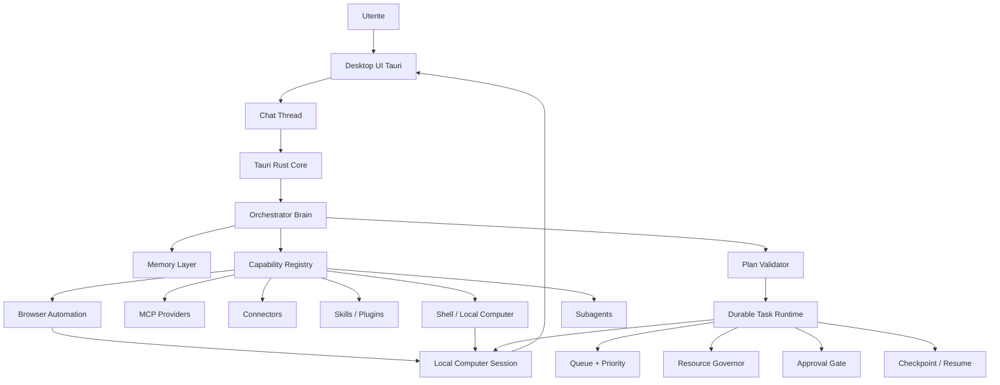

# System Map

Questo documento e' la mappa operativa del progetto. Va tenuto aggiornato insieme a
`docs/work-memory.md` quando cambiano scopo, componenti, responsabilita' o ordine di
implementazione.

## Scopo Prodotto

L'obiettivo e' costruire un assistente personale local-first, desktop-first e
multilingua che possa:

- capire richieste naturali senza regex o keyword locali;
- scegliere uno o piu' strumenti, MCP, connettori, skill, browser, shell o
  subagenti;
- eseguire task brevi, lunghi o di piu' giorni con coda, priorita', checkpoint e
  recovery;
- mostrare all'utente cosa sta facendo tramite Chat, Task UI e Local Computer;
- proteggere dati, privacy, risorse locali e azioni rischiose con policy e
  approval gate;
- apprendere abitudini e proporre automatismi solo dopo che gli eventi reali del
  computer saranno affidabili.

Non e' una semplice chat con tool. La chat e' solo la superficie utente. Il cuore
del prodotto e' il ciclo: comprensione, pianificazione, esecuzione governata,
osservabilita', memoria e apprendimento.

## Flusso Principale

## Componenti E Responsabilita'

### Desktop UI

Responsabilita':

- offrire la chat operativa, la lista thread, task, approval, settings,
  connettori, memoria, browser e apprendimento;
- mostrare read model UI-safe e progress disclosure;
- inviare prompt e comandi al Tauri Core.

Non deve:

- decidere quale tool usare;
- interpretare richieste naturali con regex o keyword;
- eseguire direttamente browser, shell, MCP o connettori;
- esporre raw payload, segreti o dati sensibili.

Stato attuale:

- shell Tauri/React creata;
- chat operativa creata;
- thread separati e nuova chat funzionanti;
- Local Computer card e dettaglio UI esistenti;
- alcune viste sono ancora mock o parzialmente cablate.

### Chat Thread

Responsabilita':

- mantenere il contesto conversazionale di una richiesta o task;
- collegare ogni thread a una Local Computer Session;
- impedire contaminazione tra prompt, timeline, terminal output e artifact.

Stato attuale:

- `create_chat_thread` crea un thread e una sessione computer isolata;
- la UI conserva messaggi separati per thread;
- il core espone snapshot thread.

### Tauri Rust Core

Responsabilita':

- essere il boundary locale tra UI e runtime;
- possedere policy, read model, command e validazione;
- coordinare Brain, task runtime, memoria, capability, processi e sessione
  computer.

Non deve:

- delegare decisioni di sicurezza al frontend;
- salvare raw prompt nei read model;
- usare API cloud per default.

Stato attuale:

- bridge Tauri con command per status, health, task, memory, capability, Local
  Computer, prompt e chat thread;
- stato ancora in-memory per varie parti desktop, da rendere persistente in
  seguito.

### Orchestrator Brain

Responsabilita':

- comprendere la richiesta in modo language-agnostic;
- produrre intenzioni strutturate e piani validati;
- selezionare tool tramite registry compatto e lazy detail;
- decidere se rispondere direttamente, usare memoria, usare capability,
  delegare a subagenti o accodare lavoro durevole.

Non deve:

- essere solo un prompt wrapper;
- vedere tutti i tool completi sempre;
- bypassare policy, approval o resource governor.

Stato attuale:

- prompt understanding via Gemma locale JSON validato;
- route per risposta diretta, ora locale, calcolo locale, pianificazione,
  chiarimento e rifiuto;
- planner prompt-level che genera `PromptExecutionPlan`;
- Orchestrator Brain completo con tool selection multi-step ancora da chiudere.

### Durable Task Runtime

Responsabilita':

- gestire task indipendenti, workflow e task lunghi;
- applicare queue, priorita', dipendenze, retry, checkpoint, lease e recovery;
- usare Resource Governor prima dell'esecuzione;
- usare Approval Gate per azioni rischiose;
- esporre read model UI-safe.

Stato attuale:

- crate `crates/task-runtime` implementato e testato;
- supporta priorita', stati, resource reservations, approval, checkpoint,
  scheduler, lease recovery e UI read model;
- i piani da prompt vengono gia' materializzati come task durevoli;
- manca collegare l'executor reale degli step pianificati.

### Resource Governor

Responsabilita':

- impedire che troppe richieste saturino il sistema;
- limitare classi come LLM, browser, shell, connettori, filesystem, Graphify e
  manutenzioni background;
- mettere task in `waiting_resource` quando una risorsa e' occupata;
- rendere visibile il motivo del blocco in UI.

Risorse principali:

- `llm_inference`
- `browser_session`
- `computer_session`
- `shell_process`
- `connector_api`
- `filesystem_io`
- `memory_indexing`
- `graph_indexing`
- `background_maintenance`

Stato attuale:

- implementato nel task runtime;
- non ancora collegato al prossimo executor degli step reali da prompt.

### Capability Registry

Responsabilita':

- descrivere provider, tool, grants, privacy domains, sensitivity e resource
  hints;
- offrire al Brain tool card compatte;
- collegare capability a task durevoli tramite bridge.

Provider previsti:

- MCP;
- connettori;
- skill/plugin locali;
- browser automation;
- shell/local computer;
- subagenti;
- managed providers opzionali e policy-bound.

Stato attuale:

- base capability registry e capability task bridge implementate;
- connettori reali e UX di configurazione ancora da completare.

### Browser Automation

Responsabilita':

- eseguire navigazione, ricerca, compilazione form e task web complessi;
- produrre artifact, screenshot, transcript redatti e blockers;
- fermarsi su login, pagamento, acquisto, invio o altre azioni rischiose senza
  approval.

Stato attuale:

- crate e contratti browser automation creati;
- Local Computer UX disegnata;
- manca executor live collegato ai task pianificati e alla preview UI.

### Local Computer Session

Responsabilita':

- mostrare superfici Browser, Shell, Files e Logs;
- registrare timeline, output redatto, artifact e stato approval/takeover;
- dare fiducia all'utente su cosa il sistema sta facendo.

Stato attuale:

- manager e read model creati;
- smoke test shell/browser-sidecar disponibile;
- chat usa sessioni computer reali;
- preview live browser/shell completa ancora da collegare.

### Memory Layer

Responsabilita':

- gestire memorie utente, workspace, domini privacy, sensitivity e audit;
- unificare riferimenti tra memoria strutturata, grafo e wiki;
- fornire contesto al Brain senza esfiltrazione;
- supportare multiutente e policy.

Stato attuale:

- memoria core, read model, privacy e riferimenti implementati;
- Graphify e wiki previsti/adattati come componenti separati;
- apprendimento automatico rinviato fino ad avere eventi reali affidabili.

### Subagenti

Responsabilita':

- specializzare lavoro complesso in agenti data-driven;
- dichiarare scope tool, limiti runtime, memoria accessibile e resource usage;
- usare task runtime per queue, retry, checkpoint e recovery.

Stato attuale:

- base subagent runtime e bridge con task runtime implementati;
- orchestrazione completa dal Brain ancora da chiudere.

### Process Manager E Runtime Locali

Responsabilita':

- avviare, fermare e monitorare sidecar locali;
- gestire health, pid, stdout limitato e readiness;
- mantenere runtime local-first.

Stato attuale:

- Process Manager implementato;
- Gemma 4 MLX runtime locale creato;
- browser sidecar registrato;
- UI runtime health parziale.

### Learning / Auto Apprendimento

Responsabilita':

- osservare pattern reali dell'utente;
- proporre automatismi spiegabili e revocabili;
- rispettare privacy domains, sensitivity, retention e approval;
- non agire in autonomia senza policy.

Stato attuale:

- solo UI/mock e direzione concettuale;
- da implementare alla fine, dopo eventi PC reali, task reali, memoria e policy.

## Sequenza Di Implementazione Aggiornata

1. Chiudere gestione chat/thread.
   Stato: base completata.

2. Collegare executor dei task pianificati dal Brain.
   Deve usare Task Runtime, Resource Governor, Approval Gate e checkpoint.

3. Collegare Tasks/Approvals UI ai read model reali.
   Serve vedere task in coda, attivi, bloccati per risorsa, bloccati per
   approval e completati.

4. Collegare Browser/Shell reali al Local Computer.
   Serve preview, screenshot/artifact, transcript redatto e takeover/approval.

5. Promuovere il planner prompt-level nell'Orchestrator Brain completo.
   Deve scegliere uno o piu' tool/MCP/skill/subagenti dal Capability Registry.

6. Collegare Connections/Settings ai provider reali.
   Serve configurazione locale, grants, policy e segreti.

7. Rendere persistenti gli stati desktop ancora in-memory.
   Thread, sessioni, task snapshot e preferenze devono sopravvivere ai riavvii.

8. Implementare auto-apprendimento.
   Solo dopo che eventi, memoria, privacy e task reali sono affidabili.

## Regole Architetturali

- Local-first e' il default: niente API cloud implicite.
- La UI non sceglie tool e non interpreta prompt.
- Il Brain non bypassa policy, approval o resource governor.
- Ogni azione lunga o rischiosa diventa task durevole.
- Ogni task dichiara risorse e passa dal Resource Governor.
- Browser, shell, connettori, MCP, skill e subagenti usano lo stesso task
  runtime.
- Raw prompt, segreti e payload sensibili non entrano nei read model UI.
- Azioni mutative, login, invio, acquisto e pagamento richiedono approval.
- Auto-apprendimento viene dopo la raccolta affidabile di eventi reali.
- File e moduli devono restare separati e non troppo lunghi.

## Stato Production Ready

Production-ready a livello di base contrattuale/test:

- runtime Gemma locale;
- Durable Task Runtime;
- Resource Governor;
- Memory Core;
- Capability Registry base;
- Process Manager;
- Local Computer Session contracts;
- Browser Automation contracts;
- subagent task-runtime bridge;
- UI shell V1 e chat thread isolati.

Non ancora production-ready end-to-end:

- executor live dei piani Brain;
- browser/shell live completi dentro Local Computer;
- tool selection completa via Orchestrator Brain;
- connettori reali e configurazione provider;
- persistenza desktop completa;
- auto-apprendimento reale;
- packaging e recovery end-to-end su workflow lunghi.

## Prossimo Blocco Consigliato

Implementare il Prompt Plan Executor V1:

- prende task `prompt_plan.*` dalla coda;
- rispetta priorita', dipendenze, approval e resource limits;
- riserva risorse prima di eseguire;
- se non puo' riservare, lascia il task in `waiting_resource`;
- esegue inizialmente step read-only browser/shell;
- registra checkpoint redatti;
- aggiorna Local Computer Session;
- espone tutto alla UI Tasks/Chat.
