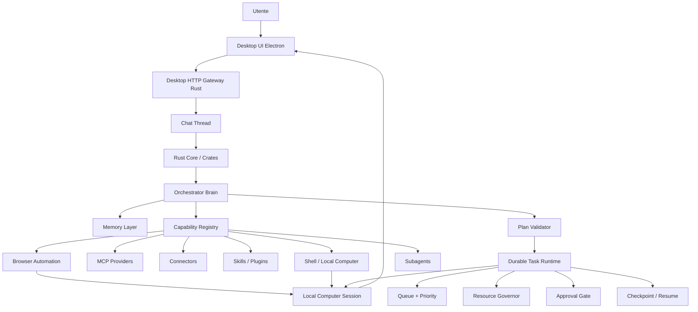

# System Map

Questo documento e' la mappa operativa del progetto. Va tenuto aggiornato insieme a
`docs/architecture/final-roadmap.md` e `docs/work-memory.md` quando cambiano
scopo, componenti, responsabilita' o ordine di implementazione.

> **Stato 2026-06-05.** Lo stato per-componente piu' sotto e' in parte storico
> (scritto a fine maggio). Realta' attuale: il gateway espone gia' i read model
> operativi (task, memoria, capability, Local Computer); chat, canali (WhatsApp/
> Telegram), contatti, artifacts/files e la sidebar a progetti sono in esercizio;
> il modello e' **capable-first** (registry + ruoli verso modelli SOTA, MLX/Gemma
> come fallback piccolo), quindi i riferimenti a "Gemma" vanno letti come
> "modello attivo del ruolo"; il browser e' stato riscritto in stile OpenClaw
> (tool granulari guidati dal modello) e affianca il planner legacy ancora vivo
> per i task durevoli. Le priorita' correnti sono in `docs/roadmap.md`.

## Scopo Prodotto

L'obiettivo e' costruire un assistente personale local-first, desktop-first e
multilingua che possa:

- capire richieste naturali senza regex o keyword locali;
- scegliere uno o piu' strumenti, MCP, connettori, skill, browser, shell o
  subagenti;
- eseguire task brevi, lunghi o di piu' giorni con coda, priorita', checkpoint e
  recovery;
- mostrare all'utente cosa sta facendo tramite Chat, Task UI e Local Computer;
- proteggere dati, privacy, risorse locali e azioni rischiose con policy e
  approval gate;
- apprendere abitudini e proporre automatismi solo dopo che gli eventi reali del
  computer saranno affidabili.

Non e' una semplice chat con tool. La chat e' solo la superficie utente. Il cuore
del prodotto e' il ciclo: comprensione, pianificazione, esecuzione governata,
osservabilita', memoria e apprendimento.

## Flusso Principale

## Componenti E Responsabilita'

### Desktop UI

Responsabilita':

- offrire la chat operativa, la lista thread, task, approval, settings,
  connettori, memoria, browser e apprendimento;
- mostrare read model UI-safe e progress disclosure;
- inviare prompt e comandi al gateway desktop locale.
- rendere contenuti chat complessi: Markdown, codice, tabelle, diagrammi,
  allegati, artifact, azioni messaggio e suggestion contestuali.
- usare il Desktop Chat HTTP Gateway per thread, messaggi, streaming,
  cancellazione e artifact ad alto volume.

Non deve:

- decidere quale tool usare;
- interpretare richieste naturali con regex o keyword;
- eseguire direttamente browser, shell, MCP o connettori;
- esporre raw payload, segreti o dati sensibili.
- usare IPC desktop per stream chat lunghi o payload grandi.

Stato attuale:

- shell Electron/React creata;
- chat operativa creata;
- renderer messaggi ricco creato con Markdown/GFM, codice, tabelle e Mermaid;
- thread separati e nuova chat funzionanti;
- Local Computer card e dettaglio UI esistenti;
- alcune viste sono ancora mock o parzialmente cablate.
- decisione aggiornata: rimuovere Tauri dalla shell desktop e usare Electron
  con un gateway HTTP Rust locale.

### Desktop Chat HTTP Gateway

Responsabilita':

- esporre API locali per thread, messaggi, streaming chat, cancel, feedback e
  azioni messaggio;
- streammare risposte via browser networking, non via IPC desktop;
- tenere il Gemma Python/MLX runtime dietro al Rust Core, non esposto come API
  prodotto;
- preservare metriche runtime: `prompt_tokens`, `generation_tokens`,
  `prompt_tps`, `generation_tps`, `peak_memory_gb`, `elapsed_seconds`;
- applicare token locale, CORS stretto, bind loopback e read model redatti;
- diventare il canale futuro per artifact Local Computer, preview browser/shell
  e payload grandi.

Non deve:

- ascoltare su LAN;
- bypassare Brain, policy, Task Runtime o Resource Governor;
- esporre raw prompt nei task/audit o segreti nei read model;
- sostituire i moduli desktop dedicati per funzioni native di sistema come file
  picker, lifecycle, notifiche o window controls.

Stato attuale:

- decisione architetturale fissata in
  `docs/decisions/0004-desktop-chat-http-gateway.md`;
- primo slice Electron creato in `apps/desktop/electron`;
- Tauri e `apps/desktop/src-tauri` sono stati rimossi dal desktop app;
- `crates/desktop-gateway` e' il processo Rust autonomo per la chat;
- `apps/desktop/src/lib/chatApi.ts` usa il gateway per thread, messaggi, pin,
  archivio, delete e commit delle risposte, con cache locale solo come fallback;
- `apps/desktop/src/lib/coreBridge.ts` usa il gateway per stream/cancel e per
  runtime health/warmup/shutdown; il renderer non chiama piu' Gemma direttamente;
- prossimo step: estendere il gateway a task, memoria, capability, Local
  Computer e packaging/log diagnostici del runtime Python/MLX.

### Chat Thread

Responsabilita':

- mantenere il contesto conversazionale di una richiesta o task;
- collegare ogni thread a una Local Computer Session;
- impedire contaminazione tra prompt, timeline, terminal output e artifact.

Stato attuale:

- il gateway conserva thread e messaggi separati in SQLite locale;
- la UI idrata thread e messaggi dal gateway e mantiene una cache locale solo
  come fallback Electron-safe;
- il commit delle risposte streaming e delle continuazioni e' atteso prima del
  refresh del read model, cosi' il contesto non viene perso tra turni;
- il primo prompt aggiorna titolo, subtitle, conteggio messaggi e thread attivo
  senza contaminare altri thread.
- il rendering chat segue un external-store pattern: React renderizza messaggi,
  stato streaming e comandi; il gateway/Rust Core deve tornare owner di thread,
  messaggi, task, approval, artifact e policy.
- da completare nella Chat Experience Foundation:
  - composer avanzato con cancel streaming, allegati, drag and drop, quote e
    focus management;
  - message actions per copia, rigenera, continua, salva in memoria, crea task
    o automazione e feedback;
  - suggestions contestuali;
  - Mermaid e code block streaming-aware;
  - attachment preview in composer e messaggi.

### Rust Desktop Gateway / Core

Responsabilita':

- essere il boundary locale tra UI e runtime;
- possedere policy, read model, command e validazione;
- coordinare Brain, task runtime, memoria, capability, processi e sessione
  computer.
- esporre il Desktop HTTP Gateway locale.

Non deve:

- delegare decisioni di sicurezza al frontend;
- salvare raw prompt nei read model operativi di task, tool, Local Computer,
  audit o checkpoint; la cronologia chat locale e' l'unico read model che
  conserva il testo conversazionale per mostrarlo all'utente;
- usare API cloud per default.

Stato attuale:

- i crate Rust per task, processi, capability, memoria, Local Computer,
  orchestrator, subagenti, skill runtime e secrets restano la base operativa;
- il vecchio core desktop legato alla shell e' stato rimosso con Tauri;
- `crates/desktop-gateway` espone gia' prompt, stream/cancel, runtime
  health/warmup/shutdown, thread e messaggi chat persistenti;
- restano da esporre nel gateway task, memory, capability, Local Computer,
  artifact preview, audit, log runtime e packaging produzione.

### Orchestrator Brain

Responsabilita':

- comprendere la richiesta in modo language-agnostic;
- produrre intenzioni strutturate e piani validati;
- selezionare tool tramite registry compatto e lazy detail;
- decidere se rispondere direttamente, usare memoria, usare capability,
  delegare a subagenti o accodare lavoro durevole.

Non deve:

- essere solo un prompt wrapper;
- vedere tutti i tool completi sempre;
- bypassare policy, approval o resource governor.

Stato attuale:

- prompt understanding capable-first: il modello attivo del ruolo orchestrator
  (registry, cloud SOTA per default) produce intenzioni/JSON validati; MLX/Gemma
  resta fallback locale piccolo;
- route per risposta diretta, calcolo, pianificazione, chiarimento e rifiuto;
- planner che genera piani materializzati come task durevoli;
- budget di contesto adattivi alla context-window del modello attivo (niente
  clamp del contenuto essenziale sui modelli capaci);
- DAG completo e selezione capability multi-provider ancora da rifinire.

### Durable Task Runtime

Responsabilita':

- gestire task indipendenti, workflow e task lunghi;
- applicare queue, priorita', dipendenze, retry, checkpoint, lease e recovery;
- usare Resource Governor prima dell'esecuzione;
- usare Approval Gate per azioni rischiose;
- esporre read model UI-safe.

Stato attuale:

- crate `crates/task-runtime` implementato e testato;
- supporta priorita', stati, resource reservations, approval, checkpoint,
  scheduler, lease recovery e UI read model;
- i piani da prompt vengono gia' materializzati come task durevoli;
- primo executor read-only per task `prompt_plan.*` da ricollegare al gateway
  autonomo;
- manca collegare browser/shell live come executor reali degli step pianificati.

### Automazioni (trigger → azione agentica)

Vedi ADR 0012. Modello di prima classe sopra il Task Runtime: la REGOLA (`Automation`) è
distinta dal RUN (`TaskRecord`).

Responsabilita':

- una regola = trigger (orario o evento) → un prompt eseguito come run agentico;
- trigger orario su ricorrenza flessibile (`dow@giorni@orari`, intervalli, jiff/DST);
- trigger evento: messaggio canale (WhatsApp/Telegram) e `ConnectorPoll` GENERICO su
  qualsiasi connettore Composio/MCP (poller in background + watermark anti-doppione);
- i run possono AGIRE proponendo conferma (`send_message` e scritture → card di conferma);
- creabili da chat (`create_automation`/`schedule_task`) e da UI (`AutomationsView` + picker
  sorgente raggruppato per servizio connesso).

Stato attuale:

- modello + store + recurrence + poller + UI implementati e verificati (A–G2);
- pendenti: fire reale ConnectorPoll su connettore vivo (lato utente), salto-conferma per
  automazioni autonome, trigger email/file/memoria (forward-declared).

### Resource Governor

Responsabilita':

- impedire che troppe richieste saturino il sistema;
- limitare classi come LLM, browser, shell, connettori, filesystem, Graphify e
  manutenzioni background;
- mettere task in `waiting_resource` quando una risorsa e' occupata;
- rendere visibile il motivo del blocco in UI.

Risorse principali:

- `llm_inference`
- `browser_session`
- `computer_session`
- `shell_process`
- `connector_api`
- `filesystem_io`
- `memory_indexing`
- `graph_indexing`
- `background_maintenance`

Stato attuale:

- implementato nel task runtime;
- non ancora collegato al prossimo executor degli step reali da prompt.

### Capability Registry

Responsabilita':

- descrivere provider, tool, grants, privacy domains, sensitivity e resource
  hints;
- offrire al Brain tool card compatte;
- collegare capability a task durevoli tramite bridge;
- routing dei tool con pattern Tool Search (ADR 0013): core piccolo sempre caricato +
  resto scoperto via `find_capability` (BM25); connessione Composio schema-driven (legge
  gli auth reali del toolkit, non li indovina).

Provider previsti:

- MCP;
- connettori;
- skill/plugin locali;
- browser automation;
- shell/local computer;
- subagenti;
- managed providers opzionali e policy-bound.

Stato attuale:

- base capability registry e capability task bridge implementate;
- connettori reali e UX di configurazione ancora da completare.

### Browser Automation

Responsabilita':

- eseguire navigazione, ricerca, compilazione form e task web complessi;
- produrre artifact, screenshot, transcript redatti e blockers;
- fermarsi su login, pagamento, acquisto, invio o altre azioni rischiose senza
  approval.

Stato attuale:

- crate e contratti browser automation creati;
- Local Computer UX disegnata;
- manca executor live collegato ai task pianificati e alla preview UI.

### Local Computer Session

Responsabilita':

- mostrare superfici Browser, Shell, Files e Logs;
- registrare timeline, output redatto, artifact e stato approval/takeover;
- dare fiducia all'utente su cosa il sistema sta facendo.

Stato attuale:

- manager e read model creati;
- smoke test shell/browser-sidecar disponibile;
- chat usa sessioni computer reali;
- preview live browser/shell completa ancora da collegare.

### Memory Layer

Responsabilita':

- gestire memorie utente, workspace, domini privacy, sensitivity e audit;
- unificare riferimenti tra memoria strutturata, grafo e wiki;
- fornire contesto al Brain senza esfiltrazione;
- supportare multiutente e policy.

Stato attuale:

- memoria core, read model, privacy e riferimenti implementati;
- Graphify e wiki previsti/adattati come componenti separati;
- apprendimento automatico rinviato fino ad avere eventi reali affidabili.

### Subagenti

Responsabilita':

- specializzare lavoro complesso in agenti data-driven;
- dichiarare scope tool, limiti runtime, memoria accessibile e resource usage;
- usare task runtime per queue, retry, checkpoint e recovery.

Stato attuale:

- base subagent runtime e bridge con task runtime implementati;
- orchestrazione completa dal Brain ancora da chiudere.

### Process Manager E Runtime Locali

Responsabilita':

- avviare, fermare e monitorare sidecar locali;
- gestire health, pid, stdout limitato e readiness;
- mantenere runtime local-first.

Stato attuale:

- Process Manager implementato;
- Gemma 4 MLX runtime locale creato;
- browser sidecar registrato;
- UI runtime health parziale.

### Learning / Auto Apprendimento

Responsabilita':

- osservare pattern reali dell'utente;
- proporre automatismi spiegabili e revocabili;
- rispettare privacy domains, sensitivity, retention e approval;
- non agire in autonomia senza policy.

Stato attuale:

- solo UI/mock e direzione concettuale;
- da implementare alla fine, dopo eventi PC reali, task reali, memoria e policy.

## Sequenza Di Implementazione Aggiornata

Gli step 1-7 sono in larga parte realizzati (vedi `docs/roadmap.md` per lo stato
vivo). In sintesi:

1. Desktop HTTP Gateway Rust autonomo collegato a Electron: FATTO, inclusi i
   read model operativi (task, memoria, capability, Local Computer).
2. Executor dei task pianificati dal Brain (Task Runtime + Resource Governor +
   Approval Gate + checkpoint): FATTO (read-only governato).
3. Tasks/Approvals UI sui read model reali: FATTO.
4. Browser/Shell reali nel Local Computer: FATTO; il browser e' poi stato
   riscritto in stile OpenClaw (tool granulari guidati dal modello). Debito
   aperto: unificare i task durevoli sul motore granular e ritirare il planner.
5. Orchestrator Brain con tool selection dal Capability Registry: avanzato.
6. Connections/Settings sui provider reali (MCP/connettori/skill): di base FATTO.
7. Persistenza degli stati desktop: FATTO (store locali, recovery all'avvio).
8. Auto-apprendimento: ancora da fare (gated su eventi reali affidabili).

Dimensioni aggiunte fuori dal piano originale e ora attive: canali WhatsApp/
Telegram (inbound-come-agente), contatti/identity resolution, artifacts/files,
sidebar a progetti.

## Regole Architetturali

- Local-first e' il default: niente API cloud implicite.
- La UI non sceglie tool e non interpreta prompt.
- Il Brain non bypassa policy, approval o resource governor.
- Ogni azione lunga o rischiosa diventa task durevole.
- Ogni task dichiara risorse e passa dal Resource Governor.
- Browser, shell, connettori, MCP, skill e subagenti usano lo stesso task
  runtime.
- Raw prompt, segreti e payload sensibili non entrano in task, audit,
  checkpoint, Local Computer o tool payload; la chat locale conserva il testo
  conversazionale solo come cronologia utente.
- Azioni mutative, login, invio, acquisto e pagamento richiedono approval.
- Auto-apprendimento viene dopo la raccolta affidabile di eventi reali.
- File e moduli devono restare separati e non troppo lunghi.

## Stato Production Ready

In esercizio (base contrattuale/test + cablaggio reale):

- gateway Rust con read model operativi (task, memoria, capability, Computer);
- modello capable-first (registry + ruoli; MLX/Gemma come fallback locale);
- Durable Task Runtime, Resource Governor, Memory Core, Process Manager;
- Capability Registry + connettori/MCP/skill di base;
- Local Computer Session con preview browser/shell;
- browser automation riscritto stile OpenClaw (tool granulari) + planner legacy;
- canali WhatsApp/Telegram, contatti, artifacts/files;
- persistenza desktop (store locali, recovery all'avvio);
- UI shell + chat thread isolati con rendering ricco.

Non ancora chiuso end-to-end:

- unificazione browser durevole sul motore granular (ritiro planner legacy);
- affidabilita' browser su siti reali complessi (extractor, recovery);
- auto-apprendimento reale;
- packaging/notarization e recovery e2e su workflow lunghi.

## Prossimo Blocco Consigliato

Il Prompt Plan Executor (il blocco originariamente consigliato qui) e' fatto.
Le priorita' correnti sono in `docs/roadmap.md` -> "Next Action". Il ruolo
browser vision e' FATTO (`minimax-m3:cloud`); la priorita' attuale e' unificare
il browser durevole sul motore granular, poi affidabilita' su siti reali,
packaging e auto-apprendimento.
