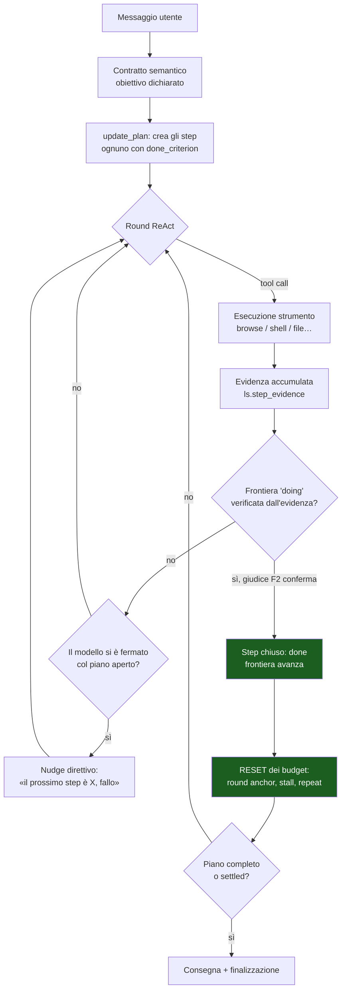
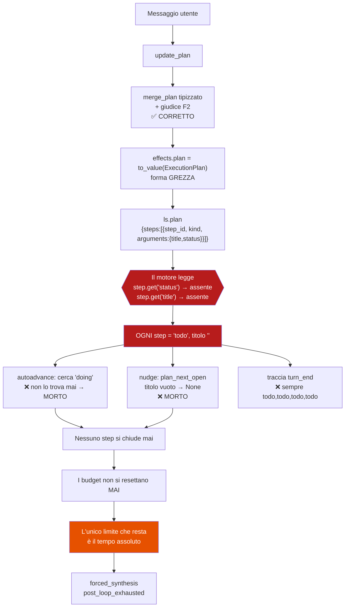

# Perché il piano non avanza, e perché finiamo sempre a regolare i tempi

**Data:** 2026-07-27 · **Metodo:** lettura del codice + trace reali (`~/.homun/logs/turn-trace.jsonl`)
+ un test eseguito che riproduce il difetto.

## La domanda

Da giorni ogni fix sul browser sposta la morte del turno a un limite diverso. L'osservazione
dell'utente: *«i tempi non dovrebbero essere un problema… non vedo il plan… stiamo girando
intorno»*. Questo documento risponde a due cose:

1. perché il piano esiste ma non avanza mai;
2. perché una lavorazione lunga (ore) oggi non è possibile.

La risposta è **una sola causa** per entrambe.

---

## 1. Come il sistema DEVE ragionare (progetto)

Il design è coerente e, sulla carta, è già quello che serve. Il punto centrale è che
**il budget non misura il tempo: misura il progresso di piano.**



Le due proprietà che contano:

- **`rounds_since_progress`** è misurato *dall'ultimo step chiuso*, non dall'inizio del turno
  (`agent_loop.rs:323`). Il tetto assoluto `HARD_ROUND_CEILING = 600` esiste solo come
  anti-runaway ed è commentato così: *«un turno lungo guidato dal piano può legittimamente
  richiedere centinaia di round»* (`main.rs:17969`).
- Il prompt promette al modello esattamente questo: *«Your working budget RESETS every time a
  step is verified complete, so a long task can run as long as it KEEPS CLOSING STEPS»*
  (`main.rs:29021`).

**Quindi la durata illimitata-mentre-progredisce è già progettata e già scritta.** Non manca.

---

## 2. Come ragiona davvero (realtà)



### La causa esatta

`ls.plan` (il piano che il **motore** legge) e il piano che il **gateway** fonde e verifica
**non hanno la stessa forma**.

| | Forma | `status` dove sta |
| --- | --- | --- |
| Piano canonico (gateway) | `{id, title, status, detail}` | in chiaro |
| `ExecutionPlan` serializzato (ciò che finisce in `ls.plan`) | `{step_id, kind, depends_on, arguments:{…}}` | **dentro `arguments`** |

`effects.plan = serde_json::to_value(&current_plan)` (`main.rs:25993`) scrive la forma **grezza**.
Il motore la legge con `plan_step_status()`, che fa
`step.get("status")…unwrap_or("todo")` (`engine/src/plan.rs:94`) — e con
`plan_step_title()`, che fa `unwrap_or("")`.

Nessun errore, nessun panic: **il default silenzioso restituisce `todo` con titolo vuoto per
qualunque step, qualunque sia il suo stato reale.**

### Prova eseguita

Test aggiunto in `crates/desktop-gateway/src/main.rs`
(`the_plan_value_handed_to_the_engine_preserves_status_and_title`) che riproduce esattamente
l'assegnazione fatta dal ramo `update_plan`:

```
assertion `left == right` failed
  left: ""
 right: "Cerca il treno"
```

### Prova sui dati reali

Trace del turno «prenotiamo il primo» (`turn_id …xd90novqsr`), **stesso turno**:

```
seq  8  plan      update_plan   sent [done, doing, todo, todo]   canonical [done, doing, todo, todo]
seq 15  turn_end                plan_final [todo, todo, todo, todo]   incomplete_steps 4
```

`seq 8` è calcolato con il lettore **giusto** (`execution_plan_steps`), `seq 15` con quello
**sbagliato** (`plan_value_steps` + `plan_step_status`). Non è il piano che regredisce: sono
due lettori che non concordano, e il motore usa quello sbagliato.

### Raggio d'azione

Ogni consumatore di `ls.plan` nel motore:

| Sito | Funzione | Effetto reale |
| --- | --- | --- |
| `agent_loop.rs:150` | `try_advance_frontier_from_evidence` | **morto** — nessuna frontiera `doing`, il giudice F2 non viene mai invocato dal loop |
| `agent_loop.rs:1153` | nudge di completamento piano | **morto** — `plan_next_open` filtra i titoli vuoti → `None` |
| `agent_loop.rs:1328` | `final_open_before` | conteggio sempre errato |
| `main.rs:29912` | traccia `turn_end` | sempre `todo` — l'osservabilità mente |

Cosa **non** è rotto (ed è il motivo per cui il difetto è sopravvissuto): il ramo `update_plan`
usa il lettore tipizzato, quindi la fusione, la verifica F2, il reset dei guard via
`effects.reset_stall_guards` e la card ‹‹PLAN›› che vedi a schermo **funzionano**. Il difetto
colpisce solo le reti di sicurezza del harness — cioè proprio quelle che devono intervenire
*quando il modello smette di segnalare i progressi da solo*. Che è esattamente il caso di
deepseek nei turni falliti: ha chiamato `update_plan` una volta al round 4 e mai più.

---

## 3. Perché finivamo sempre a regolare i tempi

Non è stata sfortuna, è una conseguenza meccanica:

1. Nessuno step si chiude → `rounds_since_progress` non si azzera mai → il budget per-step
   diventa di fatto un budget **totale**.
2. Il piano non è mai `complete` né `settled` → nessun terminale guidato dall'obiettivo.
3. Restano solo controlli temporali assoluti (`max_elapsed_ms`, il tetto round) → **l'unica
   leva visibile è il tempo**.
4. Ogni volta che ne allarghiamo uno, il turno muore al successivo.

Il difetto ha reso il sistema *cieco al progresso*, e un sistema cieco al progresso può solo
essere regolato a orologio. Avevi ragione: la strada era sbagliata.

---

## 4. Il secondo punto: lavorazioni di ore

Separando i fatti dalle opinioni.

**Ciò che già regge le ore.** Il tetto round è 600 con budget per-step che si resetta; il
controllo primario del browser è `max_stall_ms` (90s **senza un solo successo**, azzerato ad
ogni successo), non il tempo totale. Il turno di chat è già un **task durevole** con stati
`WaitingTime / WaitingExternalEvent / WaitingUserApproval / WaitingResource / Paused / Parked`
(`task-runtime/src/types.rs:83`). L'infrastruttura per il lungo periodo c'è.

**Ciò che oggi limita davvero.** `max_elapsed_ms` del browser nel turno manager è assoluto e
non si resetta mai (oggi 4 × 300s). È pensato come rete finale, ma con il progresso invisibile
diventa il limite *effettivo*. Sistemata la causa, torna a essere ciò che deve essere: una rete.

**Il vero buco di prodotto (onesto, e distinto dal bug).** Non esiste un percorso «stacca e
continua» per un lavoro lungo *una tantum*: `schedule_task` è per le ricorrenze e dice
esplicitamente *«Do NOT use it for one-off immediate actions»*. Quindi un lavoro di due ore
oggi deve stare dentro un turno di chat con qualcuno in attesa sullo stream. Questa è una
scelta di prodotto da fare, non un difetto da correggere — ma **non è la causa dei fallimenti
di questi giorni**, e va affrontata dopo, non al posto della causa.

---

## 5. Cosa fare, nell'ordine

1. **Chiudere il disallineamento di forma.** Due opzioni:
   - *(consigliata)* `ls.plan` porta la forma **canonica** (`plan_value_from_steps` esiste già e
     fa esattamente questo, `main.rs:37791`), e il ramo `update_plan` scrive quella invece della
     serializzazione grezza. Un solo punto di scrittura, il motore resta com'è.
   - il motore impara a leggere la forma grezza. Sconsigliata: duplica la conoscenza della
     forma su due crate, cioè il contrario della regola «converge, non duplicare».
   Il test rosso è già in albero e diventa il pin della regressione.
2. **Verificare che le reti tornino vive**: un test che, dato un piano con una frontiera,
   l'autoadvance la chiuda e il nudge nomini lo step giusto.
3. **Solo dopo**, rimisurare i tempi su un run reale. È probabile che i valori attuali bastino:
   con gli step che si chiudono, i budget si resettano e il tempo torna a essere una rete.
4. **Poi**, separatamente, decidere se serve un percorso «lavoro lungo staccato dalla chat».

---

## Nota di metodo

Il difetto è del tipo peggiore: **un default silenzioso al confine tra due crate**
(`unwrap_or("todo")`). Non produce errori, non rompe test, e l'osservabilità che avrebbe dovuto
smascherarlo (`plan_final` nella traccia) legge dallo *stesso lettore sbagliato*, quindi
confermava il difetto invece di rivelarlo. Vale come regola generale: **un default su un campo
di controllo è un bug che aspetta** — se un campo è necessario al controllo di flusso, la sua
assenza deve essere un errore rumoroso, non un valore plausibile.
