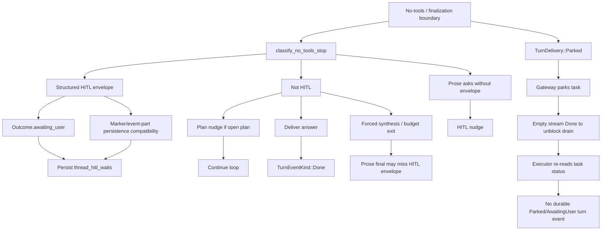

# Agent Loop Contract - Code Comparison

Data: 2026-07-28

Scope: analisi architetturale, nessun fix implementativo. Il codice resta la fonte di verita.

## Executive Verdict

Homun non ha ancora un unico oggetto di control-flow che sopravvive a query, wait, reply, resume e terminale. Il nocciolo corretto sta emergendo (`TurnOutcome.awaiting_user`, `HitlEnvelope`, `TurnDelivery::Parked`), ma il terminale effettivo e ancora distribuito tra engine, stream, task status, agent run status, marker/card persistence e UI message delivery.

Il confronto con altri runtime conferma che il problema non e "Trenitalia" o il browser. E un problema di ownership generale: manca una proiezione unica che trasformi l'esito del turno in stati coerenti per messaggio, task, run, evento terminale, wait HITL e safety references.

## Repos Letti

- AutoAgents Rust: `https://github.com/liquidos-ai/autoagents.git`, commit `1aa57a8`
- Open Agent SDK Rust: `https://github.com/codeany-ai/open-agent-sdk-rust.git`, commit `8625c94`
- Symbiont Rust: `https://github.com/thirdkeyai/symbiont.git`, commit `4739cef`
- Temporal Rust SDK: `https://github.com/temporalio/sdk-rust.git`
- iopsystems Durable: `https://github.com/iopsystems/durable.git`
- OpenHands: `https://github.com/OpenHands/openhands.git`, commit `200dba4`; il clone letto e risultato frontend/Agent Canvas, non il runtime Python storico atteso, quindi non lo uso come benchmark runtime in questa analisi.

## Cosa Impariamo Dagli Altri

### AutoAgents Rust

Evidenza codice:

- `/tmp/liquidos-autoagents.zkipzE/crates/autoagents-core/src/agent/executor/turn_engine.rs:80-87` definisce `TurnDelta::Done(TurnResult<TurnEngineOutput>)`.
- `/tmp/liquidos-autoagents.zkipzE/crates/autoagents-core/src/agent/executor/turn_engine.rs:323-337` manda `TurnCompleted { final_turn }` e poi `TurnDelta::Done`.
- `/tmp/liquidos-autoagents.zkipzE/crates/autoagents-protocol/src/protocol.rs:66-91` ha eventi tool requested/completed/failed.
- `/tmp/liquidos-autoagents.zkipzE/crates/autoagents-protocol/src/protocol.rs:128-159` ha `TurnStarted`, `TurnCompleted { final_turn }`, `StreamComplete`.
- `/tmp/liquidos-autoagents.zkipzE/crates/autoagents-core/src/agent/executor/tool_processor.rs:16-18` centralizza il tool processor.

Lezione:

AutoAgents e piu semplice di Homun, ma ha una cosa giusta: il terminale stream non si inferisce dalla chiusura del canale o dal testo. Arriva come delta tipizzato (`Done`) e come evento di turno (`TurnCompleted`). Homun oggi ha `TurnEventKind::Done`, ma non ha equivalenti durevoli per `AwaitingUser` o `Parked`, quindi molti consumatori devono dedurre lo stato finale da segnali laterali.

### Open Agent SDK Rust

Evidenza codice:

- `/tmp/open-agent-sdk-rust.c0peRp/src/agent/loop.rs:63-192` fa loop, chiama provider, esegue tool, interrompe se non ci sono tool.
- `/tmp/open-agent-sdk-rust.c0peRp/src/agent/loop.rs:197-215` emette sempre `SDKMessage::Result` con l'ultimo testo assistant.
- `/tmp/open-agent-sdk-rust.c0peRp/src/tools/executor.rs:12-17` `execute_tools` riceve un `permission_fn`.
- `/tmp/open-agent-sdk-rust.c0peRp/src/tools/executor.rs:108-122` `check_permission` puo allow, deny o modificare input.
- `/tmp/open-agent-sdk-rust.c0peRp/src/types/tool.rs:129-139` definisce `PermissionDecision`.

Lezione:

Questo e un anti-modello per Homun se copiato troppo. Il loop e utile per vedere il minimo: permission callback nel path di tool execution, result finale sempre emesso. Ma `no tool calls => done` e insufficiente per noi, perche Homun ha wait free, hold approvals, browser continuation, Vault, payment one-shot, connettori, sandbox e task long-running.

### Symbiont Rust

Evidenza codice:

- `/tmp/symbiont.gGl9qL/crates/runtime/src/reasoning/loop_types.rs:77-126` separa `ProposedAction` e `LoopDecision`.
- `/tmp/symbiont.gGl9qL/crates/runtime/src/reasoning/loop_types.rs:128-156` separa `metadata` non fidata da `trusted_context` runtime-only.
- `/tmp/symbiont.gGl9qL/crates/runtime/src/reasoning/phases.rs:25-41` marca le fasi `Reasoning`, `PolicyCheck`, `ToolDispatching`, `Observing`.
- `/tmp/symbiont.gGl9qL/crates/runtime/src/reasoning/phases.rs:115-269` produce azioni proposte dal modello.
- `/tmp/symbiont.gGl9qL/crates/runtime/src/reasoning/phases.rs:283-414` valida schema e passa ogni azione dal policy gate.
- `/tmp/symbiont.gGl9qL/crates/runtime/src/reasoning/phases.rs:532-628` esegue solo azioni approvate.
- `/tmp/symbiont.gGl9qL/crates/runtime/src/reasoning/reasoning_loop.rs:362-487` scrive journal a ogni confine: reasoning, policy, tools, observations, termination.
- `/tmp/symbiont.gGl9qL/crates/runtime/src/reasoning/policy_bridge.rs:12-29` rende il gate obbligatorio.
- `/tmp/symbiont.gGl9qL/crates/runtime/src/reasoning/policy_bridge.rs:32-123` default fail-closed per tool/delegate.
- `/tmp/symbiont.gGl9qL/crates/runtime/src/escalation/queue.rs:161-215` held action con timeout fail-closed.
- `/tmp/symbiont.gGl9qL/crates/runtime/src/sandbox/mod.rs:24-75` tier sandbox e guard contro `None` in produzione.

Lezione:

Symbiont e il benchmark piu rilevante. Non mette la sicurezza dentro il risultato del modello: il modello propone, il runtime valida/gate-a, l'executor agisce, il journal proietta. Homun dovrebbe fare la stessa cosa con i nostri owner esistenti: Vault, payment, browser safety, capability policy, sandbox e connectors restano proprietari delle rispettive decisioni, ma il turno deve proiettare un unico terminale globale.

### Temporal Rust SDK

Evidenza codice:

- `/tmp/temporal-sdk-rust.SkHjho/crates/workflow/src/workflow_context.rs:246-269` usa `PendingCommandId` per collegare comandi pendenti a timer, activity, child workflow e segnali esterni.
- `/tmp/temporal-sdk-rust.SkHjho/crates/sdk-core/src/worker/workflow/machines/workflow_machines.rs:930-999` abbina eventi di history a macchine di stato e fallisce su non-determinismo se arriva un evento senza comando corrispondente.
- `/tmp/temporal-sdk-rust.SkHjho/crates/sdk-core/src/worker/workflow/machines/workflow_machines.rs:1332-1425` trasforma risultati guidati in comandi: timer, activity, local activity, complete, fail, continue-as-new, cancel.
- `/tmp/temporal-sdk-rust.SkHjho/crates/client/src/retry.rs:100-127` distingue long-poll utente e task-poll.
- `/tmp/temporal-sdk-rust.SkHjho/crates/sdk/examples/saga/workflows.rs:77-108` implementa saga con compensazioni in ordine inverso.

Lezione:

Temporal non e un "processo lungo": e history durevole + comandi + activity + timer + signal + replay. Per Homun non conviene importare Temporal come servizio ora, perche aggiungerebbe un vincolo infrastrutturale pesante a un'app local-first, ma i suoi invarianti sono quelli corretti: side effect fuori dal workflow decisionale, timer e segnali come primi cittadini, retry esplicito, compaction/continue-as-new per history lunghe, compensazioni per sequenze irreversibili.

### iopsystems Durable

Evidenza codice:

- `/tmp/iopsystems-durable.EgfOHJ/crates/durable-runtime/src/storage/mod.rs:30-38` definisce stati `Ready`, `Active`, `Suspended`, `Complete`, `Failed`.
- `/tmp/iopsystems-durable.EgfOHJ/crates/durable-runtime/src/storage/mod.rs:66-244` espone storage con heartbeat worker, leader, wake suspended tasks, claim tasks, event log, commit event, suspend e notifications.
- `/tmp/iopsystems-durable.EgfOHJ/crates/durable-runtime/src/task.rs:46-72` usa `RecordedEvent` e `Transaction` indicizzati.
- `/tmp/iopsystems-durable.EgfOHJ/crates/durable-runtime/src/scheduler.rs:12-87` modella componenti e schedule events per simulazione deterministica.

Lezione:

Durable e vicino al nostro bisogno runtime: un task si sospende, viene svegliato da timer/notifica, ha heartbeat e ownership di worker, e il progresso e un log transazionale. Homun possiede gia molti pezzi equivalenti (`TaskStatus`, lease, `not_before`, resource waits), ma il gateway chat deve smettere di ridurre queste attese a "blocked/failure".

## Dove Homun Diverge

Evidenza codice Homun:

- `crates/engine/src/outcome.rs:25-59` ha `TurnOutcome`, `TurnDelivery` e `awaiting_user`.
- `crates/engine/src/hitl.rs:21-39` ha `HitlKind` e `HoldPolicy`.
- `crates/task-runtime/src/types.rs:83-106` ha `TaskStatus::Parked` e `WaitingUserApproval`.
- `crates/task-runtime/src/types.rs:594-616` `TurnEventKind` non ha `Parked` o `AwaitingUser`.
- `crates/desktop-gateway/src/main.rs:30414-30443` per `TurnDelivery::Parked` parcheggia il task e manda un `Done` vuoto solo per sbloccare lo stream, senza evento terminale durevole.
- `crates/desktop-gateway/src/turn_executor.rs:37-47` classifica `Cancelled`, `Parked`, `Generated`, `NoAnswer` da segnali indipendenti.
- `crates/desktop-gateway/src/turn_executor.rs:580-618` rilegge il task status per capire se e parked.
- `crates/desktop-gateway/src/turn_executor.rs:707-793` emette `Done` solo su generated non waiting; generated waiting e parked seguono strade diverse.
- `crates/desktop-gateway/src/main.rs:36090-36131` persiste wait free anche da event parts/marker.
- `crates/desktop-gateway/src/main.rs:36185-36218` persiste wait free da `TurnOutcome`.
- `crates/task-runtime/src/facade.rs:118-125` tratta `ExecutorResult::WaitUntil` come `TaskStatus::WaitingTime` con `not_before`.
- `crates/desktop-gateway/src/main.rs:48553-48674` trattava `ExecutorResult::WaitUntil` insieme a `RetryableFailure`, perdendo il contratto di timer nel bridge gateway.

Fallacia:

Homun ha gia introdotto pezzi giusti, ma non ha ancora "un solo posto" che dica:

- questo turno e `Delivered`,
- oppure `AwaitingUserFree`,
- oppure `AwaitingUserHold`,
- oppure `Parked`,
- oppure `Cancelled/Error/NoAnswer`,
- e per ciascuno quale stato devono assumere message, task, run, event stream, persistent events e open work.

## Schema Generale Proposto

Contratto generale:

```text
Model output / tool result
  -> Engine classification
  -> TurnLifecycleProjection
  -> Gateway applies projection atomically to:
       message delivery
       task status
       agent run status
       terminal event
       HITL wait/open work
       safety refs
```

Forma concettuale:

```rust
enum TurnTerminalKind {
    Delivered,
    AwaitingUserFree,
    AwaitingUserHold,
    Parked,
    Cancelled,
    Error,
    NoAnswer,
}

struct TurnLifecycleProjection {
    terminal_kind: TurnTerminalKind,
    message_delivery_state: MessageDeliveryState,
    task_status: TaskStatus,
    agent_run_status: AgentRunStatus,
    terminal_event: Option<TurnEventKind>,
    hitl_wait: Option<HitlEnvelope>,
    safety_refs: Vec<SafetyRef>,
}
```

Nota: `SafetyRef` non deve duplicare Vault/payment/sandbox. Deve solo riferire gli owner esistenti: payment approval id, vault pending id, remote approval id, browser grant, host-computer approval, capability decision.

## Contratto Durable Generale

La base comune, presa da Temporal/Durable/Symbiont e adattata a Homun, e:

1. Objective durevole: un obiettivo sopravvive a crash, pausa, attesa utente, timer e risorse non disponibili.
2. Slice brevi: ogni esecuzione produce un outcome tipizzato, non resta viva per ore.
3. Event log: ogni confine importante e persistito come evento/proiezione.
4. Checkpoint: payload raw/redacted con idempotency key per side effect.
5. Timer: `WaitingTime` + `not_before` non sono failure.
6. Signal: `WaitingExternalEvent` non e retry cieco.
7. Human wait: `AwaitingUserFree` e `WaitingUserApproval` sono diversi.
8. Resource wait: `WaitingResource` resta owner del governor, non del modello.
9. Lease/heartbeat/recovery: il worker puo morire senza perdere ownership del task.
10. Safety refs: vault, sandbox, browser, payment e connettori mantengono le proprie policy.
11. Saga: azioni esterne sequenziali devono avere ricevute e compensazioni dove possibile.
12. Continue-as-new/compaction: history lunghe non devono gonfiare indefinitamente lo stesso record.

Prima implementazione avviata:

- distinguere `ExecutorResult::WaitUntil` da `RetryableFailure` nel gateway;
- conservare `not_before` nell'outcome;
- persistere il task come `WaitingTime` invece di farlo cadere nel path `blocked`/`WaitingExternalEvent`;
- mantenere invariato il delivery state UI, per evitare un secondo asse non ancora armonizzato.

## Diagramma Uscite Rivali Attuali



Non tutti i cammini passano da un unico classifier/projection. Questo e il bug architetturale.

## Kill / Converge / Defer

| Area | Verdetto | Motivo |
| --- | --- | --- |
| `HitlEnvelope` / `TurnOutcome.awaiting_user` | KEEP | E il nucleo corretto per wait machine-owned. |
| Persist wait da `TurnOutcome` | KEEP/CONVERGE | Deve diventare source of truth. |
| Persist wait da marker/event parts | CONVERGE | Solo compatibilita input legacy, non owner. |
| `TurnDelivery::Parked` | KEEP/CONVERGE | Stato legittimo, ma serve evento/proiezione durevole. |
| Empty `Done` per sbloccare SSE parked | KILL dopo proiezione | Oggi e un trucco di trasporto, non contratto. |
| `classify_chat_turn_run` da segnali indipendenti | CONVERGE | Deve consumare projection, non ridedurre. |
| Plan nudge dopo no-tools | CONVERGE | Deve essere ramo esplicito nel classifier/projection, non secondo owner. |
| Forced synthesis fuori classifier | CONVERGE | Deve rientrare nella stessa tassonomia terminale. |
| Prose-only resume / prompt-only legacy | KILL | Crea ownership implicita e drift. |
| Safety gates payment/browser/vault/capability/sandbox | KEEP | Sono owner corretti del dominio; non vanno assorbiti nel turno. |
| `tool_safety.rs` non cablato | DEFER/CONVERGE | Utile come vocabolario, ma deve entrare in un choke point reale o essere rimosso. |
| OpenHands frontend clone | DEFER | Non e runtime agent-loop utile in questo clone. |

## Definition Of Done

- Ogni turno produce una sola `TurnLifecycleProjection`.
- `TaskStatus`, `AgentRunStatus`, `MessageDeliveryState`, `TurnEventKind` e `thread_hitl_waits` derivano dalla projection.
- `AwaitingUserFree` e `Parked` hanno eventi durevoli distinti da `Done`.
- Nessun path usa prosa del modello per decidere wait/resume.
- Il resume di Choice/Clarify usa solo wait tipizzato e OpenWork.
- Hold approvals restano via approval API, non via nuovo canale.
- Payment/Vault/browser safety conservano test one-shot, thread-bound, fail-closed.
- I connettori non vedono tool nascosti da `CapabilityPolicy`.
- Un test contrattuale copre: meteo semplice, domanda chiarificatrice, choice resume, hold confirm, parked, browser budget/forced synthesis, payment approval.
- Nessun nuovo modo di fermare o riprendere il turno viene introdotto.

## Piano Di Convergenza

1. Aggiungere test di caratterizzazione sui branch attuali senza cambiare comportamento.
2. Introdurre una funzione pura di projection a partire da `TurnOutcome`, segnali cancel/error e risultati stream.
3. Far consumare la projection a `turn_executor` al posto della deduzione `generated/waiting/parked`.
4. Aggiungere `TurnEventKind::AwaitingUser` e `TurnEventKind::Parked` o equivalenti tipizzati.
5. Rendere `persist_hitl_wait_from_outcome` il solo owner; marker/event parts restano solo normalizzazione legacy.
6. Riportare forced synthesis e plan nudge nella tassonomia del classifier/projection.
7. Rimuovere empty `Done` parked come semantica, lasciando al massimo un evento di trasporto non durevole.
8. Eseguire non-regression su Vault/payment/browser/capability/sandbox/connectors.
9. Solo dopo: cleanup warning, compile, avvio dev, test UI reale.

## Restart Prompt Implementazione

Implementa la convergenza del Turn Contract in Homun senza introdurre nuovi marker o special-case dominio. Parti da test di caratterizzazione su `TurnOutcome`, HITL Free/Hold, Parked e `turn_executor`; poi introduci una projection unica che governi message delivery, task status, agent run status, turn event e wait persistence. Mantieni Vault, payment, browser safety, sandbox e capability policy come owner esistenti: il nuovo contratto deve solo referenziarli, non duplicarli.
