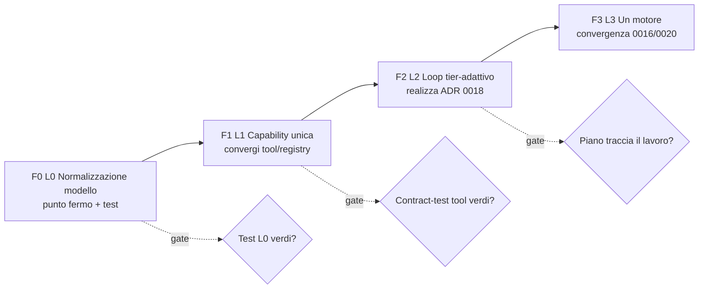

# Piano: convergenza dalle fondamenta (bottom-up)

> Data: 2026-06-27. Sintesi del reverse-engineering completo dei sottosistemi
> (vedi `docs/architecture/*.md`) + analisi strutturale del loop. Questo è il piano
> operativo che seguiamo per uscire dai cerotti. Ogni passo: chiude una **divergenza
> documentata**, ripristina un **[caposaldo](../CAPISALDI.md)**, ha un **test**.

## La scoperta trasversale (perché sembra instabile)

Non è un design sbagliato. È che **ogni sottosistema ha DUE implementazioni, e quella
canonica/tipata è dormiente**, mentre `crates/desktop-gateway/src/main.rs` (52k righe) ha
accumulato a mano un parallelo "vivo". Pattern identico ovunque:

| Sottosistema | Implementazione VIVA (gateway) | Canonica DORMIENTE | Doc |
|---|---|---|---|
| Loop di controllo | `stream_chat_via_openai` (model-driven) | `OrchestratorBrain` DAG, id stabili | [agent-loop](../architecture/agent-loop.md) |
| Normalizzazione modello | `sanitize`/`parse_text_tool_calls`/reasoning-fallback sparpagliati | `model_normalize` (TryFrom Raw→Canonical, solo PLAN_PROPOSE, non cablato) | [model-io](../architecture/model-io.md) |
| Skill | scan filesystem → iniezione `SKILL.md` | `SkillCapabilityProvider` tipato (`skill_execution_unavailable`) | [skills](../architecture/skills.md) |
| Composio | v3 inline nel gateway | provider crate pre-v3 (solo task-runtime) | [connectors](../architecture/connectors-composio.md) |
| Ricerca capability | `bm25_rank` (chat) | `ToolSearchIndexStore` FTS5 (orchestrator) | [registry](../architecture/capability-registry.md) |
| Piano (identità) | `merge_plan` per **titolo** | `step_id` runtime stabile (`ExecutionPlan`) | [agent-loop](../architecture/agent-loop.md) |

**Conseguenza:** [caposaldo #5](../CAPISALDI.md) ("un solo motore / un solo grafo / un solo
store") è violato **system-wide**. L'instabilità (piano che parte o no, stesso prompt esiti
diversi, tool sbagliato) = due-di-tutto + drift + il motore canonico che **non guida mai**.

## Obiettivo

Un sistema **fluido e prevedibile** (come Claude Code per i modelli capaci) **e affidabile
sui modelli locali/deboli** (la tensione è già risolta da [ADR 0018](../decisions/0018-adaptive-harness-subagents-triggers.md):
Pavimento per tutti, inner loop libero per i capaci / scaffolded per i deboli), su **UNA
implementazione canonica per sottosistema** ([caposaldo #5](../CAPISALDI.md)).

## Principio del piano (la metodologia ripristinata)

1. **Bottom-up**: nessun lavoro su uno strato finché quello sotto non è un **punto fermo**
   (contratto + test verde). Si parte da L0.
2. **Convergere, non aggiungere**: ogni passo **cabla la canonica e ritira il parallelo**
   (o cancella il dormiente se la canonica vince). Niente terza implementazione.
3. **Ogni modifica**: aggiorna la pagina `architecture/` + il suo Mermaid, cita il caposaldo
   che ripristina, e porta un test. Niente codice fuori dalla mappa.

## Le fasi (fondamenta → obiettivo)

### F0 — L0: Normalizzazione modello (la chiave di volta)
**Cosa:** cablare `model_normalize` come **unico** normalizzatore: ogni risposta modello
(Ollama native / OpenAI-compat, streaming) → forma canonica `{content, reasoning,
tool_calls}`. Spostare lì `sanitize_model_text`, `parse_text_tool_calls`/`synthesize_tool_calls`,
il reasoning-fallback e lo schema-downgrade `json_schema→json_object`. Estendere oltre
PLAN_PROPOSE (completare ADR 0019). **Test:** fixture per provider/modello → asserisce la
forma canonica (incl. reasoning-only, content vuoto, tool-as-text). **Chiude:**
normalizzazione sparpagliata. **Ripristina:** caposaldo #6/#11 (verità verificabile, non
inferita dal testo). **Doc:** [model-io](../architecture/model-io.md).

### F1 — L1: Capability unica (registry + tool convergenti)
**Cosa:** (a) **un solo** motore di capability-search — ritirare il doppione (`bm25_rank` vs
`ToolSearchIndexStore`). (b) Skill: cablare `SkillCapabilityProvider` come capability reale
**o** cancellarlo e dichiarare il path filesystem l'unico (decisione esplicita). (c) Composio:
una sola implementazione (la v3), ritirare il provider crate divergente. (d) Browser: portarlo
**dentro il registry** come capability (oggi è inline → il planner non lo vede, blocca ADR
0020). **Test:** contract-test per ogni tool (args → output/errore tipizzato). **Chiude:**
due-di-tutto su skill/composio/search; browser invisibile al planner. **Ripristina:** #5, #7.
**Doc:** [registry](../architecture/capability-registry.md), [skills](../architecture/skills.md),
[connectors](../architecture/connectors-composio.md), [browser](../architecture/browser.md),
[mcp](../architecture/mcp.md).

### F2 — L2: Loop tier-adattivo (realizzare ADR 0018)
**Cosa:** rendere **reale** il floor adattivo: modello **capace → inner loop libero** (la
fluidità tipo Claude Code: niente F2-gate che blocca, niente guerra di nudge); modello
**debole → slot vincolati**. E far sì che **il piano tracci il lavoro**: l'esecutore marca
`done` dopo verify, e il deliverable non esce più da canali no-tools che **bypassano** il
piano (`main.rs:~19210`, `:~22924`). **Test:** su modello capace il loop converge senza
scaffolding; il piano a fine turno è coerente col deliverable. **Chiude:** floor non
implementato (default-off, "aggravante" quando on), piano che non avanza. **Ripristina:** #2,
#6, ADR 0018. **Doc:** [agent-loop](../architecture/agent-loop.md).

### F3 — L3: Un motore (convergenza ADR 0016/0020)
**Cosa:** instradare il turno chat sull'`OrchestratorBrain` reso **driver DAG reale**
(scheduler `depends_on` + per-step model-fills-slot + verify/repair), con planner
**chat-tool-aware** (deve vedere browse/compose, non solo le capability connesse — oggi torna
0 step per la ricerca). Ritirare `merge_plan` per-titolo (identità = `step_id`) e il
prompt-prosa di control-flow. Abilita sub-agent con tool + fan-out parallelo. **Test:**
end-to-end su task reali, flag ON vs motore #1, nessuna regressione. **Chiude:** due motori,
control-flow del modello. **Ripristina:** #5, #2, ADR 0016/0020. **Doc:**
[agent-loop](../architecture/agent-loop.md), ADR 0020.

## Sequenza e gating

Ogni fase è **gated**: non si passa alla successiva finché lo strato sotto non è un punto
fermo con test verdi. Tutto dietro flag dove tocca il hot-path, motore #1 come fallback
finché F3 non è validato.

## Cosa NON fare (per non ricadere nei cerotti)

- Nessuna **terza** implementazione: si cabla la canonica o si cancella il dormiente.
- Nessun fix sul loop (L2/L3) prima che L0/L1 siano punti fermi testati.
- Nessuna modifica senza aggiornare la pagina `architecture/` + citare il caposaldo.

## Riferimenti

Capisaldi: [CAPISALDI.md](../CAPISALDI.md). Mappe sottosistemi: [architecture/](../architecture/).
ADR: [0016](../decisions/0016-harness-owned-task-engine-cross-model.md),
[0018](../decisions/0018-adaptive-harness-subagents-triggers.md),
[0019](../decisions/0019-model-output-normalizer-canonical-events.md),
[0020](../decisions/0020-converge-chat-loop-onto-orchestrator.md).
