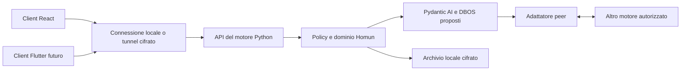

# 04 — API, client e rete tra installazioni

Stato: v0.1 da analizzare. **C:** Python + API indipendenti + React iniziale + possibilità Flutter + collegamento remoto. Endpoint e protocolli seguenti sono **P**, non API già esistenti. [Indice](README.md).

## AP-01 — Topologia



Il client può essere soltanto interfaccia: il telefono non deve ospitare un LLM o un motore completo. Un dispositivo desktop può essere client di uno spazio e host di un altro. Client→motore e motore→motore hanno contratti separati, anche se riusano il trasporto.

Il tunnel risolve raggiungibilità e protezione del collegamento; non sostituisce permessi, sincronizzazione o protocollo del lavoro. Stesso contratto API su loopback/LAN/remoto. Niente endpoint provider/segreti esposti direttamente al client.

## AP-02 — Convenzioni

Prefisso `/v1`; JSON UTF-8, ID opachi, date ISO8601 UTC, timezone separata. Contratto OpenAPI versionato; generazione e test client TypeScript/Dart. Compatibilità dichiarata dal motore, niente dipendenza da strutture interne React.

Letture paginate per cursor con limite massimo, filtri validati e ordinamento stabile. Nessuna lista senza limite. Scope workspace obbligatorio per dati condivisi; sessione autenticata determina attore e grants, non un actor_id arbitrario nel body.

Mutazioni con `command_id` stabile e `expected_version` della risorsa quando applicabile. Stesso ID/stesso payload restituisce il risultato già registrato; stesso ID/payload diverso è conflitto. Definire retention della deduplica prima del rilascio, mai dimenticare gli ID di effetti esterni ancora riconciliabili.

Esempio proposto:

```json
{
  "command_id": "cmd_123",
  "type": "plan.revise",
  "target_id": "work_456",
  "expected_version": 7,
  "payload": {"insert_after_step_id": "step_2", "title": "Traduci il catalogo", "agent_id": "agent_9"}
}
```

Risposta accettata contiene command_id, status, entity_id, version ed eventualmente operation_id/run_id. `202 accepted` significa registrato, non azione esterna conclusa. Risorse non visibili non rivelano dati tramite messaggi di errore.

## AP-03 — Superficie funzionale

Base delle risorse `/v1/workspaces/{workspace_id}` salvo endpoint host/personali.

| Route proposta | Responsabilità |
|---|---|
| `GET /v1/health`, `/v1/capabilities` | Stato minimo; dettagli diagnostici richiedono autorizzazione |
| `POST /v1/pairing/invitations`, `/accept` | Invito/pairing con prova identità e token monouso, rate limit |
| `POST /v1/sessions`, `DELETE /v1/sessions/{id}` | Apertura/revoca sessione secondo metodo scelto |
| `GET /conversations`, `/conversations/{id}/messages` | Chat e cronologia paginate |
| `POST /conversations/{id}/messages` | Testo, material_ids e riferimenti tipizzati; command_id |
| `GET /works`, `/works/{id}` | Proiezioni lavoro, criteri e stato |
| `POST /commands` | Creazione/modifica/avvio/pausa/annullamento/archivio con autorizzazione per tipo |
| `GET /works/{id}/plan`, `/runs/{id}` | Revisione e avanzamento effettivi |
| `GET /requests`, `POST /requests/{id}/responses` | Contributi e validazione |
| `GET /artifacts/{id}/versions`, `POST /reviews` | Risultati versionati e decisioni |
| `POST /action-approvals/{id}/decision` | Autorizzazione su action_hash/versione corrente |
| `GET /projects`, `/teams`, `/members`, `/agents` | Ricerca e selettori con identità/ruolo/capacità |
| `GET /materials`, `/materials/{id}` | Metadati, accesso e disponibilità nodo |
| `POST /uploads`, `PUT /uploads/{id}/parts/{part}`, `POST /uploads/{id}/complete` | Trasferimento riprendibile e validazione |
| `GET /materials/{id}/versions/{version}/content` | Download autorizzato con supporto range |
| `GET /plugins`, `/connections`, `/tool-grants` | Catalogo e capacità effettive; nessun segreto |
| `GET /automations`, `/automations/{id}/runs` | Regole/versioni/esecuzioni |
| `GET /memory`, `POST /memory/search` | Consultazione autorizzata con fonti; mutation via comandi |
| `GET /search`, `/notifications` | Risultati filtrati per ACL e inbox persistente |
| `GET/PATCH /settings/{scope}` | Configurazione con versione e permessi sullo scope |
| `GET /usage`, `/budgets`, `/audit` | Rendiconti e storico nei limiti del ruolo |
| `GET /events?cursor=...` | Stream eventi autorizzati |

Operazioni complesse come backup/export restituiscono operation_id e artifact scaricabile. Password/chiavi via endpoint dedicato del secret store, mai nei normali settings esportabili. Il catalogo comandi tipizzato è parte del contratto, non dispatch arbitrario di funzioni Python.

## AP-04 — Eventi e riconnessione

SSE proposto per messaggi/avanzamento; richieste HTTP per rispondere. Event envelope: event_id, schema_version, workspace_id, aggregate_id, aggregate_version, sequence, occurred_at, type, payload. La sequenza ordina gli eventi nell'autorità; non un orologio globale fra peer.

Eventi minimi: message.created/updated, plan.proposed/revised, work.state_changed, step.started/completed/blocked, contribution.requested/resolved, artifact.created, review.recorded, action.state_changed, notification.created/read, connection.state_changed, settings.changed.

Chunk streaming transitori separati dagli eventi finali persistiti. Al riavvio il client riceve testo persistito o parziale marcato; non è obbligatorio riprodurre ogni token. Last-Event-ID/cursor permette recupero; cursor scaduto → snapshot e nuova iscrizione senza buchi tramite watermark. Filtraggio ACL sul replay e invalidazione delle cache in caso di revoca.

Per browser, scegliere sessione cookie HttpOnly same-site tramite gateway locale oppure client streaming con header autorizzato; niente token nell'URL SSE. Flutter usa credenziali di sessione nel deposito sicuro del sistema. Handshake e rinnovo definitivi dipendono da D-NET-01/D-AUTH-01.

## AP-05 — Errori

Formato: code, message leggibile, request_id, retryable e details strutturati non sensibili. Codici: validation_error, version_conflict, permission_denied, input_missing, model_unavailable, connection_required, budget_exceeded, node_offline, execution_unknown, incompatible_version, storage_locked.

HTTP: 400 richiesta malformata; 401 sessione assente/scaduta; 403 azione vietata; 404 oggetto assente/non visibile; 409 conflitto; 413 materiale eccessivo; 429 limite con indicazione di ripresa; 503 nodo/provider non disponibile. Errori di run asincrona vanno nello stato della run, non soltanto nella risposta HTTP iniziale.

## NE-01 — Nodi e autorità

**P:** per ogni spazio una sola autorità del piano/permessi/budget. I file possono avere altri nodi custodi. Non copiare SQLite via rete. Replica solo dati autorizzati necessari; cache di lettura e bozze locali distinte da dati accettati dall'autorità.

La UI distingue: connesso, connessione diretta/relay, offline, in attesa di consegna, accesso revocato. Nodo spento non rende disponibili file mai trasferiti. Un nodo aziendale sempre acceso è facoltativo e non equivale a backend centrale del fornitore.

Discovery non implica fiducia. Pairing con invito monouso, scadenza, verifica fingerprint/codice e conferma del dispositivo; chiavi per device. Revoca device separata dalla membership della persona. Trasporto candidato da selezionare con test LAN, NAT e relay, non con sola demo localhost.

## NE-02 — Delega tra motori

Assignment: assignment_id, authority_id, work/run/step_attempt, plan_revision, capability, manifest input, policy_version, budget riservato, scadenza. Peer restituisce accepted/running/result/failed con ricevuta e consumo, non soltanto testo libero.

ACK trasporto distinto da accettazione e completamento. Duplicati non duplicano effetti. In perdita di rete: attività locale consentita sul contesto ricevuto entro scope; nuove azioni esterne condivise richiedono autorizzazione corrente. Non riassegnare un'azione incerta senza riconciliazione.

Credenziali restano sul nodo che esegue la capacità; nessuna replica automatica delle connessioni. Ogni delega trasferisce il minimo necessario, con versione e motivo registrati.

## NE-03 — Trasferimento, revoca e backup

Manifest: object_id, version, hash, size, mime, encryption metadata e destinatari. Blob a chunk con verifica finale, quote/rate limit e ripresa; nessun percorso filesystem arbitrario dal peer. Antimalware/parser isolation secondo formato e policy; materiale non interpretabile conservato senza fingere analisi.

Cancellazioni/revoche propagate con versioni/tombstone; la replica non può reintrodurre un oggetto più vecchio. Recupero chiavi e trasferimento autorità sono flussi espliciti. Failover automatico e multi-master fuori v1.

## AP-06 — Client e compatibilità

React si collega prima tramite adattatore senza cambiare UX. Flutter potrà usare lo stesso contratto con test di conformità su serializzazione, errori, paginazione, streaming e upload. OpenAPI aiuta a generare tipi; non garantisce da sola equivalenza UX o compatibilità del tunnel.

Versione API e protocollo peer indipendenti dal numero di release UI. Migrazioni testate con run sospese; feature capabilities permettono disabilitare azioni non supportate dal nodo. Nessun fallback silenzioso dal motore reale al simulatore.
