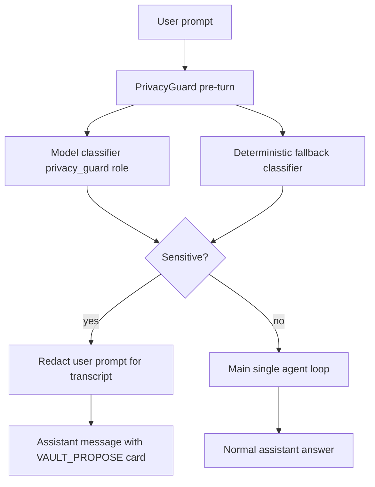

# Model-Based Privacy Guard Design

Date: 2026-06-30

## Goal

Sensitive personal data must not depend on a static keyword/regex classifier to enter
the Vault path. Before the main chat model sees a user turn, Homun should run a
dedicated Privacy Guard that classifies the message for Vault-worthy data across
languages and phrasings. If sensitive data is found, the normal chat turn stops and
the user sees a Vault proposal instead of a model-authored "I remembered it" answer.

This preserves the product boundary:

- memory stores redacted references only;
- Vault stores encrypted sensitive values;
- the main assistant loop remains the single guarded loop from ADR 0021;
- deterministic heuristics remain as an offline fallback and sanity check, not the
  primary understanding layer.

## Current Failure

The deterministic classifier in `crates/vault/src/sensitive.rs` already recognizes
Italian plates such as `FM470BN`, but the live chat path does not run a pre-turn
Vault gate. The message:

```text
ricordati che la targa della mia auto e' FM470BN e' un'audi q2
```

went through the main model, which replied that it had recorded the plate. No
`VAULT_PROPOSE` marker was emitted, so the user-visible behavior contradicted the
Vault boundary.

## Architecture

Add a new internal component, `PrivacyGuard`, owned by the desktop gateway. It runs
before `stream_chat_via_openai` calls the main provider.



The guard is a precondition check, not a second execution engine. It does not browse,
plan, use tools, or answer the user. It only returns a bounded classification object.

## Model Contract

The model classifier returns JSON with a small schema:

```json
{
  "has_sensitive_data": true,
  "items": [
    {
      "category": "vehicles",
      "kind": "vehicle_plate",
      "label": "Targa auto",
      "secret_value": "FM470BN",
      "redacted_preview": "[VAULT:vehicles:vehicle_plate]",
      "confidence": 0.92
    }
  ],
  "redacted_text": "ricordati che la targa della mia auto e' [VAULT:vehicles:vehicle_plate] e' un'audi q2"
}
```

Allowed categories stay aligned with `VaultCategory`: `payments`, `identity`,
`health`, `vehicles`, `credentials`, `private_notes`.

The classifier should identify both obvious identifiers and contextual sensitive
facts. For example, a plate plus the car model can become one vehicle secret value
if the phrase says "my car is ..."; a generic public car model alone is not
sensitive.

## Provider Policy

Default policy is local-first:

1. Use a configured `privacy_guard` role when present.
2. Prefer local providers/models for this role.
3. If no usable model is configured, run the deterministic classifier and fail
   conservatively for high-confidence built-in patterns.
4. Do not send potential secrets to the normal cloud chat provider only to decide
   whether they are sensitive.

If the only available guard would be a cloud model, Homun should not silently use it.
The first implementation can treat that as unavailable and fall back to the local
deterministic classifier. A later Settings control can let the user opt in.

## Turn Behavior

When the guard returns sensitive items:

- commit the user message with `redacted_text`, not the raw text;
- commit an assistant message containing `VAULT_PROPOSE` for each item or a grouped
  proposal when items belong together;
- do not call the main chat model for that turn;
- do not run normal memory extraction on the raw value;
- keep the raw `secret_value` out of assistant text and out of generic memory.

For the first implementation, the card can continue using the existing manual save
flow. To store the raw value without putting it into the transcript, the gateway
should keep a short-lived pending proposal sidecar keyed by proposal id. The UI sends
that id plus the PIN to `/api/vault/proposals/accept`; the gateway then encrypts the
pending secret and consumes the sidecar. If the sidecar expires, the UI asks the user
to re-enter the value in the Vault modal.

## Deterministic Fallback

The existing classifier remains useful:

- offline fallback;
- test oracle for known high-risk patterns;
- redaction defense if the model misses a clear built-in case;
- memory export redaction.

It must not be the only route for novel, multilingual, or contextual sensitive data.
The final classification can merge model items and deterministic detections, preferring
the more conservative sensitive decision when either side has high confidence.

## Errors And Ambiguity

- Classifier unavailable: fallback to deterministic classifier.
- Invalid JSON: retry once with a repair prompt, then fallback.
- Low confidence: ask a concise choice-style question in chat, not a normal memory
  confirmation.
- Multiple items: show a grouped Vault proposal with separate labels.
- User explicitly says not to store: do not create a Vault proposal, but still redact
  memory-bound text if sensitive values are present.

## Tests

The implementation must add tests for:

- model output parsing into `PrivacyGuardDecision`;
- deterministic fallback for `FM470BN`;
- pre-turn sensitive prompt returns `VAULT_PROPOSE` and does not call the main model;
- committed user message is redacted;
- accept proposal encrypts sidecar secret with PIN and consumes the sidecar;
- malformed model JSON falls back safely;
- non-sensitive messages continue to the normal loop.

## Documentation

Update `docs/architecture/vault.md` to describe the Privacy Guard as the primary
classification layer and deterministic classifier as fallback/redaction defense.
Update `docs/architecture/agent-loop.md` to show the pre-turn privacy gate before
the single agent loop. Update `docs/STATO.md` with implementation status and live
validation notes.

