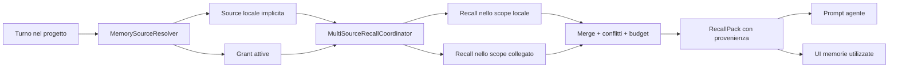
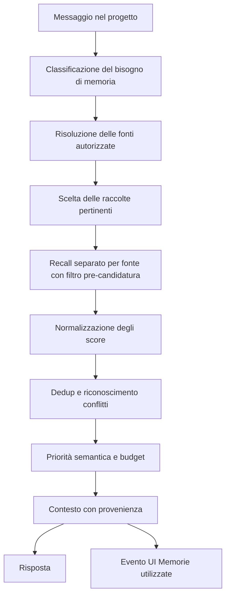
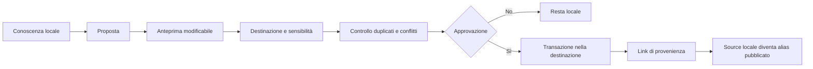

# Design — Fonti di memoria collegate ai progetti

Data: 2026-07-17. Stato: **approvato a livello di design**.

## Decisione

Ogni progetto mantiene una memoria propria, isolata e scrivibile. Il proprietario può
collegare in modo esplicito la memoria personale o la memoria di altri progetti come
**fonti autorizzate in sola lettura**.

Il collegamento non copia i record e non modifica la proprietà della memoria. È una vista
dinamica governata da una policy che limita raccolte, sensibilità e singoli record. Una
conoscenza attraversa davvero il confine tra due memorie soltanto attraverso una proposta
di pubblicazione mostrata e approvata dall'utente.

Il modello scelto è quindi:

- isolamento predefinito;
- collegamenti espliciti, revocabili e non transitivi;
- selezione per raccolte come controllo normale;
- inclusioni ed esclusioni di singole memorie come controllo avanzato;
- fonti collegate sempre in sola lettura;
- pubblicazione separata, esplicita e approvata;
- provenienza mantenuta fino al contesto e alla UI.

## Contesto verificato

La memoria canonica vive in `crates/memory/` ed è scoped per `(user_id, workspace_id)`.
Lo scope personale usa il workspace riservato `__personal__`; i progetti usano il proprio
`WorkspaceId`.

Oggi `MemoryPolicyEngine::decide_memory` nega un record quando utente o workspace della
richiesta non coincidono con quelli del record (`scope_mismatch`). Il recall lessicale e
vettoriale riceve inoltre uno scope singolo ed esplicito. Questa proprietà è corretta e non
deve essere indebolita.

Il briefing corrente fa però un'eccezione di prodotto: in un progetto legge anche le
preferenze dello scope personale. Con questo design l'eccezione scompare: anche le
preferenze personali richiedono una fonte esplicitamente collegata.

Il `ProjectAccessDialog` esistente risolve un problema differente: autorizza contatti e
canali a usare capacità del progetto (`can_use_project_memory`, automazioni, risposte,
artefatti). Non deve diventare lo store o la UI delle fonti di memoria. I due perimetri
restano separati e i loro deny si compongono.

## Obiettivi

1. Consentire a un progetto di usare conoscenza personale o di altri progetti senza
   trasformarla in una memoria globale implicita.
2. Preservare una sola copia canonica di ogni record collegato.
3. Rendere leggibile e revocabile ogni autorizzazione.
4. Applicare i filtri prima che un record possa diventare candidato del recall.
5. Conservare la provenienza in ranking, prompt, turn trace e UI.
6. Permettere la promozione di una conoscenza verso un'altra memoria soltanto con
   approvazione esplicita.
7. Conservare il comportamento fail-closed in caso di errore, scadenza o dati incoerenti.

## Non obiettivi

- Nessuna memoria globale accessibile automaticamente da tutti i progetti.
- Nessuna sincronizzazione bidirezionale automatica tra memorie.
- Nessuna scrittura diretta da un progetto dentro una fonte collegata.
- Nessuna ereditarietà A → B → C dei collegamenti.
- Nessuna condivisione multiutente nella prima versione. Il modello dati la prepara, ma
  inizialmente sorgente e consumatore appartengono allo stesso utente locale.
- Nessuna raccolta personalizzata dall'utente nella prima versione: le raccolte iniziali
  sono predicati di sistema stabili sopra tipi e metadata esistenti.
- Nessuna esportazione massiva attraverso il normale recall.

## Modello concettuale

### Spazi di memoria

Ogni record continua ad appartenere a uno e un solo `MemorySpace`, identificato dalla
coppia `(user_id, workspace_id)`:

| Spazio | Accesso dal progetto consumatore |
|---|---|
| Progetto attivo | Lettura e scrittura implicite |
| Personale collegato | Sola lettura, entro la grant |
| Altro progetto collegato | Sola lettura, entro la grant |
| Spazio non collegato | Nessun accesso |

Lo scope locale del progetto non è rappresentato da una grant: è una fonte implicita con
accesso completo. Tutte le altre fonti richiedono una grant attiva.

### Grant

Una `MemorySourceGrant` autorizza un progetto consumatore a leggere una vista limitata di
uno spazio sorgente.

```rust
struct MemorySourceGrant {
    id: String,
    consumer_user_id: UserId,
    consumer_workspace_id: WorkspaceId,
    source_user_id: UserId,
    source_workspace_id: WorkspaceId,
    max_sensitivity: DataSensitivity,
    expires_at: Option<String>,
    revoked_at: Option<String>,
    policy_version: u64,
    created_by: String,
    created_at: String,
    updated_at: String,
}

struct MemorySourceGrantCollection {
    grant_id: String,
    collection_key: String,
}

enum MemoryGrantOverrideEffect {
    Allow,
    Deny,
}

struct MemorySourceGrantOverride {
    grant_id: String,
    memory_ref: MemoryRef,
    effect: MemoryGrantOverrideEffect,
}
```

Le grant vivono in `memory.sqlite`, vicino alla policy e agli scope che governano. Non
vanno salvate in `workspaces.json`: revoca, scadenza, override e audit devono essere
transazionali e interrogabili dallo stesso boundary della memoria.

Vincoli dello store:

- una grant deve riferirsi a un consumer e a una source esistenti;
- in V1 `consumer_user_id == source_user_id`;
- il consumer non può essere `__threads__`;
- una grant non può puntare allo stesso spazio del consumer;
- un override può riferirsi soltanto a un record appartenente allo spazio sorgente;
- incrementare `policy_version` è obbligatorio a ogni modifica o revoca;
- la revoca è logica e conserva la storia; una nuova autorizzazione crea una nuova grant.

### Raccolte di sistema

La UI parla di raccolte; il motore le risolve in predicati stabili sui record esistenti.
La prima versione non introduce un secondo sistema di classificazione libero.

| Chiave | Etichetta UI | Predicato iniziale |
|---|---|---|
| `preferences` | Preferenze | `memory_type = preference` |
| `profile` | Profilo personale/professionale | `memory_type = fact` e metadata di profilo |
| `knowledge` | Conoscenze e note | `fact` e `note`, escluso profilo |
| `decisions` | Decisioni | `decision` |
| `goals` | Obiettivi e loop aperti | `goal`, `objective`, `open_loop` |
| `artifacts` | Artefatti e deliverable | `artifact` |
| `episodes` | Attività precedenti | `episode` |

Il registro delle raccolte è codice versionato e condiviso da UI, resolver e test. Una
chiave sconosciuta fa fallire la grant in modo chiuso; non equivale mai a “tutto”.

### Regola di autorizzazione effettiva

Un record di una fonte collegata è leggibile soltanto se sono vere tutte le condizioni:

```text
grant attiva
AND non scaduta
AND record appartenente esattamente alla source
AND sensibilità <= max_sensitivity
AND sensibilità != Secret
AND record non classificato come credenziale/Vault payload
AND (raccolta consentita OR override Allow sul record)
AND nessun override Deny sul record
```

`Deny` prevale sempre su `Allow`. `Secret` e i payload Vault non sono collegabili neppure
con un override individuale. Il default consigliato in UI è `Private`; alzare il limite a
`Confidential` richiede una conferma esplicita con copy di rischio.

## Architettura



### 1. `MemorySourceResolver`

Riceve l'identità dell'attore e lo scope del progetto attivo. Restituisce:

- la fonte locale implicita;
- solo le grant attive, non scadute e dello stesso utente;
- per ogni grant, la policy compilata di raccolte, sensibilità e override;
- un `policy_fingerprint` derivato dagli id e dalle `policy_version`.

Il resolver non segue mai le grant della source: risolve un solo livello. Non legge il
contenuto delle memorie e può essere usato prima del planner di recall.

### 2. Policy a due livelli, senza allargare lo scope

Il controllo cross-source è aggiuntivo, non sostitutivo:

1. `MemorySourceResolver` dimostra che il progetto può consultare una vista della source.
2. Per quella source viene costruita una normale `MemoryAccessRequest` con
   `user_id/workspace_id` uguali **alla source**.
3. `MemoryPolicyEngine` continua a verificare l'uguaglianza esatta tra richiesta e record.
4. I predicati della grant restringono ulteriormente i candidati.

In questo modo `MemoryPolicyEngine::decide_memory` conserva `scope_mismatch` e non accetta
mai direttamente una lista di workspace. Un errore nel coordinatore non trasforma la
policy esistente in una policy cross-scope permissiva.

### 3. `MultiSourceRecallCoordinator`

Il coordinatore interroga ogni fonte separatamente attraverso `MemoryRecallService`. Non
esegue una top-k globale su record di scope diversi.

Il contratto del recall deve diventare strutturato prima della fusione. `RecallHit`, oggi
non ancora popolato nel percorso principale, viene esteso almeno con:

```rust
struct RecallHit {
    memory_ref: String,
    text: String,
    score: f32,
    kind: String,
    source_user_id: UserId,
    source_workspace_id: WorkspaceId,
    source_label: String,
    collection_key: String,
    grant_id: Option<String>,
    sensitivity: DataSensitivity,
    status: MemoryStatus,
    updated_at: String,
}
```

Il blocco testuale per il prompt viene formato soltanto dopo policy, merge, dedup e budget.
La provenienza non deve essere ricostruita analizzando testo già formattato.

### 4. Filtro prima della candidatura

FTS e ricerca vettoriale devono ricevere uno scope sorgente e una policy compilata. Non è
sufficiente prendere una top-k della source e nascondere dopo i record non autorizzati:
oltre a sprecare il budget, questo può creare side channel nel ranking.

Il contratto di store/indice deve quindi supportare:

- tipi e raccolte ammesse;
- sensibilità massima;
- deny-list di `MemoryRef`;
- allow-list individuale;
- status ammessi;
- esclusione dei record pubblicati come alias.

L'indice vettoriale resta derivato e scoped per workspace. Non si crea un indice misto
cross-project.

## Workflow di richiamo



1. Il planner identifica le raccolte potenzialmente utili al messaggio.
2. Il resolver interseca tale richiesta con le raccolte concesse.
3. La memoria del progetto viene sempre interrogata quando il recall è pertinente.
4. Ogni fonte collegata viene interrogata soltanto per le raccolte pertinenti e concesse.
5. Gli score locali vengono normalizzati senza perdere source, status e timestamp.
6. I duplicati vengono rimossi per `MemoryRef`, link di pubblicazione e similarità.
7. I conflitti vengono mantenuti distinti.
8. Il budget finale garantisce spazio alla memoria locale e impedisce a una fonte ampia di
   monopolizzare il contesto.

Il planner può conoscere etichetta e raccolte concesse di una fonte, ma non riceve un
manifest dei suoi contenuti. Nessun fallback “prova tutte le memorie” è ammesso quando la
classificazione fallisce: si usa la fonte locale.

### Briefing sempre attivo

La memoria locale del progetto mantiene il proprio briefing. Le fonti collegate sono in
generale on-demand, con una sola raccolta a semantica sempre rilevante:

- `preferences`, se esplicitamente concessa dalla memoria personale, può contribuire a
  un piccolo tier always-on;
- tutte le altre raccolte collegate restano query-gated;
- preferenze personali senza grant non entrano mai nel progetto;
- loop aperti e obiettivi di altri progetti non entrano nel briefing del progetto attivo.

La cache del briefing deve includere `policy_fingerprint` e la generation di ogni source
effettivamente usata. Una revoca o modifica della grant invalida immediatamente il blocco.

### Ranking e conflitti

La priorità dipende dalla semantica, non da un peso globale nascosto:

- decisioni e stato del progetto: precedenza alla memoria del progetto attivo;
- preferenze e identità dell'utente: precedenza alla memoria personale;
- stesso spazio e stesso soggetto: precedenza a `Confirmed`, poi alla versione più recente;
- fonti diverse e contenuto incompatibile: entrambe restano rappresentate come conflitto.

Il modello non deve fondere silenziosamente due affermazioni incompatibili. Quando il
conflitto incide sulla risposta, Homun usa la fonte con precedenza semantica dichiarata e
segnala l'alternativa, oppure chiede conferma se la precedenza non è determinabile.

### Provenienza

Ogni hit conserva almeno `memory_ref`, source, collection, grant e score. Il prompt usa
marcatori strutturati di origine; il turn trace emette un evento tipizzato con soli
riferimenti e reason code. La UI può quindi mostrare “Memorie utilizzate” senza salvare una
copia del testo nell'audit.

La provenienza è parte del contratto, non una decorazione opzionale. Un hit senza source
valida non può essere iniettato.

## Workflow di pubblicazione

Una fonte collegata è sempre in sola lettura. La scrittura cross-space passa da una
`MemoryPublicationProposal` distinta dalle grant.



La proposta contiene:

- record sorgente e scope sorgente;
- scope destinatario;
- testo, tipo, raccolta e sensibilità proposti;
- eventuale record compatibile o conflittuale nella destinazione;
- stato `pending | approved | rejected | failed`;
- attore proponente e approvatore;
- timestamp e reason code.

Prima dell'approvazione la UI mostra il payload esatto. L'approvazione esegue una singola
transazione logica:

1. rivalida identità, source e destinazione;
2. ripete redazione Vault e controllo `Secret`;
3. ripete la ricerca di duplicati, perché lo stato può essere cambiato;
4. crea il record nella destinazione oppure aggiorna quello compatibile scelto;
5. crea un `MemoryPublicationLink` tra sorgente e destinazione;
6. marca il record sorgente come alias pubblicato, escluso dal recall normale;
7. chiude la proposta come approvata.

Se un passaggio fallisce, nessuna modifica parziale resta visibile. `superseded_by` non va
riusato implicitamente per link cross-scope finché le sue invarianti restano same-scope;
il link di pubblicazione è una relazione esplicita e auditabile.

La pubblicazione è un trasferimento consapevole di canonicità, non una sync. La revoca di
una grant futura non cancella il record pubblicato. Un'eventuale funzione “mantieni due
copie sincronizzate” è fuori scope.

## UX

### Impostazioni del progetto → Fonti di memoria

Stato vuoto:

```text
Memoria del progetto
Accesso completo · Sempre attiva

Fonti collegate
Nessuna fonte collegata
[ Collega una memoria ]
```

Il flusso “Collega una memoria”:

1. sceglie memoria personale o un altro progetto dello stesso utente;
2. seleziona le raccolte;
3. opzionalmente include o esclude singoli record;
4. sceglie sensibilità massima e scadenza;
5. mostra un riepilogo in linguaggio naturale;
6. conferma una grant in sola lettura.

Ogni card di fonte mostra raccolte, sensibilità, scadenza, ultima consultazione e azioni
“Modifica accesso” / “Revoca”. Nessuna azione è chiamata “sincronizza”.

La memoria personale non viene collegata automaticamente. L'onboarding può suggerire
“Usa le mie preferenze personali in questo progetto”, ma la checkbox parte disattivata e
il riepilogo precede la conferma.

### Memorie utilizzate

Ogni turno che usa memoria espone un pannello con:

- titolo/summary sicuro del record;
- etichetta della fonte;
- raccolta;
- motivo sintetico dell'uso;
- collegamento alla memoria, se l'utente può aprirla.

La UI non promette una citazione pubblica nella risposta: è una superficie di trasparenza
per l'utente. La provenienza resta disponibile anche quando la risposta non mostra badge.

### Revoca

La conferma di revoca spiega che:

- i richiami futuri vengono bloccati immediatamente;
- cache e briefing vengono invalidati;
- la memoria sorgente non viene cancellata;
- i record pubblicati con approvazione restano nella destinazione;
- le risposte già generate non possono essere modificate retroattivamente.

### Separazione da Project Access

La UI è una nuova superficie (`MemorySourcesDialog` o pagina equivalente), non una sezione
del `ProjectAccessDialog`. Un contatto può usare la memoria del progetto soltanto se il suo
Project Access lo permette; quando lo fa, vede la stessa vista effettiva già autorizzata al
progetto, ulteriormente ristretta dalle deny del contatto. Nessun grant di contatto può
creare o ampliare una fonte collegata.

## API e boundary

Il gateway espone operazioni tipate equivalenti a:

- lista fonti disponibili per il proprietario;
- lista grant effettive di un progetto;
- crea/modifica/revoca grant;
- anteprima della policy effettiva in linguaggio naturale;
- crea/approva/rifiuta proposta di pubblicazione;
- lista provenienze usate da un turno.

Le mutazioni richiedono l'identità del proprietario locale e rivalidano sempre source e
consumer server-side. Il client non invia `user_id` autorevoli. Il bridge desktop espone
tipi separati da `ProjectAccessGrant`.

Gli endpoint restituiscono reason code stabili (`grant_not_found`, `grant_expired`,
`source_scope_mismatch`, `collection_not_allowed`, `sensitivity_above_grant`,
`memory_explicitly_denied`, `secret_never_shareable`, `publication_conflict`) e copy UI
localizzata separatamente.

## Audit, cache e privacy

`access_audit` esiste ma la persistenza delle decisioni è oggi disabilitata perché
produceva righe opache e poco utili. Questa feature non deve riattivare il vecchio rumore.
Introduce invece eventi aggregati e leggibili per consultazione di fonte:

- consumer e source;
- grant e `policy_version`;
- turno;
- esito allow/deny/degraded;
- reason code;
- numero di candidati consentiti e numero di hit iniettati;
- riferimenti degli hit usati, senza query né testo della memoria.

Il pannello “Memorie utilizzate” deriva dall'evento tipizzato del turno. L'audit serve a
revoca, sicurezza e “ultima consultazione”, non a duplicare contenuti.

Ogni cache contenente risultati o briefing deve essere keyed almeno da:

```text
consumer scope
+ source scope
+ policy fingerprint
+ source generation
+ query/prompt fingerprint
```

Revoca, scadenza, modifica di raccolte/override o cambio di sensibilità provocano un miss
obbligatorio. Le cache di embedding della sola query, che non contengono dati di memoria,
possono restare condivise.

Vault e redaction restano il confine superiore: credenziali e payload critici non entrano
nella vista collegata. Nessun audit o trace salva valori redatti.

## Errori e degradazione

| Caso | Comportamento |
|---|---|
| Grant assente/scaduta/revocata | Deny, nessun fallback più ampio |
| Raccolta sconosciuta | Grant non valida, fail closed |
| Source temporaneamente indisponibile | Risposta con memoria locale; trace `degraded` |
| Source cancellata | Grant marcata dangling; UI richiede rimozione |
| Timeout di una source | Le altre fonti continuano; nessun retry in-path non limitato |
| Record spostato o cancellato | Override ignorato con warning; nessun accesso sostitutivo |
| Conflitto tra fonti | Nessuna fusione automatica |
| Revoca durante il recall | Rivalidazione del fingerprint prima dell'iniezione |
| Pubblicazione fallita | Rollback e proposta `failed`, nessun alias locale |
| Audit non disponibile | Accesso può continuare solo se la policy è valida; errore tracciato localmente |

La source locale resta sempre utilizzabile anche quando tutte le fonti collegate sono
degradate. L'indisponibilità di una fonte non deve bloccare il turno.

## Migrazione e compatibilità

- Le nuove tabelle sono additive.
- Nessuna grant viene creata per progetti esistenti.
- Il recall locale conserva il comportamento attuale.
- L'iniezione implicita di preferenze personali nei progetti viene rimossa e sostituita da
  una grant esplicita; questa è l'unica modifica intenzionale di comportamento.
- Per attenuare la sorpresa, al primo avvio dopo la migrazione Homun può proporre, senza
  preselezionarla, una grant limitata alla raccolta `preferences`.
- Personale continua a leggere la propria memoria senza grant.
- Thread episodici continuano a essere risolti dentro il progetto; non sono fonti
  collegabili autonomamente.
- Le grant dei contatti esistenti non vengono migrate né reinterpretate.

## Sequenza di consegna raccomandata

### Slice 1 — Policy e persistenza

Tabelle grant/collection/override, registro raccolte, resolver fail-closed, API di gestione
e test di policy. Nessun recall cross-source ancora attivo.

### Slice 2 — Recall strutturato e provenienza

Popolare davvero `RecallPack.hits`, aggiungere filtri pre-candidatura, coordinatore
multi-source, merge/conflitti/budget e typed event “memorie utilizzate”. Rimuovere
l'eccezione implicita delle preferenze personali soltanto quando la nuova grant è pronta.

### Slice 3 — UX e revoca

Pagina/dialog Fonti di memoria, riepilogo policy, override avanzati, audit aggregato,
invalidazione cache e gestione delle source degradate.

### Slice 4 — Pubblicazione

Proposte persistenti, anteprima, duplicate/conflict check, approvazione transazionale,
link di provenienza e alias pubblicati.

Ogni slice deve essere attivabile dietro feature flag fino alla prova end-to-end. Il flag
non può aggirare policy o Vault: `off` significa comportamento locale isolato.

## Verifica

### Policy/store

- progetto senza grant vede soltanto il proprio scope;
- grant personale limitata a `preferences` non espone fatti o episodi;
- grant verso progetto B non espone progetto C collegato a B;
- `Deny` individuale prevale sulla raccolta;
- `Allow` individuale non supera `Secret`, Vault o sensibilità massima;
- scadenza e revoca cambiano il fingerprint e bloccano subito;
- override con record di un'altra source viene rifiutato;
- collection key sconosciuta nega l'accesso.

### Recall

- FTS e vettoriale ricevono solo candidati autorizzati;
- hit identici da più fonti vengono deduplicati mantenendo la provenienza;
- decisione locale prevale su decisione progettuale collegata incompatibile;
- preferenza personale prevale sulla copia progettuale incompatibile;
- conflitto senza precedenza produce richiesta di conferma;
- una source lenta non impedisce il risultato locale;
- il budget non viene monopolizzato da una singola source;
- ogni hit iniettato ha source e grant valide;
- la revoca tra ricerca e iniezione viene intercettata.

### Briefing/cache

- senza grant nessuna preferenza personale entra in un progetto;
- grant `preferences` abilita soltanto il tier personale autorizzato;
- altri progetti non contribuiscono loop aperti always-on;
- cambio grant/generation invalida la cache;
- cache di un progetto non viene riusata da un altro.

### Pubblicazione

- una proposta rifiutata non modifica la destinazione;
- una proposta approvata crea o aggiorna una sola memoria canonica;
- il duplicate check viene ripetuto al momento dell'approvazione;
- errore intermedio non lascia destinazione o alias parziali;
- il link conserva source, destination e approvatore;
- revocare una grant non cancella la memoria pubblicata.

### UI/end-to-end

- stato vuoto chiaro e nessun opt-in preselezionato;
- riepilogo corrispondente alla policy effettiva;
- modifica e revoca visibili nel turno successivo;
- pannello “Memorie utilizzate” coerente con gli hit reali;
- Project Access di un contatto può restringere, mai ampliare, le fonti del progetto;
- smoke reale con Personale, progetto A e progetto B nello stesso runtime installabile.

## Criteri di accettazione

Il design è realizzato quando è possibile dimostrare, nello stesso runtime:

1. un progetto A isolato che non riceve alcun dato personale;
2. A collegato alle sole preferenze personali, senza accesso ad altri fatti;
3. A collegato alle decisioni di B, senza accesso transitivo alle fonti di B;
4. una revoca che elimina il dato dal turno immediatamente successivo e dalla cache;
5. una risposta che espone nella UI la provenienza reale degli hit usati;
6. una proposta approvata che pubblica una conoscenza e lascia un link auditabile;
7. assenza di Secret, Vault payload e record esplicitamente negati in candidati, trace,
   prompt e audit.
