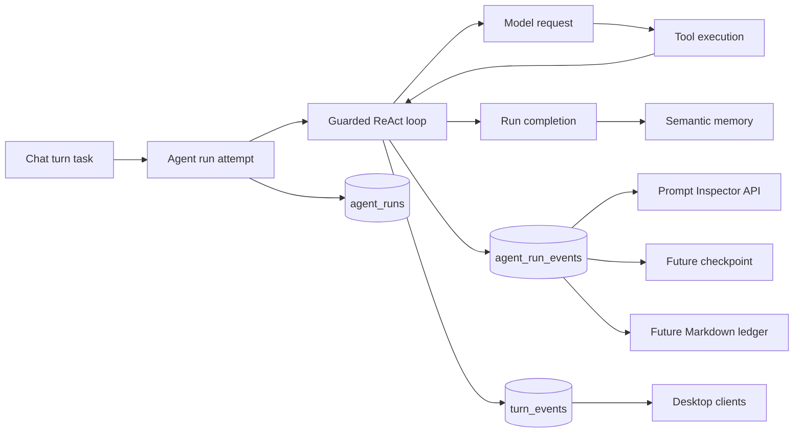

# Agent Execution Journal e Prompt Inspector — Design

**Data:** 2026-07-19  
**Stato:** approvato a livello concettuale; specifica scritta in attesa di review  
**Ambito:** prima tranche della roadmap agent-loop derivata dal confronto con Codex

## Sintesi

Homun possiede già un solo guarded ReAct loop, un broker durevole, `turn_events` per il replay della UI, un piano runtime persistito nella memoria e un `turn-trace.jsonl` diagnostico. Manca però una fonte strutturata e interrogabile che descriva l'esecuzione interna di ogni tentativo: quale payload è stato realmente presentato al modello, quali round sono avvenuti, quali tool sono partiti e terminati, quando il piano o il contesto sono cambiati e perché il run è finito.

Questa tranche introduce due capacità strettamente collegate:

1. un **Agent Execution Journal** append-only in SQLite, separato da `turn_events` e dalla memoria semantica;
2. un **Prompt Inspector** autenticato che espone l'ultima richiesta model-visible in forma redatta, ordinata e verificabile.

Il journal è osservabilità strutturata e fondazione per il futuro resume da checkpoint. Non implementa ancora il resume da metà turno, non sposta il runtime plan fuori dalla memoria e non genera un Working Ledger Markdown.

## Problema verificato

### Stato corrente

- `crates/engine/src/agent_loop.rs::run_turn` mantiene lo stato volatile in `LoopState` e guida più round modello/tool.
- `turn_events` persiste lo stream destinato ai client: delta, activity, piano, done, error e abort.
- `crates/engine/src/turn_trace.rs` scrive un file locale diagnostico best-effort, opzionale e non interrogabile dall'app.
- `recover_chat_turns_at_boot` marca l'esecuzione precedente come abortita e rimette il task in coda; il nuovo tentativo riparte dall'input durevole e dal piano runtime, non dall'ultimo round.
- `/api/chat/build_prompt` mostra il prompt runtime compresso, ma non il payload finale composto da messaggi, tool, modello e flag inviato a `ModelClient::generate`.

### Conseguenze

- Due tentativi dello stesso turno non hanno un'identità di run distinta e facilmente ispezionabile.
- Non si può dimostrare dalla UI quale contesto abbia visto il modello in uno specifico round.
- `turn_events` non deve diventare il contenitore di dettagli interni o dati sensibili solo per colmare il gap diagnostico.
- Il piano runtime usa la memoria come backend durevole, ma non esiste ancora un ledger operativo indipendente dalla memoria semantica.
- Un crash può causare la riesecuzione di lavoro già iniziato; il journal non risolve ancora l'idempotenza, ma rende osservabile e misurabile il problema.

## Alternative considerate

### A. Estendere `turn_events`

Si aggiungerebbero eventi interni come `model_request`, `tool_result` e `compaction` alla tabella già usata dalla UI.

**Vantaggi:** migrazione minima, replay e sequenza già disponibili.  
**Svantaggi:** mescola protocollo pubblico e diagnostica privata, aumenta il rischio di esposizione, gonfia lo stream e rende più difficile cambiare il journal senza rompere client storici.

**Decisione:** scartata.

### B. File JSONL per run, sul modello dei rollout Codex

Ogni tentativo scriverebbe un file append-only con tutti gli eventi.

**Vantaggi:** facile da ispezionare con strumenti testuali, scrittura sequenziale semplice.  
**Svantaggi:** secondo indice da sincronizzare con SQLite, gestione di retention e cancellazione più complessa, minore coerenza con il database locale unificato di Homun.

**Decisione:** non scelta per v1. Un export JSONL potrà essere aggiunto come vista del journal.

### C. Journal SQLite separato e proiezioni derivate

Due nuove tabelle nello stesso `homun.sqlite` conservano run ed eventi interni. `turn_events` resta il contratto client; l'eventuale JSONL e il Working Ledger diventano export rigenerabili.

**Vantaggi:** transazioni, query, retention e cancellazione nello stesso perimetro; separazione netta delle responsabilità; base adatta a checkpoint futuri.  
**Svantaggi:** richiede nuovi contratti engine/gateway e una migrazione additiva.

**Decisione:** approccio scelto.

## Architettura



### Confini di responsabilità

- **Engine:** definisce eventi engine-safe e chiama un port best-effort nei punti canonici del loop.
- **Gateway:** crea l'identità del run, redige i contenuti model-visible, costruisce le snapshot e adatta il port al `TaskStore`.
- **Task runtime:** persiste run ed eventi, assegna sequenze e offre query/retention; non interpreta prompt o tool.
- **API:** espone solo proiezioni redatte e autorizzate; non restituisce payload raw.
- **Memoria:** continua a conservare conoscenza, decisioni ed evidenze semantiche; non diventa il journal.

## Modello dati

### `agent_runs`

Una riga rappresenta un singolo tentativo di esecuzione di un `chat_turn`.

```sql
CREATE TABLE IF NOT EXISTS agent_runs (
  run_id             TEXT PRIMARY KEY,
  turn_id            TEXT NOT NULL,
  thread_id          TEXT,
  user_id            TEXT NOT NULL,
  workspace_id       TEXT NOT NULL,
  attempt            INTEGER NOT NULL,
  status             TEXT NOT NULL,
  model              TEXT,
  provider           TEXT,
  prompt_fingerprint TEXT,
  started_at         INTEGER NOT NULL,
  completed_at       INTEGER,
  terminal_reason    TEXT,
  schema_version     INTEGER NOT NULL,
  UNIQUE(turn_id, attempt)
);

CREATE INDEX IF NOT EXISTS idx_agent_runs_turn
  ON agent_runs(turn_id, attempt);

CREATE INDEX IF NOT EXISTS idx_agent_runs_scope
  ON agent_runs(user_id, workspace_id, started_at);
```

Stati v1: `running`, `completed`, `failed`, `aborted`, `cancelled`.

L'`attempt` è assegnato dal runtime come `MAX(attempt)+1` per `turn_id` nella stessa transazione che inserisce il run. Un recovery al boot chiude il run precedente come `aborted` prima di avviare il tentativo successivo.

### `agent_run_events`

```sql
CREATE TABLE IF NOT EXISTS agent_run_events (
  event_id      INTEGER PRIMARY KEY AUTOINCREMENT,
  run_id        TEXT NOT NULL,
  seq           INTEGER NOT NULL,
  round         INTEGER,
  kind          TEXT NOT NULL,
  payload_json  TEXT NOT NULL,
  created_at    INTEGER NOT NULL,
  UNIQUE(run_id, seq),
  FOREIGN KEY(run_id) REFERENCES agent_runs(run_id) ON DELETE CASCADE
);

CREATE INDEX IF NOT EXISTS idx_agent_run_events_run
  ON agent_run_events(run_id, seq);
```

Eventi v1:

- `run_started`
- `prompt_snapshot`
- `model_response`
- `tool_call_started`
- `tool_call_completed`
- `plan_updated`
- `context_compacted`
- `forced_synthesis`
- `run_completed`
- `run_failed`
- `run_aborted`

Il journal registra transizioni e metadati, non token streaming e reasoning raw. I delta continuano a vivere in `turn_events`; il reasoning raw non viene duplicato nel journal.

## Contratto engine

`crates/engine` introduce un modulo focalizzato `execution_journal.rs` con:

```rust
pub enum AgentRunEvent {
    PromptSnapshot(PromptSnapshot),
    ModelResponse(ModelResponseSummary),
    ToolCallStarted(ToolCallSummary),
    ToolCallCompleted(ToolCallResultSummary),
    PlanUpdated(PlanUpdateSummary),
    ContextCompacted(ContextCompactionSummary),
    ForcedSynthesis { reason: String },
}

pub trait ExecutionJournal {
    fn record(&self, round: Option<usize>, event: AgentRunEvent);
}
```

Il port è sincrono e non fallibile dal punto di vista del loop. L'adapter gateway usa un writer sequenziale in background: `record` accoda su un canale bounded senza effettuare I/O SQLite nel loop, mentre la chiusura del run attende un `flush` bounded prima di scrivere lo stato terminale. Se il canale è pieno, l'evento viene sostituito da un contatore locale di omissione; non si blocca il modello e non si crea memoria non limitata. Ogni errore viene registrato nei log locali e non modifica control-flow, risposta o tool execution. `ExecutionJournal::disabled()` rende gratuiti sub-turn browser e test che non richiedono osservabilità.

Il loop registra:

1. `prompt_snapshot` immediatamente prima di ogni `ModelClient::generate`;
2. `model_response` dopo normalizzazione della risposta;
3. start/end di ogni tool call, condividendo `call_id` e nome;
4. ogni sostituzione del piano canonico;
5. ogni compattazione effettivamente applicata;
6. la sintesi forzata e la ragione che l'ha attivata.

Gli eventi terminali e l'apertura del run restano responsabilità del gateway/task executor, che conosce `turn_id`, retry e stato del broker.

## Prompt Snapshot

La snapshot rappresenta la richiesta realmente presentata al `ModelClient`, non il solo prompt utente.

```rust
pub struct PromptSnapshot {
    pub model: String,
    pub provider: String,
    pub is_final_round: bool,
    pub forced_tool: Option<String>,
    pub messages: Vec<PromptMessageSnapshot>,
    pub tools: Vec<PromptToolSnapshot>,
    pub total_chars: usize,
    pub fingerprint: String,
}

pub struct PromptMessageSnapshot {
    pub position: usize,
    pub role: String,
    pub content: serde_json::Value,
    pub content_chars: usize,
    pub content_hash: String,
    pub redacted: bool,
}

pub struct PromptToolSnapshot {
    pub position: usize,
    pub name: String,
    pub schema_chars: usize,
    pub schema_hash: String,
}
```

Regole:

- l'ordine di messaggi e tool è preservato;
- `content` contiene esclusivamente la versione redatta;
- immagini data URL diventano metadati `{kind, mime_type, byte_length, sha256}`;
- chiavi e valori noti come sensibili sono rimossi prima della serializzazione;
- tool schema completi non vengono duplicati: nome, dimensione e hash bastano a verificare quale schema fosse attivo;
- `fingerprint` è calcolato sulla rappresentazione canonica redatta più gli hash degli schemi;
- ogni snapshot ha un limite serializzato di 64 KiB; oltre il limite, i contenuti più vecchi sono sostituiti da marker con hash e dimensione, senza alterare ordine e fingerprint complessivo;
- la redazione usa il percorso canonico già disponibile nel gateway, non una seconda implementazione divergente nel `TaskStore`.

## Prompt Inspector API

Nuova rotta autenticata:

```text
GET /api/chat/turns/{turn_id}/runs
GET /api/chat/runs/{run_id}/events?since=<seq>
GET /api/chat/runs/{run_id}/prompt/latest
```

La prima restituisce i tentativi del turno; la seconda gli eventi redatti; la terza l'ultima `PromptSnapshot`.

Comportamento:

- `404` se run o snapshot non esistono;
- `400` per cursori non validi;
- nessun endpoint raw o flag per disabilitare la redazione;
- gli endpoint usano l'autenticazione gateway esistente;
- la UI non è inclusa in questa tranche: le API rendono il dato verificabile e preparano una successiva vista sviluppatore.

## Recovery, cancellazione e retention

- Al boot, quando un `chat_turn` running viene recuperato, l'ultimo `agent_run` ancora `running` viene chiuso come `aborted` con `terminal_reason=lease_expired_at_boot`.
- Il nuovo tentativo riceve un nuovo `run_id` e `attempt`; gli eventi precedenti non vengono sovrascritti.
- La cancellazione di un thread/workspace elimina anche run ed eventi correlati nello stesso flusso di purge già esistente, filtrando sulle colonne scope di `agent_runs`; la correttezza non dipende dalla presenza di una riga `tasks` già cancellata.
- V1 conserva gli ultimi 20 run per thread e tutti i run non terminali. La potatura avviene dopo la chiusura di un run, best-effort.
- Il journal non è ancora usato per riprendere un `LoopState`; nessun codice deve fingere una garanzia di exactly-once.

## Sicurezza e privacy

- Il journal è redatto **prima** della persistenza.
- API key, PIN, token OAuth, segreti Vault, valori sensibili e payload immagine raw non possono apparire in `payload_json`.
- Gli argomenti dei tool sono registrati come chiavi presenti, hash canonico e preview redatta bounded; mai come raw JSON completo per default.
- I risultati dei tool conservano stato, dimensione, hash, tipo di evidenza e preview redatta bounded.
- Un errore di redazione o serializzazione causa la sostituzione dell'evento con un record minimale `journal_payload_omitted`; non deve fare fail-open sui contenuti.
- Il journal non viene inviato alla memoria semantica automaticamente.

## Osservabilità e compatibilità

- Migrazione esclusivamente additiva; nessuna modifica al wire format di `turn_events`.
- `turn-trace.jsonl` resta disponibile durante la migrazione e potrà essere ritirato solo dopo confronto di parità.
- Ogni evento include `schema_version`; lettori futuri ignorano campi sconosciuti.
- Le scritture del journal sono best-effort e non aumentano il numero di round né cambiano la selezione degli strumenti.
- Una metrica locale conta eventi omessi, errori di persistenza e snapshot troncate.

## Strategia di test

### Task runtime

- la migrazione crea tabelle e indici senza alterare database esistenti;
- due run sullo stesso turno ricevono attempt `1` e `2`;
- le sequenze degli eventi sono monotone e isolate per run;
- la cancellazione elimina gli eventi del run;
- abort al recovery chiude solo il run `running` corretto;
- la retention conserva run attivi e gli ultimi 20 terminali.

### Engine

- il primo evento di ogni round è la snapshot precedente alla chiamata modello;
- tool start e completion condividono lo stesso `call_id`;
- piano, compattazione e sintesi forzata producono un solo evento per transizione;
- un journal che rifiuta le scritture non cambia l'output del turno;
- `ExecutionJournal::disabled()` è un no-op.

### Redazione e prompt

- un messaggio con token, PIN e data URL non conserva alcun valore raw;
- ordine, ruoli, dimensioni e hash restano disponibili;
- input equivalenti producono lo stesso fingerprint;
- una variazione di messaggio, tool schema o forced tool cambia il fingerprint;
- il limite di 64 KiB produce marker verificabili e non JSON invalido.

### API

- una richiesta autenticata legge run, eventi e snapshot;
- run inesistente e snapshot assente restituiscono `404`;
- `since` restituisce solo eventi successivi;
- la risposta non contiene i segreti usati dal fixture test.

## Criteri di accettazione

1. Ogni tentativo broker di un turno ha un `run_id` distinto e uno stato terminale verificabile.
2. Ogni round del loop reale produce una `PromptSnapshot` prima della chiamata modello.
3. Nessun segreto o immagine raw dei fixture compare nelle nuove tabelle o nelle API.
4. `turn_events`, transcript, piano e risposta finale restano byte-for-byte compatibili nei test esistenti.
5. Un errore del journal non può interrompere o modificare un turno.
6. Recovery al boot conserva il run abortito e apre un nuovo attempt senza sovrascrivere la storia.
7. Le suite mirate di `local-first-engine`, `local-first-task-runtime` e `local-first-desktop-gateway` sono verdi.

## Fuori scope e tranche successive

### Tranche 2 — Runtime plan store dedicato

Spostare il piano canonico in tabelle di control-state e mantenere memoria/grafo come proiezioni semantiche.

### Tranche 3 — Checkpoint e idempotenza

Persistire un `LoopCheckpoint` ricostruibile a confine di round e introdurre idempotency key per tool effectful. Solo questa tranche abiliterà il resume senza ripartenza completa.

### Tranche 4 — Prompt packets e istruzioni gerarchiche

Scomporre il system prompt monolitico in pacchetti tipizzati con origine, priorità, budget e fingerprint; aggiungere istruzioni gerarchiche di progetto.

### Tranche 5 — Working Ledger Markdown

Generare un documento leggibile da journal, piano e artefatti. Il file sarà sempre rigenerabile e non diventerà fonte di verità.

## Decisioni definitive della tranche

- SQLite è il backend canonico; JSONL sarà eventualmente un export.
- Journal interno e `turn_events` pubblico rimangono separati.
- Persistenza esclusivamente redatta, senza modalità raw.
- Il journal è best-effort e non partecipa al control-flow.
- Il Prompt Inspector v1 mostra il payload finale per messaggi/tool, non ancora i sotto-pacchetti semantici del system prompt.
- Nessuna promessa di exactly-once o resume da metà turno viene introdotta in questa fase.
