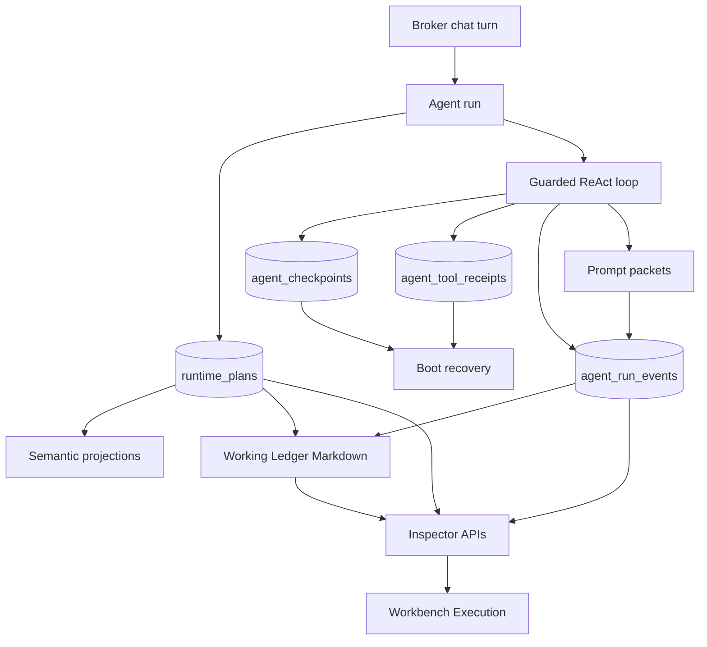

# Agent Loop Roadmap Completion — Design

**Data:** 2026-07-19
**Stato:** approvato dall'autorizzazione esplicita a completare la roadmap in autonomia
**Dipendenza:** Agent Execution Journal e Prompt Inspector v1

## Obiettivo

Completare la roadmap agent-loop trasformando il journal già implementato nella base operativa di un runtime realmente riprendibile e ispezionabile. Il risultato deve separare nettamente control-state e memoria semantica, evitare la ripetizione cieca delle azioni con effetti, rendere verificabile la gerarchia del prompt, produrre un Working Ledger rigenerabile e offrire una vista desktop non tecnica per ispezionare l'esecuzione.

## Scomposizione e ordine

La roadmap viene completata in cinque tranche dipendenti:

1. Runtime Plan Store dedicato;
2. checkpoint di round e ricevute idempotenti dei tool;
3. prompt packets e istruzioni gerarchiche di progetto;
4. Working Ledger Markdown;
5. Prompt Inspector nel Workbench desktop.

Questo ordine è obbligatorio: checkpoint e ledger devono riferirsi al piano canonico, mentre la UI deve leggere contratti backend già stabilizzati.

## Alternative considerate

### A. Continuare a usare memoria e transcript come control-state

Riduce le migrazioni ma mantiene il problema attuale: conoscenza, piano operativo e recovery hanno lifecycle e regole di accesso differenti. Il transcript non può garantire idempotenza e la memoria non deve essere il database del loop.

### B. Nuovo runtime separato con database proprio

Offre isolamento forte, ma duplica scope, retention, cancellazione e migrazioni già risolte nel database unificato. Introduce inoltre transazioni distribuite tra task, run e checkpoint.

### C. Control-state additivo nello stesso TaskStore

È l'approccio scelto. Nuove tabelle nello stesso `homun.sqlite` condividono transazioni, ownership e purge con task e run. Memoria, grafo e Markdown diventano proiezioni; nessuna di queste superfici controlla l'esecuzione.

## Architettura finale



## 1. Runtime Plan Store dedicato

### Modello

La migrazione v6 aggiunge `runtime_plans`:

```sql
CREATE TABLE runtime_plans (
  user_id          TEXT NOT NULL,
  workspace_id     TEXT NOT NULL,
  thread_id        TEXT NOT NULL,
  status           TEXT NOT NULL,
  plan_json        TEXT NOT NULL,
  revision         INTEGER NOT NULL,
  stall_turns      INTEGER NOT NULL DEFAULT 0,
  last_resume_done INTEGER NOT NULL DEFAULT 0,
  created_at       INTEGER NOT NULL,
  updated_at       INTEGER NOT NULL,
  PRIMARY KEY(user_id, workspace_id, thread_id)
);
```

`open`, `settled` e `cancelled` sono gli stati ammessi. Ogni upsert incrementa `revision` in una transazione. Il piano viene caricato e verificato usando sempre `(user_id, workspace_id, thread_id)`; nessun active workspace globale può cambiare lo scope di un thread.

### Migrazione del comportamento

- `GatewayPlanProgress` scrive prima nel `TaskStore` canonico.
- Resume, plan precedence e stall guard leggono esclusivamente il nuovo store.
- Il vecchio record memoria `source=runtime_plan` rimane temporaneamente una proiezione compatibile e non è più autorità.
- Gli outcome verificati dei singoli step restano memoria episodica: sono conoscenza/evidenza, non control-state.
- Thread e workspace purge eliminano il piano nello stesso flusso già usato dal journal.

## 2. Checkpoint di round e idempotenza

### Checkpoint

`agent_checkpoints` conserva l'ultimo stato riprendibile di ogni run a confine di round:

```sql
CREATE TABLE agent_checkpoints (
  checkpoint_id    INTEGER PRIMARY KEY AUTOINCREMENT,
  run_id           TEXT NOT NULL,
  turn_id          TEXT NOT NULL,
  round            INTEGER NOT NULL,
  state_json       TEXT NOT NULL,
  state_fingerprint TEXT NOT NULL,
  resumable        INTEGER NOT NULL,
  created_at       INTEGER NOT NULL,
  UNIQUE(run_id, round),
  FOREIGN KEY(run_id) REFERENCES agent_runs(run_id) ON DELETE CASCADE
);
```

Il checkpoint contiene solo stato engine-safe: messaggi sanitizzati, piano, contatori, evidenze, tool caricati, trace e metadati provider senza API key. Data URL e chiavi sensibili vengono redatti con la stessa policy del journal. Lo stato browser privato e una sessione live non sono serializzati; un resume riapre il browser quando necessario.

Il loop emette un checkpoint all'inizio di ogni round, dopo che il round precedente ha completato tutti i tool-result pairing. Il writer sequenziale persiste checkpoint ed eventi nello stesso ordine. Un nuovo attempt può riprendere solo il checkpoint più recente di un run precedente chiuso con `gateway_restart`; cancellazioni utente e fallimenti terminali non sono ripresi.

Se il checkpoint è marcato non riprendibile per redazione/troncamento, il runtime riparte dal seed ma conserva piano e ricevute, evitando di fingere un resume esatto.

### Ricevute tool

`agent_tool_receipts` applica un confine at-most-once alle azioni con effetti:

```sql
CREATE TABLE agent_tool_receipts (
  turn_id          TEXT NOT NULL,
  idempotency_key  TEXT NOT NULL,
  run_id           TEXT NOT NULL,
  tool_name        TEXT NOT NULL,
  args_fingerprint TEXT NOT NULL,
  status           TEXT NOT NULL,
  result_json      TEXT,
  effects_json     TEXT,
  created_at       INTEGER NOT NULL,
  completed_at     INTEGER,
  PRIMARY KEY(turn_id, idempotency_key)
);
```

La chiave è SHA-256 di `turn_id + tool_name + argomenti JSON canonici`. Prima dell'esecuzione il gateway inserisce atomicamente `started`:

- riga assente: il tool può partire;
- `completed`: il risultato redatto e gli effetti engine-safe vengono riusati;
- `started`: l'esito è incerto, quindi il tool non viene ripetuto automaticamente e il turno riceve un messaggio di recovery verificabile.

Il sistema non promette exactly-once verso servizi esterni che non espongono idempotency key. Garantisce invece che Homun non rilanci alla cieca un'azione già iniziata.

## 3. Prompt packets e istruzioni gerarchiche

### Contratto

Il prompt di sistema viene composto da pacchetti tipizzati e ordinati:

```rust
pub struct PromptPacket {
    pub id: String,
    pub source: PromptPacketSource,
    pub priority: u16,
    pub content: String,
    pub chars: usize,
    pub sha256: String,
}
```

Ordine crescente e stabile:

1. `core` — metodo e policy generali Homun;
2. `workspace` — contesto e memoria autorizzata;
3. `project` — `AGENTS.md` e `.homun/instructions.md` del progetto collegato;
4. `thread` — perimetro contatto/routing;
5. `runtime` — sicurezza, modalità, forced tool e vincoli del turno.

I file progetto sono letti solo dalla root già autorizzata, senza seguire percorsi esterni, con limite complessivo di 32 KiB. Le istruzioni personali non diventano automaticamente istruzioni progetto e viceversa. Il testo composto resta compatibile con i provider esistenti, mentre il Prompt Inspector riceve origine, priorità, dimensione e fingerprint di ogni packet.

## 4. Working Ledger Markdown

Il ledger è una proiezione deterministica, non una fonte di verità. Viene rigenerato da:

- runtime plan canonico;
- run e stato terminale;
- timeline redatta degli eventi;
- checkpoint più recente;
- ricevute tool e loro stato;
- artifact riferiti dagli eventi disponibili.

Formato minimo:

```markdown
# Working Ledger

## Scope
## Current plan
## Runs
## Timeline
## Tool receipts
## Recovery
```

Il gateway lo materializza sotto il data directory locale in `ledgers/<thread-hash>.md` al confine terminale del run e lo espone anche tramite API. Cancellare il thread elimina il file; una mancata scrittura del file non compromette il run perché il ledger è sempre rigenerabile dal database.

## 5. Prompt Inspector desktop

Il Workbench aggiunge la vista `Execution`, coerente con i pannelli esistenti. Mostra:

- tentativi e relativo stato;
- timeline degli eventi;
- ultimo prompt model-visible redatto;
- pacchetti con origine, priorità e fingerprint;
- piano canonico e stato recovery;
- Working Ledger renderizzato.

La UI non offre modalità raw, non mostra API key e non consente di modificare control-state. Errori e assenza dati hanno empty state espliciti. La vista usa endpoint scope-checked per thread, evitando che il client debba dedurre il turn id dal transcript.

## API aggiuntive

```text
GET /api/chat/threads/{thread_id}/runs
GET /api/chat/threads/{thread_id}/runtime-plan
GET /api/chat/threads/{thread_id}/ledger
GET /api/chat/runs/{run_id}/checkpoint/latest
```

Tutte le route usano autenticazione esistente e ownership `(user, workspace, thread)`. Run o thread fuori scope restituiscono `404`.

## Error handling e recovery

- Il piano canonico è fail-closed per le scritture: se non può essere persistito non viene dichiarato durevole.
- Journal e ledger restano best-effort e non cambiano la risposta del modello.
- Un checkpoint corrotto o con fingerprint errato viene ignorato e registrato come recovery degradato.
- Una receipt `started` non viene cancellata automaticamente: richiede verifica o una nuova azione esplicita dell'utente.
- Le migrazioni sono additive e idempotenti; nessun database di test esistente deve perdere dati.

## Test e criteri di accettazione

1. Il piano riparte dal `TaskStore` anche con memoria runtime-plan assente.
2. Scope diversi con lo stesso `thread_id` non condividono piano, run, checkpoint o ledger.
3. Un crash dopo un round produce un nuovo attempt che carica l'ultimo checkpoint valido.
4. Una stessa azione effectful non viene eseguita due volte sullo stesso turn/fingerprint.
5. Una receipt incerta blocca il replay automatico invece di dichiarare successo.
6. Packet equivalenti hanno fingerprint stabile; la gerarchia progetto è deterministica e jail-scoped.
7. Nessun fixture secret o data URL raw compare in checkpoint, receipt, ledger o API.
8. Il ledger è deterministico e rigenerabile dopo la cancellazione del file.
9. Il Workbench compila e visualizza run, prompt, packets, timeline e ledger senza endpoint raw.
10. Le suite di task-runtime, engine, gateway e la build desktop terminano con codice `0`.

## Non-obiettivi

- Non viene promesso exactly-once per provider esterni privi di supporto idempotente.
- Non viene persistito reasoning raw.
- Il Working Ledger non sostituisce task, journal, piano o memoria.
- Non vengono importate istruzioni da directory non collegate o da memorie non autorizzate.
