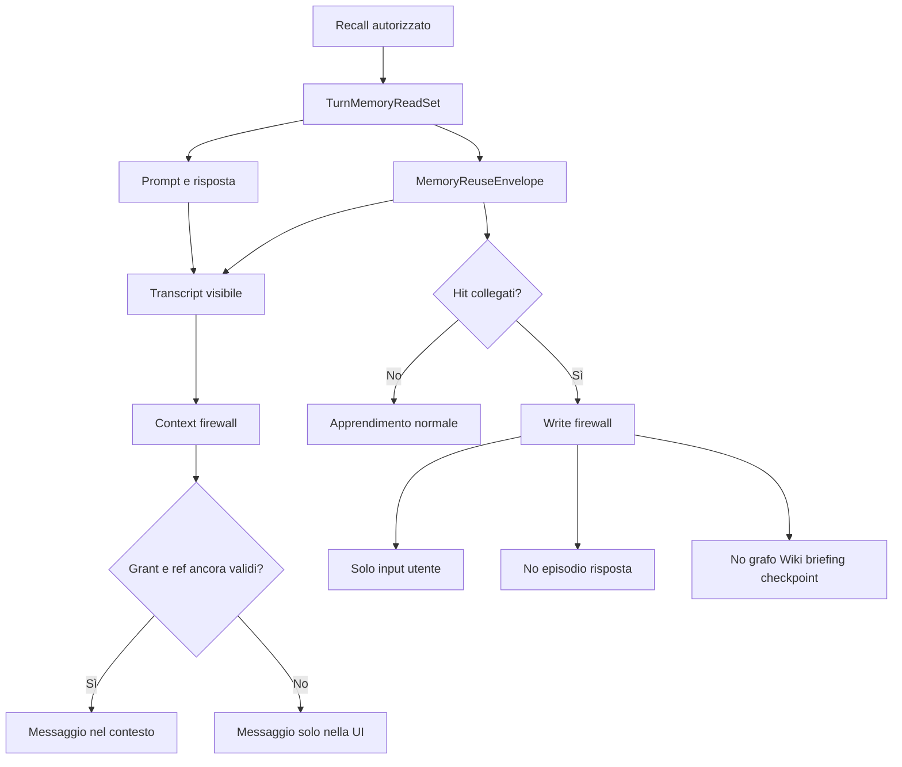

# Design — Firewall di sola lettura per le memorie collegate

Data: 2026-07-19. Stato: **approvato a livello di design**.

## Decisione

Una memoria collegata a un progetto è una vista temporanea in sola lettura. Il progetto
può usarla per rispondere mentre la grant è valida, ma nessun contenuto ottenuto tramite
la grant può diventare memoria del progetto, episodio, entità, relazione, pagina Wiki,
briefing, embedding, checkpoint di compattazione o altro dato richiamabile.

La risposta resta nel transcript della chat originaria. Il transcript è un documento
storico visibile all'utente, non una fonte di memoria. Quando la grant non è più valida,
la risposta resta visibile nell'interfaccia ma viene esclusa dal contesto inviato al
modello.

Il confine è deterministico e applicato dal runtime. Non dipende da prompt, classificatori
LLM, confronti testuali o dalla disciplina del modello.

## Sostituzione del design precedente

Questa specifica integra e corregge
`docs/superpowers/specs/2026-07-17-project-linked-memory-sources-design.md`.

Restano valide le decisioni su isolamento predefinito, grant dirette, assenza di
transitività, provenienza strutturata, revoca fail-closed e recall separato per fonte.

È invece sostituita la precedente possibilità di pubblicare una conoscenza ottenuta da
una fonte collegata. Un hit letto tramite grant non può essere copiato o pubblicato nella
memoria consumer, neppure attraverso una conferma esplicita. Se il proprietario vuole
continuare a renderlo disponibile, mantiene attiva la grant.

La pubblicazione di record già locali e non ottenuti tramite una grant resta fuori dal
perimetro di questa specifica.

## Contesto verificato

Il test locale ha dimostrato questa sequenza:

1. il progetto Homun ha richiamato correttamente una memoria personale autorizzata;
2. la revoca ha incrementato `policy_version`, rimosso la fonte attiva e mantenuto
   `memory.sqlite` integro;
3. una nuova chat nello stesso progetto ha comunque recuperato il valore revocato;
4. gli eventi del turno hanno mostrato che la fonte personale non era più interrogata;
5. `recall_memory` ha invece restituito episodi `__threads__` come fonte locale, con
   `grant_id = null`, inclusa una sintesi della precedente risposta autorizzata.

Il comportamento nasce da più percorsi che oggi non condividono lo stesso boundary:

- `recall_memory(...)` aggiunge gli episodi di `__threads__` dopo il recall autorizzato e
  li rappresenta come memoria locale del progetto;
- `MemoryRecallService::learn(...)` e il percorso inline passano all'estrattore il testo
  della risposta senza il `RecallPack` che l'ha prodotta;
- `store_episode(...)` salva una sintesi del turno in `__threads__` con il solo workspace
  originario, senza provenance della grant;
- `compact_for_context_budget(...)` tratta la conversazione precedente come materiale
  memorizzabile e può creare un secondo percorso di copia;
- la ricostruzione del contesto della chat può reinviare al modello una vecchia risposta
  anche dopo la revoca.

La correzione deve quindi coprire sia le scritture sia la ricostruzione del contesto.

## Obiettivi

1. Impedire qualsiasi persistenza richiamabile del contenuto letto da una fonte
   collegata.
2. Conservare il transcript originario senza trasformarlo in memoria.
3. Rendere effettive revoca, scadenza e modifica della grant anche nelle chat esistenti.
4. Consentire l'apprendimento di informazioni nuove scritte direttamente dall'utente in
   un turno che usa anche una memoria collegata.
5. Conservare provenienza e decisioni di policy senza duplicare il testo della source.
6. Ripulire in modo idempotente i dati derivati già contaminati.
7. Mantenere invariati il recall a grafo, il ranking multi-source e la proprietà canonica
   dei record sorgente.

## Non obiettivi

- Non cancellare o modificare la memoria sorgente.
- Non cancellare il transcript della chat.
- Non nascondere all'utente una risposta già ricevuta.
- Non introdurre euristiche testuali per riconoscere il contenuto copiato.
- Non disabilitare tutto l'apprendimento del turno quando il messaggio dell'utente
  contiene nuove informazioni locali.
- Non cambiare la semantica delle memorie esclusivamente locali.
- Non rendere transitivi i collegamenti.

## Invarianti

1. **Una sola copia canonica.** Il contenuto collegato rimane solo nella source.
2. **Transcript non equivale a memoria.** Visibilità storica e riuso automatico sono
   capacità separate.
3. **Provenienza prima del testo.** Ogni uso collegato conserva source, grant, versione e
   riferimenti prima di formattare il prompt.
4. **Scrittura negata per costruzione.** I contenuti derivati non raggiungono gli input
   dei writer.
5. **Contesto fail-closed.** Una policy non verificabile equivale a policy non valida.
6. **Revoca senza cancellazione della storia.** La UI conserva il messaggio; il modello
   non può più riceverlo.
7. **Più source, una sola validità.** Se una risposta dipende da più grant, tutte devono
   essere ancora valide per riusare il messaggio nel contesto.
8. **Nessun payload nell'audit.** La provenance tecnica non contiene il testo richiamato.

## Modello dati

### `TurnMemoryReadSet`

Il turno accumula tutti gli hit realmente iniettati nel modello:

```rust
struct TurnMemoryReadSet {
    linked: Vec<LinkedMemoryRead>,
}

struct LinkedMemoryRead {
    source_workspace_id: WorkspaceId,
    grant_id: String,
    policy_version: u64,
    memory_ref: MemoryRef,
    source_revision: String,
}
```

Il read set contiene solo identificativi e versioni. Non duplica `text`, alias o metadata
della source. `source_revision` è un fingerprint del record autorizzato, non del prompt o
del transcript. Gli hit locali non devono essere inseriti in `linked`.

Il read set è costruito dagli stessi `RecallHit` autorizzati usati per il prompt. Non può
essere ricostruito dal testo della risposta o dai messaggi del modello.

### `MemoryReuseEnvelope`

Ogni risposta dell'assistente conserva nello stesso record del transcript un envelope
derivato dal read set:

```rust
enum MemoryWritePolicy {
    Normal,
    UserInputOnly,
    BlockedUnknown,
}

struct MemoryReuseEnvelope {
    write_policy: MemoryWritePolicy,
    linked_reads: Vec<LinkedMemoryRead>,
}
```

Semantica:

- `Normal`: nessun hit collegato ha informato la risposta;
- `UserInputOnly`: la risposta usa almeno una fonte collegata; soltanto il testo scritto
  direttamente dall'utente può alimentare l'apprendimento;
- `BlockedUnknown`: provenienza attesa ma mancante, corrotta o non persistita; nessun
  riuso automatico è permesso.

Il dato canonico resta strutturato nel messaggio insieme agli event parts del recall. Una
eventuale flag denormalizzata serve solo per selezione rapida e deve essere derivabile
dall'envelope, mai autoritativa da sola.

### Persistenza atomica

Testo del messaggio, event parts di recall e `MemoryReuseEnvelope` devono essere salvati
nella stessa transazione SQLite. Non è ammesso un messaggio riusabile senza provenance
quando durante il turno sono stati iniettati hit collegati.

Se la transazione non può attestare il confine, il messaggio può essere mostrato ma viene
persistito come `BlockedUnknown` e resta escluso da apprendimento e contesto del modello.

## Architettura



### 1. Provenance collector del turno

Il loop agente deve osservare tutti gli eventi `Recall` realmente consegnati al modello,
inclusi il recall automatico e le chiamate esplicite a `recall_memory`.

Il collector:

- deduplica per `(grant_id, policy_version, memory_ref, source_revision)`;
- ignora gli hit locali;
- conserva più source senza fonderle;
- viene trasferito nell'outcome finale del turno;
- non accetta hit privi di source valida.

Il percorso automatico e il tool devono usare lo stesso tipo strutturato. Gli episodi non
possono più essere aggiunti fuori dal coordinatore come hit locali sintetici.

### 2. Write firewall

Il write firewall è un boundary centrale usato da tutti i percorsi di apprendimento.
Riceve il `MemoryReuseEnvelope` e costruisce l'input effettivamente memorizzabile.

Con `UserInputOnly`:

- `user_message` può essere analizzato normalmente;
- `assistant_message` viene omesso strutturalmente, non mascherato via prompt;
- i risultati dei tool e le azioni che possono contenere output collegati vengono
  omessi;
- l'episodio può descrivere soltanto ciò che è presente nell'input dell'utente;
- entità, relazioni e memorie possono derivare soltanto da tale input;
- nessun writer riceve il testo della risposta.

Con `BlockedUnknown` non parte alcun processo di apprendimento.

Il firewall deve governare almeno:

- apprendimento post-turno via `MemoryRecallService`;
- percorso inline quando il servizio è disabilitato;
- `store_episode`;
- persistenza di entità e relazioni estratte;
- aggiornamenti automatici di Wiki e briefing;
- checkpoint prodotti dalla compattazione del contesto;
- eventuali writer futuri registrati nel motore di memoria.

Un nuovo writer non può bypassare il firewall: il metodo pubblico di persistenza deve
richiedere esplicitamente una policy di riuso.

### 3. Context firewall

Il transcript continua a contenere la risposta completa. Prima di costruire i messaggi
per il modello, il context firewall valuta ogni `MemoryReuseEnvelope`.

Una risposta `UserInputOnly` può entrare nel contesto soltanto se:

- ogni grant esiste ed è attiva;
- nessuna grant è scaduta o revocata;
- `policy_version` coincide esattamente;
- ogni `memory_ref` appartiene ancora alla source dichiarata;
- la revisione corrente del record coincide con `source_revision`;
- il record è ancora corrente e consentito dalla policy compilata;
- la source è disponibile.

Se una sola verifica fallisce, l'intera risposta viene esclusa. Non si tenta una
redazione parziale perché non esiste una mappa affidabile tra token della risposta e hit.

L'interfaccia riceve sempre il transcript originale. Solo il vettore di messaggi per il
modello usa la versione filtrata. Se il protocollo richiede l'alternanza dei ruoli, il
messaggio escluso può essere sostituito da una nota neutra priva di contenuti della source.

### 4. Compattazione

La compattazione deve distinguere tra transcript e materiale memorizzabile:

- i messaggi `UserInputOnly` o `BlockedUnknown` non entrano nel memory checkpoint;
- i loro contenuti non entrano nel riassunto persistente;
- quando la grant non è più valida, non entrano neppure nel riassunto fornito al modello;
- il transcript completo resta nel database della chat.

Il checkpoint non può più chiamare il normale learner passando uno span testuale che ha
perso gli envelope dei messaggi.

### 5. Revoca e modifica della policy

La revoca mantiene il contratto esistente:

- incremento monotono di `policy_version`;
- invalidazione di briefing e cache dipendenti dalla policy;
- nessuna modifica della source;
- nessuna cancellazione del transcript.

In aggiunta, tutti i messaggi che attestano la versione precedente diventano non validi
per il context firewall. Lo stesso vale per scadenza, modifica delle raccolte, riduzione
della sensibilità, deny override, eliminazione del record o source indisponibile.

Una revoca concorrente a un turno già autorizzato non riscrive ciò che è stato già
mostrato. Quel turno può terminare, ma il write firewall ne impedisce comunque la
memorizzazione e ogni turno successivo rivaluta la policy.

### 6. Pubblicazione e copia

La UI non deve mostrare azioni di pubblicazione per un hit con `grant_id`.

Il server deve applicare la stessa regola e rifiutare una proposta che tenti di usare un
hit collegato come scorciatoia di copia nel consumer. L'assenza del pulsante non è un
controllo di sicurezza sufficiente.

L'utente può sempre scrivere autonomamente una nuova informazione nel progetto. In quel
caso la source del nuovo record è il messaggio dell'utente, non la memoria collegata.

## Flusso di apprendimento per turni misti

Un turno può contenere contemporaneamente:

- una domanda che provoca un recall collegato;
- un nuovo fatto scritto direttamente dall'utente.

Non si disabilita l'intero turno. Il runtime separa le origini:

```text
input utente                              -> memorizzabile
risposta basata su hit locale             -> regole normali
risposta basata su almeno un hit collegato -> mai memorizzabile
output del tool di recall collegato        -> mai memorizzabile
```

La separazione avviene prima dell'estrattore. Il modello non riceve contemporaneamente il
testo collegato e l'istruzione di non copiarlo.

## Pulizia dei dati preesistenti

La pulizia usa il framework di repair con preview, checksum, backup e apply transazionale.

### Individuazione

1. Leggere i messaggi assistente con event parts di recall contenenti `grant_id`.
2. Ricavare i thread contaminati e le versioni di policy coinvolte.
3. Individuare episodi `__threads__` e memorie automatiche con `metadata.thread_id`
   appartenente a quei thread.
4. Individuare Wiki, embedding e relazioni derivate da tali record.

Non si cercano valori o frasi nel testo. La selezione è strutturale.

### Azioni

- conservare i messaggi del transcript;
- ricostruire o aggiungere il `MemoryReuseEnvelope` ai messaggi identificabili;
- eliminare episodi e memorie automatiche contaminate;
- non eliminare record manuali o artefatti privi di derivazione automatica;
- rigenerare FTS ed embedding dalle memorie canoniche rimaste;
- rigenerare il livello del grafo derivato dalla memoria, senza toccare il grafo del
  codice sorgente;
- rigenerare Wiki e briefing dalle fonti locali autorizzate;
- conservare grant revocate e access event come audit metadata-only.

Per i record legacy la cui origine non è dimostrabile, il comportamento è fail-closed:
quarantena o rimozione dal recall. In questa fase di test è accettabile preferire perdita
di dati derivati a una possibile fuga cross-scope.

L'operazione deve essere idempotente: una seconda preview dopo apply non propone nuove
azioni e i checksum degli insiemi canonici restano stabili.

## Gestione degli errori

| Caso | Comportamento |
|---|---|
| Provenienza assente o JSON corrotto | UI leggibile, `BlockedUnknown`, nessun riuso |
| Grant non trovata | Esclusione dal contesto |
| Versione differente | Esclusione dal contesto |
| Source indisponibile | Esclusione dal contesto |
| Record non corrente o non più consentito | Esclusione dell'intera risposta |
| Persistenza atomica fallita | Nessuna policy permissiva di fallback |
| Learner o extractor non disponibile | Nessuna scrittura; risposta utente non bloccata |
| Repair interrotto | Rollback completo; backup conservato |
| Più source, una non valida | Esclusione dell'intera risposta |

Le ragioni tecniche possono essere registrate come codici stabili. Non devono includere
testo della memoria o del transcript.

## Integrazione con l'architettura esistente

### Invariato

- `MemorySourceResolver` e grant dirette;
- `MultiSourceRecallCoordinator` e ranking;
- graph-guided recall autorizzato;
- proprietà canonica dei record;
- UI “Memorie utilizzate”;
- transcript e riapertura della chat;
- isolamento tra progetti.

### Esteso

- outcome del loop con `TurnMemoryReadSet`;
- contratto `Exchange`/learner con `MemoryReuseEnvelope`;
- chat persistence atomica;
- costruzione del contesto filtrata;
- compattazione provenance-aware;
- repair degli episodi e delle proiezioni derivate.

### Rimosso o vietato

- episodi `__threads__` aggiunti come hit locali senza provenance;
- apprendimento della risposta assistente dopo un recall collegato;
- checkpoint testuali che perdono la provenienza;
- pubblicazione/copia di hit collegati.

## Piano di collaudo

### Contratto di lettura

1. Con grant attiva, il progetto recupera il valore dalla source e mostra la provenienza.
2. Il progetto non modifica la source durante il recall.
3. Un secondo progetto senza grant non recupera il valore.

### Contratto di non persistenza

4. Dopo il turno autorizzato, nessuna memoria consumer contiene il valore.
5. Nessun episodio `__threads__` contiene la risposta derivata.
6. Nessuna entità, relazione, Wiki, briefing, embedding o checkpoint contiene il valore.
7. Un riavvio non cambia il risultato.

### Revoca e contesto

8. Dopo revoca, una nuova chat non recupera il valore.
9. Nella chat originale il messaggio resta visibile.
10. Continuando la chat originale, il modello non riceve il vecchio messaggio derivato.
11. Scadenza e modifica di `policy_version` producono lo stesso blocco.
12. Con più grant, la revoca di una sola esclude l'intera risposta combinata.

### Turni misti e compattazione

13. Un fatto nuovo scritto dall'utente viene salvato anche se il turno usa una source
    collegata.
14. La risposta collegata dello stesso turno non viene salvata.
15. La compattazione non inserisce il valore né nel checkpoint né nel summary del modello
    dopo revoca.

### Errori e repair

16. Provenienza corrotta produce `BlockedUnknown`.
17. Un crash tra testo e provenance non crea un messaggio riusabile senza envelope.
18. Preview/apply del repair è checksum-tied, transazionale e dotato di backup.
19. La seconda esecuzione del repair è un no-op.
20. SQLite `quick_check` resta `ok`; FTS, embedding e grafo non hanno riferimenti orfani.
21. La rigenerazione ripetuta non crea nodi o relazioni duplicati.

### Regressioni

22. Un turno solo locale continua a usare l'apprendimento completo.
23. Il recall personale fuori dai progetti resta invariato.
24. “Memorie utilizzate” sopravvive alla riapertura della chat.
25. Briefing, Vault e grafo del codice non subiscono regressioni.

## Sequenza di rollout

1. Introdurre i tipi e i test rossi del read set/envelope.
2. Collegare collector, outcome e persistenza atomica.
3. Applicare il write firewall a learner, episodi e compattazione.
4. Applicare il context firewall alla ricostruzione della chat.
5. Vietare lato server la copia di hit collegati.
6. Aggiungere preview/apply della pulizia legacy.
7. Eseguire test unitari, integrazione gateway e test real-copy.
8. Creare una nuova build locale e ripetere lo scenario end-to-end.

Il repair legacy deve essere eseguito solo dopo che i nuovi writer sono protetti; altrimenti
una sessione attiva potrebbe ricreare immediatamente i dati appena rimossi.

## Criteri di accettazione

La modifica è completata soltanto quando:

- una risposta derivata da grant non produce alcun dato richiamabile;
- la risposta resta visibile nel transcript;
- revoca, scadenza o modifica della grant la escludono dal contesto del modello;
- un fatto nuovo scritto dall'utente nello stesso turno resta memorizzabile;
- nessun percorso di compattazione o repair reintroduce il contenuto;
- la pulizia legacy è idempotente e preserva l'integrità SQLite;
- il test locale originale passa sia nello stesso progetto sia in un secondo progetto;
- i test di recall locale, grafo, Vault e UI di provenance restano verdi.
