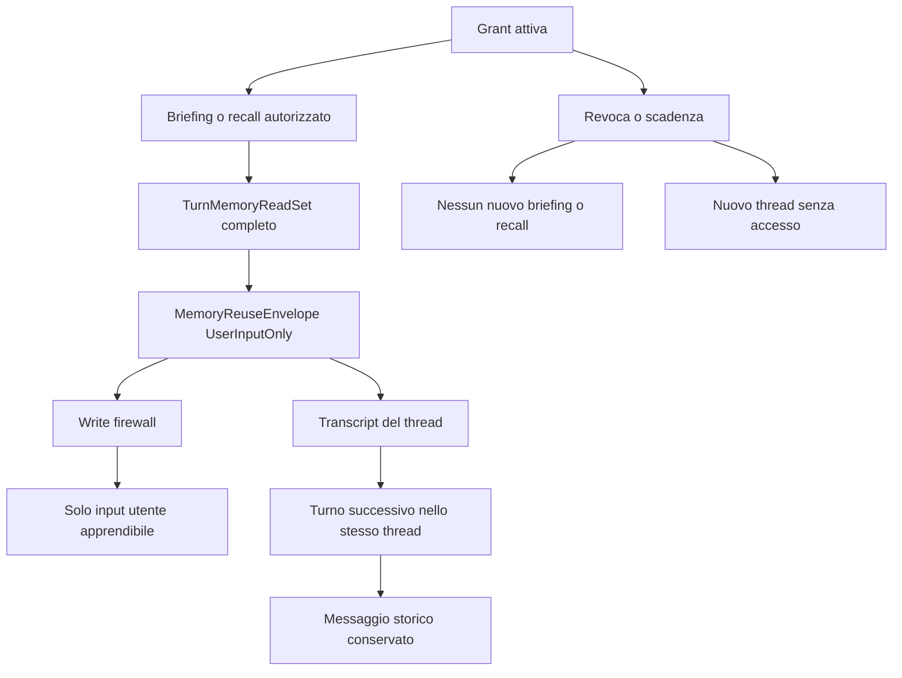

# Design — Retention contestuale delle memorie collegate

Data: 2026-07-20. Stato: **approvato nel flusso di collaudo**.

## Decisione

Quando una risposta usa una memoria collegata, il fatto resta nel contesto storico della
stessa conversazione anche se la sorgente viene successivamente scollegata. Lo
scollegamento impedisce nuovi richiami dalla sorgente e impedisce l'accesso in nuove
conversazioni; non riscrive il passato della conversazione che ha già usato il fatto.

Il contenuto collegato non diventa memoria strutturata del progetto. Non alimenta
memorie, entità, relazioni, Wiki, briefing, embeddings o pubblicazioni. Il transcript è
stato conversazionale persistente, non una nuova copia canonica nella memoria consumer.

Ogni risposta informata da una sorgente collegata conserva comunque provenance completa:
source workspace, grant, versione della policy, memory ref e revisione della source.

## Sostituzione mirata del design precedente

Questa specifica sostituisce esclusivamente il **context firewall** e la semantica di
revoca descritti in
`docs/superpowers/specs/2026-07-19-linked-memory-read-only-firewall-design.md`.

Restano invariati:

- grant dirette e non transitive;
- autorizzazione deterministica e recall semantico bounded;
- `MemoryReuseEnvelope` persistito atomicamente con il messaggio;
- `UserInputOnly` per apprendimento e writer;
- divieto di copiare o pubblicare contenuto collegato nella memoria consumer;
- `BlockedUnknown` fail-closed;
- revoca immediata per nuovi recall, briefing e nuove conversazioni.

Viene sostituita la regola che rivalidava retroattivamente grant e revisione prima di
reinserire una vecchia risposta nel contesto dello stesso thread.

## Evidenza del collaudo

Nel profilo QA dell'app installata:

1. Alpha ha richiamato `Ceruleo-47` dalla memoria personale e `Quarzo-91` da Beta;
2. le due grant sono state revocate;
3. nello stesso thread `Ceruleo-47` è rimasto disponibile, mentre `Quarzo-91` è stato
   sostituito dalla nota di omissione del context firewall;
4. una nuova conversazione Alpha non ha richiamato nessuno dei due valori;
5. `Ceruleo-47` non era stato attestato come linked read perché proveniva dal briefing
   personale always-on, mentre `Quarzo-91` aveva provenance completa.

Il primo comportamento è quello desiderato dall'utente, ma oggi avviene accidentalmente
e senza provenance. Il secondo dimostra che la nuova semantica va resa esplicita e
uniforme.

## Obiettivi

1. Conservare nello stesso thread ogni risposta linked-derived già mostrata.
2. Bloccare nuovi richiami dopo revoca, scadenza o scollegamento.
3. Impedire che una nuova conversazione erediti il contenuto collegato.
4. Attestare anche le preferenze personali iniettate dal briefing always-on.
5. Conservare il write firewall: soltanto il testo scritto direttamente dall'utente è
   apprendibile in un turno linked-derived.
6. Mantenere `BlockedUnknown` escluso dal contesto del modello.
7. Conservare un audit strutturato che possa correlare ogni accesso al turno.

## Non obiettivi

- Non creare snapshot della source nella memoria del progetto.
- Non rendere le grant transitive.
- Non estendere il numero di memorie iniettate nel prompt.
- Non garantire retention infinita oltre il normale budget del thread: questa modifica
  impedisce l'omissione dovuta alla revoca, ma non cambia la finestra contestuale.
- Non consentire a transcript o compattazione di alimentare i writer della memoria.
- Non trasformare `BlockedUnknown` in un messaggio affidabile.

## Alternative considerate

### A. Retention nel transcript attestato — scelta

La risposta linked-derived resta un normale messaggio dello stesso thread. La provenance
serve al write firewall e all'ispezione, non a rivalidare retroattivamente il testo già
usato nella conversazione. È la soluzione minima, non duplica dati e corrisponde al
modello mentale espresso durante il collaudo.

### B. Snapshot locale del fatto nel progetto — rifiutata

Creare una nuova memoria consumer renderebbe il fatto disponibile anche in thread nuovi,
duplicando ownership e ciclo di vita. Contraddice il requisito di sola lettura.

### C. Cache persistente di fatti acquisiti per thread — rinviata

Una tabella dedicata potrebbe mantenere i fatti oltre il normale budget contestuale, ma
aggiungerebbe una seconda forma di memoria e richiederebbe compattazione con provenance
per-fatto. Non è necessaria per correggere il comportamento osservato.

## Architettura

### 1. Provenance del briefing always-on

Il briefing non deve più restituire soltanto stringhe. Ogni elemento autorizzato porta
anche l'identità della source e, quando proviene da una grant, il corrispondente
`LinkedMemoryReadRef`.

`BriefingPack` espone l'unione deduplicata dei linked read realmente inclusi nel blocco
budgetizzato. Solo gli elementi che entrano effettivamente nel prompt entrano nel read
set; gli elementi scartati dal budget non vengono attestati.

Il loop inizializza `TurnMemoryReadSet` con l'unione di:

- linked reads del briefing;
- hit del recall automatico;
- hit prodotti da chiamate esplicite a `recall_memory`.

Il percorso con memory service attivo e quello inline devono produrre la stessa
provenance.

### 2. Persistenza e write firewall

Il messaggio, gli event parts e l'envelope restano salvati atomicamente. Una risposta
informata da briefing personale collegato usa `UserInputOnly`, non `Normal`.

`Exchange::learn_material` continua a consegnare ai writer soltanto:

- il messaggio dell'utente;
- nessun testo assistente;
- nessuna azione o output collegato;
- nessun `prev_assistant` linked-derived.

Il contenuto non raggiunge episodi richiamabili, memorie di progetto, Wiki, grafo,
embeddings o pubblicazioni.

### 3. Ricostruzione del contesto

Per un messaggio assistente persistito:

- `Normal` con zero linked reads: incluso;
- `UserInputOnly` con linked reads strutturalmente validi: incluso nello stesso thread,
  senza rivalidare lo stato corrente della grant;
- `BlockedUnknown`, envelope mancante/corrotto o combinazione incoerente: sostituito dalla
  nota neutra di omissione.

La source non viene interrogata durante questa ricostruzione. Il messaggio è già parte
del transcript attestato del thread.

Nuove conversazioni non possiedono quel transcript. Dopo la revoca, il resolver e il
fingerprint del briefing escludono la source, quindi non possono creare nuovi messaggi
linked-derived.

### 4. Audit

Ogni access event prodotto per briefing o recall deve ricevere il `turn_id` del broker.
L'audit conserva soltanto identificativi, outcome, contatori e refs; non duplica il testo
privato.

Se il briefing non può correlare un linked read al turno o non può costruire provenance
completa, quel contenuto non entra nel prompt.

## Error handling

- Provenance incompleta: fail-closed, elemento escluso dal briefing.
- Envelope incoerente con event parts: `BlockedUnknown` come oggi.
- Grant revocata durante il turno: la risposta già prodotta può essere mostrata e resta
  nel thread, ma il write firewall continua a bloccarne l'apprendimento.
- Source indisponibile in un turno futuro: nessun nuovo recall; il transcript storico non
  richiede la source.
- Audit non persistibile: il linked item non viene iniettato.

## Strategia di test

### Test unitari

- briefing personale autorizzato restituisce testo e linked read;
- il budget attesta soltanto elementi realmente inclusi;
- briefing locale non crea linked read;
- deduplica tra briefing e recall;
- `UserInputOnly` storico resta nel contesto dopo revoca;
- `BlockedUnknown` resta escluso;
- il write firewall continua a esporre soltanto l'input utente.

### Test di integrazione

- grant personale → briefing → risposta → envelope completo;
- grant progetto → recall → risposta → envelope completo;
- revoca → stesso thread conserva entrambe le risposte;
- revoca → nuovo thread non recupera nessuna source;
- nessuna memoria, entità, relazione, Wiki o embedding consumer contiene i sentinel;
- gli access event hanno `turn_id` valorizzato.

### Regressione

- suite completa `local-first-memory`;
- suite completa `local-first-desktop-gateway`;
- test desktop UI contract e typecheck;
- nuovo collaudo sull'app installata con profilo QA isolato.

## Criteri di accettazione

La modifica è completa quando:

1. Ceruleo e Quarzo restano entrambi disponibili nello stesso thread dopo unlink;
2. nessuno dei due è disponibile in un thread nuovo;
3. entrambi i messaggi conservano provenance completa;
4. nessun sentinel appare nella memoria strutturata di Alpha;
5. audit e integrity report restano metadata-only e verdi;
6. tutti i test mirati e le suite di regressione passano.
