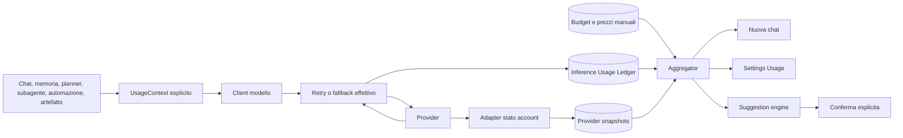

# Usage Analytics, Provider Limits e Model Suggestions — Design

**Data:** 2026-07-20
**Stato:** design approvato, implementazione non ancora avviata
**Ambito:** registro completo delle chiamate modello, riepilogo nella nuova chat, `Settings → Usage` e suggerimenti espliciti di bilanciamento

## Sintesi

Homun mostra oggi metriche parziali sul singolo messaggio, ma non possiede una fonte canonica capace di rispondere a domande come:

- quale provider e quale modello sono stati realmente usati dopo retry o fallback;
- quanto consumano chat, memoria, pianificazione, subagenti, automazioni e artefatti;
- quale parte del costo è dichiarata dal provider e quale è stimata da Homun;
- quanto budget o quota rimane e con quale livello di affidabilità;
- quando un altro modello sarebbe più conveniente senza violare privacy, capacità o qualità.

La soluzione introduce un **Inference Usage Ledger append-only in SQLite**. Ogni tentativo di chiamata modello riceve identità, finalità, provider/modello effettivi, token, tempi, esito e provenienza del costo. I dati dell'account provider restano separati dalle misure di Homun: vengono letti solo quando il provider li espone con la normale chiave già configurata. Dove non sono disponibili, l'utente può impostare un budget mensile manuale, sempre etichettato come tale.

La nuova chat conserva il saluto e l'identità di Homun, elimina i prompt di esempio e mostra un riepilogo operativo leggero. L'analisi completa vive in `Settings → Usage`. Il sistema può proporre un modello diverso spiegandone il motivo, ma non cambia mai routing o preferenze senza conferma esplicita.

## Obiettivi

1. Contabilizzare ogni chiamata a un modello, non soltanto la risposta visibile in chat.
2. Distinguere in modo non ambiguo dati osservati, dati dichiarati dal provider, stime e valori mancanti.
3. Attribuire l'uso per provider, modello, processo, progetto, task, turno, run e round quando disponibili.
4. Mostrare un riepilogo utile in ogni nuova chat senza appesantire il composer.
5. Offrire in `Settings → Usage` viste per panoramica, modelli, provider e processi.
6. Suggerire alternative compatibili con privacy e capacità, con spiegazione e conferma utente.
7. Conservare il comportamento local-first: metadati locali, nessun prompt o risposta nel ledger, nessuna nuova credenziale amministrativa.
8. Rendere aggregati e suggerimenti ricostruibili e verificabili dalla fonte canonica.

## Non obiettivi v1

- Routing o bilanciamento automatico senza conferma.
- Acquisizione di chiavi amministrative o di billing separate.
- Scraping dei dashboard web dei provider.
- Fatturazione, riconciliazione contabile o garanzia che una stima coincida con la fattura.
- Stima economica di energia, hardware o ammortamento per i modelli locali.
- Analisi del contenuto di prompt e risposte per classificare la finalità.
- Importazione forzata delle metriche storiche incomplete nel nuovo ledger.
- Retention configurabile dei record grezzi; in v1 i metadati restano finché l'utente non esegue un factory reset.

## Stato corrente verificato

### Metriche già presenti

- `apps/desktop/src/types.ts::ChatMessageMetrics` contiene token prompt/generazione, throughput, memoria di picco e tempi.
- `crates/desktop-gateway/src/chat_store.rs` conserva queste metriche nel `metrics_json` del messaggio.
- `crates/engine/src/events.rs::TokenMetrics` porta un sottoinsieme delle metriche negli eventi terminali.
- `crates/inference/src/anthropic.rs` e `crates/inference/src/openai_compat.rs` leggono l'uso dalle risposte JSON non streaming.
- `crates/engine/src/contract.rs::ModelClient` è il seam canonico per i round del guarded agent loop; `GatewayModelClient` possiede trasporto, retry e fallback.
- `crates/desktop-gateway/src/model_registry.rs` conosce provider, modelli e capacità, ma non prezzi, budget o quote.

### Gap

- Diversi eventi terminali usano ancora `TokenMetrics::zero()`.
- I collector streaming assemblano testo e tool call, ma non restituiscono un record d'uso completo e uniforme.
- Il fallback effettivo è propagato al loop, ma non diventa una storia di tentativi contabilizzabile.
- Le chiamate JSON di supporto, memoria, planner e subagenti non confluiscono in una fonte unica.
- `metrics_json` è legato al messaggio finale: non rappresenta retry billabili, chiamate interne o finalità.
- Non esistono prezzi con provenance, snapshot dei limiti provider, budget manuali o aggregati per processo.
- La home vuota usa `EMPTY_HERO_CHIPS`, cioè esempi di prompt che il nuovo design rimuove.

## Decisioni di prodotto

### Due piani separati

La UI non deve sommare come se fossero lo stesso dato:

1. **Uso misurato da Homun**: chiamate partite dall'app, token, costo, latenza ed esiti.
2. **Stato account provider**: quota, saldo, finestra di reset o limiti restituiti dal provider.

Un provider può avere il primo piano completo e il secondo non disponibile. Ogni schermata mostra timestamp e provenienza.

### Credenziali

Homun usa esclusivamente la normale chiave modello già configurata. Non aggiunge chiavi Admin, Management o Billing. Un adapter può interrogare endpoint account solo se quella stessa chiave è autorizzata. In caso contrario visualizza `Non disponibile con questa chiave`, senza degradare le metriche locali.

Questa scelta è rilevante in particolare per Anthropic: la Usage & Cost API completa richiede una Admin API key e non è disponibile per account individuali. OpenRouter, invece, può restituire token e costo nella normale risposta di generazione, compreso l'evento finale SSE; questi dati alimentano il ledger locale senza richiedere accesso amministrativo.

### Budget manuale

Quando la quota provider non è leggibile, l'utente può configurare un budget mensile per provider. Il budget:

- è una policy locale, non una quota dichiarata dal provider;
- usa valuta, importo, giorno di reset e fuso orario espliciti;
- viene confrontato solo con costi conosciuti o stimati con provenance;
- non produce una falsa percentuale residua se una parte dell'uso ha costo sconosciuto.

## Architettura



### Confini di responsabilità

- **Caller:** assegna una finalità strutturata; non viene dedotta da parole chiave o dal testo del prompt.
- **Model client / inference facade:** crea identità di chiamata e tentativo, cattura provider/modello effettivi, usage, retry, fallback ed errori.
- **UsageStore:** persiste eventi metadata-only e policy nello SQLite applicativo.
- **Provider adapter:** legge best-effort lo stato dell'account usando la chiave standard esistente.
- **Aggregator:** costruisce finestre e raggruppamenti, senza cambiare i raw event.
- **Suggestion engine:** filtra per vincoli e calcola opportunità; non muta il routing.
- **Desktop UI:** presenta provenienza, copertura e azioni esplicite.

## Identità e ciclo di vita della chiamata

Una chiamata logica possiede un `call_id`. Ogni effettivo accesso HTTP/runtime, incluso un retry o un fallback, possiede un `attempt_id` distinto e condivide il `call_id`.

Esempio:

```text
call_id C1
  attempt A1 → OpenAI / modello X → timeout
  attempt A2 → OpenAI / modello X → 429
  attempt A3 → OpenRouter / modello Y → successo, 1.240 token, costo dichiarato
```

Tutti e tre i tentativi restano visibili. Gli aggregati economici sommano ogni tentativo con costo o usage billabile noto; la vista per turno può mostrare un'unica chiamata logica con il dettaglio dei tentativi.

Il ledger usa due eventi immutabili per tentativo:

- `attempt_started`, scritto prima dell'invio;
- uno tra `attempt_completed`, `attempt_failed` o `attempt_aborted`.

Una chiave univoca `(attempt_id, event_kind)` rende le scritture idempotenti. Al riavvio, uno start privo di terminale viene chiuso con un nuovo evento `attempt_aborted` e motivo `process_recovery`; nessuna riga precedente viene modificata.

## Modello dati canonico

### `inference_usage_events`

Tabella append-only. Un record è una transizione di un tentativo, non un messaggio chat.

```sql
CREATE TABLE inference_usage_events (
  event_id                 TEXT PRIMARY KEY,
  call_id                  TEXT NOT NULL,
  attempt_id               TEXT NOT NULL,
  event_kind               TEXT NOT NULL,
  user_id                  TEXT NOT NULL,
  workspace_id             TEXT,
  thread_id                TEXT,
  turn_id                  TEXT,
  run_id                   TEXT,
  task_id                  TEXT,
  round                    INTEGER,
  purpose                  TEXT NOT NULL,
  purpose_detail           TEXT,
  provider_id              TEXT,
  model_id                 TEXT,
  locality                 TEXT NOT NULL,
  input_tokens             INTEGER,
  output_tokens            INTEGER,
  reasoning_tokens         INTEGER,
  cache_read_tokens        INTEGER,
  cache_write_tokens       INTEGER,
  latency_ms               INTEGER,
  time_to_first_token_ms   INTEGER,
  outcome                  TEXT,
  error_class              TEXT,
  upstream_status          INTEGER,
  finish_reason            TEXT,
  rate_limit_limit         INTEGER,
  rate_limit_remaining     INTEGER,
  rate_limit_reset_at      INTEGER,
  cost_microusd            INTEGER,
  usage_provenance         TEXT NOT NULL,
  cost_provenance          TEXT NOT NULL,
  pricing_source           TEXT,
  pricing_version          TEXT,
  started_at               INTEGER NOT NULL,
  recorded_at              INTEGER NOT NULL,
  schema_version           INTEGER NOT NULL,
  UNIQUE(attempt_id, event_kind)
);
```

Regole:

- importi in micro-USD interi, mai floating point;
- timestamp UTC interi; localizzazione soltanto nella UI;
- token sconosciuti sono `NULL`, non zero;
- `provider_id` e `model_id` terminali descrivono il binding effettivo;
- `attempt_started` può contenere il binding pianificato, ma gli aggregati usano il terminale;
- `rate_limit_*` contiene solo header o errori osservati; non inventa una quota mensile;
- nessun prompt, risposta, reasoning, schema tool, secret o chiave API;
- eventuali request ID provider sono esclusi in v1 salvo una futura valutazione esplicita di sensibilità.

Valori di provenance v1:

- usage: `provider_reported`, `homun_estimated`, `unavailable`;
- cost: `provider_reported`, `catalog_estimated`, `manual_estimated`, `not_billed`, `unavailable`.

`not_billed` è usato per runtime locali come Ollama e viene mostrato come `Nessun addebito provider`, non come prova che l'esecuzione non abbia costo energetico.

### `provider_usage_snapshots`

Tabella append-only di osservazioni account:

```sql
CREATE TABLE provider_usage_snapshots (
  snapshot_id        TEXT PRIMARY KEY,
  user_id            TEXT NOT NULL,
  provider_id        TEXT NOT NULL,
  status             TEXT NOT NULL,
  period_kind        TEXT,
  period_start       INTEGER,
  period_end         INTEGER,
  limit_value        INTEGER,
  used_value         INTEGER,
  remaining_value    INTEGER,
  unit               TEXT,
  currency           TEXT,
  balance_microusd   INTEGER,
  resets_at          INTEGER,
  source             TEXT NOT NULL,
  error_class        TEXT,
  fetched_at         INTEGER NOT NULL,
  schema_version     INTEGER NOT NULL
);
```

Lo stesso fetch può produrre più righe, una per finestra (`session`, `day`, `week`, `month`, `credit`). `status` distingue `available`, `unsupported`, `unauthorized`, `stale` ed `error`. La UI usa l'ultima snapshot valida e mostra sempre `fetched_at`.

### `provider_usage_policies`

Configurazione locale mutabile, separata dalle osservazioni:

```sql
CREATE TABLE provider_usage_policies (
  user_id                 TEXT NOT NULL,
  provider_id             TEXT NOT NULL,
  monthly_budget_microusd INTEGER,
  currency                TEXT NOT NULL DEFAULT 'USD',
  reset_day               INTEGER,
  timezone                TEXT,
  alert_threshold_percent INTEGER,
  pricing_overrides_json  TEXT NOT NULL DEFAULT '[]',
  updated_at              INTEGER NOT NULL,
  schema_version          INTEGER NOT NULL,
  PRIMARY KEY(user_id, provider_id)
);
```

`pricing_overrides_json` ha schema versionato e chiuso per modello: prezzo input, output, reasoning, cache read e cache write per milione di token, valuta e data di efficacia. I prezzi manuali sovrascrivono il catalogo solo per quel provider/modello e sono sempre etichettati `manual_estimated`.

### Aggregati derivati

`inference_usage_daily` è una proiezione ricostruibile per giorno, provider, modello e finalità. Può essere eliminata e rigenerata dal ledger. Non è fonte canonica e non contiene dati assenti dai raw event.

Gli aggregati espongono anche:

- percentuale di chiamate con usage conosciuto;
- percentuale di costo conosciuto;
- numero di tentativi incompleti o abortiti;
- data di inizio della copertura autorevole.

## Tassonomia delle finalità

Ogni caller deve passare un `UsageContext` esplicito. La categoria non viene mai inferita dal prompt.

Categorie v1:

- `chat_response`
- `title_generation`
- `intent_routing`
- `planning`
- `memory_extraction`
- `memory_recall`
- `memory_compaction`
- `embedding`
- `subagent`
- `automation`
- `artifact_generation`
- `vision_analysis`
- `evaluation`
- `other`

`purpose_detail` permette sottotipi versionati senza moltiplicare le categorie. `other` è ammesso ma viene conteggiato come gap di attribuzione se supera una soglia visibile nei diagnostici.

```rust
pub struct UsageContext {
    pub call_id: String,
    pub purpose: InferencePurpose,
    pub purpose_detail: Option<String>,
    pub user_id: String,
    pub workspace_id: Option<String>,
    pub thread_id: Option<String>,
    pub turn_id: Option<String>,
    pub run_id: Option<String>,
    pub task_id: Option<String>,
    pub round: Option<u32>,
}
```

## Punti di strumentazione

### Agent loop streaming

`crates/engine/src/contract.rs::ModelCall` riceve il contesto di uso. `ModelRoundOutput` restituisce un riepilogo provider-neutral di usage, tempi, finish reason e binding effettivo. `GatewayModelClient` apre e chiude ogni tentativo attorno al trasporto reale, quindi vede retry e fallback che l'engine non deve conoscere.

I collector OpenAI-compatible, Anthropic e Ollama normalizzano:

- usage presente nell'ultimo evento SSE o nella risposta terminale;
- token di reasoning e cache quando dichiarati;
- time-to-first-token e latenza totale misurati localmente;
- header di rate limit osservati;
- errori HTTP/trasporto classificati senza testo sensibile.

### Chiamate JSON e supporto

Il facade in `crates/inference` riceve lo stesso `UsageContext`. Planner, memory extraction, intent routing, subagenti, automazioni e generatori di artefatti devono fornire una finalità al punto di chiamata.

### Embedding e runtime locali

Anche embedding e inferenze locali producono record. Se il runtime restituisce token, vengono registrati; altrimenti Homun può stimarli con tokenizer noto. Tempo e modello restano utili anche senza costo monetario.

### Completezza dell'inventario

La prima tranche include un test architetturale sui client di inference noti: ogni chiamata di rete/runtime deve attraversare un adapter che richiede `UsageContext`. Nuove chiamate non strumentate devono fallire il test di contratto, non essere scoperte mesi dopo dalla dashboard.

## Usage e costo: ordine di affidabilità

Per ogni tentativo:

1. usage e costo dichiarati dal provider;
2. token dichiarati dal provider + catalogo prezzi Homun;
3. token stimati da Homun + catalogo o override manuale;
4. dato non disponibile.

Il costo dichiarato dal provider non viene ricalcolato. Un prezzo stimato viene congelato nel terminal event con `pricing_source` e `pricing_version`; aggiornare il catalogo non riscrive la storia.

Il catalogo prezzi è versionato e contiene intervalli di validità. Se valuta o unità non sono convertibili con una fonte locale esplicita, il costo resta non disponibile. La v1 non introduce un servizio di cambio valuta.

## Adapter provider e limiti

Ogni provider dichiara capacità indipendenti:

- usage per singola risposta;
- costo per singola risposta;
- rate-limit header;
- stato account interrogabile con chiave standard;
- quota o saldo con finestra temporale;
- refresh minimo e gestione della cache.

Gli adapter sono best-effort e non bloccano chat o avvio dell'app. Il refresh avviene all'apertura di `Settings → Usage` e, con una frequenza conservativa, durante l'idle. Non viene eseguito polling aggressivo.

Stati UI:

- `Dati provider aggiornati`
- `Dati provider non disponibili con questa chiave`
- `Provider non espone questa informazione`
- `Ultimo aggiornamento ...`
- `Errore temporaneo, uso Homun comunque disponibile`

## Suggestion engine

### Eligibility prima del punteggio

Un candidato viene escluso se non soddisfa tutti i vincoli richiesti dal task:

- località/privacy e consenso cloud;
- tool calling;
- vision;
- reasoning;
- context window;
- modalità richiesta;
- provider e modello abilitati.

La privacy non è un peso compensabile: un modello cloud vietato non può vincere perché costa meno.

### Punteggio bilanciato

Tra i candidati eleggibili, il profilo v1 assegna il punteggio su:

- costo previsto: 30%;
- headroom di budget/quota: 25%;
- qualità/capability profile dichiarato: 20%;
- latenza osservata: 15%;
- affidabilità osservata: 10%.

I pesi sono versionati nella policy di prodotto, non nascosti in prompt. Un valore mancante riduce confidenza e non viene trasformato in zero.

### Soglia e confidenza

Una proposta appare solo se:

- il candidato resta eleggibile;
- non comporta un downgrade di capability richieste;
- il vantaggio è materiale: almeno 20% sul costo previsto, 25% sulla latenza, oppure evita il superamento dell'80% di budget/quota;
- le metriche osservate usate nel confronto hanno almeno 10 chiamate riuscite recenti per modello, oppure il suggerimento dipende soltanto da prezzo/quota dichiarati;
- la confidenza complessiva è almeno `alta` o `media` con gap esplicitamente indicati.

Il suggerimento contiene fatti, non marketing:

```text
Per questo tipo di attività puoi usare Model B.
Stessa capacità tool e contesto; costo stimato -34%; latenza osservata -18%.
Dati: 42 chiamate negli ultimi 30 giorni. Costo stimato da catalogo.
```

Azioni:

- `Usa per questa attività`
- `Cambia preferenza`
- `Ignora`

Le prime due mostrano sempre la modifica proposta prima della conferma. Nessun suggerimento modifica automaticamente provider, modello o routing.

## UX della nuova chat

La nuova chat adotta la variante approvata **Panoramica operativa**:

- conserva marchio, saluto e sottotitolo di Homun;
- elimina completamente i chip con esempi di prompt;
- mostra sopra il composer un pannello piatto e leggero, senza card annidate;
- offre i periodi `7d`, `30d`, `Tutto`;
- mostra token, costo, provider attivi, modello dominante e trend;
- mostra al massimo un suggerimento prioritario;
- mantiene il composer largo, centrale e visivamente dominante;
- scompare dopo l'invio del primo messaggio, lasciando la normale conversazione.

Quando la copertura non è completa, il riepilogo mostra `Copertura incompleta` e la percentuale; non presenta totali stimati come assoluti. Prima che esistano eventi mostra uno stato semplice: `I dati di utilizzo inizieranno dalla prima chiamata registrata`.

La schermata non aggiunge una voce in `Work` o nella sidebar principale.

## UX di `Settings → Usage`

La pagina completa contiene quattro viste:

### Overview

- chiamate logiche e tentativi;
- token input/output/reasoning/cache;
- costo dichiarato, costo stimato e costo sconosciuto separati;
- giorni attivi e distribuzione temporale;
- copertura usage/costo;
- suggerimenti attivi.

### Models

- uso e costo per modello;
- provider effettivo;
- latenza mediana e p95;
- affidabilità, retry e fallback;
- finalità prevalenti;
- provenienza di prezzi e metriche.

### Providers

- uso misurato da Homun;
- snapshot account separato;
- quota/saldo/reset quando disponibile;
- budget manuale e consumo calcolabile;
- configurazione prezzi mancanti;
- stato e data dell'ultimo refresh.

### Processes

- chat;
- memoria;
- pianificazione;
- subagenti;
- automazioni;
- artefatti;
- embedding e altre chiamate interne.

Ogni tab usa gli stessi filtri temporali. Tabelle e grafici hanno equivalente testuale accessibile. Su larghezze ridotte i KPI passano a una colonna, i grafici non impongono scroll orizzontale e il composer della nuova chat resta utilizzabile.

## API e read model

Rotte v1:

```text
GET  /api/usage/summary?window=7d|30d|all
GET  /api/usage/models?window=...
GET  /api/usage/providers?window=...
GET  /api/usage/processes?window=...
GET  /api/usage/suggestions?window=...
POST /api/usage/providers/{provider_id}/refresh
PUT  /api/usage/providers/{provider_id}/policy
POST /api/usage/suggestions/{suggestion_id}/apply
POST /api/usage/suggestions/{suggestion_id}/dismiss
```

Tutte le query sono scope-safe per utente. Workspace e progetto sono filtri aggiuntivi, non sostituiscono lo scope utente. Le response restituiscono conteggi e provenance, mai raw event non necessari.

Il read model del riepilogo include:

- `coverage_started_at`;
- `usage_coverage_percent`;
- `cost_coverage_percent`;
- `reported_cost_microusd`;
- `estimated_cost_microusd`;
- `unknown_cost_attempts`;
- `provider_snapshot_status` per provider.

## Privacy, sicurezza e resilienza

- Ledger e snapshot restano locali.
- Nessun contenuto di prompt, risposta, reasoning o tool viene memorizzato.
- Nessuna API key o secret reference viene copiata negli eventi.
- Provider e model ID vengono normalizzati ma non contengono URL firmati o header.
- Errori vengono ridotti a classe e status; il body upstream non entra nel ledger.
- Factory reset elimina ledger, aggregati, snapshot, budget e override prezzi.
- La registrazione è **fail-open**: un errore SQLite non blocca inferenza, streaming o tool execution.
- Il writer usa una coda bounded. Saturazione o errore incrementano un contatore diagnostico e abbassano la copertura mostrata.
- Nessuna percentuale di quota viene calcolata da dati scaduti senza indicare `stale`.
- Gli endpoint usage usano autenticazione e scoping esistenti; non esiste una rotta raw priva di autorizzazione.

## Dati storici e migrazione

Il ledger autorevole parte dalla migrazione. I vecchi `metrics_json` dei messaggi non vengono convertiti automaticamente perché non descrivono retry, fallback, finalità e spesso provider effettivo. Inventare questi campi comprometterebbe proprio l'affidabilità che la funzione introduce.

La UI mostra `Dati autorevoli dal <data>`. Le metriche storiche per messaggio restano dove sono e continuano a supportare la loro UI attuale, ma non entrano nei totali del nuovo Usage. Una futura importazione può esporle in un bucket separato `Storico parziale`, mai fonderle silenziosamente con il ledger.

La migrazione è additiva e idempotente. I daily rollup iniziano vuoti e vengono costruiti dai terminal event.

## Error handling

- Start non persistibile: la chiamata procede; coverage gap locale.
- Terminale non persistibile: la chiamata procede; start orfano chiuso al recovery se presente.
- Usage provider assente: tokenizer/contatore Homun se affidabile, altrimenti `unavailable`.
- Prezzo assente: token visibili, costo `Non disponibile` e azione per impostare override.
- Endpoint account non autorizzato: snapshot `unauthorized`, nessun retry continuo.
- Provider offline: ultimo snapshot marcato stale; ledger locale continua.
- Fallback multiplo: ogni tentativo conserva provider/modello effettivo e proprio esito.
- Clock non plausibile: evento registrato con flag diagnostico ed escluso dai confronti temporali sensibili.
- Aggregato corrotto: cancellazione e rebuild dal ledger.

## Strategia di test

### Store e migrazioni

- schema idempotente;
- append-only e uniqueness per `attempt_id/event_kind`;
- recovery di start orfani;
- scoping per utente/workspace;
- factory reset completo;
- rebuild identico dei daily rollup.

### Instrumentation

- una risposta chat streaming crea start e terminale;
- chiamate JSON, memoria, planner, subagenti, automazioni, artefatti ed embedding hanno finalità corretta;
- retry e fallback creano tentativi distinti sotto lo stesso call ID;
- provider/modello terminali sono quelli effettivi;
- successi, 4xx, 5xx, timeout, cancellazione e crash hanno esito coerente;
- token reasoning/cache e ultimo usage SSE vengono preservati;
- nessun prompt, risposta o secret compare nel database.

### Pricing e provider

- costo provider-reported non viene ricalcolato;
- catalog estimate conserva versione e storico;
- override manuale ha precedenza ed etichetta corretta;
- costo sconosciuto non diventa zero;
- budget manuale non viene presentato come quota provider;
- snapshot unsupported/unauthorized/stale/error hanno copy distinta;
- rate-limit osservati non vengono promossi a quota mensile.

### Suggestion engine

- modello non compatibile con privacy, tool, vision, reasoning o contesto è escluso;
- dati mancanti abbassano confidenza;
- sotto la soglia materiale non appare proposta;
- proposta non modifica routing;
- apply richiede conferma e modifica soltanto lo scope scelto;
- dismiss impedisce ripetizioni equivalenti per una finestra bounded.

### UI

- nuova chat senza chip e con riepilogo `7d/30d/Tutto`;
- riepilogo scompare dopo il primo messaggio;
- costi dichiarati, stimati e sconosciuti restano distinti;
- `Settings → Usage` copre Overview, Models, Providers e Processes;
- stati vuoto, loading, stale, parziale ed errore;
- tastiera, screen reader, contrasto, zoom e responsive;
- nessuna nuova voce `Work`.

### Collaudo reale

Profilo QA isolato con almeno:

- un provider locale Ollama;
- un OpenAI-compatible con usage SSE;
- Anthropic o altro provider senza stato account accessibile dalla chiave standard;
- una chat con tool, una chiamata memoria, un planner/subagente, un'automazione e un artefatto;
- retry o fallback controllato;
- chiusura e riapertura dell'app;
- verifica diretta dello SQLite metadata-only;
- confronto tra ledger, read model e UI.

## Fasi di implementazione

### Fase A — Ledger e contratti

- schema, `UsageStore`, identità call/attempt, `UsageContext`;
- instrumentation completa di streaming e JSON;
- recovery, provenance e test di privacy;
- aggregati di base e API diagnostica.

### Fase B — Pricing, snapshot e policy

- catalogo prezzi versionato;
- override e budget manuali;
- adapter provider con chiave standard;
- separazione uso Homun / stato account.

### Fase C — Settings Usage

- read model Overview, Models, Providers e Processes;
- grafici accessibili, filtri e stati di copertura;
- configurazione budget e prezzi.

### Fase D — Nuova chat

- rimozione `EMPTY_HERO_CHIPS` e relativi seed;
- panoramica operativa leggera;
- composer centrale e scomparsa del riepilogo dopo il primo messaggio.

### Fase E — Suggerimenti confermati

- eligibility, scoring, confidenza e materialità;
- spiegazione con provenance;
- apply/dismiss e audit della scelta;
- nessuna mutazione automatica.

Le fasi condividono il ledger, ma ognuna ha un gate di verifica autonomo. La release può includere A–D senza attivare E se i dati osservati non sono ancora sufficienti per suggerimenti affidabili.

## Criteri di accettazione

La funzione è completa quando:

1. ogni percorso di inference noto produce eventi con finalità esplicita;
2. retry e fallback sono contabilizzati separatamente e attribuiti al provider/modello effettivo;
3. costi dichiarati, stimati, non fatturati e sconosciuti non vengono mai confusi;
4. la nuova chat sostituisce i prompt di esempio con la panoramica approvata e mantiene il composer dominante;
5. `Settings → Usage` permette di capire consumo per modello, provider e processo;
6. quota provider e budget manuale sono visivamente e semanticamente separati;
7. nessun prompt, risposta o segreto è presente nel ledger;
8. un errore del recorder non interrompe l'uso dell'app e viene riflesso nella copertura;
9. i suggerimenti rispettano privacy/capability, sono spiegati e richiedono conferma;
10. factory reset, rebuild aggregati, test mirati, suite di regressione e collaudo reale risultano verdi.

## Riferimenti provider

- [Anthropic Usage and Cost API](https://platform.claude.com/docs/en/manage-claude/usage-cost-api)
- [OpenRouter usage accounting](https://openrouter.ai/docs/cookbook/administration/usage-accounting)
- [OpenRouter Management API keys](https://openrouter.ai/docs/guides/overview/auth/management-api-keys)
- [Ollama pricing and cloud usage](https://ollama.com/pricing)
