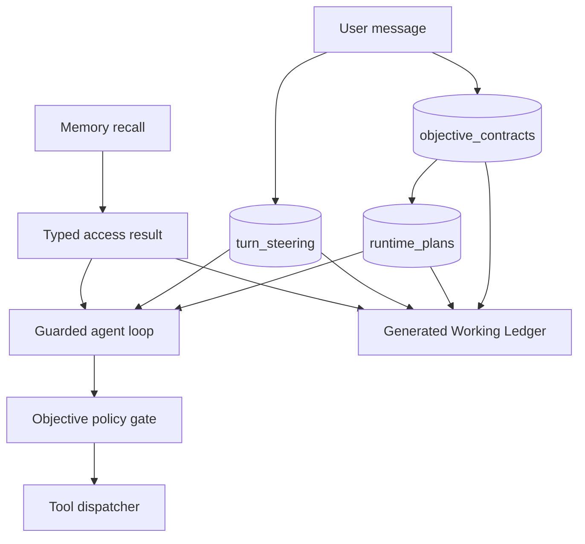

# Objective Contract and Agent Continuity — Design

**Date:** 2026-07-21
**Status:** Approved for autonomous implementation
**Scope:** canonical turn objective, plan compatibility, approval resume, live steering,
real cancellation, memory-health semantics, Working Ledger projection, and bounded retention

## Problem statement

The reviewed conversation `Analisi ODT non supportata` exposed one connected failure chain:

1. filesystem approval correctly paused the work, but continuation did not reliably resume the
   original objective;
2. a read-only request to identify required changes expanded into implementation;
3. the runtime marked twelve unexecuted plan steps done because a long answer was treated as
   evidence of completion;
4. user cancellation terminated the broker-facing future but not the detached engine task, which
   continued model rounds and effectful tools;
5. the composer remained unavailable while work was active, so the user could not steer or correct
   the run;
6. memory storage and FTS were healthy, but recall queried `personal` while the relevant episodes
   lived in `__threads__`; empty hits, unavailable search, and denied access were not distinguishable.

These are control-state failures. Prompt wording alone cannot make them reliable, especially with
small local models.

## Goals

- Keep one canonical objective active for a conversation until it completes, is cancelled, or a new
  user request replaces it.
- Let the harness replan autonomously when strategy changes but objective, scope, and effect policy
  remain compatible.
- Require confirmation before changing the objective, expanding scope, or introducing mutations not
  authorized by the current request.
- Keep the composer usable during execution and accept new messages as steering.
- Make Stop terminate model generation, tool dispatch, memory learning, and artifact creation.
- Distinguish successful empty memory recall from degraded, unavailable, and denied recall.
- Keep SQLite structured state canonical and generate one bounded Working Ledger Markdown view.

## Non-goals

- The Markdown ledger does not become execution authority.
- The design does not store raw reasoning or full model prompts as objective history.
- It does not infer broad write authority from a folder read approval.
- It does not make `__threads__` a generally linkable memory source or weaken workspace isolation.
- It does not promise interruption inside an external effect that has already crossed the tool
  boundary; such effects remain governed by receipts and are reconciled before the next attempt.

## Chosen architecture

Extend the existing `homun.sqlite` TaskStore control state. The model proposes plans and tool calls;
the runtime owns objective compatibility, cancellation, steering, and completion.



## 1. Canonical Objective Contract

The TaskStore adds one current objective record per `(user_id, workspace_id, thread_id)`:

```sql
CREATE TABLE objective_contracts (
  user_id             TEXT NOT NULL,
  workspace_id        TEXT NOT NULL,
  thread_id           TEXT NOT NULL,
  source_message_id   TEXT NOT NULL,
  objective           TEXT NOT NULL,
  mode                TEXT NOT NULL,
  scope_json          TEXT NOT NULL,
  allowed_actions_json TEXT NOT NULL,
  completion_json     TEXT NOT NULL,
  status              TEXT NOT NULL,
  revision            INTEGER NOT NULL,
  created_at          INTEGER NOT NULL,
  updated_at          INTEGER NOT NULL,
  PRIMARY KEY(user_id, workspace_id, thread_id)
);
```

Allowed modes are `read_only_analysis`, `mutation`, and `mixed`. Allowed statuses are `active`,
`needs_confirmation`, `completed`, and `cancelled`. Supersession is a journal transition followed by
an in-place replacement, not another permanently active row.

The initial contract preserves the bounded original user request as the objective. Effect policy is
classified through a constrained structured decision with a fail-closed default of read-only. A
model may propose broader effects, but only the runtime gate can activate them. An explicit user
steering message can authorize a new mode or scope and increments the contract revision.

`runtime_plans` gains `objective_revision`. A plan from another revision is never resumed. It is
replaced automatically when the objective remains compatible and marked stale when the objective is
superseded.

## 2. Compatibility and completion enforcement

Before dispatching each tool call, the harness evaluates a typed action description against the
current contract:

- read within scope: allowed;
- alternate read strategy within scope: allowed and may replace the plan;
- write already authorized by contract: allowed subject to sandbox policy;
- new filesystem/project scope: `needs_confirmation`;
- mutation under a read-only contract: `needs_confirmation`;
- objective-incompatible action: rejected and returned to the model as a control result.

The policy uses the existing tool action/effect classification, not tool-name prose generated by the
model. Artifact creation is an effect: a requested analysis report is allowed only when the contract
includes that deliverable; code patches are not.

Completion requires the contract's completion criteria and plan-step evidence. The delivery
reconciler must not mark open steps done based on response length. A plan can terminate with blocked
steps, but the objective status remains incomplete and the answer must state the blocker.

## 3. Approval pause and automatic continuation

An approval stores the source objective revision and the exact approved action. When granted:

1. reject the continuation if the objective revision changed;
2. record the approved scope/effect as narrowly as the approval permits;
3. reuse the same objective and current plan;
4. continue automatically from the blocked step;
5. never reinterpret the grant as permission to change the deliverable.

The user should not need to send `continua` or `quindi?` after a successful grant.

## 4. Live steering and composer behavior

The composer remains enabled while a turn is running. A message sent during a run is persisted as a
steering record targeted at that turn:

```sql
CREATE TABLE turn_steering (
  steering_id       TEXT PRIMARY KEY,
  turn_id           TEXT NOT NULL,
  thread_id         TEXT NOT NULL,
  user_id           TEXT NOT NULL,
  workspace_id      TEXT NOT NULL,
  message_id        TEXT NOT NULL,
  text              TEXT NOT NULL,
  status            TEXT NOT NULL,
  created_at        INTEGER NOT NULL,
  consumed_at       INTEGER
);
```

At each round boundary, before another model call or tool dispatch, the loop atomically consumes
pending steering:

- refinement/correction: append it as the latest user instruction and replan within the same
  objective;
- `continue`: keep the objective and resume the current step;
- replacement request: supersede the objective, cancel the old plan, and seed a new one;
- `stop`: use the cancellation path rather than steering.

If an effect is already running, the UI shows the steering message as accepted and applies it after
the receipt reaches a known state. No second agent loop races on the same transcript.

## 5. Real cancellation

Cancellation becomes shared state, not a single `Notify` waiter. The turn owns a cancellation flag
plus wake-up notification visible to executor, stream producer, loop and tool dispatcher.

On Stop:

- set the flag idempotently and wake all waiters;
- abort or join the spawned engine task;
- refuse tool dispatch after the flag is set;
- stop publishing deltas and finalize the visible partial message through the normal sanitizer;
- skip post-turn learning, plan reconciliation and artifact-memory creation;
- persist `cancelled` exactly once and release the composer immediately.

Receipts for effects started before cancellation remain available for recovery, but no new receipt
may start after cancellation.

## 6. Typed memory access and thread continuity

Memory recall returns a typed envelope:

```text
status: ready | empty | degraded | unavailable | denied
requested_sources: current_thread, personal, project, linked
searched_sources: [...] 
used_refs: [...]
error_codes: [...]
required_for_objective: true | false
```

`empty` is emitted only after a successful search with zero hits. Store/index errors produce
`unavailable`; partial embedding or linked-source failures produce `degraded`; policy rejection
produces `denied`.

Current-task continuity never depends on semantic recall: the Objective Contract, runtime plan and
latest steering are injected directly as runtime prompt packets. Same-thread episodes may be read
from `__threads__` only with exact thread and origin-workspace filters. Cross-thread episodic recall
is permitted only inside the authorized personal/project boundary and retains provenance.

If memory is required for an objective, the harness attempts bounded fallbacks (current transcript,
contract/ledger, lexical thread search). If every path is unavailable, it reports a real blocker; it
must not tell the model or user that no memory exists.

## 7. Working Ledger, UI, and retention

The existing ledger remains one file per thread and is regenerated from structured state. It adds:

```markdown
## Objective Contract
## Authorized scope and effects
## Completion criteria
## Current plan
## Steering
## Memory access
## Evidence and blockers
## Next action
```

The Working Island displays the objective contract's current objective and mode. The composer is not
disabled by streaming. Accepted steering is visibly pending/consumed. Memory UI differentiates
`empty`, `degraded`, `unavailable`, and `denied` rather than showing all as “not found”.

Only current contract state is retained as a row. Steering content is bounded and terminal steering
rows are purged with the existing run retention window. The ledger is overwritten atomically at the
same path; it never accumulates per-turn Markdown files. Journal entries retain hashes, reason codes
and bounded summaries, not duplicate prompts.

## 8. Error handling

- Objective persistence failure prevents a new run from starting.
- Invalid objective JSON or an unknown mode fails closed to `read_only_analysis`.
- Revision mismatch forces replan before another tool call.
- Steering persistence failure leaves the composer text recoverable and surfaces an error; it is not
  silently discarded.
- Cancellation has priority over steering and plan reconciliation.
- Memory failure cannot change objective authority or grant broader access.
- Ledger materialization remains rebuildable and cannot fail the canonical run state.

## 9. Verification strategy

Tests must prove behavior, not only type shape:

1. read-only objective rejects a patch tool and enters `needs_confirmation`;
2. a different read strategy replaces the plan without confirmation;
3. a runtime plan from an old objective revision is not resumed;
4. an approved folder read resumes the blocked objective automatically;
5. a steering message is accepted while a turn is active and consumed at the next round boundary;
6. replacement steering supersedes the old objective and plan;
7. Stop prevents model attempts, tool receipts, artifacts and learning after cancellation;
8. cancellation finalizes sanitized visible text and releases the busy thread;
9. a same-thread episode is found from `__threads__` with correct workspace isolation;
10. healthy zero-hit recall reports `empty`, while store failure reports `unavailable`;
11. delivery prose cannot sweep unevidenced plan steps to done;
12. the generated ledger is deterministic, bounded and overwritten at one path;
13. desktop tests verify the composer remains usable during streaming and displays steering state;
14. an end-to-end scenario reproduces the reviewed conversation: grant, automatic resume, read-only
    analysis, mid-run steering, correct completion, then Stop with no post-cancel effects.

## Rollout boundary

The implementation is additive and local-first. Existing threads without an Objective Contract
create one from the next user request. Existing runtime plans with revision `0` may be displayed but
are not resumed once a contract exists. No old chat messages or memory records are rewritten during
the schema migration.
