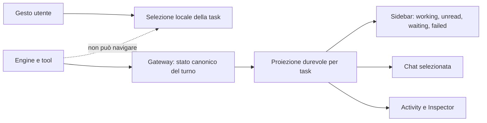

# Homun Stability Program — interfaccia stabile, turni deterministici, runtime affidabile

**Data:** 2026-07-22
**Stato:** design consolidato dopo test live; in revisione utente
**Ambito:** desktop, gateway, task runtime, engine, browser/computer, privacy guard,
skill catalog e proactivity
**Decisione UX approvata:** la task selezionata non cambia mai senza un gesto esplicito
dell'utente; una task terminata in background mostra un pallino teal fisso finché non viene
aperta; il reasoning grezzo non appare mai nel transcript.

## Sintesi

L'instabilità osservata non va trattata come una collezione di difetti indipendenti. Focus
rubato, doppie risposte, terminali prematuri, retry invisibili e reasoning corrotto derivano
dalla stessa assenza: non esiste ancora un'unica proiezione durevole e autorevole del turno e
dello stato della task.

La soluzione scelta è una stabilizzazione a strati:

1. rendere il gateway proprietario del lifecycle logico e della proiezione per task;
2. separare definitivamente selezione utente, attività in background e notifiche;
3. separare risposta visibile, reasoning, activity e risultati tool;
4. rendere retry, recovery ed effetti idempotenti;
5. applicare budget e circuit breaker ai sottosistemi lenti o fallibili;
6. chiudere con test concorrenti, restart/replay e verifica dell'app installata.

Il programma coordina e completa le specifiche già scritte. Non introduce un secondo
orchestratore e non sostituisce il task runtime esistente.

## Problemi verificati

I test live su Homun v0.1.1076 hanno evidenziato:

- un evento di una task in background può cambiare la task attiva nel desktop;
- un tentativo può mostrare `No reply generated.` e ricevere in seguito una seconda risposta;
- un turno sospeso può riapparire molto più tardi, rubare il focus e non emettere il terminale;
- reasoning grezzo e marcatori possono finire nel transcript con ripetizioni e frammenti
  illeggibili;
- indicatori di attività e istruzioni applicate possono restare visibili dopo la fine;
- una sessione browser può consumare decine di minuti e molti round senza chiudere in modo
  utile;
- il privacy guard locale può fallire aperto; `qwen3.5:2b` è una scelta provvisoria, non il
  risultato di un benchmark conclusivo;
- Homun Computer/noVNC richiede ancora un percorso di connessione più deterministico;
- l'anteprima di una skill può perdere l'identità del publisher;
- dati proattivi vecchi possono apparire correnti senza provenienza o freschezza evidente.

## Approcci considerati

### Patch solo desktop

Bloccare le chiamate di navigazione automatiche risolve il sintomo più evidente, ma lascia
terminali duplicati, retry incoerenti e recovery non deterministico. È utile come prima
protezione, non come soluzione completa.

### Riscrittura completa del runtime

Un nuovo runtime potrebbe rendere il modello più pulito, ma allargherebbe troppo il rischio e
invaliderebbe componenti già utili: task store, `turn_events`, journal, broker e WebSocket.

### Stabilizzazione a strati — scelta

Si conserva l'architettura esistente e si impongono invarianti comuni dal gateway alla UI.
Ogni workstream può essere testato e rilasciato in modo progressivo, ma nessuno può aggirare
il lifecycle canonico.

## Architettura canonica

Il gateway espone una proiezione durevole per task derivata da stato del turno, messaggi
consegnati, eventi e cursore di lettura. Il desktop la rende, senza ricostruire lifecycle
alternativi con flag React locali.



### Identità e responsabilità

| Identità | Significato | Proprietario |
| --- | --- | --- |
| `thread_id` | task/conversazione | chat store |
| `turn_id` | richiesta logica dell'utente | task runtime |
| `attempt_id` / `run_id` | tentativo interno, incluso retry/recovery | executor |
| `assistant_message_id` | unica risposta visibile del turno | chat store |
| `event_seq` | ordine pubblico e replay | `turn_events` |
| `effect_key` | deduplicazione di un effetto | tool journal/receipt store |
| `last_seen_terminal_seq` | confine letto dall'utente per task | gateway preference/store |

## Invarianti vincolanti

1. La task attiva cambia solo con click, tastiera o altra azione esplicita dell'utente.
2. WebSocket, polling, retry, recovery, canali e automazioni non chiamano mai la navigazione.
3. Ogni `turn_id` ha una sola bolla assistant e un solo terminale pubblico.
4. `retry`, `waiting_user`, reconnect e recovery sono stati intermedi, non completamenti.
5. Un terminale è accettato una sola volta tramite confronto atomico sullo stato del turno.
6. Il transcript contiene solo messaggi utente consegnati e risposte assistant validate.
7. Reasoning, activity, tool output, log e placeholder non entrano nel transcript o nel
   contesto futuro del modello.
8. Reload, reconnect, cambio task e riavvio ricostruiscono la stessa proiezione.
9. Un effetto non viene ripetuto senza idempotency key o receipt verificata.
10. Lo stato visuale nasce dalla proiezione server-owned; i flag locali sono solo ottimismi
    temporanei e revocabili.

## Contratto di selezione e notifiche

### Proprietà della selezione

`selected_thread_id` è uno stato dell'interfaccia posseduto dall'utente. Il valore server
`active_thread_id` può essere usato solo al primo avvio quando non esiste una selezione locale
valida. Dopo il bootstrap, gli aggiornamenti del server non lo sovrascrivono.

Le funzioni di refresh ricevono la selezione corrente come vincolo e aggiornano soltanto:

- cache e messaggi della task interessata;
- proiezione operativa della task;
- contatori e indicatori della sidebar;
- notifiche di sistema, se abilitate.

Non esiste un fallback da un evento in background alla navigazione.

### Stati sidebar

Ogni task espone esattamente uno stato primario:

| Stato | Semantica | Presentazione |
| --- | --- | --- |
| `idle` | nessun turno attivo, nulla di nuovo | nessun indicatore |
| `working` | turno in esecuzione o retry/backoff | indicatore teal discreto e animato |
| `completed_unread` | terminale nuovo non ancora visto | pallino teal fisso, colore Homun |
| `waiting_user` | serve approvazione o chiarimento | indicatore distinto, non confuso col completato |
| `failed` | errore definitivo non visto | indicatore d'errore con azione disponibile |

`completed_unread` nasce quando `terminal_seq > last_seen_terminal_seq` per una task non
selezionata. Si azzera quando l'utente apre la task e la proiezione terminale è stata
renderizzata. La lettura è persistita, così il pallino non ricompare dopo restart e si
sincronizza fra finestre.

Una task già selezionata non mostra il pallino per il proprio completamento: aggiorna in
place la bolla corrente e termina lo stato `working`.

### Nessun salto automatico

Un evento `thread.turn_started`, `thread.upserted`, `turn.retry`, `turn.done`, recovery al
boot o messaggio di canale non può selezionare la sua task. Se la task non è visibile:

- il contenuto viene aggiornato in background;
- la sidebar cambia stato;
- può comparire una notifica di sistema;
- la vista corrente, il composer, lo scroll e il focus tastiera restano invariati.

## Contratto del turno logico

La specifica dettagliata resta
`2026-07-22-logical-turn-lifecycle-design.md`. Questo programma aggiunge due vincoli di
integrazione:

- il terminale aggiorna la proiezione della task, non la selezione della task;
- tutti i reducer desktop scartano eventi con sequenza già applicata o incompatibili con lo
  stato terminale.

La transizione pubblica è:

```text
queued -> running -> retry_waiting -> running -> waiting_user -> running -> terminal
```

I passaggi intermedi possono ripetersi. `terminal` è uno fra `completed`, `failed` e
`cancelled` e non può essere seguito da un altro evento operativo sullo stesso turno.

Recovery e lease expiration chiudono l'`attempt_id`, non il `turn_id`. Il worker deve
acquisire esplicitamente il turno ancora recuperabile e continuare sulla stessa bolla.

## Risposta, reasoning e Activity

### Eventi separati

Il protocollo distingue in modo non ambiguo:

- `response_delta` e `response_final`: testo destinato all'utente;
- `reasoning_summary`: breve stato sintetico opzionale, già sicuro per la UI;
- `activity`: fase, retry, attesa risorsa e avanzamento;
- `tool_call` e `tool_result`: operazioni strutturate;
- `diagnostic`: dettaglio tecnico disponibile nel journal/Inspector.

I nomi legacy vengono normalizzati nel gateway prima di raggiungere i componenti. La UI non
deduce più il tipo di contenuto cercando marker testuali.

### Transcript sicuro

Solo `response_final` validata può portare la bolla a `delivered`. La validazione canonica:

- rimuove marker di visualizzazione noti;
- rifiuta testo vuoto o reasoning-only;
- rifiuta sequenze manifestamente corrotte o duplicazioni patologiche;
- conserva il payload originale nel journal tecnico con limiti e redazione;
- restituisce un errore tipizzato o avvia il retry senza salvare prosa falsa.

Durante il lavoro la chat mostra stati sintetici stabili, per esempio `Sto analizzando`,
`Uso il browser`, `Nuovo tentativo`. Il dettaglio di round, tool e provider vive in Activity.
Il reasoning grezzo non è espandibile nel transcript e non diventa mai un messaggio.

### Una sola bolla

Il placeholder assistant nasce una volta per `assistant_message_id`. Ogni attempt può
aggiornarne una preview revocabile. In caso di retry la preview precedente viene sostituita,
non concatenata. Errori e cancellazioni diventano stati della stessa unità visuale e sono
esclusi dal contesto conversazionale.

## Affidabilità dei sottosistemi

### Browser e tool loop

Il browser usa budget espliciti per tempo, round, navigazioni, retry consecutivi e azioni
bloccate. Il superamento di una soglia produce un errore classificato o una richiesta
all'utente; non continua per decine di minuti senza un cambio di strategia.

Ogni round registra segnali di progresso. Ripetere la stessa pagina, errore o azione senza
nuova evidenza incrementa uno stagnation counter e apre il circuit breaker. Le letture
possono essere ritentate; azioni con effetti richiedono receipt.

### Privacy guard e scelta del modello

Il privacy guard non può fallire aperto in silenzio. Timeout, output vuoto, JSON invalido o
modello non disponibile producono una decisione deterministica conservativa e un evento
diagnostico visibile in Activity quando rilevante.

`qwen3.5:2b` resta candidato, non default definitivo, finché non supera un benchmark locale
versionato che misura:

- latenza p50/p95 su hardware minimo supportato;
- validità dello structured output;
- recall sui casi sensibili, inclusi esempi italiani;
- falsi positivi su richieste normali;
- comportamento su timeout e modello assente.

La scelta finale deriva da soglie pubblicate nel repository. Se nessun modello locale le
supera, si usa il fallback deterministico conservativo e l'onboarding segnala il limite.

### Homun Computer e noVNC

Il lavoro locale già in corso su noVNC viene incluso senza sovrascriverlo. Il bootstrap deve
portare a uno stato verificabile `starting -> ready -> connected` e tentare l'autoconnessione
solo dopo un health check reale. Reconnect e failure sono stati espliciti; un pannello vuoto
o un bottone Connect non rappresentano `ready`.

La verifica copre container, endpoint noVNC, browser operativo e render nel pannello desktop.
Il warning `--no-sandbox` viene classificato e risolto o documentato come confine isolato,
non ignorato nei log di produzione.

### Skill catalog

Ricerca, anteprima, conferma e installazione mantengono sempre la chiave qualificata
`publisher/slug`. L'anteprima mostra publisher e provenienza e invia la stessa identità
all'installazione. Il dettaglio resta nella specifica
`2026-07-22-clawhub-publisher-aware-skill-catalog-design.md`.

### Proactivity

Ogni suggerimento proattivo espone `generated_at`, fonte e criterio di scadenza. Dati scaduti
non appaiono come nuovi: vengono rigenerati, marcati come non aggiornati o nascosti. Reload e
restart non possono promuovere uno snapshot vecchio a evento corrente.

## Persistenza e replay

La proiezione per task deve poter essere ricostruita da dati durevoli, non da ordine casuale
di richieste HTTP e WebSocket. Deve includere almeno:

- turno attivo e stato pubblico;
- ultimo `event_seq` applicato;
- `assistant_message_id` e delivery state;
- terminale più recente;
- `last_seen_terminal_seq`;
- eventuale richiesta all'utente;
- errore definitivo e azione suggerita.

Al reconnect il client chiede snapshot + eventi successivi al proprio cursore. L'apply è
idempotente. Se snapshot ed evento si sovrappongono, la sequenza impedisce doppie bolle,
doppi terminali e regressioni di stato.

## Strategia di implementazione

### Fase 0 — protezione immediata del focus

- rimuovere ogni navigazione da handler WebSocket, polling e refresh;
- introdurre reducer puro per selezione e stati sidebar;
- aggiungere test multi-task che falliscono se un evento cambia la selezione.

Questa fase riduce subito il danno percepito, ma non viene dichiarata soluzione completa.

### Fase 1 — lifecycle logico e transcript

- eseguire il piano `2026-07-22-logical-turn-terminal-lifecycle.md`;
- rendere response/reasoning/activity eventi distinti;
- introdurre terminal fence, replay idempotente e una sola bolla;
- eseguire il piano `2026-07-22-queued-steering-chat-status.md`.

### Fase 2 — unread durevole e recovery

- persistere cursori terminali letti;
- ricostruire proiezioni dopo restart/reconnect;
- testare lease expiration, vecchi turni e finestre multiple.

### Fase 3 — sottosistemi ad alto rischio

- benchmark privacy guard e fail-closed conservativo;
- budget/circuit breaker del browser;
- bootstrap e reconnect noVNC;
- completamento publisher-qualified skill preview;
- freshness contract di proactivity.

### Fase 4 — hardening e rilascio

- soak test concorrenti;
- test di packaging e migrazione;
- verifica visuale dell'app installata alle larghezze supportate;
- rollout progressivo con telemetry locale redatta e rollback documentato.

## Test richiesti

### Contratti unitari

- nessun evento background modifica `selected_thread_id`;
- `completed_unread` nasce una volta e si azzera solo all'apertura;
- `working`, `waiting_user`, `failed` e `completed_unread` sono mutuamente esclusivi;
- reasoning-only e marker corrotti non producono messaggi delivered;
- un terminale duplicato o tardivo viene ignorato;
- retry e recovery riusano `assistant_message_id`;
- receipt impedisce la ripetizione di effetti.

### Integrazione gateway/desktop

- due task lavorano contemporaneamente mentre l'utente resta nella seconda;
- la prima termina e mostra il pallino teal fisso senza cambiare vista;
- aprendo la prima il pallino sparisce e la risposta è unica;
- reconnect durante retry ricostruisce lo stesso stato;
- restart con un vecchio turno non ruba focus né duplica contenuto;
- reasoning corrotto resta solo nel journal tecnico;
- eventi fuori ordine e replay sovrapposto convergono allo stesso snapshot.

### Sottosistemi

- browser: budget, stagnation, timeout, circuit breaker e receipt;
- privacy: corpus versionato, timeout, JSON invalido, modello assente e fallback;
- noVNC: cold start, autoconnect, reconnect, container down e pannello renderizzato;
- skill: slug unico, slug ambiguo, publisher conservato e collisione locale;
- proactivity: dato fresco, scaduto, restart e provenienza.

### Gate dell'app reale

La chiusura richiede test sull'app installata, non soltanto build e test di contratto:

1. almeno tre task concorrenti con completamenti in ordine diverso;
2. una task browser lunga con retry controllato;
3. stop, waiting user e recovery dopo restart;
4. verifica visuale sidebar/chat/Activity a larghezza desktop e compatta;
5. pannello Homun Computer realmente connesso;
6. assenza di reasoning grezzo, doppie risposte e salti di task nei log e nel video di prova.

## Criteri di accettazione globali

Il programma è completo soltanto quando:

- durante un soak test concorrente non avviene alcun cambio automatico di task;
- ogni completamento in background produce il pallino teal fisso e non altro focus stealing;
- ogni turno produce al massimo una risposta assistant e un terminale;
- reasoning e diagnostica non compaiono mai come messaggi della conversazione;
- refresh, reconnect e restart conservano stato e unread corretti;
- browser e privacy guard terminano entro budget definiti con failure mode esplicito;
- noVNC raggiunge e dimostra uno stato realmente connesso;
- publisher e freschezza rimangono visibili nei relativi flussi;
- suite mirate, suite complete non escluse, packaging e verifica dell'app installata sono verdi.

## Confini e non-goal

- Non si ridisegna l'intera estetica di Homun.
- Non si espone chain-of-thought grezza.
- Non si introduce un altro store o un secondo motore di esecuzione.
- Non si promette che un modello locale specifico sia adatto prima del benchmark.
- Non si sovrascrivono le modifiche noVNC già presenti nel worktree: l'implementazione deve
  integrarle dopo diff e test mirati.

## Decomposizione dei piani esecutivi

Dopo approvazione di questa specifica, il lavoro viene trasformato in piani TDD separati e
ordinati:

1. **Desktop focus e unread state**;
2. **Logical turn e transcript isolation** — estensione dei due piani esistenti;
3. **Replay, recovery e idempotenza degli effetti**;
4. **Browser reliability budgets**;
5. **Privacy guard benchmark e fail-closed policy**;
6. **Homun Computer/noVNC readiness**;
7. **Skill publisher e proactivity freshness**;
8. **Soak, installed-app QA e release gate**.

I piani condividono gli invarianti di questo documento e non possono essere eseguiti in un
ordine che riattivi navigazione automatica o terminali attempt-level.
