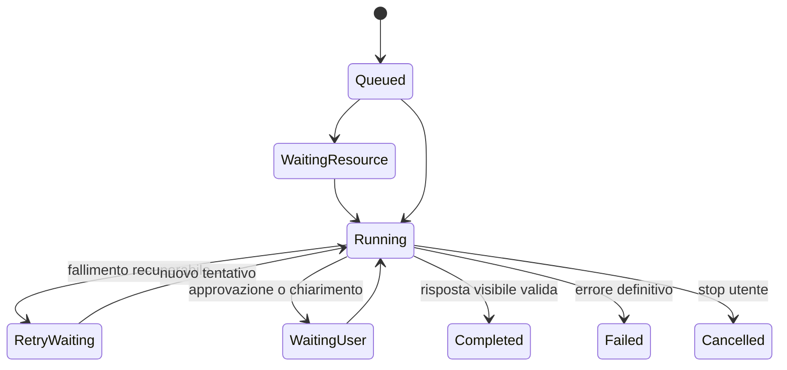

# Logical Turn Lifecycle — un solo turno, tentativi osservabili, terminale unico

**Data:** 2026-07-22
**Stato:** design approvato in conversazione; documento in revisione
**Ambito:** engine, turn broker, transcript, WebSocket e proiezione desktop
**Spec estese:** `2026-07-05-turn-queue-broker-design.md`,
`2026-07-19-agent-execution-journal-prompt-inspector-design.md`
**Capisaldi:** #5 (un solo motore), #9 (workspace agentico operativo), #11
(comprensione senza euristiche sparse e verità verificabile)

## Sintesi

Un messaggio dell'utente crea un solo **turno logico**. Il turno può attraversare più
**tentativi di esecuzione**, e ogni tentativo può contenere più **operazioni** modello/tool,
ma transcript e client devono osservare una sola identità, una sola bolla assistant e un
solo esito terminale.

La modifica converge sulle fondamenta già presenti: `chat_turn` nel task runtime,
`agent_runs` per i tentativi, `turn_events` per il replay pubblico e WebSocket unificato.
Non introduce un secondo orchestratore e non sposta semantica di dominio nel broker.

## Problema verificato

La chat reale "Idra con più problemi" su Homun v0.1.1075 ha mostrato il difetto
architetturale completo:

1. il modello ha prodotto una risposta reasoning-only;
2. la sintesi forzata ha restituito altro testo grezzo non vuoto ma senza prosa visibile;
3. l'executor ha convertito l'assenza di risposta in `No reply generated.`;
4. ha emesso `done` per il tentativo fallito;
5. il task runtime ha emesso subito dopo `retry` e avviato un secondo tentativo;
6. il desktop, già disiscritto al primo `done`, non ha seguito il retry;
7. il secondo tentativo ha creato una nuova bolla assistant e la risposta è comparsa più
   tardi tramite aggiornamento del thread.

Il problema non è specifico di Orion: la stessa sequenza è possibile con qualunque modello
reasoning, MCP in timeout, browser occupato, provider temporaneamente indisponibile, recovery
al boot, canale o automazione.

## Decisione

Il source of truth è il **turno logico server-owned**. Tentativi e operazioni sono figli
osservabili, non turni o messaggi aggiuntivi.



### Tre identità distinte

| Livello | Identità | Responsabilità |
| --- | --- | --- |
| Turno | `turn_id` | richiesta utente, transcript, stato pubblico, esito terminale |
| Tentativo | `run_id` + `attempt` | una presa in carico del worker, prompt effettivo, round, retry |
| Operazione | `call_id` / receipt | chiamata modello o tool, timeout, effetto e idempotenza |

## Invarianti vincolanti

1. **Un solo terminale pubblico.** Ogni `turn_id` emette esattamente uno tra `done`,
   `error` terminale o `cancelled`. `retry`, `queued`, `waiting_user` e `aborted_attempt`
   non sono terminali.
2. **Una sola bolla assistant.** Tutti i tentativi dello stesso turno aggiornano lo stesso
   `assistant_message_id`; un retry non aggiunge un secondo messaggio assistant.
3. **Prosa visibile come criterio di successo.** La risposta è consegnabile solo se
   `strip_display_markers(final_text).trim()` non è vuota. Il conteggio dei caratteri raw
   non è una prova.
4. **Stream provvisorio.** I delta di un tentativo in corso sono una proiezione revocabile.
   Se il tentativo fallisce, non diventano contesto conversazionale né memoria; activity e
   diagnostica restano nel journal.
5. **Retry dichiarato e tipizzato.** Si ritenta solo un fallimento classificato
   recuperabile. `completed=false` non è da solo una policy di retry.
6. **Replay deterministico.** Con `turn_events` e stato del task, reload, reconnect e cambio
   thread ricostruiscono la stessa UI senza dipendere da stato React precedente.
7. **Effetti non duplicati.** Un nuovo tentativo può ripetere letture; una tool call con
   effetti usa receipt/idempotency key prima di essere rieseguita.
8. **Semantica per sorgente, lifecycle comune.** Interactive, Channel, Automation e Connector
   condividono stati ed eventi; cambiano priorità, budget, approvazione e presentazione.

## Contratto degli eventi pubblici

`turn_events` resta il protocollo client-safe. Il journal interno continua a contenere
prompt snapshot e dettagli dei round.

### Eventi non terminali

- `queued`: turno ammesso o in attesa risorsa;
- `attempt_started`: nuovo `run_id`, numero tentativo e modello effettivo;
- `activity`, `reasoning`, `plan_update`, `tool`, `recall`, `delta`: lavoro corrente;
- `retry`: tentativo fallito, classificazione, backoff e prossimo numero;
- `waiting_user`: approvazione o informazione necessaria;
- `aborted_attempt`: lease/restart ha chiuso il tentativo, non necessariamente il turno.

### Eventi terminali

- `done`: risposta visibile finalizzata e messaggio assistant consegnato;
- `error`: fallimento definitivo con codice localizzabile e azione possibile;
- `cancelled`: interruzione richiesta dall'utente o da una policy autorizzata.

`done` mantiene il nome wire esistente per compatibilità, ma significa soltanto
**Completed del turno logico**, mai "executor del tentativo terminato".

Ogni evento legato a un tentativo include `attempt` e `run_id` nel `payload`. Il wire
mantiene quindi la forma esistente `{turn_id, seq, kind, payload}` e la tabella
`turn_events` non richiede nuove colonne. Gli eventi legacy privi di questi metadati sono
letti come `attempt=1`; quando serve il dettaglio operativo, il client o l'inspector lo
ricavano da `agent_runs` senza introdurre una seconda sequenza pubblica.

### Ordine di esempio

```text
queued
attempt_started(attempt=1)
activity / tool / delta...
retry(attempt=1, next_attempt=2, backoff_seconds=15)
attempt_started(attempt=2)
activity / tool / delta...
done(attempt=2)
```

Non è ammesso `done -> retry` sullo stesso turno.

## Risposta visibile e sintesi forzata

L'engine applica una sola funzione canonica di validazione alla risposta normale, alla
sintesi forzata e a qualsiasi fallback:

```rust
fn visible_answer(text: &str) -> Option<String> {
    let visible = strip_display_markers(text).trim().to_string();
    (!visible.is_empty()).then_some(visible)
}
```

Se la sintesi forzata è ancora reasoning-only, l'engine restituisce un esito tipizzato
`NoVisibleAnswer`; non emette `Done` e non inventa un messaggio assistant. Il broker decide
se programmare un altro tentativo. Esauriti i tentativi, il turno termina con `error` e una
UI localizzata, non con la frase inglese `No reply generated.` salvata nel transcript.

## Transcript e bolla assistant

L'enqueue conserva il messaggio utente e associa al task un solo
`assistant_message_id`. `ensure_visible_turn` crea la bolla soltanto se l'id non esiste;
i tentativi successivi la riusano.

La bolla ha uno stato di consegna esplicito:

- `streaming`: preview provvisoria del tentativo corrente;
- `retrying`: preview non consegnata, stato/backoff visibile;
- `waiting_user`: richiesta di approvazione o chiarimento;
- `delivered`: testo finale incluso nel contesto futuro;
- `failed` / `cancelled`: card di sistema, esclusa dal contesto del modello.

Lo stato viene persistito come campo dedicato additivo in `chat_messages`, con
`delivered` come default per i messaggi legacy. `thread_context_for_model` include soltanto
assistant message `delivered`; non usa preview, errori tecnici o placeholder come contesto.

Durante un retry il reducer UI sostituisce la preview del tentativo precedente, ma conserva
activity e run nell'Execution Inspector. Non concatena due risposte parziali.

## Classificazione dei fallimenti

Il confine executor/task runtime usa un esito tipizzato invece della sola coppia
`completed + blocked_reason`:

| Codice | Retry predefinito | Esempio |
| --- | --- | --- |
| `model_transport` | sì | 5xx, socket reset, rate limit temporaneo |
| `no_visible_answer` | sì, bounded | risposta reasoning-only anche dopo sintesi |
| `tool_timeout` | dipende dal requisito | MCP opzionale in timeout dopo evidenza sufficiente |
| `waiting_resource` | attesa, non retry | browser/computer occupato |
| `waiting_user` | pausa, non retry | approvazione o parametro realmente bloccante |
| `policy_denied` | no | capability non autorizzata |
| `invalid_request` | no | input o binding non valido |
| `cancelled` | no | stop utente |

Il fallimento di un tool non chiude automaticamente il turno. Se il risultato è opzionale
e l'evidenza già raccolta soddisfa la richiesta, il modello può consegnare una risposta
esplicitando il limite. Se il tool è indispensabile, l'executor produce `tool_timeout` o il
codice specifico.

Per MCP e connector, il journal distingue:

- successo del trasporto;
- `isError`/errore applicativo del tool;
- risultato utile;
- retryability dichiarata dall'adapter.

Una risposta RPC ricevuta con `isError=true` non viene registrata come tool success.

## Comportamento per sorgente

### Interactive

- stessa bolla, stato `Riprovo tra 15 s…`, Stop sempre disponibile;
- massimo tentativi contenuto;
- il composer può accettare steering senza creare un secondo turno.

### Channel

- stesso lifecycle e stesse receipt;
- typing indicator rimane coerente attraverso il retry;
- viene inviato al canale soltanto il terminale consegnabile, mai preview o fallback tecnico.

### Automation e Connector

- retry e backoff possono essere più lunghi;
- lo stato resta visibile nel task/thread associato;
- dopo errore terminale si registra l'esecuzione fallita e si pianifica la ricorrenza
  successiva secondo la policy esistente.

## Recovery, reconnect e cancellazione

- **WebSocket reconnect:** il client riprende da `last_seq`; `attempt` consente di sapere
  quale preview è corrente.
- **Reload:** task status + replay ricostruiscono bolla e Workspace Island.
- **Gateway restart:** il run precedente diventa `aborted`; il turno può tornare in coda e
  riusare la stessa bolla. Nessun `done` viene sintetizzato durante il recovery.
- **Cancel durante retry/backoff:** il task diventa `Cancelled`, annulla `not_before`, emette
  un solo `cancelled` e impedisce la partenza del tentativo successivo.
- **Cancel durante tool/modello:** l'abort chiude il run, preserva solo activity utile e non
  finalizza la preview come risposta.

## Confine con i connector

Il core non conosce Selfridges, host Orion o ranking Idra. Gli adapter possono adottare il
contratto generale di un riferimento opaco e stabile:

```json
{
  "resource_ref": "orion-idra:morricone2:www.selfridges.com_UK"
}
```

I tool successivi accettano `resource_ref` invece di far ricostruire al modello campi
case-sensitive. La semantica del riferimento, la normalizzazione e la distinzione tra
hotspot generico e ranking per errori restano proprietà del plugin/MCP. Questo è un
follow-up dell'adapter, non parte del lifecycle core.

## Approcci scartati

### Patch `No reply generated` nel solo executor

Nasconderebbe il sintomo ma lascerebbe `done -> retry`, due bolle e subscriber disallineati.

### Gestione speciale per Orion/Idra

Non coprirebbe modelli reasoning-only, browser, altri MCP, canali o recovery.

### Nuovo orchestratore o nuovo store

Viola la convergenza: `task-runtime`, `agent_runs`, `turn_events` e WebSocket possiedono già
le responsabilità necessarie.

### Riscrittura completa del task runtime

Non necessaria. Il difetto è nel contratto tra strutture esistenti, non nell'assenza delle
strutture.

## Prima slice implementabile

1. **Engine:** validazione visible-answer applicata anche alla sintesi; esito tipizzato
   `NoVisibleAnswer`; test reasoning-only normale + reasoning-only synthesis.
2. **Executor/broker:** nessun `done` e nessuna finalizzazione assistant sui tentativi
   retryable; `retry` precede il tentativo successivo; una sola bolla riusata.
3. **Event contract:** `attempt_started`, `retry` con run/attempt e terminale unico;
   migrazione additiva degli eventi legacy.
4. **Desktop:** subscriber resta attivo su `retry`/`queued`, mostra backoff e resetta soltanto
   la preview; termina su `done|error|cancelled`.
5. **Context firewall:** preview/failure escluse dal contesto del modello.
6. **Osservabilità:** tool `isError` registrato come fallimento applicativo.

Il `resource_ref` Orion viene pianificato separatamente dopo questa slice.

## Test richiesti

### Engine

- risposta normale visibile -> `Done`;
- risposta reasoning-only -> sintesi;
- sintesi reasoning-only -> `NoVisibleAnswer`, nessun `Done`;
- fallback localizzato visibile -> terminale coerente;
- tool opzionale fallito + evidenza sufficiente -> risposta consegnabile.

### Task runtime ed executor

- due tentativi producono un solo evento terminale;
- sequenza vietata `done -> retry`;
- `retry -> attempt_started -> done` riusa `assistant_message_id`;
- terminale dopo esaurimento tentativi è `error`, non una bolla assistant tecnica;
- cancel durante backoff impedisce il tentativo successivo;
- recovery chiude il run precedente ma non il turno se la policy consente retry;
- receipt impedisce la duplicazione di un tool con effetti.

### Desktop

- `retry` non risolve la Promise del turno e non spegne lo stato busy;
- backoff e numero tentativo sono visibili;
- il nuovo tentativo sostituisce la preview senza creare messaggi;
- reload durante backoff e durante attempt 2 ricostruisce lo stesso stato;
- `done`, `error` e `cancelled` terminano una sola volta;
- activity resta consultabile senza entrare nella prosa finale.

### Matrice end-to-end

- modello reasoning-only;
- modello 5xx/timeout transitorio;
- MCP indispensabile in timeout;
- MCP opzionale in timeout dopo successo parziale;
- browser in `WaitingResource`;
- disconnessione WebSocket e reload;
- gateway restart con lease stale;
- cancel durante running e retry wait;
- turno da desktop, channel e automation.

## Criteri di accettazione

1. Nessun turno può persistere due messaggi assistant per un solo messaggio utente a causa
   di retry o recovery.
2. Nessun `done` può essere seguito da un evento non terminale dello stesso turno.
3. Una risposta reasoning-only non viene mai presentata come successo.
4. Durante retry/attesa l'utente vede stato, motivo, prossimo tentativo e può fermare.
5. Reload e reconnect non cambiano il risultato o duplicano delta/messaggi.
6. Chat, channel, automation e connector consumano lo stesso lifecycle.
7. Gli errori tecnici non entrano nel contesto futuro né nella memoria semantica.
8. Le tool call con effetti non vengono duplicate da retry o recovery.

## Fuori scope

- modifica dei tool Orion o introduzione del suo `resource_ref`;
- redesign visivo generale della chat o della Workspace Island;
- resume del modello a metà token;
- exactly-once per sistemi esterni che non offrono idempotenza;
- modifica delle policy di retry specifiche dei singoli provider oltre alla nuova
  classificazione tipizzata.
